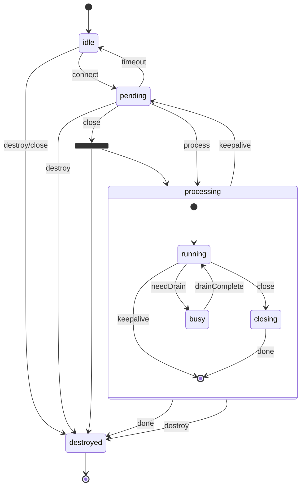

# Contexto Completo del Proyecto Flutter


================================================
📄 ARCHIVO: .flutter-plugins-dependencies
================================================

{"info":"This is a generated file; do not edit or check into version control.","plugins":{"ios":[{"name":"app_links","path":"C:\\\\Users\\\\HP\\\\AppData\\\\Local\\\\Pub\\\\Cache\\\\hosted\\\\pub.dev\\\\app_links-6.4.1\\\\","native_build":true,"dependencies":[],"dev_dependency":false},{"name":"connectivity_plus","path":"C:\\\\Users\\\\HP\\\\AppData\\\\Local\\\\Pub\\\\Cache\\\\hosted\\\\pub.dev\\\\connectivity_plus-7.1.1\\\\","native_build":true,"dependencies":[],"dev_dependency":false},{"name":"device_info_plus","path":"C:\\\\Users\\\\HP\\\\AppData\\\\Local\\\\Pub\\\\Cache\\\\hosted\\\\pub.dev\\\\device_info_plus-12.4.0\\\\","native_build":true,"dependencies":[],"dev_dependency":false},{"name":"flutter_web_auth_2","path":"C:\\\\Users\\\\HP\\\\AppData\\\\Local\\\\Pub\\\\Cache\\\\hosted\\\\pub.dev\\\\flutter_web_auth_2-5.0.3\\\\","native_build":true,"dependencies":[],"dev_dependency":false},{"name":"geolocator_apple","path":"C:\\\\Users\\\\HP\\\\AppData\\\\Local\\\\Pub\\\\Cache\\\\hosted\\\\pub.dev\\\\geolocator_apple-2.3.14\\\\","shared_darwin_source":true,"native_build":true,"dependencies":[],"dev_dependency":false},{"name":"image_picker_ios","path":"C:\\\\Users\\\\HP\\\\AppData\\\\Local\\\\Pub\\\\Cache\\\\hosted\\\\pub.dev\\\\image_picker_ios-0.8.13+6\\\\","native_build":true,"dependencies":[],"dev_dependency":false},{"name":"package_info_plus","path":"C:\\\\Users\\\\HP\\\\AppData\\\\Local\\\\Pub\\\\Cache\\\\hosted\\\\pub.dev\\\\package_info_plus-9.0.1\\\\","native_build":true,"dependencies":[],"dev_dependency":false},{"name":"path_provider_foundation","path":"C:\\\\Users\\\\HP\\\\AppData\\\\Local\\\\Pub\\\\Cache\\\\hosted\\\\pub.dev\\\\path_provider_foundation-2.6.0\\\\","native_build":false,"dependencies":[],"dev_dependency":false},{"name":"url_launcher_ios","path":"C:\\\\Users\\\\HP\\\\AppData\\\\Local\\\\Pub\\\\Cache\\\\hosted\\\\pub.dev\\\\url_launcher_ios-6.4.1\\\\","native_build":true,"dependencies":[],"dev_dependency":false}],"android":[{"name":"app_links","path":"C:\\\\Users\\\\HP\\\\AppData\\\\Local\\\\Pub\\\\Cache\\\\hosted\\\\pub.dev\\\\app_links-6.4.1\\\\","native_build":true,"dependencies":[],"dev_dependency":false},{"name":"connectivity_plus","path":"C:\\\\Users\\\\HP\\\\AppData\\\\Local\\\\Pub\\\\Cache\\\\hosted\\\\pub.dev\\\\connectivity_plus-7.1.1\\\\","native_build":true,"dependencies":[],"dev_dependency":false},{"name":"device_info_plus","path":"C:\\\\Users\\\\HP\\\\AppData\\\\Local\\\\Pub\\\\Cache\\\\hosted\\\\pub.dev\\\\device_info_plus-12.4.0\\\\","native_build":true,"dependencies":[],"dev_dependency":false},{"name":"flutter_plugin_android_lifecycle","path":"C:\\\\Users\\\\HP\\\\AppData\\\\Local\\\\Pub\\\\Cache\\\\hosted\\\\pub.dev\\\\flutter_plugin_android_lifecycle-2.0.35\\\\","native_build":true,"dependencies":[],"dev_dependency":false},{"name":"flutter_web_auth_2","path":"C:\\\\Users\\\\HP\\\\AppData\\\\Local\\\\Pub\\\\Cache\\\\hosted\\\\pub.dev\\\\flutter_web_auth_2-5.0.3\\\\","native_build":true,"dependencies":[],"dev_dependency":false},{"name":"geolocator_android","path":"C:\\\\Users\\\\HP\\\\AppData\\\\Local\\\\Pub\\\\Cache\\\\hosted\\\\pub.dev\\\\geolocator_android-4.6.2\\\\","native_build":true,"dependencies":[],"dev_dependency":false},{"name":"image_picker_android","path":"C:\\\\Users\\\\HP\\\\AppData\\\\Local\\\\Pub\\\\Cache\\\\hosted\\\\pub.dev\\\\image_picker_android-0.8.13+17\\\\","native_build":true,"dependencies":["flutter_plugin_android_lifecycle"],"dev_dependency":false},{"name":"jni","path":"C:\\\\Users\\\\HP\\\\AppData\\\\Local\\\\Pub\\\\Cache\\\\hosted\\\\pub.dev\\\\jni-1.0.0\\\\","native_build":true,"dependencies":[],"dev_dependency":false},{"name":"jni_flutter","path":"C:\\\\Users\\\\HP\\\\AppData\\\\Local\\\\Pub\\\\Cache\\\\hosted\\\\pub.dev\\\\jni_flutter-1.0.1\\\\","native_build":true,"dependencies":["jni"],"dev_dependency":false},{"name":"package_info_plus","path":"C:\\\\Users\\\\HP\\\\AppData\\\\Local\\\\Pub\\\\Cache\\\\hosted\\\\pub.dev\\\\package_info_plus-9.0.1\\\\","native_build":true,"dependencies":[],"dev_dependency":false},{"name":"path_provider_android","path":"C:\\\\Users\\\\HP\\\\AppData\\\\Local\\\\Pub\\\\Cache\\\\hosted\\\\pub.dev\\\\path_provider_android-2.3.1\\\\","native_build":false,"dependencies":["jni","jni_flutter"],"dev_dependency":false},{"name":"url_launcher_android","path":"C:\\\\Users\\\\HP\\\\AppData\\\\Local\\\\Pub\\\\Cache\\\\hosted\\\\pub.dev\\\\url_launcher_android-6.3.30\\\\","native_build":true,"dependencies":[],"dev_dependency":false}],"macos":[{"name":"app_links","path":"C:\\\\Users\\\\HP\\\\AppData\\\\Local\\\\Pub\\\\Cache\\\\hosted\\\\pub.dev\\\\app_links-6.4.1\\\\","native_build":true,"dependencies":[],"dev_dependency":false},{"name":"connectivity_plus","path":"C:\\\\Users\\\\HP\\\\AppData\\\\Local\\\\Pub\\\\Cache\\\\hosted\\\\pub.dev\\\\connectivity_plus-7.1.1\\\\","native_build":true,"dependencies":[],"dev_dependency":false},{"name":"desktop_webview_window","path":"C:\\\\Users\\\\HP\\\\AppData\\\\Local\\\\Pub\\\\Cache\\\\hosted\\\\pub.dev\\\\desktop_webview_window-0.3.0\\\\","native_build":true,"dependencies":[],"dev_dependency":false},{"name":"device_info_plus","path":"C:\\\\Users\\\\HP\\\\AppData\\\\Local\\\\Pub\\\\Cache\\\\hosted\\\\pub.dev\\\\device_info_plus-12.4.0\\\\","native_build":true,"dependencies":[],"dev_dependency":false},{"name":"file_selector_macos","path":"C:\\\\Users\\\\HP\\\\AppData\\\\Local\\\\Pub\\\\Cache\\\\hosted\\\\pub.dev\\\\file_selector_macos-0.9.5\\\\","native_build":true,"dependencies":[],"dev_dependency":false},{"name":"flutter_web_auth_2","path":"C:\\\\Users\\\\HP\\\\AppData\\\\Local\\\\Pub\\\\Cache\\\\hosted\\\\pub.dev\\\\flutter_web_auth_2-5.0.3\\\\","native_build":true,"dependencies":["desktop_webview_window","window_to_front"],"dev_dependency":false},{"name":"geolocator_apple","path":"C:\\\\Users\\\\HP\\\\AppData\\\\Local\\\\Pub\\\\Cache\\\\hosted\\\\pub.dev\\\\geolocator_apple-2.3.14\\\\","shared_darwin_source":true,"native_build":true,"dependencies":[],"dev_dependency":false},{"name":"image_picker_macos","path":"C:\\\\Users\\\\HP\\\\AppData\\\\Local\\\\Pub\\\\Cache\\\\hosted\\\\pub.dev\\\\image_picker_macos-0.2.2+1\\\\","native_build":false,"dependencies":["file_selector_macos"],"dev_dependency":false},{"name":"package_info_plus","path":"C:\\\\Users\\\\HP\\\\AppData\\\\Local\\\\Pub\\\\Cache\\\\hosted\\\\pub.dev\\\\package_info_plus-9.0.1\\\\","native_build":true,"dependencies":[],"dev_dependency":false},{"name":"path_provider_foundation","path":"C:\\\\Users\\\\HP\\\\AppData\\\\Local\\\\Pub\\\\Cache\\\\hosted\\\\pub.dev\\\\path_provider_foundation-2.6.0\\\\","native_build":false,"dependencies":[],"dev_dependency":false},{"name":"url_launcher_macos","path":"C:\\\\Users\\\\HP\\\\AppData\\\\Local\\\\Pub\\\\Cache\\\\hosted\\\\pub.dev\\\\url_launcher_macos-3.2.5\\\\","native_build":true,"dependencies":[],"dev_dependency":false},{"name":"window_to_front","path":"C:\\\\Users\\\\HP\\\\AppData\\\\Local\\\\Pub\\\\Cache\\\\hosted\\\\pub.dev\\\\window_to_front-0.0.4\\\\","native_build":true,"dependencies":[],"dev_dependency":false}],"linux":[{"name":"app_links_linux","path":"C:\\\\Users\\\\HP\\\\AppData\\\\Local\\\\Pub\\\\Cache\\\\hosted\\\\pub.dev\\\\app_links_linux-1.0.3\\\\","native_build":false,"dependencies":["gtk"],"dev_dependency":false},{"name":"connectivity_plus","path":"C:\\\\Users\\\\HP\\\\AppData\\\\Local\\\\Pub\\\\Cache\\\\hosted\\\\pub.dev\\\\connectivity_plus-7.1.1\\\\","native_build":false,"dependencies":[],"dev_dependency":false},{"name":"desktop_webview_window","path":"C:\\\\Users\\\\HP\\\\AppData\\\\Local\\\\Pub\\\\Cache\\\\hosted\\\\pub.dev\\\\desktop_webview_window-0.3.0\\\\","native_build":true,"dependencies":[],"dev_dependency":false},{"name":"device_info_plus","path":"C:\\\\Users\\\\HP\\\\AppData\\\\Local\\\\Pub\\\\Cache\\\\hosted\\\\pub.dev\\\\device_info_plus-12.4.0\\\\","native_build":false,"dependencies":[],"dev_dependency":false},{"name":"file_selector_linux","path":"C:\\\\Users\\\\HP\\\\AppData\\\\Local\\\\Pub\\\\Cache\\\\hosted\\\\pub.dev\\\\file_selector_linux-0.9.4\\\\","native_build":true,"dependencies":[],"dev_dependency":false},{"name":"flutter_web_auth_2","path":"C:\\\\Users\\\\HP\\\\AppData\\\\Local\\\\Pub\\\\Cache\\\\hosted\\\\pub.dev\\\\flutter_web_auth_2-5.0.3\\\\","native_build":false,"dependencies":["desktop_webview_window","window_to_front"],"dev_dependency":false},{"name":"gtk","path":"C:\\\\Users\\\\HP\\\\AppData\\\\Local\\\\Pub\\\\Cache\\\\hosted\\\\pub.dev\\\\gtk-2.2.0\\\\","native_build":true,"dependencies":[],"dev_dependency":false},{"name":"image_picker_linux","path":"C:\\\\Users\\\\HP\\\\AppData\\\\Local\\\\Pub\\\\Cache\\\\hosted\\\\pub.dev\\\\image_picker_linux-0.2.2\\\\","native_build":false,"dependencies":["file_selector_linux"],"dev_dependency":false},{"name":"jni","path":"C:\\\\Users\\\\HP\\\\AppData\\\\Local\\\\Pub\\\\Cache\\\\hosted\\\\pub.dev\\\\jni-1.0.0\\\\","native_build":true,"dependencies":[],"dev_dependency":false},{"name":"package_info_plus","path":"C:\\\\Users\\\\HP\\\\AppData\\\\Local\\\\Pub\\\\Cache\\\\hosted\\\\pub.dev\\\\package_info_plus-9.0.1\\\\","native_build":false,"dependencies":[],"dev_dependency":false},{"name":"path_provider_linux","path":"C:\\\\Users\\\\HP\\\\AppData\\\\Local\\\\Pub\\\\Cache\\\\hosted\\\\pub.dev\\\\path_provider_linux-2.2.2\\\\","native_build":false,"dependencies":[],"dev_dependency":false},{"name":"url_launcher_linux","path":"C:\\\\Users\\\\HP\\\\AppData\\\\Local\\\\Pub\\\\Cache\\\\hosted\\\\pub.dev\\\\url_launcher_linux-3.2.2\\\\","native_build":true,"dependencies":[],"dev_dependency":false},{"name":"window_to_front","path":"C:\\\\Users\\\\HP\\\\AppData\\\\Local\\\\Pub\\\\Cache\\\\hosted\\\\pub.dev\\\\window_to_front-0.0.4\\\\","native_build":true,"dependencies":[],"dev_dependency":false}],"windows":[{"name":"app_links","path":"C:\\\\Users\\\\HP\\\\AppData\\\\Local\\\\Pub\\\\Cache\\\\hosted\\\\pub.dev\\\\app_links-6.4.1\\\\","native_build":true,"dependencies":[],"dev_dependency":false},{"name":"connectivity_plus","path":"C:\\\\Users\\\\HP\\\\AppData\\\\Local\\\\Pub\\\\Cache\\\\hosted\\\\pub.dev\\\\connectivity_plus-7.1.1\\\\","native_build":true,"dependencies":[],"dev_dependency":false},{"name":"desktop_webview_window","path":"C:\\\\Users\\\\HP\\\\AppData\\\\Local\\\\Pub\\\\Cache\\\\hosted\\\\pub.dev\\\\desktop_webview_window-0.3.0\\\\","native_build":true,"dependencies":[],"dev_dependency":false},{"name":"device_info_plus","path":"C:\\\\Users\\\\HP\\\\AppData\\\\Local\\\\Pub\\\\Cache\\\\hosted\\\\pub.dev\\\\device_info_plus-12.4.0\\\\","native_build":false,"dependencies":[],"dev_dependency":false},{"name":"file_selector_windows","path":"C:\\\\Users\\\\HP\\\\AppData\\\\Local\\\\Pub\\\\Cache\\\\hosted\\\\pub.dev\\\\file_selector_windows-0.9.3+5\\\\","native_build":true,"dependencies":[],"dev_dependency":false},{"name":"flutter_web_auth_2","path":"C:\\\\Users\\\\HP\\\\AppData\\\\Local\\\\Pub\\\\Cache\\\\hosted\\\\pub.dev\\\\flutter_web_auth_2-5.0.3\\\\","native_build":false,"dependencies":["desktop_webview_window","window_to_front"],"dev_dependency":false},{"name":"geolocator_windows","path":"C:\\\\Users\\\\HP\\\\AppData\\\\Local\\\\Pub\\\\Cache\\\\hosted\\\\pub.dev\\\\geolocator_windows-0.2.5\\\\","native_build":true,"dependencies":[],"dev_dependency":false},{"name":"image_picker_windows","path":"C:\\\\Users\\\\HP\\\\AppData\\\\Local\\\\Pub\\\\Cache\\\\hosted\\\\pub.dev\\\\image_picker_windows-0.2.2\\\\","native_build":false,"dependencies":["file_selector_windows"],"dev_dependency":false},{"name":"jni","path":"C:\\\\Users\\\\HP\\\\AppData\\\\Local\\\\Pub\\\\Cache\\\\hosted\\\\pub.dev\\\\jni-1.0.0\\\\","native_build":true,"dependencies":[],"dev_dependency":false},{"name":"package_info_plus","path":"C:\\\\Users\\\\HP\\\\AppData\\\\Local\\\\Pub\\\\Cache\\\\hosted\\\\pub.dev\\\\package_info_plus-9.0.1\\\\","native_build":false,"dependencies":[],"dev_dependency":false},{"name":"path_provider_windows","path":"C:\\\\Users\\\\HP\\\\AppData\\\\Local\\\\Pub\\\\Cache\\\\hosted\\\\pub.dev\\\\path_provider_windows-2.3.0\\\\","native_build":false,"dependencies":[],"dev_dependency":false},{"name":"url_launcher_windows","path":"C:\\\\Users\\\\HP\\\\AppData\\\\Local\\\\Pub\\\\Cache\\\\hosted\\\\pub.dev\\\\url_launcher_windows-3.1.5\\\\","native_build":true,"dependencies":[],"dev_dependency":false},{"name":"window_to_front","path":"C:\\\\Users\\\\HP\\\\AppData\\\\Local\\\\Pub\\\\Cache\\\\hosted\\\\pub.dev\\\\window_to_front-0.0.4\\\\","native_build":true,"dependencies":[],"dev_dependency":false}],"web":[{"name":"app_links_web","path":"C:\\\\Users\\\\HP\\\\AppData\\\\Local\\\\Pub\\\\Cache\\\\hosted\\\\pub.dev\\\\app_links_web-1.0.4\\\\","dependencies":[],"dev_dependency":false},{"name":"connectivity_plus","path":"C:\\\\Users\\\\HP\\\\AppData\\\\Local\\\\Pub\\\\Cache\\\\hosted\\\\pub.dev\\\\connectivity_plus-7.1.1\\\\","dependencies":[],"dev_dependency":false},{"name":"device_info_plus","path":"C:\\\\Users\\\\HP\\\\AppData\\\\Local\\\\Pub\\\\Cache\\\\hosted\\\\pub.dev\\\\device_info_plus-12.4.0\\\\","dependencies":[],"dev_dependency":false},{"name":"flutter_web_auth_2","path":"C:\\\\Users\\\\HP\\\\AppData\\\\Local\\\\Pub\\\\Cache\\\\hosted\\\\pub.dev\\\\flutter_web_auth_2-5.0.3\\\\","dependencies":[],"dev_dependency":false},{"name":"geolocator_web","path":"C:\\\\Users\\\\HP\\\\AppData\\\\Local\\\\Pub\\\\Cache\\\\hosted\\\\pub.dev\\\\geolocator_web-4.1.4\\\\","dependencies":[],"dev_dependency":false},{"name":"image_picker_for_web","path":"C:\\\\Users\\\\HP\\\\AppData\\\\Local\\\\Pub\\\\Cache\\\\hosted\\\\pub.dev\\\\image_picker_for_web-3.1.1\\\\","dependencies":[],"dev_dependency":false},{"name":"package_info_plus","path":"C:\\\\Users\\\\HP\\\\AppData\\\\Local\\\\Pub\\\\Cache\\\\hosted\\\\pub.dev\\\\package_info_plus-9.0.1\\\\","dependencies":[],"dev_dependency":false},{"name":"url_launcher_web","path":"C:\\\\Users\\\\HP\\\\AppData\\\\Local\\\\Pub\\\\Cache\\\\hosted\\\\pub.dev\\\\url_launcher_web-2.4.3\\\\","dependencies":[],"dev_dependency":false}]},"dependencyGraph":[{"name":"app_links","dependencies":["app_links_linux","app_links_web"]},{"name":"app_links_linux","dependencies":["gtk"]},{"name":"app_links_web","dependencies":[]},{"name":"connectivity_plus","dependencies":[]},{"name":"desktop_webview_window","dependencies":[]},{"name":"device_info_plus","dependencies":[]},{"name":"file_selector_linux","dependencies":[]},{"name":"file_selector_macos","dependencies":[]},{"name":"file_selector_windows","dependencies":[]},{"name":"flutter_plugin_android_lifecycle","dependencies":[]},{"name":"flutter_web_auth_2","dependencies":["desktop_webview_window","path_provider","url_launcher","window_to_front"]},{"name":"geolocator","dependencies":["geolocator_android","geolocator_apple","geolocator_web","geolocator_windows"]},{"name":"geolocator_android","dependencies":[]},{"name":"geolocator_apple","dependencies":[]},{"name":"geolocator_web","dependencies":[]},{"name":"geolocator_windows","dependencies":[]},{"name":"gtk","dependencies":[]},{"name":"image_picker","dependencies":["image_picker_android","image_picker_for_web","image_picker_ios","image_picker_linux","image_picker_macos","image_picker_windows"]},{"name":"image_picker_android","dependencies":["flutter_plugin_android_lifecycle"]},{"name":"image_picker_for_web","dependencies":[]},{"name":"image_picker_ios","dependencies":[]},{"name":"image_picker_linux","dependencies":["file_selector_linux"]},{"name":"image_picker_macos","dependencies":["file_selector_macos"]},{"name":"image_picker_windows","dependencies":["file_selector_windows"]},{"name":"jni","dependencies":[]},{"name":"jni_flutter","dependencies":["jni"]},{"name":"package_info_plus","dependencies":[]},{"name":"path_provider","dependencies":["path_provider_android","path_provider_foundation","path_provider_linux","path_provider_windows"]},{"name":"path_provider_android","dependencies":["jni","jni_flutter"]},{"name":"path_provider_foundation","dependencies":[]},{"name":"path_provider_linux","dependencies":[]},{"name":"path_provider_windows","dependencies":[]},{"name":"url_launcher","dependencies":["url_launcher_android","url_launcher_ios","url_launcher_linux","url_launcher_macos","url_launcher_web","url_launcher_windows"]},{"name":"url_launcher_android","dependencies":[]},{"name":"url_launcher_ios","dependencies":[]},{"name":"url_launcher_linux","dependencies":[]},{"name":"url_launcher_macos","dependencies":[]},{"name":"url_launcher_web","dependencies":[]},{"name":"url_launcher_windows","dependencies":[]},{"name":"window_to_front","dependencies":[]}],"date_created":"2026-07-01 17:04:31.779481","version":"3.41.9","swift_package_manager_enabled":{"ios":false,"macos":false}}


================================================
📄 ARCHIVO: .gitignore
================================================

# Miscellaneous
*.class
*.log
*.pyc
*.swp
.DS_Store
.atom/
.build/
.buildlog/
.history
.svn/
.swiftpm/
migrate_working_dir/
node_modules/

# IntelliJ related
*.iml
*.ipr
*.iws
.idea/
seed/node_modules/

# The .vscode folder contains launch configuration and tasks you configure in
# VS Code which you may wish to be included in version control, so this line
# is commented out by default.
#.vscode/

# Flutter/Dart/Pub related
**/doc/api/
**/ios/Flutter/.last_build_id
.dart_tool/
.flutter-plugins-dependencies
.pub-cache/
.pub/
/build/
/coverage/

# Symbolication related
app.*.symbols

# Obfuscation related
app.*.map.json

# Android Studio will place build artifacts here
/android/app/debug
/android/app/profile
/android/app/release


================================================
📄 ARCHIVO: .metadata
================================================

# This file tracks properties of this Flutter project.
# Used by Flutter tool to assess capabilities and perform upgrades etc.
#
# This file should be version controlled and should not be manually edited.

version:
  revision: "00b0c91f06209d9e4a41f71b7a512d6eb3b9c694"
  channel: "stable"

project_type: app

# Tracks metadata for the flutter migrate command
migration:
  platforms:
    - platform: root
      create_revision: 00b0c91f06209d9e4a41f71b7a512d6eb3b9c694
      base_revision: 00b0c91f06209d9e4a41f71b7a512d6eb3b9c694
    - platform: android
      create_revision: 00b0c91f06209d9e4a41f71b7a512d6eb3b9c694
      base_revision: 00b0c91f06209d9e4a41f71b7a512d6eb3b9c694
    - platform: ios
      create_revision: 00b0c91f06209d9e4a41f71b7a512d6eb3b9c694
      base_revision: 00b0c91f06209d9e4a41f71b7a512d6eb3b9c694
    - platform: linux
      create_revision: 00b0c91f06209d9e4a41f71b7a512d6eb3b9c694
      base_revision: 00b0c91f06209d9e4a41f71b7a512d6eb3b9c694
    - platform: macos
      create_revision: 00b0c91f06209d9e4a41f71b7a512d6eb3b9c694
      base_revision: 00b0c91f06209d9e4a41f71b7a512d6eb3b9c694
    - platform: web
      create_revision: 00b0c91f06209d9e4a41f71b7a512d6eb3b9c694
      base_revision: 00b0c91f06209d9e4a41f71b7a512d6eb3b9c694
    - platform: windows
      create_revision: 00b0c91f06209d9e4a41f71b7a512d6eb3b9c694
      base_revision: 00b0c91f06209d9e4a41f71b7a512d6eb3b9c694

  # User provided section

  # List of Local paths (relative to this file) that should be
  # ignored by the migrate tool.
  #
  # Files that are not part of the templates will be ignored by default.
  unmanaged_files:
    - 'lib/main.dart'
    - 'ios/Runner.xcodeproj/project.pbxproj'


================================================
📄 ARCHIVO: analysis_options.yaml
================================================

# This file configures the analyzer, which statically analyzes Dart code to
# check for errors, warnings, and lints.
#
# The issues identified by the analyzer are surfaced in the UI of Dart-enabled
# IDEs (https://dart.dev/tools#ides-and-editors). The analyzer can also be
# invoked from the command line by running `flutter analyze`.

# The following line activates a set of recommended lints for Flutter apps,
# packages, and plugins designed to encourage good coding practices.
include: package:flutter_lints/flutter.yaml

linter:
  # The lint rules applied to this project can be customized in the
  # section below to disable rules from the `package:flutter_lints/flutter.yaml`
  # included above or to enable additional rules. A list of all available lints
  # and their documentation is published at https://dart.dev/lints.
  #
  # Instead of disabling a lint rule for the entire project in the
  # section below, it can also be suppressed for a single line of code
  # or a specific dart file by using the `// ignore: name_of_lint` and
  # `// ignore_for_file: name_of_lint` syntax on the line or in the file
  # producing the lint.
  rules:
    # avoid_print: false  # Uncomment to disable the `avoid_print` rule
    # prefer_single_quotes: true  # Uncomment to enable the `prefer_single_quotes` rule

# Additional information about this file can be found at
# https://dart.dev/guides/language/analysis-options


================================================
📄 ARCHIVO: lib\core\appwrite_client.dart
================================================

import 'package:appwrite/appwrite.dart';

const String appwriteEndpoint = 'https://sfo.cloud.appwrite.io/v1';
const String appwriteProjectId = 'sistema-electoral';
const String appwriteDatabaseId = '6a3ca5420008a6f70fe1';

// Colecciones (tablas) usadas por la app.
// NOTA: se corrigió el typo "ususarios" -> "users" y se agregaron las
// colecciones nuevas que el enunciado requiere (asignaciones de mesa y
// organizaciones políticas precargadas desde el backend).
const String appwriteActasCollectionId = 'actas';
const String appwriteUsersCollectionId = 'ususarios';
const String appwriteRecintosCollectionId = 'recintos';
const String appwriteAsignacionesCollectionId = 'asignaciones_mesa';
const String appwriteOrganizacionesCollectionId = 'organizaciones';
const String appwriteBucketId = '6a3ca946002e1039870d';

Client client = Client()
    .setEndpoint(appwriteEndpoint)
    .setProject(appwriteProjectId);

Databases get databases => Databases(client);
Storage get storage => Storage(client);


================================================
📄 ARCHIVO: lib\core\cedula_validator.dart
================================================

// Validador de cédula ecuatoriana.
//
// Algoritmo oficial (módulo 10) usado por el Registro Civil del Ecuador:
// 1. Los dos primeros dígitos representan el código de provincia (01-24, o 30
//    para extranjeros residentes con cédula ecuatoriana en algunos casos).
// 2. El tercer dígito debe ser menor a 6 para personas naturales.
// 3. Se aplica el algoritmo de Luhn modificado (módulo 10) sobre los primeros
//    9 dígitos, y el resultado debe coincidir con el décimo dígito (verificador).
//
// Referencia pública del algoritmo: documentación técnica del Registro Civil
// y validaciones replicadas en múltiples SDKs de validación ecuatoriana.
class CedulaValidator {
  /// Valida que [cedula] sea una cédula ecuatoriana válida.
  /// Devuelve true si es válida, false en caso contrario.
  static bool isValid(String cedula) {
    final cleaned = cedula.trim();

    // Debe tener exactamente 10 dígitos numéricos.
    if (cleaned.length != 10) return false;
    if (!RegExp(r'^[0-9]{10}$').hasMatch(cleaned)) return false;

    final digits = cleaned.split('').map(int.parse).toList();

    // Código de provincia: 01-24 (más 30 para casos especiales registrados).
    final provincia = digits[0] * 10 + digits[1];
    if (provincia < 1 || (provincia > 24 && provincia != 30)) return false;

    // Tercer dígito debe ser menor a 6 para cédulas de personas naturales.
    final tercerDigito = digits[2];
    if (tercerDigito > 6) return false;

    // Algoritmo módulo 10 (Luhn modificado):
    // Posiciones impares (índice 0,2,4,6,8) se multiplican por 2;
    // si el resultado es >= 10, se le resta 9.
    const coeficientes = [2, 1, 2, 1, 2, 1, 2, 1, 2];
    var suma = 0;
    for (var i = 0; i < 9; i++) {
      var valor = digits[i] * coeficientes[i];
      if (valor >= 10) valor -= 9;
      suma += valor;
    }

    final digitoVerificadorEsperado = (10 - (suma % 10)) % 10;
    final digitoVerificadorReal = digits[9];

    return digitoVerificadorEsperado == digitoVerificadorReal;
  }

  /// Devuelve un mensaje de error legible, o null si la cédula es válida.
  /// Útil para mostrar feedback directo en formularios.
  static String? validationMessage(String cedula) {
    final cleaned = cedula.trim();
    if (cleaned.isEmpty) return 'La cédula es obligatoria.';
    if (!RegExp(r'^[0-9]+$').hasMatch(cleaned)) {
      return 'La cédula debe contener solo números.';
    }
    if (cleaned.length != 10) {
      return 'La cédula debe tener exactamente 10 dígitos.';
    }
    if (!isValid(cleaned)) {
      return 'La cédula ingresada no es válida.';
    }
    return null;
  }
}


================================================
📄 ARCHIVO: lib\core\connectivity_service.dart
================================================

import 'dart:async';
import 'package:connectivity_plus/connectivity_plus.dart';

class ConnectivityService {
  final Connectivity _connectivity = Connectivity();
  StreamSubscription<List<ConnectivityResult>>? _subscription;
  void Function(bool)? onConnectivityChanged;

  bool _isOnline = true;
  bool get isOnline => _isOnline;

  void startMonitoring() {
    _connectivity.checkConnectivity().then((results) {
      _isOnline = results.any((r) => r != ConnectivityResult.none);
    });
    _subscription = _connectivity.onConnectivityChanged.listen((results) {
      final online = results.any((r) => r != ConnectivityResult.none);
      if (online && !_isOnline) {
        onConnectivityChanged?.call(true);
      }
      _isOnline = online;
    });
  }

  void dispose() {
    _subscription?.cancel();
  }
}


================================================
📄 ARCHIVO: lib\core\image_service.dart
================================================

import 'dart:io';
import 'package:image/image.dart' as img;

class ImageService {
  static bool isImageBlurry(File file) {
    try {
      final bytes = file.readAsBytesSync();
      final original = img.decodeImage(bytes);
      if (original == null) return true;

      if (original.width < 64 || original.height < 64) return true;

      final resized = img.copyResize(
        original,
        width: 300,
        interpolation: img.Interpolation.nearest,
      );

      final gray = img.grayscale(resized);

      double sum = 0;
      double sumSq = 0;
      int count = 0;

      for (var y = 1; y < gray.height - 1; y++) {
        for (var x = 1; x < gray.width - 1; x++) {
          final c = gray.getPixel(x, y).r.toDouble();
          final u = gray.getPixel(x, y - 1).r.toDouble();
          final d = gray.getPixel(x, y + 1).r.toDouble();
          final l = gray.getPixel(x - 1, y).r.toDouble();
          final r = gray.getPixel(x + 1, y).r.toDouble();
          final lap = (u + d + l + r - 4 * c).abs();
          sum += lap;
          sumSq += lap * lap;
          count++;
        }
      }

      if (count == 0) return true;

      final mean = sum / count;
      final variance = sumSq / count - mean * mean;
      return variance < 30.0;
    } catch (_) {
      return true;
    }
  }
}


================================================
📄 ARCHIVO: lib\core\political_organizations.dart
================================================

class PoliticalOrganization {
  final String name;
  final String party;
  PoliticalOrganization(this.name, this.party);
}

List<PoliticalOrganization> getOrganizacionesAlcalde() => [
  PoliticalOrganization('María Fernanda Salazar', 'Acción Democrática Nacional (ADN)'),
  PoliticalOrganization('Pabel Muñoz', 'Revolución Ciudadana (RC5)'),
  PoliticalOrganization('Esteban Cárdenas', 'Partido Social Cristiano (PSC)'),
  PoliticalOrganization('Luis Herrera', 'Avanza'),
  PoliticalOrganization('Andrés Quishpe', 'Pachakutik'),
];

List<PoliticalOrganization> getOrganizacionesPrefecto() => [
  PoliticalOrganization('Diego Almeida', 'Acción Democrática Nacional (ADN)'),
  PoliticalOrganization('Paola Pabón', 'Revolución Ciudadana (RC5)'),
  PoliticalOrganization('Roberto Freire', 'Partido Social Cristiano (PSC)'),
  PoliticalOrganization('Cristina Vallejo', 'Avanza'),
  PoliticalOrganization('José Guamán', 'Pachakutik'),
];

Map<String, List<PoliticalOrganization>> getOrganizacionesPorDignidad() => {
  'alcalde': getOrganizacionesAlcalde(),
  'prefecto': getOrganizacionesPrefecto(),
};


================================================
📄 ARCHIVO: lib\core\provincias.dart
================================================

const List<String> provinciasEcuador = [
  'Azuay',
  'Bolívar',
  'Cañar',
  'Carchi',
  'Cotopaxi',
  'Chimborazo',
  'El Oro',
  'Esmeraldas',
  'Galápagos',
  'Guayas',
  'Imbabura',
  'Loja',
  'Los Ríos',
  'Manabí',
  'Morona Santiago',
  'Napo',
  'Orellana',
  'Pastaza',
  'Pichincha',
  'Santa Elena',
  'Santo Domingo de los Tsáchilas',
  'Sucumbíos',
  'Tungurahua',
  'Zamora Chinchipe',
];


================================================
📄 ARCHIVO: lib\core\storage_service.dart
================================================

import 'dart:io';
import 'package:appwrite/appwrite.dart';

import 'appwrite_client.dart';

class StorageService {
  final Storage storage;

  StorageService(this.storage);

  Future<String> uploadImage(File file) async {
    final result = await storage.createFile(
      bucketId: appwriteBucketId,
      fileId: ID.unique(),
      file: InputFile.fromPath(path: file.path),
      permissions: [
        Permission.read(Role.any()),
        Permission.write(Role.any()),
      ],
    );

    return result.$id;
  }
}


================================================
📄 ARCHIVO: lib\features\actas\data\datasources\acta_datasource.dart
================================================

import 'package:appwrite/appwrite.dart';
import '../../../../core/appwrite_client.dart';
import '../models/acta_model.dart';

class ActaDatasource {
  final Databases db;

  ActaDatasource(this.db);

  Future<void> crearActa(ActaModel acta) async {
    await db.createDocument(
      databaseId: appwriteDatabaseId,
      collectionId: appwriteActasCollectionId,
      documentId: ID.unique(),
      data: acta.toJson(),
      permissions: [
        Permission.read(Role.any()),
        Permission.write(Role.any()),
      ],
    );
  }

  Future<List<Map<String, dynamic>>> obtenerActas({String? userId}) async {
    final queries = <String>[];
    if (userId != null && userId.isNotEmpty) {
      queries.add(Query.equal('userId', userId));
    }
    final result = await db.listDocuments(
      databaseId: appwriteDatabaseId,
      collectionId: appwriteActasCollectionId,
      queries: queries,
    );
    return result.documents.map((e) => {...e.data, '\$id': e.$id}).toList();
  }

  Future<void> actualizarActa(String documentId, Map<String, dynamic> data) async {
    await db.updateDocument(
      databaseId: appwriteDatabaseId,
      collectionId: appwriteActasCollectionId,
      documentId: documentId,
      data: data,
    );
  }
}


================================================
📄 ARCHIVO: lib\features\actas\data\datasources\storage_datasource.dart
================================================

import 'package:appwrite/appwrite.dart';

class StorageDatasource {
  final Storage storage;
  StorageDatasource(this.storage);

  Future<String> subirImagen(String path) async {
    final file = await storage.createFile(
      bucketId: "6a3ca946002e1039870d",
      fileId: ID.unique(),
      file: InputFile.fromPath(path: path),
    );
    return file.$id;
  }
}


================================================
📄 ARCHIVO: lib\features\actas\data\models\acta_model.dart
================================================

import '../../domain/entities/acta.dart';

class ActaModel extends Acta {
  ActaModel({
    required super.junta,
    required super.provincia,
    required super.canton,
    required super.parroquia,
    required super.dignidad,
    required super.votosOrganizaciones,
    required super.blancos,
    required super.nulos,
    required super.totalSufragantes,
    required super.fotoId,
    required super.fecha,
    required super.imagenValida,
    super.latitud,
    super.longitud,
    super.userId,
    super.id,
  });

  factory ActaModel.fromJson(Map<String, dynamic> json, {String? docId}) {
    return ActaModel(
      junta: _parseInt(json['junta']),
      provincia: _parseString(json['provincia']),
      canton: _parseString(json['canton']),
      parroquia: _parseString(json['parroquia']),
      dignidad: _parseString(json['dignidad']),
      votosOrganizaciones: _parseIntList(json['votosOrganizaciones']),
      blancos: _parseInt(json['blancos']),
      nulos: _parseInt(json['nulos']),
      totalSufragantes: _parseInt(json['totalSufragantes']),
      fotoId: _parseString(json['fotoId']),
      fecha: _parseDateTime(json['fecha']),
      imagenValida: _parseBool(json['imagenValida']),
      latitud: _parseNullableDouble(json['latitud']),
      longitud: _parseNullableDouble(json['longitud']),
      userId: _parseStringNullable(json['userId']),
      id: docId ?? json['\$id'] as String?,
    );
  }

  Map<String, dynamic> toJson() => {
    'junta': junta,
    'provincia': provincia,
    'canton': canton,
    'parroquia': parroquia,
    'dignidad': dignidad,
    'votosOrganizaciones': votosOrganizaciones,
    'blancos': blancos,
    'nulos': nulos,
    'totalSufragantes': totalSufragantes,
    'fotoId': fotoId,
    'fecha': fecha.toIso8601String(),
    'imagenValida': imagenValida,
    'latitud': latitud,
    'longitud': longitud,
    'userId': userId,
  };

  static double? _parseNullableDouble(dynamic value) {
    if (value is double) return value;
    if (value is int) return value.toDouble();
    if (value is String) return double.tryParse(value);
    return null;
  }

  static int _parseInt(dynamic value) {
    if (value is int) return value;
    if (value is num) return value.toInt();
    if (value is String) return int.tryParse(value) ?? 0;
    return 0;
  }

  static String _parseString(dynamic value) {
    if (value is String) return value;
    return '';
  }

  static String? _parseStringNullable(dynamic value) {
    if (value is String && value.isNotEmpty) return value;
    return null;
  }

  static bool _parseBool(dynamic value) {
    if (value is bool) return value;
    if (value is String) return value.toLowerCase() == 'true';
    return false;
  }

  static List<int> _parseIntList(dynamic value) {
    if (value is List) return value.map((e) => _parseInt(e)).toList();
    return List.filled(5, 0);
  }

  static DateTime _parseDateTime(dynamic value) {
    if (value is DateTime) return value;
    if (value is String && value.isNotEmpty) {
      return DateTime.tryParse(value) ?? DateTime.now();
    }
    return DateTime.now();
  }
}


================================================
📄 ARCHIVO: lib\features\actas\data\repositories\acta_repository_impl.dart
================================================

import '../../../../offline/hive_service.dart';
import '../../domain/entities/acta.dart';
import '../../domain/repositories/acta_repository.dart';
import '../datasources/acta_datasource.dart';
import '../models/acta_model.dart';

class ActaRepositoryImpl implements ActaRepository {
  final ActaDatasource datasource;
  final HiveService? hiveService;

  ActaRepositoryImpl(this.datasource, {this.hiveService});

  @override
  Future<void> crearActa(Acta acta, {String? fotoLocalPath}) async {
    try {
      await datasource.crearActa(ActaModel(
        junta: acta.junta,
        provincia: acta.provincia,
        canton: acta.canton,
        parroquia: acta.parroquia,
        dignidad: acta.dignidad,
        votosOrganizaciones: acta.votosOrganizaciones,
        blancos: acta.blancos,
        nulos: acta.nulos,
        totalSufragantes: acta.totalSufragantes,
        fotoId: acta.fotoId,
        fecha: acta.fecha,
        imagenValida: acta.imagenValida,
        latitud: acta.latitud,
        longitud: acta.longitud,
        userId: acta.userId,
      ));
    } catch (_) {
      if (hiveService != null) {
        await hiveService!.saveActaLocal(acta, fotoLocalPath: fotoLocalPath);
      } else {
        rethrow;
      }
    }
  }

  @override
  Future<List<Acta>> obtenerActas({String? userId}) async {
    try {
      final data = await datasource.obtenerActas(userId: userId);
      return data.map((e) {
        final docId = e['\$id'] as String?;
        return ActaModel.fromJson(e, docId: docId);
      }).toList();
    } catch (_) {
      if (hiveService != null) {
        return hiveService!.getAllLocalActas();
      }
      return [];
    }
  }

  @override
  Future<void> actualizarActa(String id, Acta acta) async {
    await datasource.actualizarActa(id, ActaModel(
      junta: acta.junta,
      provincia: acta.provincia,
      canton: acta.canton,
      parroquia: acta.parroquia,
      dignidad: acta.dignidad,
      votosOrganizaciones: acta.votosOrganizaciones,
      blancos: acta.blancos,
      nulos: acta.nulos,
      totalSufragantes: acta.totalSufragantes,
      fotoId: acta.fotoId,
      fecha: acta.fecha,
      imagenValida: acta.imagenValida,
      latitud: acta.latitud,
      longitud: acta.longitud,
      userId: acta.userId,
      id: id,
    ).toJson());
  }
}


================================================
📄 ARCHIVO: lib\features\actas\domain\entities\acta.dart
================================================

class Acta {
  final int junta;
  final String provincia;
  final String canton;
  final String parroquia;
  final String dignidad;
  final List<int> votosOrganizaciones;
  final int blancos;
  final int nulos;
  final int totalSufragantes;
  final String fotoId;
  final DateTime fecha;
  final bool imagenValida;
  final double? latitud;
  final double? longitud;
  final String? userId;
  final String? id;

  Acta({
    required this.junta,
    required this.provincia,
    required this.canton,
    required this.parroquia,
    required this.dignidad,
    required this.votosOrganizaciones,
    required this.blancos,
    required this.nulos,
    required this.totalSufragantes,
    required this.fotoId,
    required this.fecha,
    required this.imagenValida,
    this.latitud,
    this.longitud,
    this.userId,
    this.id,
  });

  int get totalVotos =>
      votosOrganizaciones.fold(0, (a, b) => a + b) + blancos + nulos;

  bool get isValid => totalVotos <= totalSufragantes;

  Acta copyWith({
    int? junta,
    String? provincia,
    String? canton,
    String? parroquia,
    String? dignidad,
    List<int>? votosOrganizaciones,
    int? blancos,
    int? nulos,
    int? totalSufragantes,
    String? fotoId,
    DateTime? fecha,
    bool? imagenValida,
    double? latitud,
    double? longitud,
    String? userId,
    String? id,
  }) {
    return Acta(
      junta: junta ?? this.junta,
      provincia: provincia ?? this.provincia,
      canton: canton ?? this.canton,
      parroquia: parroquia ?? this.parroquia,
      dignidad: dignidad ?? this.dignidad,
      votosOrganizaciones: votosOrganizaciones ?? List.from(this.votosOrganizaciones),
      blancos: blancos ?? this.blancos,
      nulos: nulos ?? this.nulos,
      totalSufragantes: totalSufragantes ?? this.totalSufragantes,
      fotoId: fotoId ?? this.fotoId,
      fecha: fecha ?? this.fecha,
      imagenValida: imagenValida ?? this.imagenValida,
      latitud: latitud ?? this.latitud,
      longitud: longitud ?? this.longitud,
      userId: userId ?? this.userId,
      id: id ?? this.id,
    );
  }
}


================================================
📄 ARCHIVO: lib\features\actas\domain\repositories\acta_repository.dart
================================================

import '../entities/acta.dart';

abstract class ActaRepository {
  Future<void> crearActa(Acta acta, {String? fotoLocalPath});
  Future<List<Acta>> obtenerActas({String? userId});
  Future<void> actualizarActa(String id, Acta acta);
}


================================================
📄 ARCHIVO: lib\features\actas\domain\usecases\actualizar_acta.dart
================================================

import '../entities/acta.dart';
import '../repositories/acta_repository.dart';

class ActualizarActa {
  final ActaRepository repository;

  ActualizarActa(this.repository);

  Future<void> call(String id, Acta acta) {
    return repository.actualizarActa(id, acta);
  }
}


================================================
📄 ARCHIVO: lib\features\actas\domain\usecases\create_acta.dart
================================================

import '../entities/acta.dart';
import '../repositories/acta_repository.dart';

class CrearActa {
  final ActaRepository repository;

  CrearActa(this.repository);

  Future<void> call(Acta acta, {String? fotoLocalPath}) {
    return repository.crearActa(acta, fotoLocalPath: fotoLocalPath);
  }
}


================================================
📄 ARCHIVO: lib\features\actas\domain\usecases\obtener_actas.dart
================================================

import '../entities/acta.dart';
import '../repositories/acta_repository.dart';

class ObtenerActas {
  final ActaRepository repository;

  ObtenerActas(this.repository);

  Future<List<Acta>> call({String? userId}) {
    return repository.obtenerActas(userId: userId);
  }
}


================================================
📄 ARCHIVO: lib\features\actas\presentation\bloc\acta_bloc.dart
================================================

import 'package:flutter_bloc/flutter_bloc.dart';
import 'acta_event.dart';
import 'acta_state.dart';
import '../../domain/usecases/create_acta.dart';
import '../../domain/usecases/obtener_actas.dart';
import '../../domain/usecases/actualizar_acta.dart';

class ActaBloc extends Bloc<ActaEvent, ActaState> {
  final CrearActa crearActa;
  final ObtenerActas obtenerActas;
  final ActualizarActa actualizarActa;

  ActaBloc({
    required this.crearActa,
    required this.obtenerActas,
    required this.actualizarActa,
  }) : super(ActaInitial()) {

    on<CrearActaEvent>((event, emit) async {
      emit(ActaLoading());
      try {
        await crearActa(event.acta, fotoLocalPath: event.fotoLocalPath);
        emit(ActaSuccess());
      } catch (e) {
        emit(ActaError(e.toString()));
      }
    });

    on<CargarActasEvent>((event, emit) async {
      emit(ActaLoading());
      try {
        final actas = await obtenerActas(userId: event.userId);
        emit(ActasLoaded(actas));
      } catch (e) {
        emit(ActaError(e.toString()));
      }
    });

    on<ActualizarActaEvent>((event, emit) async {
      emit(ActaLoading());
      try {
        await actualizarActa(event.id, event.acta);
        emit(ActaSuccess());
      } catch (e) {
        emit(ActaError(e.toString()));
      }
    });
  }
}


================================================
📄 ARCHIVO: lib\features\actas\presentation\bloc\acta_event.dart
================================================

import '../../domain/entities/acta.dart';

abstract class ActaEvent {}

class CrearActaEvent extends ActaEvent {
  final Acta acta;
  final String? fotoLocalPath;
  CrearActaEvent(this.acta, {this.fotoLocalPath});
}

class CargarActasEvent extends ActaEvent {
  final String? userId;
  CargarActasEvent({this.userId});
}

class ActualizarActaEvent extends ActaEvent {
  final String id;
  final Acta acta;
  ActualizarActaEvent(this.id, this.acta);
}


================================================
📄 ARCHIVO: lib\features\actas\presentation\bloc\acta_state.dart
================================================

import '../../domain/entities/acta.dart';

abstract class ActaState {}

class ActaInitial extends ActaState {}

class ActaLoading extends ActaState {}

class ActaSuccess extends ActaState {}

class ActasLoaded extends ActaState {
  final List<Acta> actas;
  ActasLoaded(this.actas);
}

class ActaError extends ActaState {
  final String message;
  ActaError(this.message);
}


================================================
📄 ARCHIVO: lib\features\actas\presentation\pages\dashboard_page.dart
================================================

import 'package:flutter/material.dart';
import 'package:flutter_bloc/flutter_bloc.dart';
import '../bloc/acta_bloc.dart';
import '../bloc/acta_event.dart';
import '../bloc/acta_state.dart';
import '../../../../core/political_organizations.dart';

class DashboardPage extends StatefulWidget {
  const DashboardPage({super.key});

  @override
  State<DashboardPage> createState() => _DashboardPageState();
}

class _DashboardPageState extends State<DashboardPage>
    with SingleTickerProviderStateMixin {
  late TabController _tabController;

  List<int> _votosAlcaldeTotal = List.filled(5, 0);
  List<int> _votosPrefectoTotal = List.filled(5, 0);
  Map<String, List<int>> _votosPorRecintoAlcalde = {};
  Map<String, List<int>> _votosPorRecintoPrefecto = {};

  final _orgsAlcalde = getOrganizacionesAlcalde();
  final _orgsPrefecto = getOrganizacionesPrefecto();
  bool _dataLoaded = false;

  @override
  void initState() {
    super.initState();
    _tabController = TabController(length: 2, vsync: this);
    context.read<ActaBloc>().add(CargarActasEvent());
  }

  @override
  void dispose() {
    _tabController.dispose();
    super.dispose();
  }

  void _procesarActas(List actas) {
    final alcaldeTotal = List.filled(5, 0);
    final prefectoTotal = List.filled(5, 0);
    final porRecintoAlcalde = <String, List<int>>{};
    final porRecintoPrefecto = <String, List<int>>{};

    for (final a in actas) {
      final votos = a.votosOrganizaciones;
      if (votos == null) continue;
      final lista = (votos as List).map((e) => (e as num).toInt()).toList();
      while (lista.length < 5) lista.add(0);

      final canton = a.canton as String? ?? 'Desconocido';
      final parroquia = a.parroquia as String? ?? '';
      final recintoKey = '$canton / $parroquia';

      if (a.dignidad == 'alcalde') {
        for (int i = 0; i < 5; i++) alcaldeTotal[i] += lista[i];
        porRecintoAlcalde[recintoKey] ??= List.filled(5, 0);
        for (int i = 0; i < 5; i++) porRecintoAlcalde[recintoKey]![i] += lista[i];
      } else if (a.dignidad == 'prefecto') {
        for (int i = 0; i < 5; i++) prefectoTotal[i] += lista[i];
        porRecintoPrefecto[recintoKey] ??= List.filled(5, 0);
        for (int i = 0; i < 5; i++) porRecintoPrefecto[recintoKey]![i] += lista[i];
      }
    }

    if (mounted) {
      setState(() {
        _votosAlcaldeTotal = alcaldeTotal;
        _votosPrefectoTotal = prefectoTotal;
        _votosPorRecintoAlcalde = porRecintoAlcalde;
        _votosPorRecintoPrefecto = porRecintoPrefecto;
        _dataLoaded = true;
      });
    }
  }

  @override
  Widget build(BuildContext context) {
    return Scaffold(
      backgroundColor: const Color(0xFFF0F2F5),
      appBar: AppBar(
        title: const Text('Dashboard Electoral'),
        flexibleSpace: Container(
          decoration: const BoxDecoration(
            gradient: LinearGradient(
              colors: [Color(0xFF0D2137), Color(0xFF1A3A6B)],
              begin: Alignment.topLeft,
              end: Alignment.bottomRight,
            ),
          ),
        ),
        actions: [
          IconButton(
            icon: const Icon(Icons.refresh),
            tooltip: 'Actualizar',
            onPressed: () {
              setState(() => _dataLoaded = false);
              context.read<ActaBloc>().add(CargarActasEvent());
            },
          ),
        ],
        bottom: TabBar(
          controller: _tabController,
          indicatorColor: const Color(0xFFD4A843),
          labelColor: Colors.white,
          unselectedLabelColor: Colors.white60,
          indicatorSize: TabBarIndicatorSize.label,
          tabs: const [
            Tab(text: 'ALCALDE'),
            Tab(text: 'PREFECTO'),
          ],
        ),
      ),
      resizeToAvoidBottomInset: true,
      body: SafeArea(
        child: BlocListener<ActaBloc, ActaState>(
          listener: (context, state) {
            if (state is ActasLoaded && !_dataLoaded) {
              _procesarActas(state.actas);
            }
          },
          child: BlocBuilder<ActaBloc, ActaState>(
            builder: (context, state) {
              if (state is ActaLoading && !_dataLoaded) {
                return const Center(
                  child: CircularProgressIndicator(color: Color(0xFF0D2137)),
                );
              }

              if (state is ActaError && !_dataLoaded) {
                return Center(
                  child: Column(
                    mainAxisAlignment: MainAxisAlignment.center,
                    children: [
                      const Icon(Icons.error_outline, size: 64, color: Color(0xFFE74C3C)),
                      const SizedBox(height: 12),
                      Text('Error: ${state.message}', textAlign: TextAlign.center),
                      const SizedBox(height: 12),
                      ElevatedButton(
                        onPressed: () {
                          setState(() => _dataLoaded = false);
                          context.read<ActaBloc>().add(CargarActasEvent());
                        },
                        child: const Text('Reintentar'),
                      ),
                    ],
                  ),
                );
              }

              if (!_dataLoaded) {
                return Center(
                  child: Column(
                    mainAxisAlignment: MainAxisAlignment.center,
                    children: [
                      const Icon(Icons.touch_app, size: 48, color: Colors.grey),
                      const SizedBox(height: 12),
                      const Text('Presiona recargar para ver los datos', style: TextStyle(color: Colors.grey)),
                      const SizedBox(height: 12),
                      ElevatedButton.icon(
                        icon: const Icon(Icons.refresh),
                        label: const Text('Cargar datos'),
                        onPressed: () {
                          setState(() => _dataLoaded = false);
                          context.read<ActaBloc>().add(CargarActasEvent());
                        },
                      ),
                    ],
                  ),
                );
              }

              return TabBarView(
                controller: _tabController,
                children: [
                  _buildTabContent(
                    orgs: _orgsAlcalde,
                    totalVotos: _votosAlcaldeTotal,
                    porRecinto: _votosPorRecintoAlcalde,
                  ),
                  _buildTabContent(
                    orgs: _orgsPrefecto,
                    totalVotos: _votosPrefectoTotal,
                    porRecinto: _votosPorRecintoPrefecto,
                  ),
                ],
              );
            },
          ),
        ),
      ),
    );
  }

  Widget _buildTabContent({
    required List orgs,
    required List<int> totalVotos,
    required Map<String, List<int>> porRecinto,
  }) {
    final grandTotal = totalVotos.fold(0, (a, b) => a + b);

    return ListView(
      padding: const EdgeInsets.all(16),
      children: [
        _sectionCard(
          title: 'Consolidado General',
          icon: Icons.bar_chart,
          child: grandTotal == 0
              ? const Padding(
                  padding: EdgeInsets.all(24),
                  child: Center(
                    child: Column(
                      children: [
                        Icon(Icons.inbox, size: 48, color: Colors.grey),
                        SizedBox(height: 8),
                        Text('No hay votos registrados aún',
                            style: TextStyle(color: Colors.grey)),
                      ],
                    ),
                  ),
                )
              : Column(
                  children: List.generate(orgs.length, (i) {
                    final votos = totalVotos[i];
                    final pct = grandTotal > 0 ? votos / grandTotal : 0.0;
                    return Padding(
                      padding: const EdgeInsets.only(bottom: 14),
                      child: Column(
                        crossAxisAlignment: CrossAxisAlignment.start,
                        children: [
                          Row(
                            children: [
                              Expanded(
                                child: Text(
                                  orgs[i].name,
                                  style: const TextStyle(
                                      fontWeight: FontWeight.w600,
                                      fontSize: 13,
                                      color: Color(0xFF0D2137)),
                                ),
                              ),
                              Container(
                                padding: const EdgeInsets.symmetric(horizontal: 8, vertical: 2),
                                decoration: BoxDecoration(
                                  color: const Color(0xFFD4A843).withValues(alpha: 0.1),
                                  borderRadius: BorderRadius.circular(6),
                                ),
                                child: Text(
                                  '$votos votos (${(pct * 100).toStringAsFixed(1)}%)',
                                  style: const TextStyle(
                                    fontSize: 11,
                                    fontWeight: FontWeight.w600,
                                    color: Color(0xFFD4A843),
                                  ),
                                ),
                              ),
                            ],
                          ),
                          const SizedBox(height: 4),
                          Text(
                            orgs[i].party,
                            style: const TextStyle(fontSize: 11, color: Colors.grey),
                          ),
                          const SizedBox(height: 6),
                          ClipRRect(
                            borderRadius: BorderRadius.circular(4),
                            child: LinearProgressIndicator(
                              value: pct.toDouble().clamp(0.0, 1.0),
                              minHeight: 8,
                              backgroundColor: Colors.grey.shade200,
                              valueColor: AlwaysStoppedAnimation<Color>(
                                  _colorForIndex(i)),
                            ),
                          ),
                        ],
                      ),
                    );
                  }),
                ),
        ),
        const SizedBox(height: 16),
        if (porRecinto.isNotEmpty)
          _sectionCard(
            title: 'Por Recinto',
            icon: Icons.location_city,
            child: Column(
              children: porRecinto.entries.map((entry) {
                final recintoVotos = entry.value;
                final recintoTotal = recintoVotos.fold(0, (a, b) => a + b);
                return Container(
                  margin: const EdgeInsets.only(bottom: 8),
                  decoration: BoxDecoration(
                    border: Border.all(color: Colors.grey.shade100),
                    borderRadius: BorderRadius.circular(12),
                  ),
                  child: ExpansionTile(
                    title: Text(entry.key,
                        style: const TextStyle(
                            fontSize: 13, fontWeight: FontWeight.w600)),
                    subtitle: Text('Total: $recintoTotal votos',
                        style: const TextStyle(fontSize: 12, color: Colors.grey)),
                    childrenPadding: const EdgeInsets.fromLTRB(16, 0, 16, 12),
                    children: List.generate(orgs.length, (i) {
                      final v = recintoVotos[i];
                      final p = recintoTotal > 0 ? v / recintoTotal : 0.0;
                      return Padding(
                        padding: const EdgeInsets.only(bottom: 6),
                        child: Row(
                          children: [
                            Container(
                              width: 8, height: 8,
                              decoration: BoxDecoration(
                                color: _colorForIndex(i),
                                shape: BoxShape.circle,
                              ),
                            ),
                            const SizedBox(width: 8),
                            Expanded(
                              child: Text(orgs[i].name,
                                  style: const TextStyle(fontSize: 12)),
                            ),
                            Text(
                              '$v (${(p * 100).toStringAsFixed(1)}%)',
                              style: const TextStyle(fontSize: 12, fontWeight: FontWeight.w500),
                            ),
                          ],
                        ),
                      );
                    }),
                  ),
                );
              }).toList(),
            ),
          ),
      ],
    );
  }

  Color _colorForIndex(int i) {
    const colors = [
      Color(0xFF0D2137),
      Color(0xFFD4A843),
      Color(0xFF27AE60),
      Color(0xFF2980B9),
      Color(0xFFE74C3C),
    ];
    return colors[i % colors.length];
  }

  Widget _sectionCard({
    required String title,
    required IconData icon,
    required Widget child,
  }) {
    return Container(
      padding: const EdgeInsets.all(16),
      decoration: BoxDecoration(
        color: Colors.white,
        borderRadius: BorderRadius.circular(16),
        boxShadow: [
          BoxShadow(
            color: Colors.black.withValues(alpha: 0.04),
            blurRadius: 8,
            offset: const Offset(0, 2),
          ),
        ],
      ),
      child: Column(
        crossAxisAlignment: CrossAxisAlignment.start,
        children: [
          Row(children: [
            Icon(icon, color: const Color(0xFF0D2137), size: 20),
            const SizedBox(width: 8),
            Text(title,
                style: const TextStyle(
                    fontSize: 15,
                    fontWeight: FontWeight.w600,
                    color: Color(0xFF0D2137))),
          ]),
          const Divider(height: 20),
          child,
        ],
      ),
    );
  }
}


================================================
📄 ARCHIVO: lib\features\actas\presentation\pages\form_acta_page.dart
================================================

import 'dart:io';
import 'dart:typed_data';
import 'package:flutter/material.dart';
import 'package:flutter_bloc/flutter_bloc.dart';
import 'package:image_picker/image_picker.dart';
import 'package:geolocator/geolocator.dart';
import 'package:connectivity_plus/connectivity_plus.dart';
import 'package:path_provider/path_provider.dart';

import '../../../../core/image_service.dart';
import '../../../../core/storage_service.dart';
import '../../../../core/appwrite_client.dart';
import '../../../../core/provincias.dart';
import '../../../../core/political_organizations.dart';
import '../../../asignaciones/data/datasources/asignacion_datasource.dart';
import '../../../recintos/data/datasources/recinto_datasource.dart';
import '../../../auth/domain/entities/app_user.dart';
import '../bloc/acta_bloc.dart';
import '../bloc/acta_event.dart';
import '../bloc/acta_state.dart';
import '../../domain/entities/acta.dart';

class FormActaPage extends StatefulWidget {
  final Acta? actaExistente;
  final AppUser? currentUser;
  const FormActaPage({super.key, this.actaExistente, this.currentUser});

  @override
  State<FormActaPage> createState() => _FormActaPageState();
}

class _FormActaPageState extends State<FormActaPage> {
  final picker = ImagePicker();
  File? imageFile;
  late StorageService storageService;
  bool _isSubmitting = false;

  final junta = TextEditingController();
  final canton = TextEditingController();
  final parroquia = TextEditingController();
  String _dignidadSeleccionada = 'alcalde';
  final List<TextEditingController> _votosOrg = List.generate(5, (_) => TextEditingController());
  final blancos = TextEditingController();
  final nulos = TextEditingController();
  final totalSufragantes = TextEditingController();

  String _provinciaSeleccionada = 'Pichincha';
  double? _latitud;
  double? _longitud;

  bool _actaAlcaldeCompletada = false;
  bool _actaPrefectoCompletada = false;
  List<int> _mesasAsignadas = [];
  bool _esVeedor = false;
  bool _lockedRecinto = false;
  String? _recintoNombre;
  String? _dignidadGuardando;
  bool _actasCheckeadas = false;

  @override
  void initState() {
    super.initState();
    storageService = StorageService(storage);

    final user = widget.currentUser;
    if (user != null && user.role == UserRole.observer) {
      _esVeedor = true;
      _cargarMesasAsignadas(user.authUserId);
    }

    if (widget.actaExistente != null) {
      final a = widget.actaExistente!;
      junta.text = a.junta.toString();
      canton.text = a.canton;
      parroquia.text = a.parroquia;
      _dignidadSeleccionada = a.dignidad;
      _provinciaSeleccionada = a.provincia;
      blancos.text = a.blancos.toString();
      nulos.text = a.nulos.toString();
      totalSufragantes.text = a.totalSufragantes.toString();
      for (int i = 0; i < a.votosOrganizaciones.length && i < 5; i++) {
        _votosOrg[i].text = a.votosOrganizaciones[i].toString();
      }
      _latitud = a.latitud;
      _longitud = a.longitud;
    }
  }

  @override
  void didChangeDependencies() {
    super.didChangeDependencies();
    if (!_actasCheckeadas) {
      _actasCheckeadas = true;
      final st = context.read<ActaBloc>().state;
      if (st is ActasLoaded) {
        _checkExistingActas(st.actas);
      }
    }
  }

  void _checkExistingActas(List<Acta> actas) {
    if (widget.actaExistente != null) return;
    if (widget.currentUser?.id == null) return;
    final mesa = int.tryParse(junta.text) ?? 0;
    final userId = widget.currentUser!.id;
    for (final a in actas) {
      if (a.userId == userId && a.junta == mesa) {
        if (a.dignidad == 'alcalde') _actaAlcaldeCompletada = true;
        if (a.dignidad == 'prefecto') _actaPrefectoCompletada = true;
      }
    }
  }

  Future<void> _cargarMesasAsignadas(String authUserId) async {
    try {
      final ds = AsignacionDatasource(databases);
      final data = await ds.obtenerPorVeedor(authUserId);
      if (mounted) {
        setState(() {
          _mesasAsignadas = data.map((e) => e['mesa'] as int).toList();
        });
        if (data.isNotEmpty) {
          final recintoId = data.first['recintoId'] as String?;
          if (recintoId != null) {
            await _cargarRecintoInfo(recintoId);
          }
        }
      }
    } catch (_) {}
  }

  Future<void> _cargarRecintoInfo(String recintoId) async {
    try {
      final recintoDs = RecintoDatasource(databases);
      final data = await recintoDs.obtenerRecinto(recintoId);
      if (data != null && mounted) {
        setState(() {
          _recintoNombre = data['nombre'] as String?;
          _provinciaSeleccionada = data['provincia'] as String? ?? _provinciaSeleccionada;
          canton.text = data['canton'] as String? ?? canton.text;
          parroquia.text = data['parroquia'] as String? ?? parroquia.text;
          _lockedRecinto = true;
        });
      }
    } catch (_) {}
  }

  void _verFoto(String fotoId) {
    showDialog(
      context: context,
      builder: (_) => Dialog(
        child: FutureBuilder<Uint8List>(
          future: storage.getFileDownload(bucketId: appwriteBucketId, fileId: fotoId),
          builder: (context, snapshot) {
            if (snapshot.connectionState == ConnectionState.waiting) {
              return const SizedBox(
                height: 200,
                child: Center(child: CircularProgressIndicator()),
              );
            }
            if (snapshot.hasError || !snapshot.hasData) {
              return const Padding(
                padding: EdgeInsets.all(40),
                child: Center(child: Text('Error al cargar la imagen', style: TextStyle(color: Colors.grey))),
              );
            }
            return InteractiveViewer(
              child: Image.memory(snapshot.data!, fit: BoxFit.contain),
            );
          },
        ),
      ),
    );
  }

  @override
  void dispose() {
    junta.dispose();
    canton.dispose();
    parroquia.dispose();
    for (final c in _votosOrg) {
      c.dispose();
    }
    blancos.dispose();
    nulos.dispose();
    totalSufragantes.dispose();
    super.dispose();
  }

  Future<void> _obtenerGPS() async {
    bool serviceEnabled = await Geolocator.isLocationServiceEnabled();
    if (!serviceEnabled) {
      if (!mounted) return;
      _mostrarError('El GPS está desactivado. Actívalo para continuar.');
      return;
    }

    LocationPermission permission = await Geolocator.checkPermission();
    if (permission == LocationPermission.denied) {
      permission = await Geolocator.requestPermission();
      if (permission == LocationPermission.denied) {
        if (!mounted) return;
        _mostrarError('Permiso de ubicación denegado. Es necesario para registrar el acta.');
        return;
      }
    }

    if (permission == LocationPermission.deniedForever) {
      if (!mounted) return;
      _mostrarError('Permiso de ubicación bloqueado permanentemente. Ve a configuración para habilitarlo.');
      return;
    }

    final pos = await Geolocator.getCurrentPosition();
    if (!mounted) return;
    setState(() {
      _latitud = pos.latitude;
      _longitud = pos.longitude;
    });
  }

  Future<void> takePhoto() async {
    await _obtenerGPS();
    if (_latitud == null || _longitud == null) return;

    final picked = await picker.pickImage(
      source: ImageSource.camera,
      imageQuality: 90,
    );
    if (picked == null) return;

    setState(() {
      imageFile = File(picked.path);
    });
  }

  void _mostrarError(String msg) {
    ScaffoldMessenger.of(context).showSnackBar(
      SnackBar(content: Text(msg), backgroundColor: Colors.red),
    );
  }

  void _mostrarExito(String msg) {
    ScaffoldMessenger.of(context).showSnackBar(
      SnackBar(content: Text(msg), backgroundColor: Colors.green),
    );
  }

  bool _validarVotos() {
    final total = int.tryParse(totalSufragantes.text) ?? 0;
    if (total <= 0) {
      _mostrarError('Debe ingresar el total de sufragantes.');
      return false;
    }
    final votos = _votosOrg.map((c) => int.tryParse(c.text) ?? 0).toList();
    final suma = votos.fold(0, (a, b) => a + b) + (int.tryParse(blancos.text) ?? 0) + (int.tryParse(nulos.text) ?? 0);
    if (suma > total) {
      _mostrarError('La suma de votos ($suma) supera el total de sufragantes ($total).');
      return false;
    }
    return true;
  }

  Future<void> guardarActaDignidad(String dignidad) async {
    if (!_validarVotos()) return;

    if (_esVeedor && _lockedRecinto) {
      final mesa = int.tryParse(junta.text) ?? 0;
      if (!_mesasAsignadas.contains(mesa)) {
        _mostrarError('La mesa $mesa no está asignada a usted. Seleccione una mesa asignada.');
        return;
      }
    }

    if (imageFile == null && widget.actaExistente == null) {
      _mostrarError('Debe tomar una foto del acta.');
      return;
    }

    if (imageFile != null) {
      final isBlurry = ImageService.isImageBlurry(imageFile!);
      if (isBlurry) {
        _mostrarError('Imagen borrosa. Tome la foto nuevamente.');
        return;
      }
    }

    if (_latitud == null || _longitud == null) {
      _mostrarError('No se pudo obtener las coordenadas GPS.');
      return;
    }

    final connectivity = await Connectivity().checkConnectivity();
    final online = connectivity.any((r) => r != ConnectivityResult.none);

    setState(() => _isSubmitting = true);

    try {
      String fotoId = widget.actaExistente?.fotoId ?? '';
      String? fotoLocalPath;

      if (imageFile != null) {
        if (online) {
          fotoId = await storageService.uploadImage(imageFile!);
        } else {
          final dir = await getApplicationDocumentsDirectory();
          final fileName = 'acta_${DateTime.now().millisecondsSinceEpoch}.jpg';
          final localPath = '${dir.path}/$fileName';
          await imageFile!.copy(localPath);
          fotoLocalPath = localPath;
        }
      }

      if (widget.actaExistente?.id != null && widget.actaExistente!.id!.isNotEmpty && online) {
        final acta = Acta(
          junta: int.tryParse(junta.text) ?? 0,
          provincia: _provinciaSeleccionada,
          canton: canton.text,
          parroquia: parroquia.text,
          dignidad: dignidad,
          votosOrganizaciones: _votosOrg.map((c) => int.tryParse(c.text) ?? 0).toList(),
          blancos: int.tryParse(blancos.text) ?? 0,
          nulos: int.tryParse(nulos.text) ?? 0,
          totalSufragantes: int.tryParse(totalSufragantes.text) ?? 0,
          fotoId: fotoId,
          fecha: DateTime.now(),
          imagenValida: true,
          latitud: _latitud,
          longitud: _longitud,
          userId: widget.currentUser?.id,
        );

        if (!mounted) return;
        setState(() => _dignidadGuardando = dignidad);
        context.read<ActaBloc>().add(ActualizarActaEvent(widget.actaExistente!.id!, acta));
        return;
      }

      final acta = Acta(
        junta: int.tryParse(junta.text) ?? 0,
        provincia: _provinciaSeleccionada,
        canton: canton.text,
        parroquia: parroquia.text,
        dignidad: dignidad,
        votosOrganizaciones: _votosOrg.map((c) => int.tryParse(c.text) ?? 0).toList(),
        blancos: int.tryParse(blancos.text) ?? 0,
        nulos: int.tryParse(nulos.text) ?? 0,
        totalSufragantes: int.tryParse(totalSufragantes.text) ?? 0,
        fotoId: fotoId,
        fecha: DateTime.now(),
        imagenValida: true,
        latitud: _latitud,
        longitud: _longitud,
        userId: widget.currentUser?.id,
      );

      if (!online) {
        if (!mounted) return;
        setState(() => _dignidadGuardando = dignidad);
        context.read<ActaBloc>().add(CrearActaEvent(acta, fotoLocalPath: fotoLocalPath));
        return;
      }

      if (!mounted) return;
      setState(() => _dignidadGuardando = dignidad);

      if (widget.actaExistente?.id != null && widget.actaExistente!.id!.isNotEmpty) {
        context.read<ActaBloc>().add(ActualizarActaEvent(widget.actaExistente!.id!, acta));
      } else {
        context.read<ActaBloc>().add(CrearActaEvent(acta));
      }
    } catch (e) {
      _mostrarError('Error al guardar: $e');
      if (mounted) setState(() => _isSubmitting = false);
    }
  }

  Widget _input(TextEditingController c, String label, {TextInputType keyboardType = TextInputType.text}) {
    return Padding(
      padding: const EdgeInsets.only(bottom: 12),
      child: TextField(
        controller: c,
        keyboardType: keyboardType,
        decoration: InputDecoration(
          labelText: label,
          border: OutlineInputBorder(borderRadius: BorderRadius.circular(10)),
          filled: true,
          fillColor: Colors.grey.shade50,
        ),
      ),
    );
  }

  @override
  Widget build(BuildContext context) {
    final orgs = getOrganizacionesPorDignidad();
    final orgsActuales = orgs[_dignidadSeleccionada] ?? [];

    return Scaffold(
      backgroundColor: const Color(0xFFF5F7FA),
      appBar: AppBar(
        title: Text(widget.actaExistente != null ? 'Corregir Acta' : 'Registrar Acta'),
        backgroundColor: const Color(0xFF1A3A6B),
        foregroundColor: Colors.white,
        elevation: 0,
      ),
      resizeToAvoidBottomInset: true,
      body: SafeArea(
        child: BlocListener<ActaBloc, ActaState>(
        listener: (context, state) {
          if (state is ActaSuccess) {
            if (_dignidadGuardando == null) return;
            final d = _dignidadGuardando!;
            setState(() {
              if (d == 'alcalde') _actaAlcaldeCompletada = true;
              else _actaPrefectoCompletada = true;
              _isSubmitting = false;
              _dignidadGuardando = null;
            });
            _mostrarExito('Acta de $d guardada correctamente.');
            if (_actaAlcaldeCompletada && _actaPrefectoCompletada) {
              Navigator.pop(context);
            }
          }
          if (state is ActasLoaded) {
            _checkExistingActas(state.actas);
          }
          if (state is ActaError) {
            _mostrarError(state.message);
            setState(() {
              _isSubmitting = false;
              _dignidadGuardando = null;
            });
          }
        },
        child: ListView(
          keyboardDismissBehavior: ScrollViewKeyboardDismissBehavior.onDrag,
          padding: const EdgeInsets.all(16),
          children: [
            _sectionCard(
              title: _lockedRecinto ? 'Recinto asignado: $_recintoNombre' : 'Datos del recinto',
              icon: Icons.location_city,
              children: _lockedRecinto
                  ? [
                      _readOnlyField('Provincia', _provinciaSeleccionada),
                      _readOnlyField('Cantón', canton.text),
                      _readOnlyField('Parroquia', parroquia.text),
                      Padding(
                        padding: const EdgeInsets.only(bottom: 12),
                        child: DropdownButtonFormField<int>(
                          value: int.tryParse(junta.text),
                          decoration: _inputDeco('Mesa (JRV) asignada'),
                          items: _mesasAsignadas.map((m) => DropdownMenuItem(
                            value: m,
                            child: Text('Mesa $m'),
                          )).toList(),
                          onChanged: (v) {
                            if (v != null) junta.text = v.toString();
                          },
                        ),
                      ),
                    ]
                  : [
                      DropdownButtonFormField<String>(
                        initialValue: _provinciaSeleccionada,
                        decoration: _inputDeco('Provincia'),
                        items: provinciasEcuador.map((p) => DropdownMenuItem(value: p, child: Text(p))).toList(),
                        onChanged: (v) => setState(() => _provinciaSeleccionada = v!),
                      ),
                      _input(canton, 'Cantón'),
                      _input(parroquia, 'Parroquia'),
                      _esVeedor && _mesasAsignadas.isNotEmpty
                          ? Padding(
                              padding: const EdgeInsets.only(bottom: 12),
                              child: DropdownButtonFormField<int>(
                                value: int.tryParse(junta.text),
                                decoration: _inputDeco('Mesa (JRV) asignada'),
                                items: _mesasAsignadas.map((m) => DropdownMenuItem(
                                  value: m,
                                  child: Text('Mesa $m'),
                                )).toList(),
                                onChanged: (v) {
                                  if (v != null) junta.text = v.toString();
                                },
                              ),
                            )
                          : _input(junta, 'Número de mesa (JRV)', keyboardType: TextInputType.number),
                    ],
            ),
            const SizedBox(height: 12),
            _sectionCard(
              title: 'Dignidad',
              icon: Icons.assignment,
              children: [
                SegmentedButton<String>(
                  segments: const [
                    ButtonSegment(value: 'alcalde', label: Text('Alcalde')),
                    ButtonSegment(value: 'prefecto', label: Text('Prefecto')),
                  ],
                  selected: {_dignidadSeleccionada},
                  onSelectionChanged: (v) => setState(() => _dignidadSeleccionada = v.first),
                ),
              ],
            ),
            const SizedBox(height: 12),
            _sectionCard(
              title: 'Votos por organización — ${_dignidadSeleccionada == "alcalde" ? "ALCALDE" : "PREFECTO"}',
              icon: Icons.how_to_vote,
              children: [
                ...List.generate(5, (i) {
                  return Padding(
                    padding: const EdgeInsets.only(bottom: 10),
                    child: TextField(
                      controller: _votosOrg[i],
                      keyboardType: TextInputType.number,
                      decoration: InputDecoration(
                        labelText: '${orgsActuales[i].name} (${orgsActuales[i].party})',
                        border: OutlineInputBorder(borderRadius: BorderRadius.circular(10)),
                        filled: true,
                        fillColor: Colors.grey.shade50,
                      ),
                    ),
                  );
                }),
                const Divider(height: 20),
                _input(blancos, 'Votos en blanco', keyboardType: TextInputType.number),
                _input(nulos, 'Votos nulos', keyboardType: TextInputType.number),
                _input(totalSufragantes, 'Total sufragantes', keyboardType: TextInputType.number),
              ],
            ),
            const SizedBox(height: 12),
            _sectionCard(
              title: 'Fotografía del acta',
              icon: Icons.camera_alt,
              children: [
                if (_latitud != null)
                  Container(
                    margin: const EdgeInsets.only(bottom: 10),
                    padding: const EdgeInsets.symmetric(horizontal: 12, vertical: 8),
                    decoration: BoxDecoration(
                      color: Colors.green.shade50,
                      borderRadius: BorderRadius.circular(8),
                      border: Border.all(color: Colors.green.shade200),
                    ),
                    child: Row(
                      children: [
                        const Icon(Icons.location_on, color: Colors.green, size: 18),
                        const SizedBox(width: 6),
                        Expanded(
                          child: Text(
                            'GPS: ${_latitud!.toStringAsFixed(5)}, ${_longitud!.toStringAsFixed(5)}',
                            style: const TextStyle(fontSize: 12, color: Colors.green),
                          ),
                        ),
                        IconButton(
                          icon: const Icon(Icons.refresh, size: 18, color: Colors.green),
                          onPressed: _obtenerGPS,
                          padding: EdgeInsets.zero,
                          constraints: const BoxConstraints(),
                        ),
                      ],
                    ),
                  )
                else
                  Container(
                    margin: const EdgeInsets.only(bottom: 10),
                    padding: const EdgeInsets.symmetric(horizontal: 12, vertical: 8),
                    decoration: BoxDecoration(
                      color: Colors.orange.shade50,
                      borderRadius: BorderRadius.circular(8),
                      border: Border.all(color: Colors.orange.shade200),
                    ),
                    child: Row(
                      children: [
                        const Icon(Icons.location_off, color: Colors.orange, size: 18),
                        const SizedBox(width: 6),
                        const Expanded(
                          child: Text('GPS requerido para guardar',
                              style: TextStyle(fontSize: 12, color: Colors.orange)),
                        ),
                        TextButton.icon(
                          icon: const Icon(Icons.refresh, size: 16),
                          label: const Text('Reintentar', style: TextStyle(fontSize: 12)),
                          onPressed: _obtenerGPS,
                          style: TextButton.styleFrom(foregroundColor: Colors.orange, padding: EdgeInsets.zero),
                        ),
                      ],
                    ),
                  ),
                if (imageFile != null)
                  ClipRRect(
                    borderRadius: BorderRadius.circular(10),
                    child: Image.file(imageFile!, height: 200, fit: BoxFit.cover, width: double.infinity),
                  )
                else if (widget.actaExistente?.fotoId != null)
                  GestureDetector(
                    onTap: () => _verFoto(widget.actaExistente!.fotoId),
                    child: ClipRRect(
                      borderRadius: BorderRadius.circular(10),
                      child: FutureBuilder<Uint8List>(
                        future: storage.getFileDownload(bucketId: appwriteBucketId, fileId: widget.actaExistente!.fotoId),
                        builder: (context, snapshot) {
                          if (snapshot.connectionState == ConnectionState.waiting) {
                            return Container(
                              height: 200,
                              decoration: BoxDecoration(
                                color: Colors.grey.shade100,
                                borderRadius: BorderRadius.circular(10),
                              ),
                              child: const Center(child: CircularProgressIndicator(strokeWidth: 2)),
                            );
                          }
                          if (snapshot.hasError || !snapshot.hasData) {
                            return Container(
                              height: 200,
                              decoration: BoxDecoration(
                                color: Colors.grey.shade100,
                                borderRadius: BorderRadius.circular(10),
                              ),
                              child: const Center(child: Text('Error al cargar imagen', style: TextStyle(color: Colors.grey))),
                            );
                          }
                          return Image.memory(snapshot.data!, height: 200, fit: BoxFit.cover, width: double.infinity);
                        },
                      ),
                    ),
                  )
                else
                  Container(
                    height: 160,
                    decoration: BoxDecoration(
                      color: Colors.grey.shade100,
                      borderRadius: BorderRadius.circular(10),
                      border: Border.all(color: Colors.grey.shade300),
                    ),
                    child: const Center(
                      child: Column(
                        mainAxisAlignment: MainAxisAlignment.center,
                        children: [
                          Icon(Icons.image_outlined, size: 48, color: Colors.grey),
                          SizedBox(height: 8),
                          Text('Sin foto aún', style: TextStyle(color: Colors.grey)),
                        ],
                      ),
                    ),
                  ),
                const SizedBox(height: 12),
                SizedBox(
                  width: double.infinity,
                  child: OutlinedButton.icon(
                    icon: const Icon(Icons.camera_alt),
                    label: const Text('Tomar foto del acta'),
                    style: OutlinedButton.styleFrom(
                      padding: const EdgeInsets.symmetric(vertical: 14),
                      shape: RoundedRectangleBorder(borderRadius: BorderRadius.circular(10)),
                      side: const BorderSide(color: Color(0xFF1A3A6B)),
                      foregroundColor: const Color(0xFF1A3A6B),
                    ),
                    onPressed: takePhoto,
                  ),
                ),
              ],
            ),
            const SizedBox(height: 24),
            SizedBox(
              width: double.infinity,
              height: 52,
              child: ElevatedButton.icon(
                icon: _isSubmitting
                    ? const SizedBox(width: 18, height: 18, child: CircularProgressIndicator(color: Colors.white, strokeWidth: 2))
                    : const Icon(Icons.save),
                label: Text(_isSubmitting
                    ? 'Guardando...'
                    : (widget.actaExistente != null
                        ? 'Guardar corrección'
                        : 'Guardar Acta de ${_dignidadSeleccionada == "alcalde" ? "Alcalde" : "Prefecto"}')),
                style: ElevatedButton.styleFrom(
                  backgroundColor: widget.actaExistente != null ? Colors.orange.shade700 : const Color(0xFF1A3A6B),
                  foregroundColor: Colors.white,
                  shape: RoundedRectangleBorder(borderRadius: BorderRadius.circular(10)),
                ),
                onPressed: _isSubmitting ? null : () => guardarActaDignidad(_dignidadSeleccionada),
              ),
            ),
            if (widget.actaExistente == null) ...[
              const SizedBox(height: 8),
              Text(
                _actaAlcaldeCompletada
                    ? '✓ Acta de Alcalde completada'
                    : '⏳ Pendiente: Acta de Alcalde',
                style: TextStyle(
                  fontSize: 13,
                  color: _actaAlcaldeCompletada ? Colors.green : Colors.grey,
                ),
              ),
              Text(
                _actaPrefectoCompletada
                    ? '✓ Acta de Prefecto completada'
                    : '⏳ Pendiente: Acta de Prefecto',
                style: TextStyle(
                  fontSize: 13,
                  color: _actaPrefectoCompletada ? Colors.green : Colors.grey,
                ),
              ),
            ],
            const SizedBox(height: 32),
          ],
        ),
        ),
      ),
    );
  }

  InputDecoration _inputDeco(String label) => InputDecoration(
        labelText: label,
        border: OutlineInputBorder(borderRadius: BorderRadius.circular(10)),
        filled: true,
        fillColor: Colors.grey.shade50,
      );

  Widget _readOnlyField(String label, String value) {
    return Padding(
      padding: const EdgeInsets.only(bottom: 12),
      child: InputDecorator(
        decoration: InputDecoration(
          labelText: label,
          border: OutlineInputBorder(borderRadius: BorderRadius.circular(10)),
          filled: true,
          fillColor: Colors.grey.shade200,
        ),
        child: Text(value, style: const TextStyle(fontSize: 14)),
      ),
    );
  }

  Widget _sectionCard({required String title, required IconData icon, required List<Widget> children}) {
    return Container(
      padding: const EdgeInsets.all(16),
      decoration: BoxDecoration(
        color: Colors.white,
        borderRadius: BorderRadius.circular(14),
        boxShadow: [BoxShadow(color: const Color.fromRGBO(0, 0, 0, 0.05), blurRadius: 8, offset: const Offset(0, 2))],
      ),
      child: Column(
        crossAxisAlignment: CrossAxisAlignment.start,
        children: [
          Row(
            children: [
              Icon(icon, color: const Color(0xFF1A3A6B), size: 20),
              const SizedBox(width: 8),
              Text(title, style: const TextStyle(fontSize: 15, fontWeight: FontWeight.w600, color: Color(0xFF1A3A6B))),
            ],
          ),
          const Divider(height: 20),
          ...children,
        ],
      ),
    );
  }
}


================================================
📄 ARCHIVO: lib\features\actas\presentation\pages\list_actas_page.dart
================================================

import 'dart:typed_data';
import 'package:flutter/material.dart';
import 'package:flutter_bloc/flutter_bloc.dart';
import '../../../auth/domain/entities/app_user.dart';
import '../../../../core/appwrite_client.dart';
import '../bloc/acta_bloc.dart';
import '../bloc/acta_event.dart';
import '../bloc/acta_state.dart';
import 'form_acta_page.dart';

class ListActasPage extends StatelessWidget {
  void _verFoto(BuildContext context, String fotoId) {
    showDialog(
      context: context,
      builder: (_) => Dialog(
        child: FutureBuilder<Uint8List>(
          future: storage.getFileDownload(bucketId: appwriteBucketId, fileId: fotoId),
          builder: (context, snapshot) {
            if (snapshot.connectionState == ConnectionState.waiting) {
              return const SizedBox(
                height: 200,
                child: Center(child: CircularProgressIndicator()),
              );
            }
            if (snapshot.hasError || !snapshot.hasData) {
              return Padding(
                padding: const EdgeInsets.all(40),
                child: Center(
                  child: Text(snapshot.hasError ? 'Error al cargar la imagen' : 'Sin datos',
                      style: const TextStyle(color: Colors.grey)),
                ),
              );
            }
            return InteractiveViewer(
              child: Image.memory(snapshot.data!, fit: BoxFit.contain),
            );
          },
        ),
      ),
    );
  }
  final AppUser? currentUser;
  final bool readOnly;
  const ListActasPage({super.key, this.currentUser, this.readOnly = false});

  void _mostrarDetalleActa(BuildContext context, acta) {
    showDialog(
      context: context,
      builder: (_) => Dialog(
        child: Padding(
          padding: const EdgeInsets.all(20),
          child: SingleChildScrollView(
            child: Column(
              mainAxisSize: MainAxisSize.min,
              crossAxisAlignment: CrossAxisAlignment.start,
              children: [
                Row(
                  children: [
                    const Icon(Icons.description, color: Color(0xFF0D2137)),
                    const SizedBox(width: 8),
                    Text('Acta Mesa ${acta.junta}',
                        style: const TextStyle(fontSize: 18, fontWeight: FontWeight.bold, color: Color(0xFF0D2137))),
                  ],
                ),
                const Divider(height: 24),
                _detalleFila('Dignidad', acta.dignidad == 'alcalde' ? 'ALCALDE' : 'PREFECTO'),
                _detalleFila('Provincia', acta.provincia),
                _detalleFila('Cantón', acta.canton),
                _detalleFila('Parroquia', acta.parroquia),
                _detalleFila('Votos', '${acta.votosOrganizaciones}'),
                _detalleFila('Blancos', '${acta.blancos}'),
                _detalleFila('Nulos', '${acta.nulos}'),
                _detalleFila('Total sufragantes', '${acta.totalSufragantes}'),
                _detalleFila('Total votos', '${acta.totalVotos}'),
                if (acta.latitud != null) _detalleFila('GPS', '${acta.latitud!.toStringAsFixed(4)}, ${acta.longitud!.toStringAsFixed(4)}'),
                _detalleFila('Imagen', acta.imagenValida ? 'Válida' : 'Inválida'),
                const SizedBox(height: 16),
                SizedBox(
                  width: double.infinity,
                  child: ElevatedButton(
                    onPressed: () => Navigator.pop(context),
                    child: const Text('Cerrar'),
                  ),
                ),
              ],
            ),
          ),
        ),
      ),
    );
  }

  Widget _detalleFila(String label, String value) {
    return Padding(
      padding: const EdgeInsets.only(bottom: 8),
      child: Row(
        crossAxisAlignment: CrossAxisAlignment.start,
        children: [
          SizedBox(
            width: 130,
            child: Text(label, style: const TextStyle(fontWeight: FontWeight.w600, color: Colors.grey)),
          ),
          Expanded(child: Text(value, style: const TextStyle(fontWeight: FontWeight.w500))),
        ],
      ),
    );
  }

  @override
  Widget build(BuildContext context) {
    return Scaffold(
      backgroundColor: const Color(0xFFF5F7FA),
      appBar: AppBar(
        title: const Text('Actas registradas'),
        backgroundColor: const Color(0xFF1A3A6B),
        foregroundColor: Colors.white,
        elevation: 0,
        actions: [
          IconButton(
            icon: const Icon(Icons.refresh),
            tooltip: 'Recargar',
            onPressed: () => context.read<ActaBloc>().add(CargarActasEvent()),
          ),
        ],
      ),
      resizeToAvoidBottomInset: true,
      body: SafeArea(
        child: BlocBuilder<ActaBloc, ActaState>(
        builder: (context, state) {
          if (state is ActaLoading) {
            return const Center(child: CircularProgressIndicator(color: Color(0xFF1A3A6B)));
          }

          if (state is ActaError) {
            return Center(
              child: Column(
                mainAxisAlignment: MainAxisAlignment.center,
                children: [
                  const Icon(Icons.error_outline, size: 64, color: Colors.red),
                  const SizedBox(height: 12),
                  Text('Error: ${state.message}', textAlign: TextAlign.center),
                  const SizedBox(height: 12),
                  ElevatedButton(
                    onPressed: () => context.read<ActaBloc>().add(CargarActasEvent()),
                    child: const Text('Reintentar'),
                  ),
                ],
              ),
            );
          }

          if (state is ActasLoaded) {
            var actas = state.actas;
            if (currentUser?.role == UserRole.observer && currentUser?.id != null) {
              actas = actas.where((a) => a.userId == currentUser!.id).toList();
            }
            if (actas.isEmpty) {
              return const Center(
                child: Column(
                  mainAxisAlignment: MainAxisAlignment.center,
                  children: [
                    Icon(Icons.inbox, size: 64, color: Colors.grey),
                    SizedBox(height: 12),
                    Text('No hay actas registradas', style: TextStyle(color: Colors.grey, fontSize: 16)),
                  ],
                ),
              );
            }

            return ListView.builder(
              padding: const EdgeInsets.all(12),
              itemCount: actas.length,
              itemBuilder: (context, index) {
                final acta = actas[index];
                return Container(
                  margin: const EdgeInsets.only(bottom: 10),
                  decoration: BoxDecoration(
                    color: Colors.white,
                    borderRadius: BorderRadius.circular(14),
                    boxShadow: [BoxShadow(color: const Color.fromRGBO(0, 0, 0, 0.05), blurRadius: 6, offset: const Offset(0, 2))],
                  ),
                  child: ListTile(
                    contentPadding: const EdgeInsets.symmetric(horizontal: 16, vertical: 8),
                    leading: CircleAvatar(
                      backgroundColor: const Color(0xFF1A3A6B),
                      foregroundColor: Colors.white,
                      child: Text('${acta.junta}', style: const TextStyle(fontWeight: FontWeight.bold)),
                    ),
                    title: Text(
                      'Mesa ${acta.junta} — ${acta.provincia}',
                      style: const TextStyle(fontWeight: FontWeight.w600),
                    ),
                    subtitle: Column(
                      crossAxisAlignment: CrossAxisAlignment.start,
                      children: [
                        const SizedBox(height: 4),
                        Text(
                          '${acta.dignidad == "alcalde" ? "ALCALDE" : "PREFECTO"} | ${acta.canton} / ${acta.parroquia}',
                          style: const TextStyle(fontWeight: FontWeight.w500),
                        ),
                        Text(
                          'Votos: ${acta.votosOrganizaciones} | Blancos: ${acta.blancos} | Nulos: ${acta.nulos}',
                          style: const TextStyle(fontSize: 12),
                        ),
                        Text(
                          'Total sufragantes: ${acta.totalSufragantes} | Votos emitidos: ${acta.totalVotos}',
                          style: TextStyle(
                            fontSize: 11,
                            color: acta.isValid ? Colors.green : Colors.red,
                          ),
                        ),
                        if (acta.latitud != null)
                          Text(
                            'GPS: ${acta.latitud!.toStringAsFixed(4)}, ${acta.longitud!.toStringAsFixed(4)}',
                            style: const TextStyle(fontSize: 11, color: Colors.green),
                          ),
                        const SizedBox(height: 4),
                        Row(
                          children: [
                            Container(
                              padding: const EdgeInsets.symmetric(horizontal: 8, vertical: 2),
                              decoration: BoxDecoration(
                                color: acta.imagenValida ? Colors.green.shade50 : Colors.red.shade50,
                                borderRadius: BorderRadius.circular(20),
                              ),
                              child: Text(
                                acta.imagenValida ? 'Imagen válida' : 'Imagen inválida',
                                style: TextStyle(
                                  fontSize: 11,
                                  color: acta.imagenValida ? Colors.green.shade700 : Colors.red.shade700,
                                  fontWeight: FontWeight.w500,
                                ),
                              ),
                            ),
                            if (acta.fotoId.isNotEmpty) ...[
                              const SizedBox(width: 8),
                              GestureDetector(
                                onTap: () => _verFoto(context, acta.fotoId),
                                child: Container(
                                  padding: const EdgeInsets.symmetric(horizontal: 8, vertical: 2),
                                  decoration: BoxDecoration(
                                    color: Colors.blue.shade50,
                                    borderRadius: BorderRadius.circular(20),
                                  ),
                                  child: Row(
                                    mainAxisSize: MainAxisSize.min,
                                    children: [
                                      Icon(Icons.image, size: 12, color: Colors.blue.shade700),
                                      const SizedBox(width: 4),
                                      Text(
                                        'Ver foto',
                                        style: TextStyle(
                                          fontSize: 11,
                                          color: Colors.blue.shade700,
                                          fontWeight: FontWeight.w500,
                                        ),
                                      ),
                                    ],
                                  ),
                                ),
                              ),
                            ],
                          ],
                        ),
                      ],
                    ),
                    trailing: Icon(readOnly ? Icons.visibility : Icons.chevron_right),
                    onTap: () {
                      if (readOnly) {
                        _mostrarDetalleActa(context, acta);
                      } else {
                        Navigator.push(
                          context,
                          MaterialPageRoute(
                            builder: (_) => FormActaPage(actaExistente: acta),
                          ),
                        );
                      }
                    },
                  ),
                );
              },
            );
          }

          return Center(
            child: Column(
              mainAxisAlignment: MainAxisAlignment.center,
              children: [
                const Icon(Icons.touch_app, size: 48, color: Colors.grey),
                const SizedBox(height: 12),
                const Text('Presiona recargar para ver los datos', style: TextStyle(color: Colors.grey)),
                const SizedBox(height: 12),
                ElevatedButton.icon(
                  icon: const Icon(Icons.refresh),
                  label: const Text('Cargar actas'),
                  onPressed: () => context.read<ActaBloc>().add(CargarActasEvent()),
                ),
              ],
            ),
          );
        },
        ),
      ),
    );
  }
}


================================================
📄 ARCHIVO: lib\features\asignaciones\data\datasources\asignacion_datasource.dart
================================================

import 'package:appwrite/appwrite.dart';
import '../../../../core/appwrite_client.dart';

class AsignacionDatasource {
  final Databases db;
  AsignacionDatasource(this.db);

  Future<void> crearAsignacion({
    required String veedorAuthId,
    required int mesa,
    required String recintoId,
  }) async {
    await db.createDocument(
      databaseId: appwriteDatabaseId,
      collectionId: appwriteAsignacionesCollectionId,
      documentId: ID.unique(),
      data: {
        'veedorId': veedorAuthId,
        'mesa': mesa,
        'recintoId': recintoId,
      },
      permissions: [
        Permission.read(Role.any()),
        Permission.write(Role.any()),
      ],
    );
  }

  Future<List<Map<String, dynamic>>> obtenerPorVeedor(String veedorAuthId) async {
    final result = await db.listDocuments(
      databaseId: appwriteDatabaseId,
      collectionId: appwriteAsignacionesCollectionId,
      queries: [Query.equal('veedorId', veedorAuthId)],
    );
    return result.documents.map((e) => {...e.data, '\$id': e.$id}).toList();
  }

  Future<List<Map<String, dynamic>>> obtenerPorRecinto(String recintoId) async {
    final result = await db.listDocuments(
      databaseId: appwriteDatabaseId,
      collectionId: appwriteAsignacionesCollectionId,
      queries: [Query.equal('recintoId', recintoId)],
    );
    return result.documents.map((e) => {...e.data, '\$id': e.$id}).toList();
  }

  Future<void> eliminarAsignacion(String id) async {
    await db.deleteDocument(
      databaseId: appwriteDatabaseId,
      collectionId: appwriteAsignacionesCollectionId,
      documentId: id,
    );
  }

  Future<void> actualizarMesa(String id, int nuevaMesa) async {
    await db.updateDocument(
      databaseId: appwriteDatabaseId,
      collectionId: appwriteAsignacionesCollectionId,
      documentId: id,
      data: {'mesa': nuevaMesa},
    );
  }
}


================================================
📄 ARCHIVO: lib\features\auth\data\datasources\auth_remote_datasource.dart
================================================

import 'package:appwrite/appwrite.dart';
import 'package:appwrite/models.dart';
import '../../../../core/appwrite_client.dart';

// Limitación conocida: la creación de usuarios (coordinadores de recinto y
// veedores) requiere normalmente la Appwrite Admin API (server-side, con
// API Key), que no debería invocarse desde el cliente Flutter en producción
// por motivos de seguridad. Para esta entrega académica se usa
// `account.create()` que SÍ es válido desde el cliente, pero tiene una
// limitación: la sesión activa del creador (coordinador) se pierde al crear
// la cuenta del nuevo usuario, porque el SDK cliente de Appwrite cambia de
// contexto de sesión. Por eso, inmediatamente después de crear el usuario
// nuevo se debe restaurar la sesión original del coordinador (ver
// AuthRepositoryImpl.crearUsuario). En un entorno productivo real esto se
// resolvería con una Appwrite Function (server-side) que use la Admin API
// con API Key, sin tocar la sesión del cliente.
class AuthRemoteDataSource {
  AuthRemoteDataSource();

  Account get _account => Account(client);

  /// Login por cédula: primero se busca el documento de usuario por cédula
  /// para obtener el email real asociado, luego se autentica contra
  /// Appwrite Auth con ese email + password.
  Future<String> obtenerEmailPorCedula(String cedula) async {
    final result = await databases.listDocuments(
      databaseId: appwriteDatabaseId,
      collectionId: appwriteUsersCollectionId,
      queries: [Query.equal('cedula', cedula)],
    );
    if (result.documents.isEmpty) {
      throw Exception('No existe una cuenta registrada con esa cédula.');
    }
    final email = result.documents.first.data['correo'] as String?;
    if (email == null || email.isEmpty) {
      throw Exception('La cuenta no tiene un correo asociado. Contacte a su coordinador.');
    }
    return email;
  }

  Future<User> login(String email, String password) async {
    await _account.createEmailPasswordSession(email: email, password: password);
    final user = await _account.get();
    if (!user.emailVerification) {
      await _account.deleteSession(sessionId: 'current');
      throw Exception('Debes verificar tu correo electrónico antes de iniciar sesión. Revisa tu bandeja de entrada.');
    }
    return user;
  }

  Future<void> sendPasswordReset(String email) async {
    try {
      await _account.createRecovery(
        email: email,
        url: 'sistema-electoral://recovery',
      );
    } on AppwriteException catch (e) {
      if (e.message?.contains('register your new client') == true ||
          e.message?.contains('platform') == true) {
        throw Exception(
          'Error de configuración: debes registrar "sistema-electoral://" '
          'como plataforma Web en Appwrite Console (Settings → Platforms). '
          'Contacta al administrador.',
        );
      }
      rethrow;
    }
  }

  Future<void> completePasswordReset({
    required String userId,
    required String secret,
    required String password,
  }) async {
    await _account.updateRecovery(
      userId: userId,
      secret: secret,
      password: password,
    );
  }

  Future<void> completeEmailVerification({
    required String userId,
    required String secret,
  }) async {
    // Appwrite v25 SDK renamed updateVerification to updateEmailVerification
    await _account.updateVerification(
      userId: userId,
      secret: secret,
    );
  }

  Future<User> changePassword(String newPassword, String oldPassword) async {
    return await _account.updatePassword(
      password: newPassword,
      oldPassword: oldPassword,
    );
  }

  Future<void> logout() async {
    try {
      await _account.deleteSession(sessionId: 'current');
    } catch (_) {
      await _account.deleteSessions();
    }
  }

  Future<User> getCurrentUser() async {
    return await _account.get();
  }

  /// Crea la cuenta real en Appwrite Auth (no solo el documento de la
  /// colección `users`). Devuelve el $id del usuario creado en Auth.
  ///
  /// IMPORTANTE: esto cierra la sesión actual del coordinador porque el SDK
  /// cliente de Appwrite no permite crear otro usuario sin afectar la
  /// sesión activa. El llamador debe volver a iniciar sesión con las
  /// credenciales del coordinador después de esta operación (ver
  /// AuthRepositoryImpl.crearUsuario, que orquesta esto).
  Future<String> crearCuentaAuth({
    required String email,
    required String password,
    required String nombreCompleto,
  }) async {
    final nuevoUsuario = await _account.create(
      userId: ID.unique(),
      email: email,
      password: password,
      name: nombreCompleto,
    );
    return nuevoUsuario.$id;
  }

  /// Envía el correo de verificación de cuenta. Debe llamarse estando
  /// autenticado como el usuario recién creado (por eso se invoca justo
  /// después de crearCuentaAuth, antes de restaurar la sesión original).
  Future<void> enviarVerificacionEmail() async {
    try {
      await _account.createVerification(
        url: 'sistema-electoral://verify',
      );
    } on AppwriteException catch (e) {
      if (e.message?.contains('register your new client') == true ||
          e.message?.contains('platform') == true) {
        throw Exception(
          'Error de configuración: debes registrar "sistema-electoral://" '
          'como plataforma Web en Appwrite Console (Settings → Platforms). '
          'Además, configura SMTP en Appwrite para que los correos se puedan enviar.',
        );
      }
      rethrow;
    }
  }
}


================================================
📄 ARCHIVO: lib\features\auth\data\models\user_model.dart
================================================

import '../../domain/entities/app_user.dart';

class UserModel extends AppUser {
  UserModel({
    required super.id,
    required super.authUserId,
    required super.cedula,
    required super.nombres,
    required super.apellidos,
    required super.telefono,
    required super.email,
    required super.role,
    required super.mustChangePassword,
    super.recintoId,
  });

  factory UserModel.fromJson(Map<String, dynamic> json, {String? docId}) {
    return UserModel(
      id: docId ?? json['\$id'] as String? ?? '',
      authUserId: json['authUserId'] as String? ?? json['\$id'] as String? ?? '',
      cedula: json['cedula'] as String? ?? '',
      nombres: json['nombres'] as String? ?? '',
      apellidos: json['apellidos'] as String? ?? '',
      telefono: json['telefono'] as String? ?? '',
      email: json['correo'] as String? ?? json['email'] as String? ?? '',
      role: _parseRole(json['rol'] as String? ?? 'observer'),
      mustChangePassword: _parseBool(json['primerLogin'] ?? json['mustChangePassword']),
      recintoId: json['recintoId'] as String? ?? json['recintold'] as String?,
    );
  }

  Map<String, dynamic> toJson() => {
    'authUserId': authUserId,
    'cedula': cedula,
    'nombres': nombres,
    'apellidos': apellidos,
    'telefono': telefono,
    'correo': email,
    'rol': role.name,
    'primerLogin': mustChangePassword,
    'recintoId': recintoId,
  };

  static bool _parseBool(dynamic value) {
    if (value is bool) return value;
    if (value is String) return value.toLowerCase() == 'true';
    return true; // por defecto, todo usuario nuevo debe cambiar password
  }

  static UserRole _parseRole(String role) {
    switch (role) {
      case 'coordinatorProvincial':
        return UserRole.coordinatorProvincial;
      case 'coordinatorRecinto':
        return UserRole.coordinatorRecinto;
      default:
        return UserRole.observer;
    }
  }
}


================================================
📄 ARCHIVO: lib\features\auth\data\repositories\auth_repository_impl.dart
================================================

import 'package:appwrite/appwrite.dart';
import '../../../../core/appwrite_client.dart';
import '../../domain/entities/app_user.dart';
import '../../domain/repositories/auth_repository.dart';
import '../datasources/auth_remote_datasource.dart';
import '../models/user_model.dart';

const String _passwordInicial = 'Ecuador2026';

class AuthRepositoryImpl implements AuthRepository {
  final AuthRemoteDataSource remoteDataSource;
  final Databases db;

  AuthRepositoryImpl(this.remoteDataSource, this.db);

  @override
  Future<AppUser> loginConCedula(String cedula, String password) async {
    final email = await remoteDataSource.obtenerEmailPorCedula(cedula);
    final authUser = await remoteDataSource.login(email, password);
    return _obtenerPerfilPorAuthId(authUser.$id);
  }

  @override
  Future<void> sendPasswordReset(String email) async {
    await remoteDataSource.sendPasswordReset(email);
  }

  @override
  Future<AppUser> changePassword(String newPassword, String oldPassword) async {
    final authUser = await remoteDataSource.changePassword(newPassword, oldPassword);
    final perfilActual = await _obtenerPerfilPorAuthId(authUser.$id);
    await db.updateDocument(
      databaseId: appwriteDatabaseId,
      collectionId: appwriteUsersCollectionId,
      documentId: perfilActual.id,
      data: {'primerLogin': false},
    );
    return UserModel(
      id: perfilActual.id,
      authUserId: perfilActual.authUserId,
      cedula: perfilActual.cedula,
      nombres: perfilActual.nombres,
      apellidos: perfilActual.apellidos,
      telefono: perfilActual.telefono,
      email: perfilActual.email,
      role: perfilActual.role,
      mustChangePassword: false,
      recintoId: perfilActual.recintoId,
    );
  }

  @override
  Future<void> logout() async {
    await remoteDataSource.logout();
  }

  @override
  Future<AppUser?> getUsuarioActual() async {
    try {
      final authUser = await remoteDataSource.getCurrentUser();
      return await _obtenerPerfilPorAuthId(authUser.$id);
    } catch (_) {
      return null;
    }
  }

  @override
  Future<({String authUserId, bool sessionRestored})> crearUsuario({
    required String cedula,
    required String nombres,
    required String apellidos,
    required String telefono,
    required String email,
    required UserRole rol,
    String? recintoId,
    required String emailCoordinadorActual,
    required String passwordCoordinadorActual,
  }) async {
    // 1) Crear la cuenta real en Appwrite Auth con password inicial fija.
    final authUserId = await remoteDataSource.crearCuentaAuth(
      email: email,
      password: _passwordInicial,
      nombreCompleto: '$nombres $apellidos'.trim(),
    );

    // 2) Mientras la sesión activa es la del usuario recién creado, se envía
    //    el correo de verificación de cuenta.
    try {
      await remoteDataSource.enviarVerificacionEmail();
    } catch (_) {
      // Si falla el envío de verificación no se bloquea la creación del
      // usuario; se podría reintentar manualmente desde el panel.
    }

    // 3) Crear el documento de perfil en la colección `users`.
    await db.createDocument(
      databaseId: appwriteDatabaseId,
      collectionId: appwriteUsersCollectionId,
      documentId: ID.unique(),
      data: {
        'authUserId': authUserId,
        'cedula': cedula,
        'nombres': nombres,
        'apellidos': apellidos,
        'telefono': telefono,
        'correo': email,
        'rol': rol.name,
        'primerLogin': true,
        'recintoId': recintoId ?? '',
      },
      permissions: [
        Permission.read(Role.any()),
        Permission.write(Role.any()),
      ],
    );

    // 4) Restaurar la sesión del coordinador que estaba autenticado antes de
    //    crear este usuario nuevo (ver nota en AuthRemoteDataSource).
    //    Se intenta varias veces con pausa porque Appwrite Cloud puede tardar
    //    en propagar la creación del usuario anterior.
    bool restored = false;
    for (int i = 0; i < 3; i++) {
      try {
        await Future.delayed(Duration(milliseconds: 500 * (i + 1)));
        await remoteDataSource.login(emailCoordinadorActual, passwordCoordinadorActual);
        restored = true;
        break;
      } catch (_) {
        // Reintentar
      }
    }
    if (!restored) {
      // No se pudo restaurar la sesión; forzamos logout para que el usuario
      // inicie sesión de nuevo manualmente. La creación del usuario ya se
      // completó exitosamente.
      try {
        await remoteDataSource.logout();
      } catch (_) {}
    }
    return (authUserId: authUserId, sessionRestored: restored);
  }

  @override
  Future<void> completePasswordReset({
    required String userId,
    required String secret,
    required String password,
  }) async {
    await remoteDataSource.completePasswordReset(
      userId: userId,
      secret: secret,
      password: password,
    );
  }

  @override
  Future<void> completeEmailVerification({
    required String userId,
    required String secret,
  }) async {
    await remoteDataSource.completeEmailVerification(
      userId: userId,
      secret: secret,
    );
  }

  Future<UserModel> _obtenerPerfilPorAuthId(String authUserId) async {
    final result = await db.listDocuments(
      databaseId: appwriteDatabaseId,
      collectionId: appwriteUsersCollectionId,
      queries: [Query.equal('authUserId', authUserId)],
    );
    if (result.documents.isEmpty) {
      throw Exception('No se encontró un perfil asociado a esta cuenta.');
    }
    final row = result.documents.first;
    return UserModel.fromJson(row.data, docId: row.$id);
  }
}


================================================
📄 ARCHIVO: lib\features\auth\domain\entities\app_user.dart
================================================

enum UserRole { coordinatorProvincial, coordinatorRecinto, observer }

class AppUser {
  final String id; // $id del documento en la colección users
  final String authUserId; // $id del usuario real en Appwrite Auth
  final String cedula; // usada como nombre de usuario para login
  final String nombres;
  final String apellidos;
  final String telefono;
  final String email;
  final UserRole role;
  final bool mustChangePassword;
  final String? recintoId; // coordinador de recinto

  AppUser({
    required this.id,
    required this.authUserId,
    required this.cedula,
    required this.nombres,
    required this.apellidos,
    required this.telefono,
    required this.email,
    required this.role,
    required this.mustChangePassword,
    this.recintoId,
  });

  String get nombreCompleto => '$nombres $apellidos'.trim();
}


================================================
📄 ARCHIVO: lib\features\auth\domain\repositories\auth_repository.dart
================================================

import '../entities/app_user.dart';

abstract class AuthRepository {
  Future<AppUser> loginConCedula(String cedula, String password);
  Future<void> sendPasswordReset(String email);
  Future<AppUser> changePassword(String newPassword, String oldPassword);
  Future<void> logout();
  Future<AppUser?> getUsuarioActual();

  /// Crea un nuevo usuario (coordinador de recinto o veedor) y restaura la
  /// sesión del coordinador que lo está creando.
  /// Devuelve el authUserId y si se logró restaurar la sesión.
  Future<({String authUserId, bool sessionRestored})> crearUsuario({
    required String cedula,
    required String nombres,
    required String apellidos,
    required String telefono,
    required String email,
    required UserRole rol,
    String? recintoId,
    required String emailCoordinadorActual,
    required String passwordCoordinadorActual,
  });

  Future<void> completePasswordReset({
    required String userId,
    required String secret,
    required String password,
  });

  Future<void> completeEmailVerification({
    required String userId,
    required String secret,
  });
}


================================================
📄 ARCHIVO: lib\features\auth\domain\usecases\change_password_usecase.dart
================================================

import '../entities/app_user.dart';
import '../repositories/auth_repository.dart';

class ChangePasswordUseCase {
  final AuthRepository repository;
  ChangePasswordUseCase(this.repository);

  Future<AppUser> call(String newPassword, String oldPassword) {
    return repository.changePassword(newPassword, oldPassword);
  }
}


================================================
📄 ARCHIVO: lib\features\auth\domain\usecases\check_auth_usecase.dart
================================================

import '../entities/app_user.dart';
import '../repositories/auth_repository.dart';

class CheckAuthUseCase {
  final AuthRepository repository;
  CheckAuthUseCase(this.repository);

  Future<AppUser?> call() {
    return repository.getUsuarioActual();
  }
}


================================================
📄 ARCHIVO: lib\features\auth\domain\usecases\complete_recovery_usecase.dart
================================================

import '../repositories/auth_repository.dart';

class CompleteRecoveryUseCase {
  final AuthRepository repository;
  CompleteRecoveryUseCase(this.repository);

  Future<void> call({
    required String userId,
    required String secret,
    required String password,
    required String passwordAgain,
  }) {
    return repository.completePasswordReset(
      userId: userId,
      secret: secret,
      password: password,
    );
  }
}


================================================
📄 ARCHIVO: lib\features\auth\domain\usecases\complete_verification_usecase.dart
================================================

import '../repositories/auth_repository.dart';

class CompleteVerificationUseCase {
  final AuthRepository repository;
  CompleteVerificationUseCase(this.repository);

  Future<void> call({
    required String userId,
    required String secret,
  }) {
    return repository.completeEmailVerification(
      userId: userId,
      secret: secret,
    );
  }
}


================================================
📄 ARCHIVO: lib\features\auth\domain\usecases\crear_usuario_usecase.dart
================================================

import '../entities/app_user.dart';
import '../repositories/auth_repository.dart';

class CrearUsuarioUseCase {
  final AuthRepository repository;
  CrearUsuarioUseCase(this.repository);

  Future<({String authUserId, bool sessionRestored})> call({
    required String cedula,
    required String nombres,
    required String apellidos,
    required String telefono,
    required String email,
    required UserRole rol,
    String? recintoId,
    required String emailCoordinadorActual,
    required String passwordCoordinadorActual,
  }) {
    return repository.crearUsuario(
      cedula: cedula,
      nombres: nombres,
      apellidos: apellidos,
      telefono: telefono,
      email: email,
      rol: rol,
      recintoId: recintoId,
      emailCoordinadorActual: emailCoordinadorActual,
      passwordCoordinadorActual: passwordCoordinadorActual,
    );
  }
}


================================================
📄 ARCHIVO: lib\features\auth\domain\usecases\forgot_password_usecase.dart
================================================

import '../repositories/auth_repository.dart';

class ForgotPasswordUseCase {
  final AuthRepository repository;
  ForgotPasswordUseCase(this.repository);

  Future<void> call(String email) {
    return repository.sendPasswordReset(email);
  }
}


================================================
📄 ARCHIVO: lib\features\auth\domain\usecases\login_usecase.dart
================================================

import '../entities/app_user.dart';
import '../repositories/auth_repository.dart';

class LoginUseCase {
  final AuthRepository repository;
  LoginUseCase(this.repository);

  Future<AppUser> call(String cedula, String password) {
    return repository.loginConCedula(cedula, password);
  }
}


================================================
📄 ARCHIVO: lib\features\auth\domain\usecases\logout_usecase.dart
================================================

import '../repositories/auth_repository.dart';

class LogoutUseCase {
  final AuthRepository repository;
  LogoutUseCase(this.repository);

  Future<void> call() {
    return repository.logout();
  }
}


================================================
📄 ARCHIVO: lib\features\auth\presentation\bloc\auth_bloc.dart
================================================

import 'package:flutter_bloc/flutter_bloc.dart';
import '../../domain/usecases/login_usecase.dart';
import '../../domain/usecases/forgot_password_usecase.dart';
import '../../domain/usecases/change_password_usecase.dart';
import '../../domain/usecases/crear_usuario_usecase.dart';
import '../../domain/usecases/check_auth_usecase.dart';
import '../../domain/usecases/logout_usecase.dart';
import '../../domain/usecases/complete_recovery_usecase.dart';
import '../../domain/usecases/complete_verification_usecase.dart';
import '../bloc/auth_event.dart';
import '../bloc/auth_state.dart';

class AuthBloc extends Bloc<AuthEvent, AuthState> {
  final LoginUseCase loginUseCase;
  final ForgotPasswordUseCase forgotPasswordUseCase;
  final ChangePasswordUseCase changePasswordUseCase;
  final CrearUsuarioUseCase crearUsuarioUseCase;
  final CheckAuthUseCase checkAuthUseCase;
  final LogoutUseCase logoutUseCase;
  final CompleteRecoveryUseCase completeRecoveryUseCase;
  final CompleteVerificationUseCase completeVerificationUseCase;

  AuthBloc({
    required this.loginUseCase,
    required this.forgotPasswordUseCase,
    required this.changePasswordUseCase,
    required this.crearUsuarioUseCase,
    required this.checkAuthUseCase,
    required this.logoutUseCase,
    required this.completeRecoveryUseCase,
    required this.completeVerificationUseCase,
  }) : super(AuthInitial()) {

    on<AuthLoginRequested>((event, emit) async {
      emit(AuthLoading());
      try {
        final user = await loginUseCase(event.cedula, event.password);
        if (user.mustChangePassword) {
          emit(AuthRequirePasswordChange(user));
        } else {
          emit(AuthAuthenticated(user));
        }
      } catch (e) {
        emit(AuthFailure(e.toString()));
      }
    });

    on<AuthForgotPasswordRequested>((event, emit) async {
      emit(AuthLoading());
      try {
        await forgotPasswordUseCase(event.email);
        emit(AuthMessage('Se envio el correo de recuperacion. Revisa tu bandeja de entrada.'));
      } catch (e) {
        emit(AuthFailure(e.toString()));
      }
    });

    on<AuthChangePasswordRequested>((event, emit) async {
      emit(AuthLoading());
      try {
        final user = await changePasswordUseCase(event.newPassword, event.oldPassword);
        emit(AuthAuthenticated(user));
      } catch (e) {
        emit(AuthFailure(e.toString()));
      }
    });

    on<AuthLogoutRequested>((event, emit) async {
      try {
        await logoutUseCase();
      } catch (_) {}
      emit(AuthInitial());
    });

    on<AuthCheckStatus>((event, emit) async {
      emit(AuthLoading());
      try {
        final user = await checkAuthUseCase();
        if (user != null) {
          if (user.mustChangePassword) {
            emit(AuthRequirePasswordChange(user));
          } else {
            emit(AuthAuthenticated(user));
          }
        } else {
          emit(AuthInitial());
        }
      } catch (_) {
        emit(AuthInitial());
      }
    });

    on<AuthCrearUsuarioRequested>((event, emit) async {
      emit(AuthLoading());
      try {
        final result = await crearUsuarioUseCase(
          cedula: event.cedula,
          nombres: event.nombres,
          apellidos: event.apellidos,
          telefono: event.telefono,
          email: event.email,
          rol: event.rol,
          recintoId: event.recintoId,
          emailCoordinadorActual: event.emailCoordinadorActual,
          passwordCoordinadorActual: event.passwordCoordinadorActual,
        );
        emit(AuthUsuarioCreado(
          authUserId: result.authUserId,
          sessionRestored: result.sessionRestored,
        ));
      } catch (e) {
        emit(AuthFailure(e.toString()));
      }
    });

    on<AuthRoleChanged>((event, emit) {});

    on<AuthCompleteRecoveryRequested>((event, emit) async {
      emit(AuthLoading());
      try {
        await completeRecoveryUseCase(
          userId: event.userId,
          secret: event.secret,
          password: event.password,
          passwordAgain: event.passwordAgain,
        );
        emit(AuthMessage('Contraseña restablecida correctamente. Ahora puedes iniciar sesión.'));
      } catch (e) {
        emit(AuthFailure(e.toString()));
      }
    });

    on<AuthCompleteVerificationRequested>((event, emit) async {
      emit(AuthLoading());
      try {
        await completeVerificationUseCase(
          userId: event.userId,
          secret: event.secret,
        );
        emit(AuthMessage('Correo electrónico verificado correctamente.'));
      } catch (e) {
        emit(AuthFailure(e.toString()));
      }
    });
  }
}


================================================
📄 ARCHIVO: lib\features\auth\presentation\bloc\auth_event.dart
================================================

import '../../domain/entities/app_user.dart';

abstract class AuthEvent {}

class AuthLoginRequested extends AuthEvent {
  final String cedula;
  final String password;
  AuthLoginRequested(this.cedula, this.password);
}

class AuthForgotPasswordRequested extends AuthEvent {
  final String email;
  AuthForgotPasswordRequested(this.email);
}

class AuthChangePasswordRequested extends AuthEvent {
  final String oldPassword;
  final String newPassword;
  AuthChangePasswordRequested(this.oldPassword, this.newPassword);
}

class AuthLogoutRequested extends AuthEvent {}

class AuthCheckStatus extends AuthEvent {}

class AuthRoleChanged extends AuthEvent {
  final AppUser user;
  AuthRoleChanged(this.user);
}

class AuthCrearUsuarioRequested extends AuthEvent {
  final String cedula;
  final String nombres;
  final String apellidos;
  final String telefono;
  final String email;
  final UserRole rol;
  final String? recintoId;
  final String emailCoordinadorActual;
  final String passwordCoordinadorActual;

  AuthCrearUsuarioRequested({
    required this.cedula,
    required this.nombres,
    required this.apellidos,
    required this.telefono,
    required this.email,
    required this.rol,
    this.recintoId,
    required this.emailCoordinadorActual,
    required this.passwordCoordinadorActual,
  });
}

class AuthCompleteRecoveryRequested extends AuthEvent {
  final String userId;
  final String secret;
  final String password;
  final String passwordAgain;
  AuthCompleteRecoveryRequested({
    required this.userId,
    required this.secret,
    required this.password,
    required this.passwordAgain,
  });
}

class AuthCompleteVerificationRequested extends AuthEvent {
  final String userId;
  final String secret;
  AuthCompleteVerificationRequested({
    required this.userId,
    required this.secret,
  });
}


================================================
📄 ARCHIVO: lib\features\auth\presentation\bloc\auth_state.dart
================================================

import '../../domain/entities/app_user.dart';

abstract class AuthState {}

class AuthInitial extends AuthState {}

class AuthLoading extends AuthState {}

class AuthAuthenticated extends AuthState {
  final AppUser user;
  AuthAuthenticated(this.user);
}

class AuthRequirePasswordChange extends AuthState {
  final AppUser user;
  AuthRequirePasswordChange(this.user);
}

class AuthFailure extends AuthState {
  final String message;
  AuthFailure(this.message);
}

class AuthMessage extends AuthState {
  final String message;
  AuthMessage(this.message);
}

class AuthUsuarioCreado extends AuthState {
  final String? authUserId;
  final bool sessionRestored;
  AuthUsuarioCreado({this.authUserId, this.sessionRestored = true});
}


================================================
📄 ARCHIVO: lib\features\auth\presentation\pages\change_password_page.dart
================================================

import 'package:flutter/material.dart';
import 'package:flutter_bloc/flutter_bloc.dart';
import '../../domain/entities/app_user.dart';
import '../bloc/auth_bloc.dart';
import '../bloc/auth_event.dart';
import '../bloc/auth_state.dart';

class ChangePasswordPage extends StatefulWidget {
  const ChangePasswordPage({super.key});

  @override
  State<ChangePasswordPage> createState() => _ChangePasswordPageState();
}

class _ChangePasswordPageState extends State<ChangePasswordPage> {
  final oldPasswordController = TextEditingController();
  final passwordController = TextEditingController();
  final confirmController = TextEditingController();
  bool _obscureOld = true;
  bool _obscureNew = true;

  @override
  void dispose() {
    oldPasswordController.dispose();
    passwordController.dispose();
    confirmController.dispose();
    super.dispose();
  }

  @override
  Widget build(BuildContext context) {
    // Recibe el usuario para mostrar info contextual
    final user = ModalRoute.of(context)?.settings.arguments as AppUser?;

    return Scaffold(
      backgroundColor: const Color(0xFFF5F7FA),
      appBar: AppBar(
        title: const Text('Cambiar contraseña'),
        backgroundColor: const Color(0xFF1A3A6B),
        foregroundColor: Colors.white,
        automaticallyImplyLeading: false,
      ),
      resizeToAvoidBottomInset: true,
      body: SafeArea(
        child: BlocListener<AuthBloc, AuthState>(
        listener: (context, state) {
          if (state is AuthAuthenticated) {
            Navigator.pushReplacementNamed(context, '/home',
                arguments: state.user);
          }
          if (state is AuthFailure) {
            ScaffoldMessenger.of(context).showSnackBar(
              SnackBar(
                  content: Text(state.message), backgroundColor: Colors.red),
            );
          }
        },
        child: SingleChildScrollView(
          padding: const EdgeInsets.all(24),
          child: Column(
            crossAxisAlignment: CrossAxisAlignment.start,
            children: [
              if (user != null)
                Padding(
                  padding: const EdgeInsets.only(bottom: 16),
                  child: Text('Hola, ${user.nombreCompleto}',
                      style: const TextStyle(
                          fontSize: 16, fontWeight: FontWeight.w600)),
                ),
              Container(
                padding: const EdgeInsets.all(16),
                decoration: BoxDecoration(
                  color: Colors.blue.shade50,
                  borderRadius: BorderRadius.circular(12),
                  border: Border.all(color: Colors.blue.shade200),
                ),
                child: Row(
                  children: [
                    Icon(Icons.info_outline,
                        color: Colors.blue.shade700, size: 20),
                    const SizedBox(width: 12),
                    const Expanded(
                      child: Text(
                        'Debes cambiar tu contraseña antes de continuar. La contraseña inicial es Ecuador2026.',
                        style: TextStyle(fontSize: 13),
                      ),
                    ),
                  ],
                ),
              ),
              const SizedBox(height: 24),
              TextField(
                controller: oldPasswordController,
                obscureText: _obscureOld,
                decoration: InputDecoration(
                  labelText: 'Contraseña actual',
                  prefixIcon: const Icon(Icons.lock_outlined),
                  suffixIcon: IconButton(
                    icon: Icon(
                        _obscureOld ? Icons.visibility_off : Icons.visibility),
                    onPressed: () =>
                        setState(() => _obscureOld = !_obscureOld),
                  ),
                  border: OutlineInputBorder(
                      borderRadius: BorderRadius.circular(12)),
                  filled: true,
                  fillColor: Colors.white,
                ),
              ),
              const SizedBox(height: 16),
              TextField(
                controller: passwordController,
                obscureText: _obscureNew,
                decoration: InputDecoration(
                  labelText: 'Nueva contraseña',
                  prefixIcon: const Icon(Icons.lock_outlined),
                  suffixIcon: IconButton(
                    icon: Icon(
                        _obscureNew ? Icons.visibility_off : Icons.visibility),
                    onPressed: () =>
                        setState(() => _obscureNew = !_obscureNew),
                  ),
                  border: OutlineInputBorder(
                      borderRadius: BorderRadius.circular(12)),
                  filled: true,
                  fillColor: Colors.white,
                ),
              ),
              const SizedBox(height: 16),
              TextField(
                controller: confirmController,
                obscureText: true,
                decoration: InputDecoration(
                  labelText: 'Confirmar nueva contraseña',
                  prefixIcon: const Icon(Icons.lock_outlined),
                  border: OutlineInputBorder(
                      borderRadius: BorderRadius.circular(12)),
                  filled: true,
                  fillColor: Colors.white,
                ),
              ),
              const SizedBox(height: 24),
              SizedBox(
                width: double.infinity,
                height: 52,
                child: BlocBuilder<AuthBloc, AuthState>(
                  builder: (context, state) {
                    final loading = state is AuthLoading;
                    return ElevatedButton(
                      onPressed: loading ? null : _cambiarPassword,
                      style: ElevatedButton.styleFrom(
                        backgroundColor: const Color(0xFF1A3A6B),
                        foregroundColor: Colors.white,
                        shape: RoundedRectangleBorder(
                            borderRadius: BorderRadius.circular(12)),
                      ),
                      child: loading
                          ? const SizedBox(
                              width: 22,
                              height: 22,
                              child: CircularProgressIndicator(
                                  color: Colors.white, strokeWidth: 2))
                          : const Text('Cambiar contraseña',
                              style: TextStyle(fontSize: 16)),
                    );
                  },
                ),
              ),
            ],
          ),
        ),
        ),
      ),
    );
  }

  void _cambiarPassword() {
    if (oldPasswordController.text.isEmpty) {
      ScaffoldMessenger.of(context).showSnackBar(
        const SnackBar(
            content: Text('Ingresa tu contraseña actual'),
            backgroundColor: Colors.red),
      );
      return;
    }
    if (passwordController.text.length < 8) {
      ScaffoldMessenger.of(context).showSnackBar(
        const SnackBar(
            content: Text('La nueva contraseña debe tener al menos 8 caracteres'),
            backgroundColor: Colors.red),
      );
      return;
    }
    if (passwordController.text != confirmController.text) {
      ScaffoldMessenger.of(context).showSnackBar(
        const SnackBar(
            content: Text('Las contraseñas no coinciden'),
            backgroundColor: Colors.red),
      );
      return;
    }
    context.read<AuthBloc>().add(AuthChangePasswordRequested(
          oldPasswordController.text,
          passwordController.text,
        ));
  }
}


================================================
📄 ARCHIVO: lib\features\auth\presentation\pages\email_verification_page.dart
================================================

import 'package:flutter/material.dart';
import 'package:flutter_bloc/flutter_bloc.dart';
import '../bloc/auth_bloc.dart';
import '../bloc/auth_event.dart';
import '../bloc/auth_state.dart';

class EmailVerificationPage extends StatefulWidget {
  final String userId;
  final String secret;
  const EmailVerificationPage({
    super.key,
    required this.userId,
    required this.secret,
  });

  @override
  State<EmailVerificationPage> createState() => _EmailVerificationPageState();
}

class _EmailVerificationPageState extends State<EmailVerificationPage> {
  bool _verificado = false;
  bool _error = false;
  String _mensajeError = '';

  @override
  void initState() {
    super.initState();
    _verificarEmail();
  }

  void _verificarEmail() {
    context.read<AuthBloc>().add(AuthCompleteVerificationRequested(
      userId: widget.userId,
      secret: widget.secret,
    ));
  }

  @override
  Widget build(BuildContext context) {
    return Scaffold(
      backgroundColor: const Color(0xFFF0F2F5),
      appBar: AppBar(
        title: const Text('Verificación de correo'),
        flexibleSpace: Container(
          decoration: const BoxDecoration(
            gradient: LinearGradient(
              colors: [Color(0xFF0D2137), Color(0xFF1A3A6B)],
              begin: Alignment.topLeft,
              end: Alignment.bottomRight,
            ),
          ),
        ),
        automaticallyImplyLeading: false,
      ),
      body: SafeArea(
        child: BlocListener<AuthBloc, AuthState>(
          listener: (context, state) {
            if (state is AuthMessage) {
              setState(() {
                _verificado = true;
                _error = false;
              });
            }
            if (state is AuthFailure) {
              setState(() {
                _error = true;
                _mensajeError = state.message;
              });
            }
          },
          child: Center(
            child: Padding(
              padding: const EdgeInsets.all(32),
              child: Container(
                padding: const EdgeInsets.all(32),
                decoration: BoxDecoration(
                  color: Colors.white,
                  borderRadius: BorderRadius.circular(16),
                  boxShadow: [
                    BoxShadow(
                      color: Colors.black.withValues(alpha: 0.04),
                      blurRadius: 8,
                      offset: const Offset(0, 2),
                    ),
                  ],
                ),
                child: Column(
                  mainAxisSize: MainAxisSize.min,
                  children: [
                    if (_verificado) ...[
                      Container(
                        padding: const EdgeInsets.all(20),
                        decoration: BoxDecoration(
                          color: const Color(0xFF27AE60).withValues(alpha: 0.1),
                          shape: BoxShape.circle,
                        ),
                        child: const Icon(Icons.check_circle,
                            size: 64, color: Color(0xFF27AE60)),
                      ),
                      const SizedBox(height: 20),
                      const Text(
                        'Correo verificado',
                        style: TextStyle(
                          fontSize: 22,
                          fontWeight: FontWeight.bold,
                          color: Color(0xFF0D2137),
                        ),
                      ),
                      const SizedBox(height: 8),
                      const Text(
                        'Tu correo electrónico ha sido verificado correctamente. Ahora puedes iniciar sesión.',
                        textAlign: TextAlign.center,
                        style: TextStyle(fontSize: 14, color: Colors.grey),
                      ),
                      const SizedBox(height: 24),
                      SizedBox(
                        width: double.infinity,
                        height: 48,
                        child: ElevatedButton(
                          onPressed: () => Navigator.pushNamedAndRemoveUntil(
                              context, '/login', (_) => true),
                          child: const Text('Ir a iniciar sesión'),
                        ),
                      ),
                    ] else if (_error) ...[
                      Container(
                        padding: const EdgeInsets.all(20),
                        decoration: BoxDecoration(
                          color: const Color(0xFFE74C3C).withValues(alpha: 0.1),
                          shape: BoxShape.circle,
                        ),
                        child: const Icon(Icons.error_outline,
                            size: 64, color: Color(0xFFE74C3C)),
                      ),
                      const SizedBox(height: 20),
                      const Text(
                        'Error de verificación',
                        style: TextStyle(
                          fontSize: 22,
                          fontWeight: FontWeight.bold,
                          color: Color(0xFF0D2137),
                        ),
                      ),
                      const SizedBox(height: 8),
                      Text(
                        _mensajeError,
                        textAlign: TextAlign.center,
                        style: const TextStyle(fontSize: 14, color: Colors.grey),
                      ),
                      const SizedBox(height: 24),
                      SizedBox(
                        width: double.infinity,
                        height: 48,
                        child: ElevatedButton(
                          onPressed: _verificarEmail,
                          child: const Text('Reintentar'),
                        ),
                      ),
                      const SizedBox(height: 8),
                      TextButton(
                        onPressed: () => Navigator.pushNamedAndRemoveUntil(
                            context, '/login', (_) => true),
                        child: const Text('Ir a iniciar sesión'),
                      ),
                    ] else ...[
                      const SizedBox(
                        width: 48,
                        height: 48,
                        child: CircularProgressIndicator(
                            color: Color(0xFF0D2137)),
                      ),
                      const SizedBox(height: 20),
                      const Text(
                        'Verificando correo electrónico...',
                        style: TextStyle(fontSize: 16, color: Colors.grey),
                      ),
                    ],
                  ],
                ),
              ),
            ),
          ),
        ),
      ),
    );
  }
}


================================================
📄 ARCHIVO: lib\features\auth\presentation\pages\forgot_password_page.dart
================================================

import 'package:flutter/material.dart';
import 'package:flutter_bloc/flutter_bloc.dart';
import '../bloc/auth_bloc.dart';
import '../bloc/auth_event.dart';
import '../bloc/auth_state.dart';

class ForgotPasswordPage extends StatefulWidget {
  const ForgotPasswordPage({super.key});

  @override
  State<ForgotPasswordPage> createState() => _ForgotPasswordPageState();
}

class _ForgotPasswordPageState extends State<ForgotPasswordPage> {
  final emailController = TextEditingController();

  @override
  void dispose() {
    emailController.dispose();
    super.dispose();
  }

  bool _isValidEmail(String email) {
    return RegExp(r'^[a-zA-Z0-9._%+-]+@[a-zA-Z0-9.-]+\.[a-zA-Z]{2,}$').hasMatch(email.trim());
  }

  void _enviarRecuperacion() {
    final email = emailController.text.trim();
    if (!_isValidEmail(email)) {
      ScaffoldMessenger.of(context).showSnackBar(
        const SnackBar(
          content: Text('Ingresa un correo electrónico válido'),
          backgroundColor: Colors.red,
        ),
      );
      return;
    }
    context.read<AuthBloc>().add(AuthForgotPasswordRequested(email));
  }

  @override
  Widget build(BuildContext context) {
    return Scaffold(
      backgroundColor: const Color(0xFFF5F7FA),
      appBar: AppBar(
        title: const Text('Recuperar contraseña'),
        backgroundColor: const Color(0xFF1A3A6B),
        foregroundColor: Colors.white,
      ),
      resizeToAvoidBottomInset: true,
      body: SafeArea(
        child: BlocListener<AuthBloc, AuthState>(
        listener: (context, state) {
          if (state is AuthMessage) {
            ScaffoldMessenger.of(context).showSnackBar(
              SnackBar(content: Text(state.message), backgroundColor: Colors.green),
            );
          }
          if (state is AuthFailure) {
            ScaffoldMessenger.of(context).showSnackBar(
              SnackBar(content: Text(state.message), backgroundColor: Colors.red),
            );
          }
        },
        child: SingleChildScrollView(
          padding: const EdgeInsets.all(24),
          child: Column(
            crossAxisAlignment: CrossAxisAlignment.start,
            children: [
              const Text(
                'Ingresa tu correo electrónico para recibir un enlace de recuperación.',
                style: TextStyle(fontSize: 14, color: Colors.grey),
              ),
              const SizedBox(height: 24),
              TextField(
                controller: emailController,
                decoration: InputDecoration(
                  labelText: 'Correo electrónico',
                  prefixIcon: const Icon(Icons.email_outlined),
                  border: OutlineInputBorder(borderRadius: BorderRadius.circular(12)),
                  filled: true,
                  fillColor: Colors.white,
                ),
                keyboardType: TextInputType.emailAddress,
              ),
              const SizedBox(height: 24),
              SizedBox(
                width: double.infinity,
                height: 52,
                child: BlocBuilder<AuthBloc, AuthState>(
                  builder: (context, state) {
                    final loading = state is AuthLoading;
                    return ElevatedButton(
                      onPressed: loading ? null : _enviarRecuperacion,
                      style: ElevatedButton.styleFrom(
                        backgroundColor: const Color(0xFF1A3A6B),
                        foregroundColor: Colors.white,
                        shape: RoundedRectangleBorder(borderRadius: BorderRadius.circular(12)),
                      ),
                      child: loading
                          ? const SizedBox(width: 22, height: 22, child: CircularProgressIndicator(color: Colors.white, strokeWidth: 2))
                          : const Text('Enviar enlace de recuperación'),
                    );
                  },
                ),
              ),
            ],
          ),
        ),
        ),
      ),
    );
  }
}


================================================
📄 ARCHIVO: lib\features\auth\presentation\pages\login_page.dart
================================================

import 'package:flutter/material.dart';
import 'package:flutter_bloc/flutter_bloc.dart';
import '../bloc/auth_bloc.dart';
import '../bloc/auth_event.dart';
import '../bloc/auth_state.dart';

class LoginPage extends StatefulWidget {
  const LoginPage({super.key});

  @override
  State<LoginPage> createState() => _LoginPageState();
}

class _LoginPageState extends State<LoginPage> {
  final cedulaController = TextEditingController();
  final passwordController = TextEditingController();
  bool _obscurePassword = true;

  @override
  void dispose() {
    cedulaController.dispose();
    passwordController.dispose();
    super.dispose();
  }

  @override
  Widget build(BuildContext context) {
    return Scaffold(
      backgroundColor: const Color(0xFFF5F7FA),
      body: BlocListener<AuthBloc, AuthState>(
        listener: (context, state) {
          if (state is AuthAuthenticated) {
            Navigator.pushReplacementNamed(context, '/home', arguments: state.user);
          }
          if (state is AuthRequirePasswordChange) {
            Navigator.pushReplacementNamed(context, '/change-password',
                arguments: state.user);
          }
          if (state is AuthFailure) {
            ScaffoldMessenger.of(context).showSnackBar(
              SnackBar(content: Text(state.message), backgroundColor: Colors.red),
            );
          }
          if (state is AuthMessage) {
            ScaffoldMessenger.of(context).showSnackBar(
              SnackBar(content: Text(state.message), backgroundColor: Colors.green),
            );
          }
        },
        child: SafeArea(
          child: Center(
            child: SingleChildScrollView(
              padding: const EdgeInsets.symmetric(horizontal: 32),
              child: Column(
                mainAxisAlignment: MainAxisAlignment.center,
                children: [
                  Container(
                    width: 80,
                    height: 80,
                    decoration: BoxDecoration(
                      color: const Color(0xFF1A3A6B),
                      borderRadius: BorderRadius.circular(20),
                    ),
                    child: const Icon(Icons.how_to_vote, size: 44, color: Colors.white),
                  ),
                  const SizedBox(height: 20),
                  const Text(
                    'Sistema Electoral',
                    style: TextStyle(
                        fontSize: 22,
                        fontWeight: FontWeight.bold,
                        color: Color(0xFF1A3A6B)),
                  ),
                  const SizedBox(height: 8),
                  const Text(
                    'Inicia sesión para continuar',
                    style: TextStyle(fontSize: 14, color: Colors.grey),
                  ),
                  const SizedBox(height: 40),
                  TextField(
                    controller: cedulaController,
                    decoration: InputDecoration(
                      labelText: 'Cédula de identidad',
                      prefixIcon: const Icon(Icons.badge_outlined),
                      border: OutlineInputBorder(
                          borderRadius: BorderRadius.circular(12)),
                      filled: true,
                      fillColor: Colors.white,
                    ),
                    keyboardType: TextInputType.number,
                    maxLength: 10,
                  ),
                  const SizedBox(height: 8),
                  TextField(
                    controller: passwordController,
                    obscureText: _obscurePassword,
                    decoration: InputDecoration(
                      labelText: 'Contraseña',
                      prefixIcon: const Icon(Icons.lock_outlined),
                      suffixIcon: IconButton(
                        icon: Icon(_obscurePassword
                            ? Icons.visibility_off
                            : Icons.visibility),
                        onPressed: () =>
                            setState(() => _obscurePassword = !_obscurePassword),
                      ),
                      border: OutlineInputBorder(
                          borderRadius: BorderRadius.circular(12)),
                      filled: true,
                      fillColor: Colors.white,
                    ),
                  ),
                  const SizedBox(height: 24),
                  SizedBox(
                    width: double.infinity,
                    height: 52,
                    child: BlocBuilder<AuthBloc, AuthState>(
                      builder: (context, state) {
                        final loading = state is AuthLoading;
                        return ElevatedButton(
                          onPressed: loading
                              ? null
                              : () => context.read<AuthBloc>().add(
                                    AuthLoginRequested(
                                      cedulaController.text.trim(),
                                      passwordController.text,
                                    ),
                                  ),
                          style: ElevatedButton.styleFrom(
                            backgroundColor: const Color(0xFF1A3A6B),
                            foregroundColor: Colors.white,
                            shape: RoundedRectangleBorder(
                                borderRadius: BorderRadius.circular(12)),
                          ),
                          child: loading
                              ? const SizedBox(
                                  width: 22,
                                  height: 22,
                                  child: CircularProgressIndicator(
                                      color: Colors.white, strokeWidth: 2),
                                )
                              : const Text('Ingresar',
                                  style: TextStyle(fontSize: 16)),
                        );
                      },
                    ),
                  ),
                  const SizedBox(height: 16),
                  TextButton(
                    onPressed: () =>
                        Navigator.pushNamed(context, '/forgot-password'),
                    child: const Text('¿Olvidaste tu contraseña?'),
                  ),
                ],
              ),
            ),
          ),
        ),
      ),
    );
  }
}


================================================
📄 ARCHIVO: lib\features\auth\presentation\pages\reset_password_page.dart
================================================

import 'package:flutter/material.dart';
import 'package:flutter_bloc/flutter_bloc.dart';
import '../bloc/auth_bloc.dart';
import '../bloc/auth_event.dart';
import '../bloc/auth_state.dart';

class ResetPasswordPage extends StatefulWidget {
  final String userId;
  final String secret;
  const ResetPasswordPage({
    super.key,
    required this.userId,
    required this.secret,
  });

  @override
  State<ResetPasswordPage> createState() => _ResetPasswordPageState();
}

class _ResetPasswordPageState extends State<ResetPasswordPage> {
  final _passwordCtrl = TextEditingController();
  final _confirmCtrl = TextEditingController();

  @override
  void dispose() {
    _passwordCtrl.dispose();
    _confirmCtrl.dispose();
    super.dispose();
  }

  @override
  Widget build(BuildContext context) {
    return Scaffold(
      backgroundColor: const Color(0xFFF0F2F5),
      appBar: AppBar(
        title: const Text('Restablecer contraseña'),
        flexibleSpace: Container(
          decoration: const BoxDecoration(
            gradient: LinearGradient(
              colors: [Color(0xFF0D2137), Color(0xFF1A3A6B)],
              begin: Alignment.topLeft,
              end: Alignment.bottomRight,
            ),
          ),
        ),
      ),
      body: SafeArea(
        child: BlocListener<AuthBloc, AuthState>(
          listener: (context, state) {
            if (state is AuthMessage) {
              ScaffoldMessenger.of(context).showSnackBar(
                SnackBar(
                  content: Text(state.message),
                  backgroundColor: const Color(0xFF27AE60),
                ),
              );
              Navigator.pushNamedAndRemoveUntil(context, '/login', (_) => true);
            }
            if (state is AuthFailure) {
              ScaffoldMessenger.of(context).showSnackBar(
                SnackBar(
                  content: Text(state.message),
                  backgroundColor: const Color(0xFFE74C3C),
                ),
              );
            }
          },
          child: SingleChildScrollView(
            padding: const EdgeInsets.all(24),
            child: Column(
              crossAxisAlignment: CrossAxisAlignment.start,
              children: [
                Container(
                  padding: const EdgeInsets.all(20),
                  decoration: BoxDecoration(
                    color: Colors.white,
                    borderRadius: BorderRadius.circular(16),
                    boxShadow: [
                      BoxShadow(
                        color: Colors.black.withValues(alpha: 0.04),
                        blurRadius: 8,
                        offset: const Offset(0, 2),
                      ),
                    ],
                  ),
                  child: Column(
                    crossAxisAlignment: CrossAxisAlignment.start,
                    children: [
                      const Row(
                        children: [
                          Icon(Icons.lock_reset, color: Color(0xFFD4A843), size: 24),
                          SizedBox(width: 10),
                          Text('Nueva contraseña',
                              style: TextStyle(
                                  fontSize: 16,
                                  fontWeight: FontWeight.w600,
                                  color: Color(0xFF0D2137))),
                        ],
                      ),
                      const Divider(height: 24),
                      const Text(
                        'Ingresa tu nueva contraseña para restablecer el acceso a tu cuenta.',
                        style: TextStyle(fontSize: 13, color: Colors.grey),
                      ),
                      const SizedBox(height: 20),
                      TextField(
                        controller: _passwordCtrl,
                        obscureText: true,
                        decoration: const InputDecoration(
                          labelText: 'Nueva contraseña',
                          prefixIcon: Icon(Icons.lock_outlined),
                        ),
                      ),
                      const SizedBox(height: 12),
                      TextField(
                        controller: _confirmCtrl,
                        obscureText: true,
                        decoration: const InputDecoration(
                          labelText: 'Confirmar contraseña',
                          prefixIcon: Icon(Icons.lock_outlined),
                        ),
                      ),
                      const SizedBox(height: 24),
                      SizedBox(
                        width: double.infinity,
                        height: 52,
                        child: BlocBuilder<AuthBloc, AuthState>(
                          builder: (context, state) {
                            final loading = state is AuthLoading;
                            return ElevatedButton(
                              onPressed: loading ? null : _completarRecuperacion,
                              child: loading
                                  ? const SizedBox(
                                      width: 22,
                                      height: 22,
                                      child: CircularProgressIndicator(
                                          color: Colors.white, strokeWidth: 2))
                                  : const Text('Restablecer contraseña'),
                            );
                          },
                        ),
                      ),
                    ],
                  ),
                ),
              ],
            ),
          ),
        ),
      ),
    );
  }

  void _completarRecuperacion() {
    final password = _passwordCtrl.text;
    final confirm = _confirmCtrl.text;

    if (password.length < 8) {
      ScaffoldMessenger.of(context).showSnackBar(
        const SnackBar(
          content: Text('La contraseña debe tener al menos 8 caracteres'),
          backgroundColor: Color(0xFFE74C3C),
        ),
      );
      return;
    }

    if (password != confirm) {
      ScaffoldMessenger.of(context).showSnackBar(
        const SnackBar(
          content: Text('Las contraseñas no coinciden'),
          backgroundColor: Color(0xFFE74C3C),
        ),
      );
      return;
    }

    context.read<AuthBloc>().add(AuthCompleteRecoveryRequested(
      userId: widget.userId,
      secret: widget.secret,
      password: password,
      passwordAgain: confirm,
    ));
  }
}


================================================
📄 ARCHIVO: lib\features\recintos\data\datasources\recinto_datasource.dart
================================================

import 'package:appwrite/appwrite.dart';
import '../../../../core/appwrite_client.dart';
import '../models/recinto_model.dart';

class RecintoDatasource {
  final Databases db;

  RecintoDatasource(this.db);

  Future<void> crearRecinto(RecintoModel recinto) async {
    await db.createDocument(
      databaseId: appwriteDatabaseId,
      collectionId: appwriteRecintosCollectionId,
      documentId: ID.unique(),
      data: recinto.toJson(),
      permissions: [
        Permission.read(Role.any()),
        Permission.write(Role.any()),
      ],
    );
  }

  Future<List<Map<String, dynamic>>> obtenerRecintos() async {
    final result = await db.listDocuments(
      databaseId: appwriteDatabaseId,
      collectionId: appwriteRecintosCollectionId,
    );
    return result.documents.map((e) => e.data).toList();
  }

  Future<Map<String, dynamic>?> obtenerRecinto(String id) async {
    try {
      final doc = await db.getDocument(
        databaseId: appwriteDatabaseId,
        collectionId: appwriteRecintosCollectionId,
        documentId: id,
      );
      return doc.data;
    } catch (_) {
      return null;
    }
  }

  Future<void> actualizarRecinto(String id, Map<String, dynamic> data) async {
    await db.updateDocument(
      databaseId: appwriteDatabaseId,
      collectionId: appwriteRecintosCollectionId,
      documentId: id,
      data: data,
    );
  }
}


================================================
📄 ARCHIVO: lib\features\recintos\data\models\recinto_model.dart
================================================

import '../../domain/entities/recinto.dart';

class RecintoModel extends Recinto {
  RecintoModel({
    super.id,
    required super.nombre,
    required super.provincia,
    required super.canton,
    required super.parroquia,
    required super.numeroJRV,
    super.coordinadorId,
  });

  factory RecintoModel.fromJson(Map<String, dynamic> json) {
    return RecintoModel(
      id: json['\$id'] as String?,
      nombre: json['nombre'] as String? ?? '',
      provincia: json['provincia'] as String? ?? '',
      canton: json['canton'] as String? ?? '',
      parroquia: json['parroquia'] as String? ?? '',
      numeroJRV: json['numeroJRV'] as int? ?? 0,
      coordinadorId: json['coordinadorId'] as String?,
    );
  }

  Map<String, dynamic> toJson() => {
    'nombre': nombre,
    'provincia': provincia,
    'canton': canton,
    'parroquia': parroquia,
    'numeroJRV': numeroJRV,
    'coordinadorId': coordinadorId,
  };
}


================================================
📄 ARCHIVO: lib\features\recintos\data\repositories\recinto_repository_impl.dart
================================================

import 'package:appwrite/appwrite.dart';
import '../../../../core/appwrite_client.dart';
import '../../domain/entities/recinto.dart';
import '../../domain/repositories/recinto_repository.dart';
import '../datasources/recinto_datasource.dart';
import '../models/recinto_model.dart';

class RecintoRepositoryImpl implements RecintoRepository {
  final RecintoDatasource datasource;

  RecintoRepositoryImpl(this.datasource);

  @override
  Future<void> crearRecinto(Recinto recinto) async {
    await datasource.crearRecinto(RecintoModel(
      nombre: recinto.nombre,
      provincia: recinto.provincia,
      canton: recinto.canton,
      parroquia: recinto.parroquia,
      numeroJRV: recinto.numeroJRV,
      coordinadorId: recinto.coordinadorId,
    ));
  }

  @override
  Future<List<Recinto>> obtenerRecintos() async {
    final data = await datasource.obtenerRecintos();
    return data.map((e) => RecintoModel.fromJson(e)).toList();
  }

  @override
  Future<Recinto?> obtenerRecinto(String id) async {
    final data = await datasource.obtenerRecinto(id);
    if (data == null) return null;
    return RecintoModel.fromJson({...data, '\$id': id});
  }

  @override
  Future<void> asignarCoordinador(String recintoId, String authUserId) async {
    try {
      // Buscar documento del usuario para obtener su recintoId actual
      final userResult = await databases.listDocuments(
        databaseId: appwriteDatabaseId,
        collectionId: appwriteUsersCollectionId,
        queries: [Query.equal('authUserId', authUserId)],
      );
      if (userResult.documents.isNotEmpty) {
        final userDoc = userResult.documents.first;
        final oldRecintoId = userDoc.data['recintoId'] as String? ?? '';

        // Si el coordinador estaba asignado a otro recinto, limpiar ese recinto
        if (oldRecintoId.isNotEmpty && oldRecintoId != recintoId) {
          await datasource.actualizarRecinto(oldRecintoId, {'coordinadorId': ''});
        }

        // Actualizar el recinto nuevo
        await datasource.actualizarRecinto(recintoId, {'coordinadorId': authUserId});

        // Actualizar el documento del usuario
        await databases.updateDocument(
          databaseId: appwriteDatabaseId,
          collectionId: appwriteUsersCollectionId,
          documentId: userDoc.$id,
          data: {'recintoId': recintoId},
        );
      }
    } catch (_) {
      // Si falla la reasignación no bloqueamos
    }
  }
}


================================================
📄 ARCHIVO: lib\features\recintos\domain\entities\recinto.dart
================================================

class Recinto {
  final String? id;
  final String nombre;
  final String provincia;
  final String canton;
  final String parroquia;
  final int numeroJRV;
  final String? coordinadorId;

  Recinto({
    this.id,
    required this.nombre,
    required this.provincia,
    required this.canton,
    required this.parroquia,
    required this.numeroJRV,
    this.coordinadorId,
  });
}


================================================
📄 ARCHIVO: lib\features\recintos\domain\repositories\recinto_repository.dart
================================================

import '../entities/recinto.dart';

abstract class RecintoRepository {
  Future<void> crearRecinto(Recinto recinto);
  Future<List<Recinto>> obtenerRecintos();
  Future<Recinto?> obtenerRecinto(String id);
  Future<void> asignarCoordinador(String recintoId, String userId);
}


================================================
📄 ARCHIVO: lib\features\recintos\domain\usecases\asignar_coordinador.dart
================================================

import '../repositories/recinto_repository.dart';

class AsignarCoordinador {
  final RecintoRepository repository;
  AsignarCoordinador(this.repository);

  Future<void> call(String recintoId, String userId) =>
      repository.asignarCoordinador(recintoId, userId);
}


================================================
📄 ARCHIVO: lib\features\recintos\domain\usecases\crear_recinto.dart
================================================

import '../entities/recinto.dart';
import '../repositories/recinto_repository.dart';

class CrearRecinto {
  final RecintoRepository repository;
  CrearRecinto(this.repository);

  Future<void> call(Recinto recinto) => repository.crearRecinto(recinto);
}


================================================
📄 ARCHIVO: lib\features\recintos\domain\usecases\obtener_recintos.dart
================================================

import '../entities/recinto.dart';
import '../repositories/recinto_repository.dart';

class ObtenerRecintos {
  final RecintoRepository repository;
  ObtenerRecintos(this.repository);

  Future<List<Recinto>> call() => repository.obtenerRecintos();
}


================================================
📄 ARCHIVO: lib\features\recintos\presentation\bloc\recinto_bloc.dart
================================================

import 'package:flutter_bloc/flutter_bloc.dart';
import 'recinto_event.dart';
import 'recinto_state.dart';
import '../../domain/usecases/crear_recinto.dart';
import '../../domain/usecases/obtener_recintos.dart';
import '../../domain/usecases/asignar_coordinador.dart';

class RecintoBloc extends Bloc<RecintoEvent, RecintoState> {
  final CrearRecinto crearRecinto;
  final ObtenerRecintos obtenerRecintos;
  final AsignarCoordinador asignarCoordinador;

  RecintoBloc({
    required this.crearRecinto,
    required this.obtenerRecintos,
    required this.asignarCoordinador,
  }) : super(RecintoInitial()) {

    on<CrearRecintoEvent>((event, emit) async {
      emit(RecintoLoading());
      try {
        await crearRecinto(event.recinto);
        emit(RecintoSuccess());
      } catch (e) {
        emit(RecintoError(e.toString()));
      }
    });

    on<CargarRecintosEvent>((event, emit) async {
      emit(RecintoLoading());
      try {
        final recintos = await obtenerRecintos();
        emit(RecintosLoaded(recintos));
      } catch (e) {
        emit(RecintoError(e.toString()));
      }
    });

    on<AsignarCoordinadorEvent>((event, emit) async {
      try {
        await asignarCoordinador(event.recintoId, event.userId);
        add(CargarRecintosEvent());
      } catch (e) {
        emit(RecintoError(e.toString()));
      }
    });
  }
}


================================================
📄 ARCHIVO: lib\features\recintos\presentation\bloc\recinto_event.dart
================================================

import '../../domain/entities/recinto.dart';

abstract class RecintoEvent {}

class CrearRecintoEvent extends RecintoEvent {
  final Recinto recinto;
  CrearRecintoEvent(this.recinto);
}

class CargarRecintosEvent extends RecintoEvent {}

class AsignarCoordinadorEvent extends RecintoEvent {
  final String recintoId;
  final String userId;
  AsignarCoordinadorEvent(this.recintoId, this.userId);
}


================================================
📄 ARCHIVO: lib\features\recintos\presentation\bloc\recinto_state.dart
================================================

import '../../domain/entities/recinto.dart';

abstract class RecintoState {}

class RecintoInitial extends RecintoState {}

class RecintoLoading extends RecintoState {}

class RecintoSuccess extends RecintoState {}

class RecintosLoaded extends RecintoState {
  final List<Recinto> recintos;
  RecintosLoaded(this.recintos);
}

class RecintoError extends RecintoState {
  final String message;
  RecintoError(this.message);
}


================================================
📄 ARCHIVO: lib\features\recintos\presentation\pages\coordinador_recinto_page.dart
================================================

import 'package:flutter/material.dart';
import 'package:flutter_bloc/flutter_bloc.dart';
import '../../../../core/cedula_validator.dart';
import '../../../../core/appwrite_client.dart';
import 'package:appwrite/appwrite.dart';
import '../../../actas/presentation/bloc/acta_bloc.dart';
import '../../../actas/presentation/bloc/acta_event.dart';
import '../../../actas/presentation/bloc/acta_state.dart';
import '../../../actas/presentation/pages/form_acta_page.dart';
import '../../../actas/domain/entities/acta.dart';
import '../../../auth/presentation/bloc/auth_bloc.dart';
import '../../../auth/presentation/bloc/auth_event.dart';
import '../../../auth/presentation/bloc/auth_state.dart';
import '../../../auth/domain/entities/app_user.dart';
import '../../../asignaciones/data/datasources/asignacion_datasource.dart';
import '../../domain/entities/recinto.dart';
import '../bloc/recinto_bloc.dart';
import '../bloc/recinto_event.dart';
import '../bloc/recinto_state.dart';

class CoordinadorRecintoPage extends StatefulWidget {
  final String recintoId;
  final String userId;
  final AppUser? currentUser;

  const CoordinadorRecintoPage({
    super.key,
    required this.recintoId,
    required this.userId,
    this.currentUser,
  });

  @override
  State<CoordinadorRecintoPage> createState() => _CoordinadorRecintoPageState();
}

class _CoordinadorRecintoPageState extends State<CoordinadorRecintoPage> {
  final _cedulaCtrl = TextEditingController();
  final _nombresCtrl = TextEditingController();
  final _apellidosCtrl = TextEditingController();
  final _telefonoCtrl = TextEditingController();
  final _emailCtrl = TextEditingController();
  final _mesaCtrl = TextEditingController();
  final _passwordCoordinadorCtrl = TextEditingController();
  Recinto? _recinto;
  final _asignacionDs = AsignacionDatasource(databases);
  List<Map<String, dynamic>> _asignaciones = [];

  @override
  void initState() {
    super.initState();
    context.read<RecintoBloc>().add(CargarRecintosEvent());
    context.read<ActaBloc>().add(CargarActasEvent());
    _cargarAsignaciones();
  }

  Future<void> _cargarAsignaciones() async {
    try {
      final data = await _asignacionDs.obtenerPorRecinto(widget.recintoId);
      if (mounted) setState(() => _asignaciones = data);
    } catch (_) {}
  }

  @override
  void dispose() {
    _cedulaCtrl.dispose();
    _nombresCtrl.dispose();
    _apellidosCtrl.dispose();
    _telefonoCtrl.dispose();
    _emailCtrl.dispose();
    _mesaCtrl.dispose();
    _passwordCoordinadorCtrl.dispose();
    super.dispose();
  }

  List<Acta> _filtrarActasDelRecinto(List<Acta> actas) {
    if (_recinto == null) return [];
    return actas.where((a) =>
        a.provincia == _recinto!.provincia &&
        a.canton == _recinto!.canton &&
        a.parroquia == _recinto!.parroquia
    ).toList();
  }

  @override
  Widget build(BuildContext context) {
    return BlocListener<AuthBloc, AuthState>(
      listener: (context, state) {
        if (state is AuthUsuarioCreado) {
          _guardarAsignacion(state.authUserId);
          if (!state.sessionRestored) {
            ScaffoldMessenger.of(context).showSnackBar(
              const SnackBar(
                content: Text('Veedor creado. Por favor, inicia sesión de nuevo.'),
                backgroundColor: Colors.green,
              ),
            );
            context.read<AuthBloc>().add(AuthLogoutRequested());
          } else {
            ScaffoldMessenger.of(context).showSnackBar(
              const SnackBar(
                content: Text('Veedor creado. Contraseña inicial: Ecuador2026'),
                backgroundColor: Colors.green,
              ),
            );
            _limpiarFormulario();
          }
        }
        if (state is AuthFailure) {
          ScaffoldMessenger.of(context).showSnackBar(
            SnackBar(
                content: Text('Error: ${state.message}'),
                backgroundColor: Colors.red),
          );
        }
      },
      child: ListView(
        padding: const EdgeInsets.all(16),
        children: [
          BlocBuilder<RecintoBloc, RecintoState>(
            builder: (context, state) {
              if (state is RecintosLoaded) {
                _recinto = state.recintos.cast<Recinto?>().firstWhere(
                  (r) => r?.id == widget.recintoId,
                  orElse: () => null,
                );
              }
              return const SizedBox.shrink();
            },
          ),
          _card(
            icon: Icons.table_chart,
            title: 'Mesas del Recinto${_recinto != null ? ' (${_recinto!.numeroJRV} JRV)' : ''}',
            child: BlocBuilder<ActaBloc, ActaState>(
              builder: (context, state) {
                if (state is ActaLoading || _recinto == null) {
                  return const Center(
                      child: CircularProgressIndicator(
                          color: Color(0xFF1A3A6B)));
                }
                if (state is ActasLoaded) {
                  final actasRecinto = _filtrarActasDelRecinto(state.actas);
                  final mesasConActa = actasRecinto.map((a) => a.junta).toSet();
                  final totalMesas = _recinto!.numeroJRV;

                  return Column(
                    crossAxisAlignment: CrossAxisAlignment.start,
                    children: [
                      Text('${mesasConActa.length} de $totalMesas mesas registradas',
                          style: const TextStyle(fontSize: 13, color: Colors.grey)),
                      const SizedBox(height: 12),
                      ...List.generate(totalMesas, (i) {
                        final mesaNum = i + 1;
                        final tieneActa = mesasConActa.contains(mesaNum);
                        final alcaldeOk = actasRecinto.any(
                            (a) => a.junta == mesaNum && a.dignidad == 'alcalde');
                        final prefectoOk = actasRecinto.any(
                            (a) => a.junta == mesaNum && a.dignidad == 'prefecto');
                        final asignacion = _asignaciones.where(
                            (a) => a['mesa'] == mesaNum).toList();
                        return ListTile(
                          dense: true,
                          leading: Icon(
                            tieneActa ? Icons.check_circle : Icons.pending,
                            color: tieneActa ? Colors.green : Colors.grey,
                          ),
                          title: Text('Mesa $mesaNum',
                              style: TextStyle(
                                  fontWeight: FontWeight.w600,
                                  color: tieneActa ? Colors.green.shade700 : Colors.grey)),
                          subtitle: Text(
                            '${alcaldeOk ? "✓ Alcalde" : "✗ Alcalde"} | ${prefectoOk ? "✓ Prefecto" : "✗ Prefecto"}'
                            '${asignacion.isNotEmpty ? " | Veedor asignado" : " | Sin veedor"}',
                            style: const TextStyle(fontSize: 12)),
                          trailing: asignacion.isNotEmpty
                              ? TextButton(
                                  onPressed: () => _reasignarMesa(asignacion.first['\$id'] as String, mesaNum),
                                  child: const Text('Reasignar', style: TextStyle(fontSize: 12)),
                                )
                              : null,
                        );
                      }),
                    ],
                  );
                }
                return ElevatedButton(
                  onPressed: () =>
                      context.read<ActaBloc>().add(CargarActasEvent()),
                  child: const Text('Cargar mesas'),
                );
              },
            ),
          ),
          const SizedBox(height: 16),
          _card(
            icon: Icons.person_add,
            title: 'Crear cuenta de Veedor',
            child: Column(
              children: [
                _input(_cedulaCtrl, 'Cédula de identidad',
                    keyboard: TextInputType.number, maxLen: 10),
                _input(_nombresCtrl, 'Nombres completos'),
                _input(_apellidosCtrl, 'Apellidos completos'),
                _input(_telefonoCtrl, 'Teléfono de contacto',
                    keyboard: TextInputType.phone),
                _input(_emailCtrl, 'Correo electrónico',
                    keyboard: TextInputType.emailAddress),
                _input(_mesaCtrl, 'Mesa asignada (número JRV)',
                    keyboard: TextInputType.number),
                _input(_passwordCoordinadorCtrl, 'Tu contraseña actual (para restaurar sesión)',
                    keyboard: TextInputType.visiblePassword),
                const SizedBox(height: 12),
                BlocBuilder<AuthBloc, AuthState>(
                  builder: (context, state) {
                    final loading = state is AuthLoading;
                    return SizedBox(
                      width: double.infinity,
                      height: 44,
                      child: ElevatedButton.icon(
                        icon: loading
                            ? const SizedBox(
                                width: 18,
                                height: 18,
                                child: CircularProgressIndicator(
                                    color: Colors.white, strokeWidth: 2))
                            : const Icon(Icons.person_add, size: 18),
                        label: Text(loading ? 'Creando...' : 'Crear Veedor'),
                        style: ElevatedButton.styleFrom(
                          backgroundColor: const Color(0xFF1A3A6B),
                          foregroundColor: Colors.white,
                        ),
                        onPressed: loading ? null : _crearVeedor,
                      ),
                    );
                  },
                ),
              ],
            ),
          ),
          const SizedBox(height: 16),
          _card(
            icon: Icons.link,
            title: 'Asignar veedor existente a mesa',
            child: ElevatedButton.icon(
              icon: const Icon(Icons.person_search, size: 18),
              label: const Text('Seleccionar veedor y asignar mesa'),
              style: ElevatedButton.styleFrom(
                backgroundColor: Colors.teal,
                foregroundColor: Colors.white,
              ),
              onPressed: () => _mostrarDialogoAsignarVeedor(context),
            ),
          ),
          const SizedBox(height: 16),
          _card(
            icon: Icons.edit_note,
            title: 'Corregir Acta',
            subtitle: 'Selecciona y edita cualquier acta del recinto',
            child: ElevatedButton.icon(
              icon: const Icon(Icons.edit, size: 18),
              label: const Text('Ir a corrección de actas'),
              style: ElevatedButton.styleFrom(
                backgroundColor: Colors.orange.shade700,
                foregroundColor: Colors.white,
              ),
              onPressed: () {
                context.read<ActaBloc>().add(CargarActasEvent());
                _mostrarActasParaCorregir(context);
              },
            ),
          ),
          const SizedBox(height: 16),
          _card(
            icon: Icons.add_circle_outline,
            title: 'Registrar nueva acta',
            subtitle: 'Registrar acta de una mesa del recinto',
            child: ElevatedButton.icon(
              icon: const Icon(Icons.add, size: 18),
              label: const Text('Nueva acta'),
              style: ElevatedButton.styleFrom(
                backgroundColor: const Color(0xFF1A3A6B),
                foregroundColor: Colors.white,
              ),
              onPressed: () => Navigator.push(
                context,
                MaterialPageRoute(builder: (_) => const FormActaPage()),
              ),
            ),
          ),
        ],
      ),
    );
  }

  Future<void> _guardarAsignacion(String? veedorAuthId) async {
    if (veedorAuthId == null || veedorAuthId.isEmpty) return;
    final mesa = int.tryParse(_mesaCtrl.text.trim());
    if (mesa == null) return;
    try {
      await _asignacionDs.crearAsignacion(
        veedorAuthId: veedorAuthId,
        mesa: mesa,
        recintoId: widget.recintoId,
      );
      await _cargarAsignaciones();
    } catch (_) {}
  }

  Future<void> _reasignarMesa(String asignacionId, int mesaActual) async {
    final mesaCtrl = TextEditingController(text: mesaActual.toString());
    final nuevaMesa = await showDialog<int>(
      context: context,
      builder: (ctx) => AlertDialog(
        title: const Text('Reasignar mesa'),
        content: TextField(
          controller: mesaCtrl,
          keyboardType: TextInputType.number,
          decoration: const InputDecoration(labelText: 'Nuevo número de mesa (JRV)'),
        ),
        actions: [
          TextButton(onPressed: () => Navigator.pop(ctx), child: const Text('Cancelar')),
          ElevatedButton(
            onPressed: () => Navigator.pop(ctx, int.tryParse(mesaCtrl.text.trim())),
            child: const Text('Reasignar'),
          ),
        ],
      ),
    );
    if (nuevaMesa == null || nuevaMesa == mesaActual) return;
    try {
      await _asignacionDs.actualizarMesa(asignacionId, nuevaMesa);
      await _cargarAsignaciones();
      if (mounted) {
        ScaffoldMessenger.of(context).showSnackBar(
          SnackBar(content: Text('Mesa reasignada a JRV $nuevaMesa'), backgroundColor: Colors.green),
        );
      }
    } catch (e) {
      if (mounted) {
        ScaffoldMessenger.of(context).showSnackBar(
          SnackBar(content: Text('Error al reasignar: $e'), backgroundColor: Colors.red),
        );
      }
    }
  }

  Widget _input(TextEditingController c, String label,
      {TextInputType keyboard = TextInputType.text, int? maxLen}) {
    return Padding(
      padding: const EdgeInsets.only(bottom: 8),
      child: TextField(
        controller: c,
        keyboardType: keyboard,
        maxLength: maxLen,
        decoration: InputDecoration(
          labelText: label,
          border: const OutlineInputBorder(),
          counterText: maxLen != null ? null : '',
          isDense: true,
        ),
      ),
    );
  }

  void _limpiarFormulario() {
    _cedulaCtrl.clear();
    _nombresCtrl.clear();
    _apellidosCtrl.clear();
    _telefonoCtrl.clear();
    _emailCtrl.clear();
    _mesaCtrl.clear();
    _passwordCoordinadorCtrl.clear();
  }

  void _crearVeedor() {
    final cedula = _cedulaCtrl.text.trim();
    final nombres = _nombresCtrl.text.trim();
    final apellidos = _apellidosCtrl.text.trim();
    final telefono = _telefonoCtrl.text.trim();
    final email = _emailCtrl.text.trim();
    final mesa = _mesaCtrl.text.trim();

    if (cedula.isEmpty || nombres.isEmpty || apellidos.isEmpty ||
        telefono.isEmpty || email.isEmpty || mesa.isEmpty) {
      ScaffoldMessenger.of(context).showSnackBar(
        const SnackBar(
            content: Text('Todos los campos son obligatorios'),
            backgroundColor: Colors.red),
      );
      return;
    }

    final cedulaError = CedulaValidator.validationMessage(cedula);
    if (cedulaError != null) {
      ScaffoldMessenger.of(context).showSnackBar(
        SnackBar(content: Text(cedulaError), backgroundColor: Colors.red),
      );
      return;
    }

    if (!email.contains('@')) {
      ScaffoldMessenger.of(context).showSnackBar(
        const SnackBar(
            content: Text('Correo electrónico inválido'),
            backgroundColor: Colors.red),
      );
      return;
    }

    if (_passwordCoordinadorCtrl.text.isEmpty) {
      ScaffoldMessenger.of(context).showSnackBar(
        const SnackBar(content: Text('Ingresa tu contraseña para continuar'),
            backgroundColor: Colors.red),
      );
      return;
    }

    final currentUser = widget.currentUser;
    if (currentUser == null) {
      ScaffoldMessenger.of(context).showSnackBar(
        const SnackBar(
            content: Text('Sesión inválida. Vuelve a iniciar sesión.'),
            backgroundColor: Colors.red),
      );
      return;
    }

    context.read<AuthBloc>().add(AuthCrearUsuarioRequested(
          cedula: cedula,
          nombres: nombres,
          apellidos: apellidos,
          telefono: telefono,
          email: email,
          rol: UserRole.observer,
          recintoId: widget.recintoId,
          emailCoordinadorActual: currentUser.email,
          passwordCoordinadorActual: _passwordCoordinadorCtrl.text,
        ));
  }

  Widget _card(
      {required IconData icon,
      required String title,
      String? subtitle,
      required Widget child}) {
    return Container(
      padding: const EdgeInsets.all(16),
      decoration: BoxDecoration(
        color: Colors.white,
        borderRadius: BorderRadius.circular(14),
        boxShadow: [
          BoxShadow(
              color: const Color.fromRGBO(0, 0, 0, 0.05),
              blurRadius: 8,
              offset: const Offset(0, 2))
        ],
      ),
      child: Column(
        crossAxisAlignment: CrossAxisAlignment.start,
        children: [
          Row(children: [
            Icon(icon, color: const Color(0xFF1A3A6B), size: 20),
            const SizedBox(width: 8),
            Text(title,
                style: const TextStyle(
                    fontSize: 15,
                    fontWeight: FontWeight.w600,
                    color: Color(0xFF1A3A6B))),
          ]),
          if (subtitle != null) ...[
            const SizedBox(height: 4),
            Text(subtitle,
                style: const TextStyle(fontSize: 12, color: Colors.grey))
          ],
          const Divider(height: 20),
          child,
        ],
      ),
    );
  }

  void _mostrarActasParaCorregir(BuildContext context) {
    showModalBottomSheet(
      context: context,
      isScrollControlled: true,
      builder: (ctx) => DraggableScrollableSheet(
        initialChildSize: 0.7,
        builder: (_, scrollCtrl) => BlocBuilder<ActaBloc, ActaState>(
          builder: (context, state) {
            if (state is ActasLoaded) {
              final actas = _filtrarActasDelRecinto(state.actas);
              if (actas.isEmpty) {
                return const Center(child: Text('No hay actas en este recinto.'));
              }
              return ListView.builder(
                controller: scrollCtrl,
                padding: const EdgeInsets.all(16),
                itemCount: actas.length + 1,
                itemBuilder: (_, i) {
                  if (i == 0) {
                    return const Padding(
                      padding: EdgeInsets.only(bottom: 12),
                      child: Text('Selecciona un acta para corregir',
                          style: TextStyle(
                              fontSize: 16, fontWeight: FontWeight.bold)),
                    );
                  }
                  final a = actas[i - 1];
                  return Card(
                    child: ListTile(
                      title: Text(
                          'Mesa ${a.junta} — ${a.dignidad == "alcalde" ? "ALCALDE" : "PREFECTO"}'),
                      subtitle: Text('${a.canton} / ${a.parroquia}'),
                      trailing: const Icon(Icons.edit),
                      onTap: () {
                        Navigator.pop(ctx);
                        Navigator.push(
                          context,
                          MaterialPageRoute(
                            builder: (_) => FormActaPage(actaExistente: a),
                          ),
                        );
                      },
                    ),
                  );
                },
              );
            }
            return const Center(child: CircularProgressIndicator());
          },
        ),
      ),
    );
  }

  void _mostrarDialogoAsignarVeedor(BuildContext context) {
    showDialog(
      context: context,
      builder: (ctx) => FutureBuilder<List<Map<String, dynamic>>>(
        future: _cargarVeedores(),
        builder: (context, snapshot) {
          if (snapshot.connectionState == ConnectionState.waiting) {
            return const AlertDialog(content: SizedBox(height: 100, child: Center(child: CircularProgressIndicator())));
          }
          final veedores = snapshot.data ?? [];
          if (veedores.isEmpty) {
            return AlertDialog(
              title: const Text('Sin veedores'),
              content: const Text('No hay veedores registrados. Crea uno primero.'),
              actions: [TextButton(onPressed: () => Navigator.pop(ctx), child: const Text('Cerrar'))],
            );
          }
          return AlertDialog(
            title: const Text('Seleccionar veedor'),
            content: SizedBox(
              width: double.maxFinite,
              child: ListView.builder(
                shrinkWrap: true,
                itemCount: veedores.length,
                itemBuilder: (_, i) {
                  final v = veedores[i];
                  final veedorId = v['authUserId'] as String? ?? '';
                  final nombre = '${v['nombres'] ?? ''} ${v['apellidos'] ?? ''}'.trim();
                  final cedula = v['cedula'] as String? ?? '';
                  final mesasActuales = _asignaciones
                      .where((a) => a['veedorId'] == veedorId)
                      .map((a) => a['mesa'] as int)
                      .toList()
                    ..sort();
                  return Card(
                    child: ListTile(
                      title: Text(nombre, style: const TextStyle(fontWeight: FontWeight.w600)),
                      subtitle: Text('Cédula: $cedula${mesasActuales.isNotEmpty ? " | Mesas: ${mesasActuales.join(", ")}" : " | Sin mesas"}'),
                      trailing: const Icon(Icons.add_circle_outline),
                      onTap: () {
                        Navigator.pop(ctx);
                        _pedirMesaYAsignar(veedorId, nombre, mesasActuales);
                      },
                    ),
                  );
                },
              ),
            ),
            actions: [TextButton(onPressed: () => Navigator.pop(ctx), child: const Text('Cancelar'))],
          );
        },
      ),
    );
  }

  Future<List<Map<String, dynamic>>> _cargarVeedores() async {
    try {
      final result = await databases.listDocuments(
        databaseId: appwriteDatabaseId,
        collectionId: appwriteUsersCollectionId,
        queries: [Query.equal('rol', 'observer')],
      );
      return result.documents.map((e) => {...e.data, '\$id': e.$id}).toList();
    } catch (_) {
      return [];
    }
  }

  Future<void> _pedirMesaYAsignar(String veedorId, String nombre, List<int> mesasActuales) async {
    final mesaCtrl = TextEditingController();
    final mesa = await showDialog<int>(
      context: context,
      builder: (ctx) => AlertDialog(
        title: Text('Asignar mesa a $nombre'),
        content: Column(
          mainAxisSize: MainAxisSize.min,
          crossAxisAlignment: CrossAxisAlignment.start,
          children: [
            if (mesasActuales.isNotEmpty)
              Padding(
                padding: const EdgeInsets.only(bottom: 8),
                child: Text('Mesas actuales: ${mesasActuales.join(", ")}',
                    style: const TextStyle(fontSize: 13, color: Colors.grey)),
              ),
            TextField(
              controller: mesaCtrl,
              keyboardType: TextInputType.number,
              decoration: const InputDecoration(labelText: 'Número de mesa (JRV)'),
            ),
          ],
        ),
        actions: [
          TextButton(onPressed: () => Navigator.pop(ctx), child: const Text('Cancelar')),
          ElevatedButton(
            onPressed: () => Navigator.pop(ctx, int.tryParse(mesaCtrl.text.trim())),
            child: const Text('Asignar'),
          ),
        ],
      ),
    );
    if (mesa == null) return;
    if (mesasActuales.contains(mesa)) {
      if (mounted) {
        ScaffoldMessenger.of(context).showSnackBar(
          SnackBar(content: Text('La mesa $mesa ya está asignada a $nombre'), backgroundColor: Colors.orange),
        );
      }
      return;
    }
    try {
      await _asignacionDs.crearAsignacion(
        veedorAuthId: veedorId,
        mesa: mesa,
        recintoId: widget.recintoId,
      );
      await _cargarAsignaciones();
      if (mounted) {
        ScaffoldMessenger.of(context).showSnackBar(
          SnackBar(content: Text('Mesa $mesa asignada a $nombre'), backgroundColor: Colors.green),
        );
      }
    } catch (e) {
      if (mounted) {
        ScaffoldMessenger.of(context).showSnackBar(
          SnackBar(content: Text('Error: $e'), backgroundColor: Colors.red),
        );
      }
    }
  }
}


================================================
📄 ARCHIVO: lib\features\recintos\presentation\pages\crear_coordinador_page.dart
================================================

import 'package:flutter/material.dart';
import 'package:flutter_bloc/flutter_bloc.dart';
import '../../../../core/cedula_validator.dart';
import '../../../auth/domain/entities/app_user.dart';
import '../../../auth/presentation/bloc/auth_bloc.dart';
import '../../../auth/presentation/bloc/auth_event.dart';
import '../../../auth/presentation/bloc/auth_state.dart';
import '../../domain/entities/recinto.dart';
import '../bloc/recinto_bloc.dart';
import '../bloc/recinto_event.dart';
import '../bloc/recinto_state.dart';

class CrearCoordinadorPage extends StatefulWidget {
  final AppUser currentUser;
  const CrearCoordinadorPage({super.key, required this.currentUser});

  @override
  State<CrearCoordinadorPage> createState() => _CrearCoordinadorPageState();
}

class _CrearCoordinadorPageState extends State<CrearCoordinadorPage> {
  final _cedulaCtrl = TextEditingController();
  final _nombresCtrl = TextEditingController();
  final _apellidosCtrl = TextEditingController();
  final _telefonoCtrl = TextEditingController();
  final _emailCtrl = TextEditingController();
  final _passwordCtrl = TextEditingController();
  Recinto? _recintoSeleccionado;

  @override
  void initState() {
    super.initState();
    context.read<RecintoBloc>().add(CargarRecintosEvent());
  }

  @override
  void dispose() {
    _cedulaCtrl.dispose();
    _nombresCtrl.dispose();
    _apellidosCtrl.dispose();
    _telefonoCtrl.dispose();
    _emailCtrl.dispose();
    _passwordCtrl.dispose();
    super.dispose();
  }

  @override
  Widget build(BuildContext context) {
    return Scaffold(
      backgroundColor: const Color(0xFFF5F7FA),
      appBar: AppBar(
        title: const Text('Crear Coordinador de Recinto'),
        backgroundColor: const Color(0xFF1A3A6B),
        foregroundColor: Colors.white,
      ),
      resizeToAvoidBottomInset: true,
      body: SafeArea(
        child: BlocListener<AuthBloc, AuthState>(
        listener: (context, state) {
          if (state is AuthUsuarioCreado) {
            if (_recintoSeleccionado != null && state.authUserId != null) {
              context.read<RecintoBloc>().add(AsignarCoordinadorEvent(
                    _recintoSeleccionado!.id!,
                    state.authUserId!,
                  ));
            }
            if (!state.sessionRestored) {
              ScaffoldMessenger.of(context).showSnackBar(
                const SnackBar(
                  content: Text('Coordinador creado. Por favor, inicia sesión de nuevo.'),
                  backgroundColor: Colors.green,
                ),
              );
              context.read<AuthBloc>().add(AuthLogoutRequested());
              Navigator.pop(context);
            } else {
              ScaffoldMessenger.of(context).showSnackBar(
                const SnackBar(
                  content: Text('Coordinador creado y asignado. Contraseña inicial: Ecuador2026'),
                  backgroundColor: Colors.green,
                ),
              );
              Navigator.pop(context);
            }
          }
          if (state is AuthFailure) {
            ScaffoldMessenger.of(context).showSnackBar(
              SnackBar(
                content: Text('Error: ${state.message}'),
                backgroundColor: Colors.red,
              ),
            );
          }
        },
        child: ListView(
          keyboardDismissBehavior: ScrollViewKeyboardDismissBehavior.onDrag,
          padding: const EdgeInsets.all(16),
          children: [
            _input(_cedulaCtrl, 'Cédula de identidad',
                keyboard: TextInputType.number, maxLen: 10),
            _input(_nombresCtrl, 'Nombres completos'),
            _input(_apellidosCtrl, 'Apellidos completos'),
            _input(_telefonoCtrl, 'Teléfono de contacto',
                keyboard: TextInputType.phone),
            _input(_emailCtrl, 'Correo electrónico',
                keyboard: TextInputType.emailAddress),
            const SizedBox(height: 12),
            BlocBuilder<RecintoBloc, RecintoState>(
              builder: (context, state) {
                if (state is RecintosLoaded) {
                  final disponibles = state.recintos
                      .where((r) => r.coordinadorId == null || r.coordinadorId!.isEmpty)
                      .toList();
                  return DropdownButtonFormField<Recinto>(
                    value: _recintoSeleccionado,
                    decoration: _inputDeco('Seleccionar recinto'),
                    items: disponibles.map((r) => DropdownMenuItem(
                      value: r,
                      child: Text('${r.nombre} — ${r.canton} / ${r.parroquia}'),
                    )).toList(),
                    onChanged: (v) => setState(() => _recintoSeleccionado = v),
                  );
                }
                if (state is RecintoLoading) {
                  return const LinearProgressIndicator();
                }
                return const Text('Cargando recintos...');
              },
            ),
            if (_recintoSeleccionado == null)
              const Padding(
                padding: EdgeInsets.only(top: 4),
                child: Text('Selecciona un recinto sin coordinador asignado',
                    style: TextStyle(fontSize: 12, color: Colors.grey)),
              ),
            const SizedBox(height: 16),
            _input(_passwordCtrl, 'Tu contraseña actual (para restaurar sesión)',
                keyboard: TextInputType.visiblePassword),
            const SizedBox(height: 24),
            BlocBuilder<AuthBloc, AuthState>(
              builder: (context, state) {
                final loading = state is AuthLoading;
                return SizedBox(
                  width: double.infinity,
                  height: 52,
                  child: ElevatedButton.icon(
                    icon: loading
                        ? const SizedBox(
                            width: 18,
                            height: 18,
                            child: CircularProgressIndicator(
                                color: Colors.white, strokeWidth: 2))
                        : const Icon(Icons.person_add, size: 18),
                    label: Text(loading ? 'Creando...' : 'Crear Coordinador'),
                    style: ElevatedButton.styleFrom(
                      backgroundColor: const Color(0xFF1A3A6B),
                      foregroundColor: Colors.white,
                      shape: RoundedRectangleBorder(
                          borderRadius: BorderRadius.circular(10)),
                    ),
                    onPressed: loading ? null : _crearCoordinador,
                  ),
                );
              },
            ),
          ],
        ),
        ),
      ),
    );
  }

  void _crearCoordinador() {
    final cedula = _cedulaCtrl.text.trim();
    final nombres = _nombresCtrl.text.trim();
    final apellidos = _apellidosCtrl.text.trim();
    final telefono = _telefonoCtrl.text.trim();
    final email = _emailCtrl.text.trim();
    final password = _passwordCtrl.text;

    if (cedula.isEmpty || nombres.isEmpty || apellidos.isEmpty ||
        telefono.isEmpty || email.isEmpty || password.isEmpty) {
      ScaffoldMessenger.of(context).showSnackBar(
        const SnackBar(
            content: Text('Todos los campos son obligatorios'),
            backgroundColor: Colors.red),
      );
      return;
    }

    if (_recintoSeleccionado == null) {
      ScaffoldMessenger.of(context).showSnackBar(
        const SnackBar(
            content: Text('Debes seleccionar un recinto'),
            backgroundColor: Colors.red),
      );
      return;
    }

    final cedulaError = CedulaValidator.validationMessage(cedula);
    if (cedulaError != null) {
      ScaffoldMessenger.of(context).showSnackBar(
        SnackBar(content: Text(cedulaError), backgroundColor: Colors.red),
      );
      return;
    }

    if (!email.contains('@')) {
      ScaffoldMessenger.of(context).showSnackBar(
        const SnackBar(
            content: Text('Correo electrónico inválido'),
            backgroundColor: Colors.red),
      );
      return;
    }

    context.read<AuthBloc>().add(AuthCrearUsuarioRequested(
          cedula: cedula,
          nombres: nombres,
          apellidos: apellidos,
          telefono: telefono,
          email: email,
          rol: UserRole.coordinatorRecinto,
          recintoId: _recintoSeleccionado!.id,
          emailCoordinadorActual: widget.currentUser.email,
          passwordCoordinadorActual: password,
        ));
  }

  Widget _input(TextEditingController c, String label,
      {TextInputType keyboard = TextInputType.text, int? maxLen}) {
    return Padding(
      padding: const EdgeInsets.only(bottom: 12),
      child: TextField(
        controller: c,
        keyboardType: keyboard,
        maxLength: maxLen,
        decoration: InputDecoration(
          labelText: label,
          border: OutlineInputBorder(
              borderRadius: BorderRadius.circular(10)),
          filled: true,
          fillColor: Colors.grey.shade50,
          counterText: maxLen != null ? null : '',
        ),
      ),
    );
  }

  InputDecoration _inputDeco(String label) => InputDecoration(
        labelText: label,
        border: OutlineInputBorder(
            borderRadius: BorderRadius.circular(10)),
        filled: true,
        fillColor: Colors.grey.shade50,
      );
}


================================================
📄 ARCHIVO: lib\features\recintos\presentation\pages\crear_recinto_page.dart
================================================

import 'package:flutter/material.dart';
import 'package:flutter_bloc/flutter_bloc.dart';
import '../../../../core/provincias.dart';
import '../../domain/entities/recinto.dart';
import '../bloc/recinto_bloc.dart';
import '../bloc/recinto_event.dart';
import '../bloc/recinto_state.dart';

class CrearRecintoPage extends StatefulWidget {
  const CrearRecintoPage({super.key});

  @override
  State<CrearRecintoPage> createState() => _CrearRecintoPageState();
}

class _CrearRecintoPageState extends State<CrearRecintoPage> {
  final nombreCtrl = TextEditingController();
  final cantonCtrl = TextEditingController();
  final parroquiaCtrl = TextEditingController();
  final jrvCtrl = TextEditingController();
  String _provinciaSeleccionada = 'Pichincha';

  @override
  void dispose() {
    nombreCtrl.dispose();
    cantonCtrl.dispose();
    parroquiaCtrl.dispose();
    jrvCtrl.dispose();
    super.dispose();
  }

  @override
  Widget build(BuildContext context) {
    return Scaffold(
      backgroundColor: const Color(0xFFF0F2F5),
      appBar: AppBar(
        title: const Text('Crear Recinto'),
        flexibleSpace: Container(
          decoration: const BoxDecoration(
            gradient: LinearGradient(
              colors: [Color(0xFF0D2137), Color(0xFF1A3A6B)],
              begin: Alignment.topLeft,
              end: Alignment.bottomRight,
            ),
          ),
        ),
      ),
      resizeToAvoidBottomInset: true,
      body: SingleChildScrollView(
        padding: const EdgeInsets.all(16),
        child: Column(
          children: [
            Container(
              padding: const EdgeInsets.all(20),
              decoration: BoxDecoration(
                color: Colors.white,
                borderRadius: BorderRadius.circular(16),
                boxShadow: [
                  BoxShadow(
                    color: Colors.black.withValues(alpha: 0.04),
                    blurRadius: 8,
                    offset: const Offset(0, 2),
                  ),
                ],
              ),
              child: Column(
                crossAxisAlignment: CrossAxisAlignment.start,
                children: [
                  Row(
                    children: [
                      const Icon(Icons.location_city, color: Color(0xFF0D2137), size: 20),
                      const SizedBox(width: 8),
                      const Text('Información del recinto',
                          style: TextStyle(
                              fontSize: 16,
                              fontWeight: FontWeight.w600,
                              color: Color(0xFF0D2137))),
                    ],
                  ),
                  const Divider(height: 24),
                  _input(nombreCtrl, 'Nombre del recinto'),
                  DropdownButtonFormField<String>(
                    initialValue: _provinciaSeleccionada,
                    decoration: _inputDeco('Provincia'),
                    items: provinciasEcuador.map((p) =>
                      DropdownMenuItem(value: p, child: Text(p))
                    ).toList(),
                    onChanged: (v) => setState(() => _provinciaSeleccionada = v!),
                  ),
                  const SizedBox(height: 12),
                  _input(cantonCtrl, 'Cantón'),
                  _input(parroquiaCtrl, 'Parroquia'),
                  _input(jrvCtrl, 'Número de JRV', keyboardType: TextInputType.number),
                ],
              ),
            ),
            const SizedBox(height: 24),
            SizedBox(
              width: double.infinity,
              height: 52,
              child: BlocBuilder<RecintoBloc, RecintoState>(
                builder: (context, state) {
                  final loading = state is RecintoLoading;
                  return ElevatedButton.icon(
                    icon: loading
                        ? const SizedBox(
                            width: 18,
                            height: 18,
                            child: CircularProgressIndicator(
                                color: Colors.white, strokeWidth: 2))
                        : const Icon(Icons.save),
                    label: Text(loading ? 'Guardando...' : 'Guardar Recinto'),
                    style: ElevatedButton.styleFrom(
                      backgroundColor: const Color(0xFF0D2137),
                      foregroundColor: Colors.white,
                      shape: RoundedRectangleBorder(
                          borderRadius: BorderRadius.circular(12)),
                    ),
                    onPressed: loading ? null : () {
                      context.read<RecintoBloc>().add(CrearRecintoEvent(Recinto(
                        nombre: nombreCtrl.text,
                        provincia: _provinciaSeleccionada,
                        canton: cantonCtrl.text,
                        parroquia: parroquiaCtrl.text,
                        numeroJRV: int.tryParse(jrvCtrl.text) ?? 0,
                      )));
                    },
                  );
                },
              ),
            ),
          ],
        ),
      ),
    );
  }

  Widget _input(TextEditingController c, String label,
      {TextInputType keyboardType = TextInputType.text}) {
    return Padding(
      padding: const EdgeInsets.only(bottom: 12),
      child: TextField(
        controller: c,
        keyboardType: keyboardType,
        decoration: _inputDeco(label),
      ),
    );
  }

  InputDecoration _inputDeco(String label) => InputDecoration(
        labelText: label,
        border: OutlineInputBorder(borderRadius: BorderRadius.circular(12)),
        filled: true,
        fillColor: Colors.grey.shade50,
      );
}


================================================
📄 ARCHIVO: lib\features\recintos\presentation\pages\listar_recintos_page.dart
================================================

import 'package:appwrite/appwrite.dart';
import 'package:flutter/material.dart';
import 'package:flutter_bloc/flutter_bloc.dart';
import '../../../../core/appwrite_client.dart';
import '../../../actas/data/datasources/acta_datasource.dart';
import '../bloc/recinto_bloc.dart';
import '../bloc/recinto_event.dart';
import '../bloc/recinto_state.dart';
import 'crear_recinto_page.dart';

class ListarRecintosPage extends StatefulWidget {
  const ListarRecintosPage({super.key});

  @override
  State<ListarRecintosPage> createState() => _ListarRecintosPageState();
}

class _ListarRecintosPageState extends State<ListarRecintosPage> {
  @override
  void initState() {
    super.initState();
    context.read<RecintoBloc>().add(CargarRecintosEvent());
  }

  @override
  Widget build(BuildContext context) {
    return Scaffold(
      backgroundColor: const Color(0xFFF5F7FA),
      appBar: AppBar(
        title: const Text('Gestión de Recintos'),
        backgroundColor: const Color(0xFF1A3A6B), foregroundColor: Colors.white,
        actions: [
          IconButton(
            icon: const Icon(Icons.add),
            tooltip: 'Crear recinto',
            onPressed: () async {
              await Navigator.push(context, MaterialPageRoute(builder: (_) => const CrearRecintoPage()));
              if (!context.mounted) return;
              context.read<RecintoBloc>().add(CargarRecintosEvent());
            },
          ),
          IconButton(
            icon: const Icon(Icons.refresh),
            onPressed: () => context.read<RecintoBloc>().add(CargarRecintosEvent()),
          ),
        ],
      ),
      resizeToAvoidBottomInset: true,
      body: SafeArea(
        child: BlocBuilder<RecintoBloc, RecintoState>(
        builder: (context, state) {
          if (state is RecintoLoading) {
            return const Center(child: CircularProgressIndicator(color: Color(0xFF1A3A6B)));
          }
          if (state is RecintoError) {
            return Center(
              child: Column(
                mainAxisAlignment: MainAxisAlignment.center,
                children: [
                  const Icon(Icons.error_outline, size: 64, color: Colors.red),
                  const SizedBox(height: 12),
                  Text('Error: ${state.message}'),
                  const SizedBox(height: 12),
                  ElevatedButton(
                    onPressed: () => context.read<RecintoBloc>().add(CargarRecintosEvent()),
                    child: const Text('Reintentar'),
                  ),
                ],
              ),
            );
          }
          if (state is RecintosLoaded) {
            if (state.recintos.isEmpty) {
              return const Center(
                child: Column(
                  mainAxisAlignment: MainAxisAlignment.center,
                  children: [
                    Icon(Icons.inbox, size: 64, color: Colors.grey),
                    SizedBox(height: 12),
                    Text('No hay recintos registrados', style: TextStyle(color: Colors.grey, fontSize: 16)),
                    SizedBox(height: 12),
                    Text('Presiona + para crear uno', style: TextStyle(color: Colors.grey)),
                  ],
                ),
              );
            }
            return ListView.builder(
              padding: const EdgeInsets.all(12),
              itemCount: state.recintos.length,
              itemBuilder: (context, index) {
                final r = state.recintos[index];
                return Container(
                  margin: const EdgeInsets.only(bottom: 10),
                  decoration: BoxDecoration(
                    color: Colors.white,
                    borderRadius: BorderRadius.circular(14),
                    boxShadow: [BoxShadow(color: const Color.fromRGBO(0, 0, 0, 0.05), blurRadius: 6, offset: const Offset(0, 2))],
                  ),
                  child: ListTile(
                    contentPadding: const EdgeInsets.symmetric(horizontal: 16, vertical: 8),
                    leading: CircleAvatar(
                      backgroundColor: const Color(0xFF1A3A6B), foregroundColor: Colors.white,
                      child: Text('${r.numeroJRV}', style: const TextStyle(fontWeight: FontWeight.bold, fontSize: 12)),
                    ),
                    title: Text(r.nombre, style: const TextStyle(fontWeight: FontWeight.w600)),
                    subtitle: Column(
                      crossAxisAlignment: CrossAxisAlignment.start,
                      children: [
                        Text('${r.provincia} — ${r.canton} — ${r.parroquia}'),
                        Text('JRVs: ${r.numeroJRV}  |  Coordinador: ${r.coordinadorId ?? "Sin asignar"}',
                            style: const TextStyle(fontSize: 12, color: Colors.grey)),
                      ],
                    ),
                    trailing: const Icon(Icons.chevron_right),
                    onTap: () => _mostrarDetalle(context, r.id, r.nombre, r.numeroJRV),
                  ),
                );
              },
            );
          }
          return const Center(child: Text('Presiona recargar para cargar'));
        },
        ),
      ),
    );
  }

  void _mostrarDetalle(BuildContext context, String? id, String nombre, int numeroJRV) {
    showModalBottomSheet(
      context: context,
      builder: (ctx) => Padding(
        padding: const EdgeInsets.all(24),
        child: Column(
          mainAxisSize: MainAxisSize.min,
          crossAxisAlignment: CrossAxisAlignment.start,
          children: [
            Text(nombre, style: const TextStyle(fontSize: 18, fontWeight: FontWeight.bold)),
            const SizedBox(height: 16),
            const Text('Funciones disponibles:', style: TextStyle(fontWeight: FontWeight.w600)),
            const SizedBox(height: 8),
            _opcion(ctx, 'Asignar coordinador de recinto', Icons.person_add, () async {
              Navigator.pop(ctx);
              await _asignarCoordinador(context, id);
            }),
            _opcion(ctx, 'Ver coordenadas GPS de actas', Icons.map, () async {
              Navigator.pop(ctx);
              await _mostrarGpsActas(context, id);
            }),
            _opcion(ctx, 'Ver avance (actas registradas vs pendientes)', Icons.bar_chart, () async {
              Navigator.pop(ctx);
              await _mostrarAvance(context, id, nombre, numeroJRV);
            }),
          ],
        ),
      ),
    );
  }

  Future<void> _asignarCoordinador(BuildContext context, String? recintoId) async {
    if (recintoId == null) return;
    try {
      final usersResult = await databases.listDocuments(
        databaseId: appwriteDatabaseId,
        collectionId: appwriteUsersCollectionId,
        queries: [Query.equal('rol', 'coordinatorRecinto')],
      );
      final recintosResult = await databases.listDocuments(
        databaseId: appwriteDatabaseId,
        collectionId: appwriteRecintosCollectionId,
      );
      final recintoMap = {for (final r in recintosResult.documents) r.$id: r.data['nombre'] ?? ''};

      final disponibles = usersResult.documents
          .map((d) => ({'id': d.$id, ...d.data}))
          .where((u) => u['authUserId'] != null && (u['authUserId'] as String).isNotEmpty)
          .toList();

      if (!context.mounted) return;
      if (disponibles.isEmpty) {
        ScaffoldMessenger.of(context).showSnackBar(
          const SnackBar(
            content: Text('No hay coordinadores de recinto disponibles. Crea uno primero.'),
          ),
        );
        return;
      }

      final seleccionado = await showDialog<Map<String, dynamic>>(
        context: context,
        builder: (ctx) => AlertDialog(
          title: const Text('Seleccionar Coordinador'),
          content: SizedBox(
            width: double.maxFinite,
            child: ListView.builder(
              shrinkWrap: true,
              itemCount: disponibles.length,
              itemBuilder: (_, i) {
                final u = disponibles[i];
                final asignadoA = u['recintoId'] != null && (u['recintoId'] as String).isNotEmpty
                    ? recintoMap[u['recintoId']] ?? 'Recinto desconocido'
                    : null;
                return ListTile(
                  title: Text('${u['nombres'] ?? ''} ${u['apellidos'] ?? ''}'.trim()),
                  subtitle: Text(asignadoA != null
                      ? '${u['correo'] ?? u['email'] ?? ''} — Asignado: $asignadoA'
                      : u['correo'] ?? u['email'] ?? ''),
                  onTap: () => Navigator.pop(ctx, u),
                );
              },
            ),
          ),
          actions: [TextButton(onPressed: () => Navigator.pop(ctx), child: const Text('Cancelar'))],
        ),
      );

      if (seleccionado != null && context.mounted) {
        context.read<RecintoBloc>().add(AsignarCoordinadorEvent(
              recintoId,
              seleccionado['authUserId'] as String,
            ));
      }
    } catch (e) {
      if (context.mounted) {
        ScaffoldMessenger.of(context).showSnackBar(
          SnackBar(content: Text('Error al cargar coordinadores: $e'), backgroundColor: Colors.red),
        );
      }
    }
  }

  Widget _opcion(BuildContext ctx, String texto, IconData icon, VoidCallback onTap) {
    return ListTile(
      leading: Icon(icon, color: const Color(0xFF1A3A6B)),
      title: Text(texto, style: const TextStyle(fontSize: 14)),
      trailing: const Icon(Icons.arrow_forward_ios, size: 14),
      onTap: onTap,
    );
  }

  Future<void> _mostrarGpsActas(BuildContext context, String? recintoId) async {
    final datasource = ActaDatasource(databases);
    try {
      final actas = await datasource.obtenerActas();
      final actasConGps = actas.where((a) => a['latitud'] != null && a['longitud'] != null).toList();

      if (!context.mounted) return;
      showDialog(
        context: context,
        builder: (ctx) => AlertDialog(
          title: const Text('Coordenadas GPS de Actas'),
          content: SizedBox(
            width: double.maxFinite,
            child: actasConGps.isEmpty
                ? const Text('No hay actas con coordenadas registradas.')
                : ListView.builder(
                    shrinkWrap: true,
                    itemCount: actasConGps.length,
                    itemBuilder: (_, i) {
                      final a = actasConGps[i];
                      return ListTile(
                        dense: true,
                        title: Text('Mesa ${a['junta']} - ${a['dignidad'] ?? 'N/A'}'),
                        subtitle: Text('GPS: ${a['latitud']}, ${a['longitud']}'),
                      );
                    },
                  ),
          ),
          actions: [TextButton(onPressed: () => Navigator.pop(ctx), child: const Text('Cerrar'))],
        ),
      );
    } catch (_) {
      if (context.mounted) {
        ScaffoldMessenger.of(context).showSnackBar(
          const SnackBar(content: Text('Error al cargar coordenadas'), backgroundColor: Colors.red),
        );
      }
    }
  }

  Future<void> _mostrarAvance(BuildContext context, String? recintoId, String nombre, int numeroJRV) async {
    final datasource = ActaDatasource(databases);
    try {
      final actas = await datasource.obtenerActas();
      final actasAlcalde = actas.where((a) => a['dignidad'] == 'alcalde').length;
      final actasPrefecto = actas.where((a) => a['dignidad'] == 'prefecto').length;
      final totalRegistradas = actasAlcalde + actasPrefecto;
      final totalEsperado = numeroJRV * 2;
      final pendientes = totalEsperado - totalRegistradas;

      if (!context.mounted) return;
      showDialog(
        context: context,
        builder: (ctx) => AlertDialog(
          title: Text('Avance — $nombre'),
          content: Column(
            mainAxisSize: MainAxisSize.min,
            crossAxisAlignment: CrossAxisAlignment.start,
            children: [
              Text('Actas de Alcalde registradas: $actasAlcalde / $numeroJRV'),
              const SizedBox(height: 4),
              Text('Actas de Prefecto registradas: $actasPrefecto / $numeroJRV'),
              const SizedBox(height: 4),
              Text('Total registradas: $totalRegistradas / $totalEsperado'),
              const SizedBox(height: 4),
              Text('Pendientes: $pendientes'),
            ],
          ),
          actions: [TextButton(onPressed: () => Navigator.pop(ctx), child: const Text('Cerrar'))],
        ),
      );
    } catch (e) {
      if (!context.mounted) return;
      ScaffoldMessenger.of(context).showSnackBar(
        SnackBar(content: Text('Error al consultar avance: $e'), backgroundColor: Colors.red),
      );
    }
  }
}


================================================
📄 ARCHIVO: lib\main.dart
================================================

import 'dart:async';
import 'package:flutter/material.dart';
import 'package:flutter/services.dart';
import 'package:flutter_bloc/flutter_bloc.dart';
import 'package:app_links/app_links.dart';

import 'core/appwrite_client.dart';
import 'core/connectivity_service.dart';
import 'features/auth/data/datasources/auth_remote_datasource.dart';
import 'features/auth/data/repositories/auth_repository_impl.dart';
import 'features/auth/domain/repositories/auth_repository.dart';
import 'features/auth/domain/entities/app_user.dart';
import 'features/auth/domain/usecases/login_usecase.dart';
import 'features/auth/domain/usecases/forgot_password_usecase.dart';
import 'features/auth/domain/usecases/change_password_usecase.dart';
import 'features/auth/domain/usecases/crear_usuario_usecase.dart';
import 'features/auth/domain/usecases/check_auth_usecase.dart';
import 'features/auth/domain/usecases/logout_usecase.dart';
import 'features/auth/domain/usecases/complete_recovery_usecase.dart';
import 'features/auth/domain/usecases/complete_verification_usecase.dart';
import 'features/auth/presentation/bloc/auth_bloc.dart';
import 'features/auth/presentation/bloc/auth_event.dart';
import 'features/auth/presentation/bloc/auth_state.dart';
import 'features/auth/presentation/pages/login_page.dart';
import 'features/auth/presentation/pages/forgot_password_page.dart';
import 'features/auth/presentation/pages/change_password_page.dart';
import 'features/auth/presentation/pages/reset_password_page.dart';
import 'features/auth/presentation/pages/email_verification_page.dart';

import 'features/actas/data/datasources/acta_datasource.dart';
import 'features/actas/data/repositories/acta_repository_impl.dart';
import 'features/actas/domain/repositories/acta_repository.dart';
import 'features/actas/domain/usecases/create_acta.dart';
import 'features/actas/domain/usecases/obtener_actas.dart';
import 'features/actas/domain/usecases/actualizar_acta.dart';
import 'features/actas/presentation/bloc/acta_bloc.dart';
import 'features/actas/presentation/bloc/acta_event.dart';
import 'features/actas/presentation/pages/form_acta_page.dart';
import 'features/actas/presentation/pages/list_actas_page.dart';
import 'features/actas/presentation/pages/dashboard_page.dart';

import 'features/recintos/data/datasources/recinto_datasource.dart';
import 'features/recintos/data/repositories/recinto_repository_impl.dart';
import 'features/recintos/domain/repositories/recinto_repository.dart';
import 'features/recintos/domain/usecases/crear_recinto.dart';
import 'features/recintos/domain/usecases/obtener_recintos.dart';
import 'features/recintos/domain/usecases/asignar_coordinador.dart';
import 'features/recintos/presentation/bloc/recinto_bloc.dart';
import 'features/recintos/presentation/pages/listar_recintos_page.dart';
import 'features/recintos/presentation/pages/crear_coordinador_page.dart';
import 'features/recintos/presentation/pages/coordinador_recinto_page.dart';
import 'features/asignaciones/data/datasources/asignacion_datasource.dart';

import 'offline/hive_service.dart';
import 'offline/sync_service.dart';

late final HiveService hiveService;
late final SyncService syncService;
final ConnectivityService connectivityService = ConnectivityService();

final ThemeData appTheme = ThemeData(
  useMaterial3: true,
  colorScheme: ColorScheme.fromSeed(
    seedColor: const Color(0xFF0D2137),
    primary: const Color(0xFF0D2137),
    secondary: const Color(0xFFD4A843),
    tertiary: const Color(0xFF27AE60),
    error: const Color(0xFFE74C3C),
    surface: Colors.white,
    brightness: Brightness.light,
  ),
  scaffoldBackgroundColor: const Color(0xFFF0F2F5),
  appBarTheme: const AppBarTheme(
    backgroundColor: Color(0xFF0D2137),
    foregroundColor: Colors.white,
    elevation: 0,
    centerTitle: true,
    titleTextStyle: TextStyle(
      color: Colors.white,
      fontSize: 18,
      fontWeight: FontWeight.w600,
    ),
  ),
  cardTheme: CardThemeData(
    elevation: 0,
    shape: RoundedRectangleBorder(borderRadius: BorderRadius.circular(16)),
    color: Colors.white,
  ),
  elevatedButtonTheme: ElevatedButtonThemeData(
    style: ElevatedButton.styleFrom(
      elevation: 0,
      padding: const EdgeInsets.symmetric(vertical: 14, horizontal: 24),
      shape: RoundedRectangleBorder(borderRadius: BorderRadius.circular(12)),
      backgroundColor: const Color(0xFF0D2137),
      foregroundColor: Colors.white,
      textStyle: const TextStyle(
        fontSize: 15,
        fontWeight: FontWeight.w600,
      ),
    ),
  ),
  outlinedButtonTheme: OutlinedButtonThemeData(
    style: OutlinedButton.styleFrom(
      padding: const EdgeInsets.symmetric(vertical: 14),
      shape: RoundedRectangleBorder(borderRadius: BorderRadius.circular(12)),
      side: const BorderSide(color: Color(0xFF0D2137)),
      foregroundColor: const Color(0xFF0D2137),
    ),
  ),
  segmentedButtonTheme: SegmentedButtonThemeData(
    style: SegmentedButton.styleFrom(
      selectedBackgroundColor: const Color(0xFF0D2137),
      selectedForegroundColor: Colors.white,
    ),
  ),
  inputDecorationTheme: InputDecorationTheme(
    filled: true,
    fillColor: Colors.white,
    border: OutlineInputBorder(borderRadius: BorderRadius.circular(12)),
    enabledBorder: OutlineInputBorder(
      borderRadius: BorderRadius.circular(12),
      borderSide: BorderSide(color: Colors.grey.shade200),
    ),
    focusedBorder: OutlineInputBorder(
      borderRadius: BorderRadius.circular(12),
      borderSide: const BorderSide(color: Color(0xFF0D2137), width: 2),
    ),
    contentPadding: const EdgeInsets.symmetric(horizontal: 16, vertical: 14),
  ),
  dividerTheme: DividerThemeData(
    color: Colors.grey.shade100,
    thickness: 1,
  ),
  snackBarTheme: SnackBarThemeData(
    behavior: SnackBarBehavior.floating,
    shape: RoundedRectangleBorder(borderRadius: BorderRadius.circular(10)),
  ),
);

void main() async {
  WidgetsFlutterBinding.ensureInitialized();
  SystemChrome.setSystemUIOverlayStyle(const SystemUiOverlayStyle(
    systemNavigationBarColor: Color(0xFFF0F2F5),
    systemNavigationBarDividerColor: Colors.transparent,
    systemNavigationBarIconBrightness: Brightness.dark,
    statusBarColor: Colors.transparent,
    statusBarIconBrightness: Brightness.light,
  ));
  hiveService = await HiveService.init();

  final actaDatasource = ActaDatasource(databases);
  final actaRepository = ActaRepositoryImpl(actaDatasource, hiveService: hiveService);
  syncService = SyncService(hiveService, actaDatasource);

  connectivityService.onConnectivityChanged = (_) async {
    await syncService.syncPendingActas();
  };
  connectivityService.startMonitoring();

  await syncService.syncPendingActas();

  final authRemoteDS = AuthRemoteDataSource();
  final authRepository = AuthRepositoryImpl(authRemoteDS, databases);
  final recintoDatasource = RecintoDatasource(databases);
  final recintoRepository = RecintoRepositoryImpl(recintoDatasource);

  runApp(MyApp(
    authRepository: authRepository,
    actaRepository: actaRepository,
    recintoRepository: recintoRepository,
  ));
}

class MyApp extends StatefulWidget {
  final AuthRepository authRepository;
  final ActaRepository actaRepository;
  final RecintoRepository recintoRepository;

  const MyApp({
    super.key,
    required this.authRepository,
    required this.actaRepository,
    required this.recintoRepository,
  });

  @override
  State<MyApp> createState() => _MyAppState();
}

class _MyAppState extends State<MyApp> {
  late final AppLinks _appLinks;
  StreamSubscription<Uri>? _linkSubscription;

  @override
  void initState() {
    super.initState();
    _appLinks = AppLinks();
    _initDeepLinks();
  }

  Future<void> _initDeepLinks() async {
    try {
      final initialUri = await _appLinks.getInitialLink();
      if (initialUri != null) {
        _handleDeepLink(initialUri);
      }
      _linkSubscription = _appLinks.uriLinkStream.listen(_handleDeepLink);
    } catch (_) {}
  }

  void _handleDeepLink(Uri uri) {
    if (uri.host == 'recovery' || uri.pathSegments.contains('recovery')) {
      final userId = uri.queryParameters['userId'] ?? '';
      final secret = uri.queryParameters['secret'] ?? '';
      if (userId.isNotEmpty && secret.isNotEmpty) {
        Navigator.of(context).push(
          MaterialPageRoute(
            builder: (_) => ResetPasswordPage(userId: userId, secret: secret),
          ),
        );
      }
    } else if (uri.host == 'verify' || uri.pathSegments.contains('verify')) {
      final userId = uri.queryParameters['userId'] ?? '';
      final secret = uri.queryParameters['secret'] ?? '';
      if (userId.isNotEmpty && secret.isNotEmpty) {
        Navigator.of(context).push(
          MaterialPageRoute(
            builder: (_) => EmailVerificationPage(userId: userId, secret: secret),
          ),
        );
      }
    }
  }

  @override
  void dispose() {
    _linkSubscription?.cancel();
    super.dispose();
  }

  @override
  Widget build(BuildContext context) {
    return MultiBlocProvider(
      providers: [
        BlocProvider(
          create: (_) => AuthBloc(
            loginUseCase: LoginUseCase(widget.authRepository),
            forgotPasswordUseCase: ForgotPasswordUseCase(widget.authRepository),
            changePasswordUseCase: ChangePasswordUseCase(widget.authRepository),
            crearUsuarioUseCase: CrearUsuarioUseCase(widget.authRepository),
            checkAuthUseCase: CheckAuthUseCase(widget.authRepository),
            logoutUseCase: LogoutUseCase(widget.authRepository),
            completeRecoveryUseCase: CompleteRecoveryUseCase(widget.authRepository),
            completeVerificationUseCase: CompleteVerificationUseCase(widget.authRepository),
          )..add(AuthCheckStatus()),
        ),
        BlocProvider(
          create: (_) => ActaBloc(
            crearActa: CrearActa(widget.actaRepository),
            obtenerActas: ObtenerActas(widget.actaRepository),
            actualizarActa: ActualizarActa(widget.actaRepository),
          )..add(CargarActasEvent()),
        ),
        BlocProvider(
          create: (_) => RecintoBloc(
            crearRecinto: CrearRecinto(widget.recintoRepository),
            obtenerRecintos: ObtenerRecintos(widget.recintoRepository),
            asignarCoordinador: AsignarCoordinador(widget.recintoRepository),
          ),
        ),
      ],
      child: MaterialApp(
        debugShowCheckedModeBanner: false,
        title: 'Sistema Electoral',
        theme: appTheme,
        initialRoute: '/login',
        onGenerateRoute: (settings) {
          switch (settings.name) {
            case '/login':
              return MaterialPageRoute(builder: (_) => const LoginPage());
            case '/forgot-password':
              return MaterialPageRoute(
                  builder: (_) => const ForgotPasswordPage());
            case '/change-password':
              return MaterialPageRoute(
                builder: (_) => const ChangePasswordPage(),
                settings: settings,
              );
            case '/home':
              final args = settings.arguments as AppUser?;
              return MaterialPageRoute(builder: (_) => HomePage(user: args));
            default:
              return MaterialPageRoute(builder: (_) => const LoginPage());
          }
        },
      ),
    );
  }
}


class HomePage extends StatelessWidget {
  final AppUser? user;
  const HomePage({super.key, this.user});

  @override
  Widget build(BuildContext context) {
    final role = user?.role;

    return BlocListener<AuthBloc, AuthState>(
      listener: (context, state) {
        if (state is AuthFailure) {
          ScaffoldMessenger.of(context).showSnackBar(
            SnackBar(
              content: Text(state.message),
              backgroundColor: const Color(0xFFE74C3C),
            ),
          );
        }
        if (state is AuthInitial) {
          Navigator.pushReplacementNamed(context, '/login');
        }
      },
      child: Scaffold(
        backgroundColor: const Color(0xFFF0F2F5),
        appBar: AppBar(
          title: Row(
            mainAxisSize: MainAxisSize.min,
            children: [
              const Icon(Icons.how_to_vote, size: 22, color: Color(0xFFD4A843)),
              const SizedBox(width: 8),
              Text('Sistema Electoral'),
            ],
          ),
          flexibleSpace: Container(
            decoration: const BoxDecoration(
              gradient: LinearGradient(
                colors: [Color(0xFF0D2137), Color(0xFF1A3A6B)],
                begin: Alignment.topLeft,
                end: Alignment.bottomRight,
              ),
            ),
          ),
          automaticallyImplyLeading: false,
          actions: [
            if (user != null)
              Padding(
                padding: const EdgeInsets.symmetric(vertical: 10, horizontal: 4),
                child: Container(
                  padding: const EdgeInsets.symmetric(horizontal: 10, vertical: 4),
                  decoration: BoxDecoration(
                    color: Colors.white.withValues(alpha: 0.15),
                    borderRadius: BorderRadius.circular(8),
                  ),
                  child: Text(
                    user!.nombreCompleto,
                    style: const TextStyle(fontSize: 11, color: Colors.white70),
                  ),
                ),
              ),
            IconButton(
              icon: const Icon(Icons.logout, color: Colors.white70),
              tooltip: 'Cerrar sesión',
              onPressed: () =>
                  context.read<AuthBloc>().add(AuthLogoutRequested()),
            ),
          ],
        ),
        body: role == UserRole.coordinatorProvincial
            ? _buildProvincialPanel(context)
            : role == UserRole.coordinatorRecinto
                ? CoordinadorRecintoPage(
                    recintoId: user?.recintoId ?? user?.id ?? '',
                    userId: user?.id ?? '',
                    currentUser: user,
                  )
                : _VeedorPanel(user: user),
      ),
    );
  }

  Widget _buildProvincialPanel(BuildContext context) {
    return ListView(
      padding: const EdgeInsets.all(16),
      children: [
        _headerCard(
          icon: Icons.admin_panel_settings,
          title: 'Panel Provincial',
          subtitle: 'Gestión completa del proceso electoral',
        ),
        const SizedBox(height: 16),
        _navCard(
          icon: Icons.bar_chart,
          iconColor: const Color(0xFFD4A843),
          title: 'Dashboard de Votos',
          subtitle: 'Votos consolidados por candidato y recinto',
          onTap: () => Navigator.push(
            context,
            MaterialPageRoute(builder: (_) => const DashboardPage()),
          ),
        ),
        const SizedBox(height: 12),
        _navCard(
          icon: Icons.location_city,
          iconColor: const Color(0xFF27AE60),
          title: 'Gestión de Recintos',
          subtitle: 'Crear y administrar recintos electorales',
          onTap: () => Navigator.push(
            context,
            MaterialPageRoute(
              builder: (_) => BlocProvider.value(
                value: context.read<RecintoBloc>(),
                child: const ListarRecintosPage(),
              ),
            ),
          ),
        ),
        const SizedBox(height: 12),
        _navCard(
          icon: Icons.person_add,
          iconColor: const Color(0xFF2980B9),
          title: 'Crear Coordinador de Recinto',
          subtitle: 'Crear cuenta y asignar a un recinto',
          onTap: () => Navigator.push(
            context,
            MaterialPageRoute(
              builder: (_) => BlocProvider.value(
                value: context.read<RecintoBloc>(),
                child: CrearCoordinadorPage(currentUser: user!),
              ),
            ),
          ),
        ),
        const SizedBox(height: 12),
        _navCard(
          icon: Icons.description,
          iconColor: const Color(0xFF8E44AD),
          title: 'Ver todas las actas',
          subtitle: 'Actas registradas con coordenadas GPS y estado',
          onTap: () => Navigator.push(
            context,
            MaterialPageRoute(
              builder: (_) => BlocProvider.value(
                value: context.read<ActaBloc>(),
                child: ListActasPage(currentUser: user, readOnly: true),
              ),
            ),
          ),
        ),
        const SizedBox(height: 12),
        _navCard(
          icon: Icons.sync,
          iconColor: const Color(0xFFD4A843),
          title: 'Sincronizar datos pendientes',
          subtitle: 'Forzar sincronización de actas offline',
          onTap: () async {
            await syncService.syncPendingActas();
            if (context.mounted) {
              ScaffoldMessenger.of(context).showSnackBar(
                const SnackBar(
                  content: Text('Sincronización completada'),
                  backgroundColor: Color(0xFF27AE60),
                ),
              );
            }
          },
        ),
      ],
    );
  }

  Widget _headerCard({
    required IconData icon,
    required String title,
    required String subtitle,
  }) {
    return Container(
      padding: const EdgeInsets.all(20),
      decoration: BoxDecoration(
        gradient: const LinearGradient(
          colors: [Color(0xFF0D2137), Color(0xFF1A3A6B)],
          begin: Alignment.topLeft,
          end: Alignment.bottomRight,
        ),
        borderRadius: BorderRadius.circular(16),
        boxShadow: [
          BoxShadow(
            color: const Color(0xFF0D2137).withValues(alpha: 0.2),
            blurRadius: 12,
            offset: const Offset(0, 4),
          ),
        ],
      ),
      child: Row(
        children: [
          Container(
            padding: const EdgeInsets.all(12),
            decoration: BoxDecoration(
              color: Colors.white.withValues(alpha: 0.15),
              borderRadius: BorderRadius.circular(12),
            ),
            child: Icon(icon, color: const Color(0xFFD4A843), size: 28),
          ),
          const SizedBox(width: 16),
          Expanded(
            child: Column(
              crossAxisAlignment: CrossAxisAlignment.start,
              children: [
                Text(
                  title,
                  style: const TextStyle(
                    color: Colors.white,
                    fontSize: 18,
                    fontWeight: FontWeight.bold,
                  ),
                ),
                const SizedBox(height: 4),
                Text(
                  subtitle,
                  style: TextStyle(
                    color: Colors.white.withValues(alpha: 0.7),
                    fontSize: 12,
                  ),
                ),
              ],
            ),
          ),
        ],
      ),
    );
  }

  Widget _navCard({
    required IconData icon,
    required Color iconColor,
    required String title,
    required String subtitle,
    required VoidCallback onTap,
  }) {
    return Container(
      decoration: BoxDecoration(
        color: Colors.white,
        borderRadius: BorderRadius.circular(16),
        boxShadow: [
          BoxShadow(
            color: Colors.black.withValues(alpha: 0.04),
            blurRadius: 8,
            offset: const Offset(0, 2),
          ),
        ],
      ),
      child: Material(
        color: Colors.transparent,
        borderRadius: BorderRadius.circular(16),
        child: InkWell(
          borderRadius: BorderRadius.circular(16),
          onTap: onTap,
          child: Padding(
            padding: const EdgeInsets.all(16),
            child: Row(
              children: [
                Container(
                  padding: const EdgeInsets.all(10),
                  decoration: BoxDecoration(
                    color: iconColor.withValues(alpha: 0.1),
                    borderRadius: BorderRadius.circular(12),
                  ),
                  child: Icon(icon, color: iconColor, size: 22),
                ),
                const SizedBox(width: 14),
                Expanded(
                  child: Column(
                    crossAxisAlignment: CrossAxisAlignment.start,
                    children: [
                      Text(
                        title,
                        style: const TextStyle(
                          fontWeight: FontWeight.w600,
                          fontSize: 14,
                          color: Color(0xFF0D2137),
                        ),
                      ),
                      const SizedBox(height: 2),
                      Text(
                        subtitle,
                        style: TextStyle(
                          fontSize: 12,
                          color: Colors.grey.shade500,
                        ),
                      ),
                    ],
                  ),
                ),
                Icon(Icons.chevron_right, color: Colors.grey.shade300, size: 20),
              ],
            ),
          ),
        ),
      ),
    );
  }
}

class _VeedorPanel extends StatefulWidget {
  final AppUser? user;
  const _VeedorPanel({this.user});

  @override
  State<_VeedorPanel> createState() => _VeedorPanelState();
}

class _VeedorPanelState extends State<_VeedorPanel> {
  Map<String, dynamic>? _recinto;
  List<Map<String, dynamic>> _asignaciones = [];
  List<int> _mesas = [];
  bool _loading = true;

  @override
  void initState() {
    super.initState();
    _cargarDatos();
  }

  Future<void> _cargarDatos() async {
    final user = widget.user;
    if (user?.recintoId == null || user?.authUserId == null) {
      if (mounted) setState(() => _loading = false);
      return;
    }
    try {
      final results = await Future.wait([
        RecintoDatasource(databases).obtenerRecinto(user!.recintoId!),
        AsignacionDatasource(databases).obtenerPorVeedor(user.authUserId),
      ]);
      if (mounted) {
        setState(() {
          _recinto = results[0] as Map<String, dynamic>?;
          _asignaciones = results[1] as List<Map<String, dynamic>>;
          _mesas = _asignaciones.map((e) => e['mesa'] as int).toList()..sort();
          _loading = false;
        });
      }
    } catch (_) {
      if (mounted) setState(() => _loading = false);
    }
  }

  @override
  Widget build(BuildContext context) {
    return ListView(
      padding: const EdgeInsets.all(16),
      children: [
        _veedorHeader(),
        const SizedBox(height: 16),
        if (_loading)
          const Center(
            child: Padding(
              padding: EdgeInsets.all(32),
              child: CircularProgressIndicator(color: Color(0xFF0D2137)),
            ),
          )
        else ...[
          if (_recinto != null)
            _recintoCard(),
          const SizedBox(height: 12),
          _navCard(
            icon: Icons.add_circle,
            iconColor: const Color(0xFF27AE60),
            title: 'Registrar Acta',
            subtitle: 'Tomar foto y registrar votos',
            onTap: () => Navigator.push(
              context,
              MaterialPageRoute(
                builder: (_) => FormActaPage(currentUser: widget.user),
              ),
            ),
          ),
          const SizedBox(height: 12),
          _navCard(
            icon: Icons.list_alt,
            iconColor: const Color(0xFF2980B9),
            title: 'Ver mis actas',
            subtitle: 'Actas registradas y su estado',
            onTap: () {
              context.read<ActaBloc>().add(CargarActasEvent());
              Navigator.push(
                context,
                MaterialPageRoute(
                  builder: (_) => ListActasPage(currentUser: widget.user),
                ),
              );
            },
          ),
        ],
      ],
    );
  }

  Widget _veedorHeader() {
    return Container(
      padding: const EdgeInsets.all(20),
      decoration: BoxDecoration(
        gradient: const LinearGradient(
          colors: [Color(0xFF1A3A6B), Color(0xFF2980B9)],
          begin: Alignment.topLeft,
          end: Alignment.bottomRight,
        ),
        borderRadius: BorderRadius.circular(16),
        boxShadow: [
          BoxShadow(
            color: const Color(0xFF0D2137).withValues(alpha: 0.2),
            blurRadius: 12,
            offset: const Offset(0, 4),
          ),
        ],
      ),
      child: Row(
        children: [
          Container(
            padding: const EdgeInsets.all(12),
            decoration: BoxDecoration(
              color: Colors.white.withValues(alpha: 0.15),
              borderRadius: BorderRadius.circular(12),
            ),
            child: const Icon(Icons.visibility, color: Color(0xFFD4A843), size: 28),
          ),
          const SizedBox(width: 16),
          Expanded(
            child: Column(
              crossAxisAlignment: CrossAxisAlignment.start,
              children: [
                const Text(
                  'Panel del Veedor',
                  style: TextStyle(
                    color: Colors.white,
                    fontSize: 18,
                    fontWeight: FontWeight.bold,
                  ),
                ),
                const SizedBox(height: 4),
                Text(
                  'Registra las actas de tus mesas asignadas',
                  style: TextStyle(
                    color: Colors.white.withValues(alpha: 0.7),
                    fontSize: 12,
                  ),
                ),
              ],
            ),
          ),
        ],
      ),
    );
  }

  Widget _recintoCard() {
    return Container(
      padding: const EdgeInsets.all(16),
      decoration: BoxDecoration(
        color: Colors.white,
        borderRadius: BorderRadius.circular(16),
        border: Border.all(color: const Color(0xFFD4A843).withValues(alpha: 0.3)),
        boxShadow: [
          BoxShadow(
            color: Colors.black.withValues(alpha: 0.04),
            blurRadius: 8,
            offset: const Offset(0, 2),
          ),
        ],
      ),
      child: Column(
        crossAxisAlignment: CrossAxisAlignment.start,
        children: [
          Row(
            children: [
              const Icon(Icons.location_on, color: Color(0xFFD4A843), size: 20),
              const SizedBox(width: 10),
              Expanded(
                child: Column(
                  crossAxisAlignment: CrossAxisAlignment.start,
                  children: [
                    Text(
                      _recinto?['nombre'] as String? ?? 'Recinto',
                      style: const TextStyle(
                        fontWeight: FontWeight.w600,
                        fontSize: 15,
                        color: Color(0xFF0D2137),
                      ),
                    ),
                    Text(
                      '${_recinto?['canton'] ?? ''} / ${_recinto?['parroquia'] ?? ''}',
                      style: const TextStyle(fontSize: 12, color: Colors.grey),
                    ),
                  ],
                ),
              ),
              Container(
                padding: const EdgeInsets.symmetric(horizontal: 10, vertical: 4),
                decoration: BoxDecoration(
                  color: const Color(0xFFD4A843).withValues(alpha: 0.1),
                  borderRadius: BorderRadius.circular(8),
                ),
                child: Text(
                  '${_mesas.length} mesa${_mesas.length != 1 ? 's' : ''}',
                  style: const TextStyle(
                    fontSize: 12,
                    fontWeight: FontWeight.w600,
                    color: Color(0xFFD4A843),
                  ),
                ),
              ),
            ],
          ),
          if (_mesas.isNotEmpty) ...[
            const Divider(height: 20),
            Wrap(
              spacing: 6,
              runSpacing: 6,
              children: _mesas.map((m) => Container(
                padding: const EdgeInsets.symmetric(horizontal: 12, vertical: 6),
                decoration: BoxDecoration(
                  color: const Color(0xFF0D2137),
                  borderRadius: BorderRadius.circular(8),
                ),
                child: Text(
                  'Mesa $m',
                  style: const TextStyle(
                    color: Colors.white,
                    fontSize: 12,
                    fontWeight: FontWeight.w500,
                  ),
                ),
              )).toList(),
            ),
          ],
        ],
      ),
    );
  }

  Widget _navCard({
    required IconData icon,
    required Color iconColor,
    required String title,
    required String subtitle,
    required VoidCallback onTap,
  }) {
    return Container(
      decoration: BoxDecoration(
        color: Colors.white,
        borderRadius: BorderRadius.circular(16),
        boxShadow: [
          BoxShadow(
            color: Colors.black.withValues(alpha: 0.04),
            blurRadius: 8,
            offset: const Offset(0, 2),
          ),
        ],
      ),
      child: Material(
        color: Colors.transparent,
        borderRadius: BorderRadius.circular(16),
        child: InkWell(
          borderRadius: BorderRadius.circular(16),
          onTap: onTap,
          child: Padding(
            padding: const EdgeInsets.all(16),
            child: Row(
              children: [
                Container(
                  padding: const EdgeInsets.all(10),
                  decoration: BoxDecoration(
                    color: iconColor.withValues(alpha: 0.1),
                    borderRadius: BorderRadius.circular(12),
                  ),
                  child: Icon(icon, color: iconColor, size: 22),
                ),
                const SizedBox(width: 14),
                Expanded(
                  child: Column(
                    crossAxisAlignment: CrossAxisAlignment.start,
                    children: [
                      Text(
                        title,
                        style: const TextStyle(
                          fontWeight: FontWeight.w600,
                          fontSize: 14,
                          color: Color(0xFF0D2137),
                        ),
                      ),
                      const SizedBox(height: 2),
                      Text(
                        subtitle,
                        style: const TextStyle(fontSize: 12, color: Colors.grey),
                      ),
                    ],
                  ),
                ),
                Icon(Icons.chevron_right, color: Colors.grey.shade300, size: 20),
              ],
            ),
          ),
        ),
      ),
    );
  }
}


================================================
📄 ARCHIVO: lib\offline\hive_service.dart
================================================

import 'dart:convert';
import 'package:hive_flutter/hive_flutter.dart';
import '../features/actas/domain/entities/acta.dart';

class HiveService {
  static const String _boxName = 'offline_actas';
  static const String _pendingBoxName = 'pending_sync';
  late Box<String> _box;
  late Box<String> _pendingBox;

  static Future<HiveService> init() async {
    await Hive.initFlutter();
    final service = HiveService();
    service._box = await Hive.openBox<String>(_boxName);
    service._pendingBox = await Hive.openBox<String>(_pendingBoxName);
    return service;
  }

  Future<void> saveActaLocal(Acta acta, {String? fotoLocalPath}) async {
    final key = '${acta.junta}_${acta.dignidad}_${DateTime.now().millisecondsSinceEpoch}';
    final now = DateTime.now().toIso8601String();
    await _box.put(key, jsonEncode({
      'junta': acta.junta,
      'provincia': acta.provincia,
      'canton': acta.canton,
      'parroquia': acta.parroquia,
      'dignidad': acta.dignidad,
      'votosOrganizaciones': acta.votosOrganizaciones,
      'blancos': acta.blancos,
      'nulos': acta.nulos,
      'totalSufragantes': acta.totalSufragantes,
      'fotoId': acta.fotoId,
      'fotoLocalPath': fotoLocalPath,
      'fecha': acta.fecha.toIso8601String(),
      'imagenValida': acta.imagenValida,
      'latitud': acta.latitud,
      'longitud': acta.longitud,
      'userId': acta.userId,
      'synced': false,
      'retryCount': 0,
      'lastModified': now,
    }));
    await _pendingBox.put(key, jsonEncode({'status': 'pending', 'retryCount': 0}));
  }

  Future<List<Map<String, dynamic>>> getPendingActas() async {
    final keys = _pendingBox.keys.toList();
    final result = <Map<String, dynamic>>[];
    for (final key in keys) {
      final data = _box.get(key);
      if (data != null) {
        final parsed = jsonDecode(data) as Map<String, dynamic>;
        final pendingData = jsonDecode(_pendingBox.get(key) ?? '{}') as Map<String, dynamic>;
        parsed['_key'] = key;
        parsed['retryCount'] = pendingData['retryCount'] ?? 0;
        result.add(parsed);
      }
    }
    return result;
  }

  Future<void> markSynced(String key) async {
    await _pendingBox.delete(key);
    final data = _box.get(key);
    if (data != null) {
      final map = jsonDecode(data) as Map<String, dynamic>;
      map['synced'] = true;
      map['lastModified'] = DateTime.now().toIso8601String();
      await _box.put(key, jsonEncode(map));
    }
  }

  Future<void> markFailed(String key) async {
    await _pendingBox.delete(key);
    final data = _box.get(key);
    if (data != null) {
      final map = jsonDecode(data) as Map<String, dynamic>;
      map['synced'] = false;
      map['syncFailed'] = true;
      await _box.put(key, jsonEncode(map));
    }
  }

  Future<void> incrementRetry(String key) async {
    final pendingData = _pendingBox.get(key);
    if (pendingData != null) {
      final map = jsonDecode(pendingData) as Map<String, dynamic>;
      map['retryCount'] = (map['retryCount'] as int? ?? 0) + 1;
      await _pendingBox.put(key, jsonEncode(map));
    }
    final data = _box.get(key);
    if (data != null) {
      final map = jsonDecode(data) as Map<String, dynamic>;
      map['retryCount'] = (map['retryCount'] as int? ?? 0) + 1;
      await _box.put(key, jsonEncode(map));
    }
  }

  Future<void> removeActa(String key) async {
    await _box.delete(key);
    await _pendingBox.delete(key);
  }

  Future<List<Acta>> getAllLocalActas() async {
    final keys = _box.keys.toList();
    final result = <Acta>[];
    for (final key in keys) {
      final data = _box.get(key);
      if (data != null) {
        final map = jsonDecode(data) as Map<String, dynamic>;
        result.add(Acta(
          junta: map['junta'] as int,
          provincia: map['provincia'] as String? ?? '',
          canton: map['canton'] as String? ?? '',
          parroquia: map['parroquia'] as String? ?? '',
          dignidad: map['dignidad'] as String? ?? 'alcalde',
          votosOrganizaciones: (map['votosOrganizaciones'] as List).cast<int>(),
          blancos: map['blancos'] as int? ?? 0,
          nulos: map['nulos'] as int? ?? 0,
          totalSufragantes: map['totalSufragantes'] as int? ?? 0,
          fotoId: map['fotoId'] as String? ?? '',
          fecha: DateTime.parse(map['fecha'] as String),
          imagenValida: map['imagenValida'] as bool? ?? true,
          latitud: map['latitud'] as double?,
          longitud: map['longitud'] as double?,
          userId: map['userId'] as String?,
        ));
      }
    }
    return result;
  }

  bool hasPending() => _pendingBox.isNotEmpty;
}


================================================
📄 ARCHIVO: lib\offline\sync_service.dart
================================================

import 'dart:io';
import 'package:connectivity_plus/connectivity_plus.dart';
import '../core/appwrite_client.dart';
import '../core/storage_service.dart';
import '../features/actas/data/datasources/acta_datasource.dart';
import '../features/actas/data/models/acta_model.dart';
import 'hive_service.dart';

class SyncService {
  final HiveService _hive;
  final ActaDatasource _datasource;
  final StorageService _storage = StorageService(storage);
  static const int _maxRetries = 3;

  SyncService(this._hive, this._datasource);

  Future<void> syncPendingActas() async {
    final connectivity = await Connectivity().checkConnectivity();
    final online = connectivity.any((r) => r != ConnectivityResult.none);
    if (!online) return;

    final pending = await _hive.getPendingActas();
    if (pending.isEmpty) return;

    for (final item in pending) {
      await _syncSingleActa(item);
    }
  }

  Future<void> _syncSingleActa(Map<String, dynamic> item) async {
    final key = item['_key'] as String;
    final retryCount = item['retryCount'] as int? ?? 0;

    if (retryCount >= _maxRetries) {
      await _hive.markFailed(key);
      return;
    }

    try {
      final fotoLocalPath = item['fotoLocalPath'] as String?;
      String fotoId = item['fotoId'] as String? ?? '';

      if (fotoId.isEmpty && fotoLocalPath != null && fotoLocalPath.isNotEmpty) {
        final file = File(fotoLocalPath);
        if (await file.exists()) {
          try {
            fotoId = await _storage.uploadImage(file);
          } catch (_) {
            await _hive.incrementRetry(key);
            return;
          }
        }
      }

      await _datasource.crearActa(ActaModel(
        junta: item['junta'] as int,
        provincia: item['provincia'] as String? ?? '',
        canton: item['canton'] as String? ?? '',
        parroquia: item['parroquia'] as String? ?? '',
        dignidad: item['dignidad'] as String? ?? 'alcalde',
        votosOrganizaciones: (item['votosOrganizaciones'] as List).cast<int>(),
        blancos: item['blancos'] as int? ?? 0,
        nulos: item['nulos'] as int? ?? 0,
        totalSufragantes: item['totalSufragantes'] as int? ?? 0,
        fotoId: fotoId,
        fecha: DateTime.parse(item['fecha'] as String),
        imagenValida: item['imagenValida'] as bool? ?? true,
        latitud: item['latitud'] as double?,
        longitud: item['longitud'] as double?,
        userId: item['userId'] as String?,
      ));

      await _hive.markSynced(key);

      if (fotoLocalPath != null && fotoLocalPath.isNotEmpty) {
        final file = File(fotoLocalPath);
        if (await file.exists()) {
          await file.delete();
        }
      }
    } catch (_) {
      await _hive.incrementRetry(key);
    }
  }
}


================================================
📄 ARCHIVO: node_modules\.package-lock.json
================================================

{
  "name": "Sistema-electoral",
  "lockfileVersion": 3,
  "requires": true,
  "packages": {
    "node_modules/bignumber.js": {
      "version": "9.3.1",
      "resolved": "https://registry.npmjs.org/bignumber.js/-/bignumber.js-9.3.1.tgz",
      "integrity": "sha512-Ko0uX15oIUS7wJ3Rb30Fs6SkVbLmPBAKdlm7q9+ak9bbIeFf0MwuBsQV6z7+X768/cHsfg+WlysDWJcmthjsjQ==",
      "license": "MIT",
      "engines": {
        "node": "*"
      }
    },
    "node_modules/json-bigint": {
      "version": "1.0.0",
      "resolved": "https://registry.npmjs.org/json-bigint/-/json-bigint-1.0.0.tgz",
      "integrity": "sha512-SiPv/8VpZuWbvLSMtTDU8hEfrZWg/mH/nV/b4o0CYbSxu1UIQPLdwKOCIyLQX+VIPO5vrLX3i8qtqFyhdPSUSQ==",
      "license": "MIT",
      "dependencies": {
        "bignumber.js": "^9.0.0"
      }
    },
    "node_modules/node-appwrite": {
      "version": "26.2.0",
      "resolved": "https://registry.npmjs.org/node-appwrite/-/node-appwrite-26.2.0.tgz",
      "integrity": "sha512-rRToHOuG05F5Q3BGRoJNNIcO69zrYul/V9HOTxfcMSqhdw3TwInAl7pnSnMRW7D0MOQcvaLb8iZIwE1P8TP9Cw==",
      "license": "BSD-3-Clause",
      "dependencies": {
        "json-bigint": "1.0.0",
        "undici": "^6.26.0"
      }
    },
    "node_modules/undici": {
      "version": "6.27.0",
      "resolved": "https://registry.npmjs.org/undici/-/undici-6.27.0.tgz",
      "integrity": "sha512-YmfV3YnEDzXRC5lZ2jWtWWHKGUm1zIt8AhesR1tens+HTNv+YZlN/dp6G727LOvMJ8xjP9Be7Y2Sdr96LDm+pg==",
      "license": "MIT",
      "engines": {
        "node": ">=18.17"
      }
    }
  }
}


================================================
📄 ARCHIVO: node_modules\bignumber.js\CHANGELOG.md
================================================

#### 9.3.1

* 11/07/25
* [BUGFIX] #388 `toPrecision` fix.

#### 9.3.0

* 19/04/25
* Refactor type declarations:
* Rename *bignumber.d.ts* to *types.d.ts*.
* Rename *bignumber.d.cts* to *bignumber.d.ts*.
* Add `export as namespace` to *bignumber.d.ts*.
* Remove subpath exports from *package.json*.
* Refactor named export from *bignumber.d.mts*.
* #383 Remove `?` from static `BigNumber` and `default` properties.
* Add blank lines after titles in *CHANGELOG.md*.

#### 9.2.1

* 08/04/25
* #371 #382 Add `BigNumber` as named export.

#### 9.2.0

* 03/04/25
* #355 Support `BigInt` argument.
* #371 Provide separate type definitions for CommonJS and ES modules.
* #374 Correct `comparedTo` return type.

#### 9.1.2

* 28/08/23
* #354 Amend `round` to avoid bug in v8 Maglev compiler.
* [BUGFIX] #344 `minimum(0, -0)` should be `-0`.

#### 9.1.1

* 04/12/22
* #338 [BUGFIX] `exponentiatedBy`: ensure `0**-n === Infinity` for very large `n`.

#### 9.1.0

* 08/08/22
* #329 Remove `import` example.
* #277 Resolve lint warnings and add number `toString` note.
* Correct `decimalPlaces()` return type in *bignumber.d.ts*.
* Add ES module global `crypto` example.
* #322 Add `exports` field to *package.json*.
* #251 (#308) Amend *bignumber.d.ts* to allow instantiating a BigNumber without `new`.

#### 9.0.2

* 12/12/21
* #250 [BUGFIX] Allow use of user-defined alphabet for base 10.
* #295 Remove *bignumber.min.js* and amend *README.md*.
* Update *.travis.yml* and *LICENCE.md*.

#### 9.0.1

* 28/09/20
* [BUGFIX] #276 Correct `sqrt` initial estimate.
* Update *.travis.yml*, *LICENCE.md* and *README.md*.

#### 9.0.0

* 27/05/2019
* For compatibility with legacy browsers, remove `Symbol` references.

#### 8.1.1

* 24/02/2019
* [BUGFIX] #222 Restore missing `var` to `export BigNumber`.
* Allow any key in BigNumber.Instance in *bignumber.d.ts*.

#### 8.1.0

* 23/02/2019
* [NEW FEATURE] #220 Create a BigNumber using `{s, e, c}`.
* [NEW FEATURE] `isBigNumber`: if `BigNumber.DEBUG` is `true`, also check that the BigNumber instance is well-formed.
* Remove `instanceof` checks; just use `_isBigNumber` to identify a BigNumber instance.
* Add `_isBigNumber` to prototype in *bignumber.mjs*.
* Add tests for BigNumber creation from object.
* Update *API.html*.

#### 8.0.2

* 13/01/2019
* #209 `toPrecision` without argument should follow `toString`.
* Improve *Use* section of *README*.
* Optimise `toString(10)`.
* Add verson number to API doc.

#### 8.0.1

* 01/11/2018
* Rest parameter must be array type in *bignumber.d.ts*.

#### 8.0.0

* 01/11/2018
* [NEW FEATURE] Add `BigNumber.sum` method.
* [NEW FEATURE]`toFormat`: add `prefix` and `suffix` options.
* [NEW FEATURE] #178 Pass custom formatting to `toFormat`.
* [BREAKING CHANGE] #184 `toFraction`: return array of BigNumbers not strings.
* [NEW FEATURE] #185 Enable overwrite of `valueOf` to prevent accidental addition to string.
* #183 Add Node.js `crypto` requirement to documentation.
* [BREAKING CHANGE] #198 Disallow signs and whitespace in custom alphabet.
* [NEW FEATURE] #188 Implement `util.inspect.custom` for Node.js REPL.
* #170 Make `isBigNumber` a type guard in *bignumber.d.ts*.
* [BREAKING CHANGE] `BigNumber.min` and `BigNumber.max`: don't accept an array.
* Update *.travis.yml*.
* Remove *bower.json*.

#### 7.2.1

* 24/05/2018
* Add `browser` field to *package.json*.

#### 7.2.0

* 22/05/2018
* #166 Correct *.mjs* file. Remove extension from `main` field in *package.json*.

#### 7.1.0

* 18/05/2018
* Add `module` field to *package.json* for *bignumber.mjs*.

#### 7.0.2

* 17/05/2018
* #165 Bugfix: upper-case letters for bases 11-36 in a custom alphabet.
* Add note to *README* regarding creating BigNumbers from Number values.

#### 7.0.1

* 26/04/2018
* #158 Fix global object variable name typo.

#### 7.0.0

* 26/04/2018
* #143 Remove global BigNumber from typings.
* #144 Enable compatibility with `Object.freeze(Object.prototype)`.
* #148 #123 #11 Only throw on a number primitive with more than 15 significant digits if `BigNumber.DEBUG` is `true`.
* Only throw on an invalid BigNumber value if `BigNumber.DEBUG` is `true`. Return BigNumber `NaN` instead.
* #154 `exponentiatedBy`: allow BigNumber exponent.
* #156 Prevent Content Security Policy *unsafe-eval* issue.
* `toFraction`: allow `Infinity` maximum denominator.
* Comment-out some excess tests to reduce test time.
* Amend indentation and other spacing.

#### 6.0.0

* 26/01/2018
* #137 Implement `APLHABET` configuration option.
* Remove `ERRORS` configuration option.
* Remove `toDigits` method; extend `precision` method accordingly.
* Remove s`round` method; extend `decimalPlaces` method accordingly.
* Remove methods: `ceil`, `floor`, and `truncated`.
* Remove method aliases: `add`, `cmp`, `isInt`, `isNeg`, `trunc`, `mul`, `neg` and `sub`.
* Rename methods: `shift` to `shiftedBy`, `another` to `clone`, `toPower` to `exponentiatedBy`, and `equals` to `isEqualTo`.
* Rename methods: add `is` prefix to `greaterThan`, `greaterThanOrEqualTo`, `lessThan` and `lessThanOrEqualTo`.
* Add methods: `multipliedBy`, `isBigNumber`, `isPositive`, `integerValue`, `maximum` and `minimum`.
* Refactor test suite.
* Add *CHANGELOG.md*.
* Rewrite *bignumber.d.ts*.
* Redo API image.

#### 5.0.0

* 27/11/2017
* #81 Don't throw on constructor call without `new`.

#### 4.1.0

* 26/09/2017
* Remove node 0.6 from *.travis.yml*.
* Add *bignumber.mjs*.

#### 4.0.4

* 03/09/2017
* Add missing aliases to *bignumber.d.ts*.

#### 4.0.3

* 30/08/2017
* Add types: *bignumber.d.ts*.

#### 4.0.2

* 03/05/2017
* #120 Workaround Safari/Webkit bug.

#### 4.0.1

* 05/04/2017
* #121 BigNumber.default to BigNumber['default'].

#### 4.0.0

* 09/01/2017
* Replace BigNumber.isBigNumber method with isBigNumber prototype property.

#### 3.1.2

* 08/01/2017
* Minor documentation edit.

#### 3.1.1

* 08/01/2017
* Uncomment `isBigNumber` tests.
* Ignore dot files.

#### 3.1.0

* 08/01/2017
* Add `isBigNumber` method.

#### 3.0.2

* 08/01/2017
* Bugfix: Possible incorrect value of `ERRORS` after a `BigNumber.another` call (due to `parseNumeric` declaration in outer scope).

#### 3.0.1

* 23/11/2016
* Apply fix for old ipads with `%` issue, see #57 and #102.
* Correct error message.

#### 3.0.0

* 09/11/2016
* Remove `require('crypto')` - leave it to the user.
* Add `BigNumber.set` as `BigNumber.config` alias.
* Default `POW_PRECISION` to `0`.

#### 2.4.0

* 14/07/2016
* #97 Add exports to support ES6 imports.

#### 2.3.0

* 07/03/2016
* #86 Add modulus parameter to `toPower`.

#### 2.2.0

* 03/03/2016
* #91 Permit larger JS integers.

#### 2.1.4

* 15/12/2015
* Correct UMD.

#### 2.1.3

* 13/12/2015
* Refactor re global object and crypto availability when bundling.

#### 2.1.2

* 10/12/2015
* Bugfix: `window.crypto` not assigned to `crypto`.

#### 2.1.1

* 09/12/2015
* Prevent code bundler from adding `crypto` shim.

#### 2.1.0

* 26/10/2015
* For `valueOf` and `toJSON`, include the minus sign with negative zero.

#### 2.0.8

* 2/10/2015
* Internal round function bugfix.

#### 2.0.6

* 31/03/2015
* Add bower.json. Tweak division after in-depth review.

#### 2.0.5

* 25/03/2015
* Amend README. Remove bitcoin address.

#### 2.0.4

* 25/03/2015
* Critical bugfix #58: division.

#### 2.0.3

* 18/02/2015
* Amend README. Add source map.

#### 2.0.2

* 18/02/2015
* Correct links.

#### 2.0.1

* 18/02/2015
* Add `max`, `min`, `precision`, `random`, `shiftedBy`, `toDigits` and `truncated` methods.
* Add the short-forms: `add`, `mul`, `sd`, `sub` and `trunc`.
* Add an `another` method to enable multiple independent constructors to be created.
* Add support for the base 2, 8 and 16 prefixes `0b`, `0o` and `0x`.
* Enable a rounding mode to be specified as a second parameter to `toExponential`, `toFixed`, `toFormat` and `toPrecision`.
* Add a `CRYPTO` configuration property so cryptographically-secure pseudo-random number generation can be specified.
* Add a `MODULO_MODE` configuration property to enable the rounding mode used by the `modulo` operation to be specified.
* Add a `POW_PRECISION` configuration property to enable the number of significant digits calculated by the power operation to be limited.
* Improve code quality.
* Improve documentation.

#### 2.0.0

* 29/12/2014
* Add `dividedToIntegerBy`, `isInteger` and `toFormat` methods.
* Remove the following short-forms: `isF`, `isZ`, `toE`, `toF`, `toFr`, `toN`, `toP`, `toS`.
* Store a BigNumber's coefficient in base 1e14, rather than base 10.
* Add fast path for integers to BigNumber constructor.
* Incorporate the library into the online documentation.

#### 1.5.0

* 13/11/2014
* Add `toJSON` and `decimalPlaces` methods.

#### 1.4.1

* 08/06/2014
* Amend README.

#### 1.4.0

* 08/05/2014
* Add `toNumber`.

#### 1.3.0

* 08/11/2013
* Ensure correct rounding of `sqrt` in all, rather than almost all, cases.
* Maximum radix to 64.

#### 1.2.1

* 17/10/2013
* Sign of zero when x < 0 and x + (-x) = 0.

#### 1.2.0

* 19/9/2013
* Throw Error objects for stack.

#### 1.1.1

* 22/8/2013
* Show original value in constructor error message.

#### 1.1.0

* 1/8/2013
* Allow numbers with trailing radix point.

#### 1.0.1

* Bugfix: error messages with incorrect method name

#### 1.0.0

* 8/11/2012
* Initial release


================================================
📄 ARCHIVO: node_modules\bignumber.js\LICENCE.md
================================================

The MIT License (MIT)
=====================

Copyright © `<2025>` `Michael Mclaughlin`

Permission is hereby granted, free of charge, to any person
obtaining a copy of this software and associated documentation
files (the “Software”), to deal in the Software without
restriction, including without limitation the rights to use,
copy, modify, merge, publish, distribute, sublicense, and/or sell
copies of the Software, and to permit persons to whom the
Software is furnished to do so, subject to the following
conditions:

The above copyright notice and this permission notice shall be
included in all copies or substantial portions of the Software.

THE SOFTWARE IS PROVIDED “AS IS”, WITHOUT WARRANTY OF ANY KIND,
EXPRESS OR IMPLIED, INCLUDING BUT NOT LIMITED TO THE WARRANTIES
OF MERCHANTABILITY, FITNESS FOR A PARTICULAR PURPOSE AND
NONINFRINGEMENT. IN NO EVENT SHALL THE AUTHORS OR COPYRIGHT
HOLDERS BE LIABLE FOR ANY CLAIM, DAMAGES OR OTHER LIABILITY,
WHETHER IN AN ACTION OF CONTRACT, TORT OR OTHERWISE, ARISING
FROM, OUT OF OR IN CONNECTION WITH THE SOFTWARE OR THE USE OR
OTHER DEALINGS IN THE SOFTWARE.


================================================
📄 ARCHIVO: node_modules\bignumber.js\package.json
================================================

{
  "name": "bignumber.js",
  "description": "A library for arbitrary-precision decimal and non-decimal arithmetic",
  "version": "9.3.1",
  "keywords": [
    "arbitrary",
    "precision",
    "arithmetic",
    "big",
    "number",
    "decimal",
    "float",
    "biginteger",
    "bigdecimal",
    "bignumber",
    "bigint",
    "bignum"
  ],
  "repository": {
    "type": "git",
    "url": "https://github.com/MikeMcl/bignumber.js.git"
  },
  "main": "bignumber",
  "module": "bignumber.mjs",
  "browser": "bignumber.js",
  "types": "bignumber.d.ts",
  "exports": {
    ".": {
      "import": {
        "types": "./bignumber.d.mts",
        "default": "./bignumber.mjs"
      },
      "require": {
        "types": "./bignumber.d.ts",
        "default": "./bignumber.js"
      },
      "browser": {
        "types": "./bignumber.d.ts",
        "default": "./bignumber.js"
      },
      "default": {
        "types": "./bignumber.d.ts",
        "default": "./bignumber.js"
      }
    },
    "./package.json": "./package.json"
  },
  "author": {
    "name": "Michael Mclaughlin",
    "email": "M8ch88l@gmail.com"
  },
  "engines": {
    "node": "*"
  },
  "license": "MIT",
  "scripts": {
    "test": "node test/test"
  },
  "dependencies": {}
}


================================================
📄 ARCHIVO: node_modules\bignumber.js\README.md
================================================


A JavaScript library for arbitrary-precision decimal and non-decimal arithmetic.

[](https://www.npmjs.com/package/bignumber.js)
[](https://www.npmjs.com/package/bignumber.js)
[](https://github.com/MikeMcl/bignumber.js/actions/workflows/ci.yml)

<br />

## Features

- Integers and decimals
- Simple API but full-featured
- Faster, smaller, and perhaps easier to use than JavaScript versions of Java's BigDecimal
- 8 KB minified and gzipped
- Replicates the `toExponential`, `toFixed`, `toPrecision` and `toString` methods of JavaScript's Number type
- Includes a `toFraction` and a correctly-rounded `squareRoot` method
- Supports cryptographically-secure pseudo-random number generation
- No dependencies
- Wide platform compatibility: uses JavaScript 1.5 (ECMAScript 3) features only
- Comprehensive [documentation](http://mikemcl.github.io/bignumber.js/) and test set


If a smaller and simpler library is required see [big.js](https://github.com/MikeMcl/big.js/).
It's less than half the size but only works with decimal numbers and only has half the methods.
It also has fewer configuration options than this library, and does not allow `NaN` or `Infinity`.

See also [decimal.js](https://github.com/MikeMcl/decimal.js/), which among other things adds support for non-integer powers, and performs all operations to a specified number of significant digits.

## Load

The library is the single JavaScript file *bignumber.js* or ES module *bignumber.mjs*.

### Browser

```html
<script src='path/to/bignumber.js'></script>
```

> ES module

```html
<script type="module">
import BigNumber from './path/to/bignumber.mjs';
```

> Get a minified version from a CDN:

```html
<script src='https://cdn.jsdelivr.net/npm/bignumber.js@9.3.1/bignumber.min.js'></script>
```

### [Node.js](http://nodejs.org)

```bash
npm install bignumber.js
```

```javascript
const BigNumber = require('bignumber.js');
```

> ES module

```javascript
import BigNumber from "bignumber.js";
```

### [Deno](https://deno.land/)

```javascript
// @deno-types="https://raw.githubusercontent.com/mikemcl/bignumber.js/v9.3.1/bignumber.d.mts"
import BigNumber from 'https://raw.githubusercontent.com/mikemcl/bignumber.js/v9.3.1/bignumber.mjs';

// @deno-types="https://unpkg.com/bignumber.js@latest/bignumber.d.mts"
import { BigNumber } from 'https://unpkg.com/bignumber.js@latest/bignumber.mjs';
```

## Use

The library exports a single constructor function, [`BigNumber`](http://mikemcl.github.io/bignumber.js/#bignumber), which accepts a value of type Number, String or BigNumber,

```javascript
let x = new BigNumber(123.4567);
let y = BigNumber('123456.7e-3');
let z = new BigNumber(x);
x.isEqualTo(y) && y.isEqualTo(z) && x.isEqualTo(z);      // true
```

To get the string value of a BigNumber use [`toString()`](http://mikemcl.github.io/bignumber.js/#toS) or [`toFixed()`](http://mikemcl.github.io/bignumber.js/#toFix). Using `toFixed()` prevents exponential notation being returned, no matter how large or small the value.

```javascript
let x = new BigNumber('1111222233334444555566');
x.toString();                       // "1.111222233334444555566e+21"
x.toFixed();                        // "1111222233334444555566"
```

If the limited precision of Number values is not well understood, it is recommended to create BigNumbers from String values rather than Number values to avoid a potential loss of precision.

*In all further examples below, `let`, semicolons and `toString` calls are not shown. If a commented-out value is in quotes it means `toString` has been called on the preceding expression.*

```javascript
// Precision loss from using numeric literals with more than 15 significant digits.
new BigNumber(1.0000000000000001)         // '1'
new BigNumber(88259496234518.57)          // '88259496234518.56'
new BigNumber(99999999999999999999)       // '100000000000000000000'

// Precision loss from using numeric literals outside the range of Number values.
new BigNumber(2e+308)                     // 'Infinity'
new BigNumber(1e-324)                     // '0'

// Precision loss from the unexpected result of arithmetic with Number values.
new BigNumber(0.7 + 0.1)                  // '0.7999999999999999'
```

When creating a BigNumber from a Number, note that a BigNumber is created from a Number's decimal `toString()` value not from its underlying binary value. If the latter is required, then pass the Number's `toString(2)` value and specify base 2.

```javascript
new BigNumber(Number.MAX_VALUE.toString(2), 2)
```

BigNumbers can be created from values in bases from 2 to 36. See [`ALPHABET`](http://mikemcl.github.io/bignumber.js/#alphabet) to extend this range.

```javascript
a = new BigNumber(1011, 2)          // "11"
b = new BigNumber('zz.9', 36)       // "1295.25"
c = a.plus(b)                       // "1306.25"
```

*Performance is better if base 10 is NOT specified for decimal values. Only specify base 10 when you want to limit the number of decimal places of the input value to the current [`DECIMAL_PLACES`](http://mikemcl.github.io/bignumber.js/#decimal-places) setting.*

A BigNumber is immutable in the sense that it is not changed by its methods.

```javascript
0.3 - 0.1                           // 0.19999999999999998
x = new BigNumber(0.3)
x.minus(0.1)                        // "0.2"
x                                   // "0.3"
```

The methods that return a BigNumber can be chained.

```javascript
x.dividedBy(y).plus(z).times(9)
x.times('1.23456780123456789e+9').plus(9876.5432321).dividedBy('4444562598.111772').integerValue()
```

Some of the longer method names have a shorter alias.

```javascript
x.squareRoot().dividedBy(y).exponentiatedBy(3).isEqualTo(x.sqrt().div(y).pow(3))    // true
x.modulo(y).multipliedBy(z).eq(x.mod(y).times(z))                                   // true
```

As with JavaScript's Number type, there are [`toExponential`](http://mikemcl.github.io/bignumber.js/#toE), [`toFixed`](http://mikemcl.github.io/bignumber.js/#toFix) and [`toPrecision`](http://mikemcl.github.io/bignumber.js/#toP) methods.

```javascript
x = new BigNumber(255.5)
x.toExponential(5)                  // "2.55500e+2"
x.toFixed(5)                        // "255.50000"
x.toPrecision(5)                    // "255.50"
x.toNumber()                        //  255.5
```

 A base can be specified for [`toString`](http://mikemcl.github.io/bignumber.js/#toS).

*Performance is better if base 10 is NOT specified, i.e. use `toString()` not `toString(10)`. Only specify base 10 when you want to limit the number of decimal places of the string to the current [`DECIMAL_PLACES`](http://mikemcl.github.io/bignumber.js/#decimal-places) setting.*

 ```javascript
 x.toString(16)                     // "ff.8"
 ```

There is a [`toFormat`](http://mikemcl.github.io/bignumber.js/#toFor) method which may be useful for internationalisation.

```javascript
y = new BigNumber('1234567.898765')
y.toFormat(2)                       // "1,234,567.90"
```

The maximum number of decimal places of the result of an operation involving division (i.e. a division, square root, base conversion or negative power operation) is set using the `set` or `config` method of the `BigNumber` constructor.

The other arithmetic operations always give the exact result.

```javascript
BigNumber.set({ DECIMAL_PLACES: 10, ROUNDING_MODE: 4 })

x = new BigNumber(2)
y = new BigNumber(3)
z = x.dividedBy(y)                        // "0.6666666667"
z.squareRoot()                            // "0.8164965809"
z.exponentiatedBy(-3)                     // "3.3749999995"
z.toString(2)                             // "0.1010101011"
z.multipliedBy(z)                         // "0.44444444448888888889"
z.multipliedBy(z).decimalPlaces(10)       // "0.4444444445"
```

There is a [`toFraction`](http://mikemcl.github.io/bignumber.js/#toFr) method with an optional *maximum denominator* argument

```javascript
y = new BigNumber(355)
pi = y.dividedBy(113)               // "3.1415929204"
pi.toFraction()                     // [ "7853982301", "2500000000" ]
pi.toFraction(1000)                 // [ "355", "113" ]
```

and [`isNaN`](http://mikemcl.github.io/bignumber.js/#isNaN) and [`isFinite`](http://mikemcl.github.io/bignumber.js/#isF) methods, as `NaN` and `Infinity` are valid `BigNumber` values.

```javascript
x = new BigNumber(NaN)                                           // "NaN"
y = new BigNumber(Infinity)                                      // "Infinity"
x.isNaN() && !y.isNaN() && !x.isFinite() && !y.isFinite()        // true
```

The value of a BigNumber is stored in a decimal floating point format in terms of a coefficient, exponent and sign.

```javascript
x = new BigNumber(-123.456);
x.c                                 // [ 123, 45600000000000 ]  coefficient (i.e. significand)
x.e                                 // 2                        exponent
x.s                                 // -1                       sign
```

For advanced usage, multiple BigNumber constructors can be created, each with its own independent configuration.

```javascript
// Set DECIMAL_PLACES for the original BigNumber constructor
BigNumber.set({ DECIMAL_PLACES: 10 })

// Create another BigNumber constructor, optionally passing in a configuration object
BN = BigNumber.clone({ DECIMAL_PLACES: 5 })

x = new BigNumber(1)
y = new BN(1)

x.div(3)                            // '0.3333333333'
y.div(3)                            // '0.33333'
```

To avoid having to call `toString` or `valueOf` on a BigNumber to get its value in the Node.js REPL or when using `console.log` use

```javascript
BigNumber.prototype[require('util').inspect.custom] = BigNumber.prototype.valueOf;
```

For further information see the [API](http://mikemcl.github.io/bignumber.js/) reference in the *doc* directory.

## Test

The *test/modules* directory contains the test scripts for each method.

The tests can be run with Node.js or a browser. For Node.js use

```bash
npm test
```

or

```bash
node test/test
```

To test a single method, use, for example

```bash
node test/methods/toFraction
```

For the browser, open *test/test.html*.

## Minify

To minify using, for example, [terser](https://github.com/terser/terser)

```bash
npm install -g terser
```

```bash
terser big.js -c -m -o big.min.js
```

## Licence

The MIT Licence.

See [LICENCE](https://github.com/MikeMcl/bignumber.js/blob/main/LICENCE.md).


================================================
📄 ARCHIVO: node_modules\json-bigint\package.json
================================================

{
  "name": "json-bigint",
  "version": "1.0.0",
  "description": "JSON.parse with bigints support",
  "main": "index.js",
  "files": [
    "index.js",
    "lib/parse.js",
    "lib/stringify.js"
  ],
  "scripts": {
    "test": "./node_modules/mocha/bin/mocha -R spec --check-leaks test/*-test.js"
  },
  "repository": {
    "type": "git",
    "url": "git@github.com:sidorares/json-bigint.git"
  },
  "keywords": [
    "JSON",
    "bigint",
    "bignumber",
    "parse",
    "json"
  ],
  "author": "Andrey Sidorov <sidorares@yandex.ru>",
  "license": "MIT",
  "dependencies": {
    "bignumber.js": "^9.0.0"
  },
  "devDependencies": {
    "chai": "4.2.0",
    "mocha": "8.0.1"
  }
}


================================================
📄 ARCHIVO: node_modules\json-bigint\README.md
================================================

# json-bigint

[](http://travis-ci.org/sidorares/json-bigint)
[](https://nodei.co/npm/json-bigint/)

JSON.parse/stringify with bigints support. Based on Douglas Crockford [JSON.js](https://github.com/douglascrockford/JSON-js) package and [bignumber.js](https://github.com/MikeMcl/bignumber.js) library.

Native `Bigint` was added to JS recently, so we added an option to leverage it instead of `bignumber.js`. However, the parsing with native `BigInt` is kept an option for backward compability.

While most JSON parsers assume numeric values have same precision restrictions as IEEE 754 double, JSON specification _does not_ say anything about number precision. Any floating point number in decimal (optionally scientific) notation is valid JSON value. It's a good idea to serialize values which might fall out of IEEE 754 integer precision as strings in your JSON api, but `{ "value" : 9223372036854775807}`, for example, is still a valid RFC4627 JSON string, and in most JS runtimes the result of `JSON.parse` is this object: `{ value: 9223372036854776000 }`

==========

example:

```js
var JSONbig = require('json-bigint');

var json = '{ "value" : 9223372036854775807, "v2": 123 }';
console.log('Input:', json);
console.log('');

console.log('node.js built-in JSON:');
var r = JSON.parse(json);
console.log('JSON.parse(input).value : ', r.value.toString());
console.log('JSON.stringify(JSON.parse(input)):', JSON.stringify(r));

console.log('\n\nbig number JSON:');
var r1 = JSONbig.parse(json);
console.log('JSONbig.parse(input).value : ', r1.value.toString());
console.log('JSONbig.stringify(JSONbig.parse(input)):', JSONbig.stringify(r1));
```

Output:

```
Input: { "value" : 9223372036854775807, "v2": 123 }

node.js built-in JSON:
JSON.parse(input).value :  9223372036854776000
JSON.stringify(JSON.parse(input)): {"value":9223372036854776000,"v2":123}


big number JSON:
JSONbig.parse(input).value :  9223372036854775807
JSONbig.stringify(JSONbig.parse(input)): {"value":9223372036854775807,"v2":123}
```

### Options

The behaviour of the parser is somewhat configurable through 'options'

#### options.strict, boolean, default false

Specifies the parsing should be "strict" towards reporting duplicate-keys in the parsed string.
The default follows what is allowed in standard json and resembles the behavior of JSON.parse, but overwrites any previous values with the last one assigned to the duplicate-key.

Setting options.strict = true will fail-fast on such duplicate-key occurances and thus warn you upfront of possible lost information.

example:

```js
var JSONbig = require('json-bigint');
var JSONstrict = require('json-bigint')({ strict: true });

var dupkeys = '{ "dupkey": "value 1", "dupkey": "value 2"}';
console.log('\n\nDuplicate Key test with both lenient and strict JSON parsing');
console.log('Input:', dupkeys);
var works = JSONbig.parse(dupkeys);
console.log('JSON.parse(dupkeys).dupkey: %s', works.dupkey);
var fails = 'will stay like this';
try {
  fails = JSONstrict.parse(dupkeys);
  console.log('ERROR!! Should never get here');
} catch (e) {
  console.log(
    'Succesfully catched expected exception on duplicate keys: %j',
    e
  );
}
```

Output

```
Duplicate Key test with big number JSON
Input: { "dupkey": "value 1", "dupkey": "value 2"}
JSON.parse(dupkeys).dupkey: value 2
Succesfully catched expected exception on duplicate keys: {"name":"SyntaxError","message":"Duplicate key \"dupkey\"","at":33,"text":"{ \"dupkey\": \"value 1\", \"dupkey\": \"value 2\"}"}

```

#### options.storeAsString, boolean, default false

Specifies if BigInts should be stored in the object as a string, rather than the default BigNumber.

Note that this is a dangerous behavior as it breaks the default functionality of being able to convert back-and-forth without data type changes (as this will convert all BigInts to be-and-stay strings).

example:

```js
var JSONbig = require('json-bigint');
var JSONbigString = require('json-bigint')({ storeAsString: true });
var key = '{ "key": 1234567890123456789 }';
console.log('\n\nStoring the BigInt as a string, instead of a BigNumber');
console.log('Input:', key);
var withInt = JSONbig.parse(key);
var withString = JSONbigString.parse(key);
console.log(
  'Default type: %s, With option type: %s',
  typeof withInt.key,
  typeof withString.key
);
```

Output

```
Storing the BigInt as a string, instead of a BigNumber
Input: { "key": 1234567890123456789 }
Default type: object, With option type: string

```

#### options.useNativeBigInt, boolean, default false

Specifies if parser uses native BigInt instead of bignumber.js

example:

```js
var JSONbig = require('json-bigint');
var JSONbigNative = require('json-bigint')({ useNativeBigInt: true });
var key = '{ "key": 993143214321423154315154321 }';
console.log(`\n\nStoring the Number as native BigInt, instead of a BigNumber`);
console.log('Input:', key);
var normal = JSONbig.parse(key);
var nativeBigInt = JSONbigNative.parse(key);
console.log(
  'Default type: %s, With option type: %s',
  typeof normal.key,
  typeof nativeBigInt.key
);
```

Output

```
Storing the Number as native BigInt, instead of a BigNumber
Input: { "key": 993143214321423154315154321 }
Default type: object, With option type: bigint

```

#### options.alwaysParseAsBig, boolean, default false

Specifies if all numbers should be stored as BigNumber.

Note that this is a dangerous behavior as it breaks the default functionality of being able to convert back-and-forth without data type changes (as this will convert all Number to be-and-stay BigNumber)

example:

```js
var JSONbig = require('json-bigint');
var JSONbigAlways = require('json-bigint')({ alwaysParseAsBig: true });
var key = '{ "key": 123 }'; // there is no need for BigNumber by default, but we're forcing it
console.log(`\n\nStoring the Number as a BigNumber, instead of a Number`);
console.log('Input:', key);
var normal = JSONbig.parse(key);
var always = JSONbigAlways.parse(key);
console.log(
  'Default type: %s, With option type: %s',
  typeof normal.key,
  typeof always.key
);
```

Output

```
Storing the Number as a BigNumber, instead of a Number
Input: { "key": 123 }
Default type: number, With option type: object

```

If you want to force all numbers to be parsed as native `BigInt`
(you probably do! Otherwise any calulations become a real headache):

```js
var JSONbig = require('json-bigint')({
  alwaysParseAsBig: true,
  useNativeBigInt: true,
});
```

#### options.protoAction, boolean, default: "error". Possible values: "error", "ignore", "preserve"

#### options.constructorAction, boolean, default: "error". Possible values: "error", "ignore", "preserve"

Controls how `__proto__` and `constructor` properties are treated. If set to "error" they are not allowed and
parse() call will throw an error. If set to "ignore" the prroperty and it;s value is skipped from parsing and object building.
If set to "preserve" the `__proto__` property is set. One should be extra careful and make sure any other library consuming generated data
is not vulnerable to prototype poisoning attacks.

example:

```js
var JSONbigAlways = require('json-bigint')({ protoAction: 'ignore' });
const user = JSONbig.parse('{ "__proto__": { "admin": true }, "id": 12345 }');
// => result is { id: 12345 }
```

### Links:

- [RFC4627: The application/json Media Type for JavaScript Object Notation (JSON)](http://www.ietf.org/rfc/rfc4627.txt)
- [Re: \[Json\] Limitations on number size?](http://www.ietf.org/mail-archive/web/json/current/msg00297.html)
- [Is there any proper way to parse JSON with large numbers? (long, bigint, int64)](http://stackoverflow.com/questions/18755125/node-js-is-there-any-proper-way-to-parse-json-with-large-numbers-long-bigint)
- [What is JavaScript's Max Int? What's the highest Integer value a Number can go to without losing precision?](http://stackoverflow.com/questions/307179/what-is-javascripts-max-int-whats-the-highest-integer-value-a-number-can-go-t)
- [Large numbers erroneously rounded in Javascript](http://stackoverflow.com/questions/1379934/large-numbers-erroneously-rounded-in-javascript)

### Note on native BigInt support

#### Stringifying

Full support out-of-the-box, stringifies BigInts as pure numbers (no quotes, no `n`)

#### Limitations

- Roundtrip operations

`s === JSONbig.stringify(JSONbig.parse(s))` but

`o !== JSONbig.parse(JSONbig.stringify(o))`

when `o` has a value with something like `123n`.

`JSONbig` stringify `123n` as `123`, which becomes `number` (aka `123` not `123n`) by default when being reparsed.

There is currently no consistent way to deal with this issue, so we decided to leave it, handling this specific case is then up to users.


================================================
📄 ARCHIVO: node_modules\node-appwrite\package.json
================================================

{
  "name": "node-appwrite",
  "homepage": "https://appwrite.io/support",
  "description": "Appwrite is an open-source self-hosted backend server that abstracts and simplifies complex and repetitive development tasks behind a very simple REST API",
  "version": "26.2.0",
  "license": "BSD-3-Clause",
  "main": "dist/index.js",
  "type": "commonjs",
  "scripts": {
    "build": "tsup",
    "test": "jest"
  },
  "exports": {
    ".": {
      "import": {
        "types": "./dist/index.d.mts",
        "default": "./dist/index.mjs"
      },
      "require": {
        "types": "./dist/index.d.ts",
        "default": "./dist/index.js"
      }
    },
    "./file": {
      "import": {
        "types": "./dist/inputFile.d.mts",
        "default": "./dist/inputFile.mjs"
      },
      "require": {
        "types": "./dist/inputFile.d.ts",
        "default": "./dist/inputFile.js"
      }
    }
  },
  "files": [
    "dist"
  ],
  "module": "dist/index.mjs",
  "types": "dist/index.d.ts",
  "repository": {
    "type": "git",
    "url": "https://github.com/appwrite/sdk-for-node"
  },
  "devDependencies": {
    "@types/json-bigint": "1.0.4",
    "@types/node": "20.11.25",
    "tsup": "^8.5.1",
    "esbuild-plugin-file-path-extensions": "^2.0.0",
    "tslib": "2.6.2",
    "typescript": "5.4.2",
    "jest": "^29.7.0"
  },
  "dependencies": {
    "json-bigint": "1.0.0",
    "undici": "^6.26.0"
  }
}


================================================
📄 ARCHIVO: node_modules\node-appwrite\README.md
================================================

# Appwrite Node.js SDK


[](https://travis-ci.com/appwrite/sdk-generator)
[](https://twitter.com/appwrite)
[](https://appwrite.io/discord)

**This SDK is compatible with Appwrite server version 1.9.x. For older versions, please check [previous releases](https://github.com/appwrite/sdk-for-node/releases).**

 > This is the Node.js SDK for integrating with Appwrite from your Node.js server-side code.
                            If you're looking to integrate from the browser, you should check [appwrite/sdk-for-web](https://github.com/appwrite/sdk-for-web)

Appwrite is an open-source backend as a service server that abstracts and simplifies complex and repetitive development tasks behind a very simple to use REST API. Appwrite aims to help you develop your apps faster and in a more secure way. Use the Node.js SDK to integrate your app with the Appwrite server to easily start interacting with all of Appwrite backend APIs and tools. For full API documentation and tutorials go to [https://appwrite.io/docs](https://appwrite.io/docs)


## Installation

To install via [NPM](https://www.npmjs.com/):

```bash
npm install node-appwrite --save
```


## Getting Started

### Init your SDK

Initialize your SDK with your Appwrite server API endpoint and project ID which can be found in your project settings page and your new API secret Key project API keys section.

```js
const sdk = require('node-appwrite');

let client = new sdk.Client();

client
    .setEndpoint('https://[HOSTNAME_OR_IP]/v1') // Your API Endpoint
    .setProject('5df5acd0d48c2') // Your project ID
    .setKey('919c2d18fb5d4...a2ae413da83346ad2') // Your secret API key
    .setSelfSigned() // Use only on dev mode with a self-signed SSL cert
;
```

### Make Your First Request

Once your SDK object is set, create any of the Appwrite service objects and choose any request to send. Full documentation for any service method you would like to use can be found in your SDK documentation or in the [API References](https://appwrite.io/docs) section.

```js
let users = new sdk.Users(client);

let promise = users.create(sdk.ID.unique(), "email@example.com", "+123456789", "password", "Walter O'Brien");

promise.then(function (response) {
    console.log(response);
}, function (error) {
    console.log(error);
});
```

### Full Example
```js
const sdk = require('node-appwrite');

let client = new sdk.Client();

client
    .setEndpoint('https://[HOSTNAME_OR_IP]/v1') // Your API Endpoint
    .setProject('5df5acd0d48c2') // Your project ID
    .setKey('919c2d18fb5d4...a2ae413da83346ad2') // Your secret API key
    .setSelfSigned() // Use only on dev mode with a self-signed SSL cert
;

let users = new sdk.Users(client);
let promise = users.create(sdk.ID.unique(), "email@example.com", "+123456789", "password", "Walter O'Brien");

promise.then(function (response) {
    console.log(response);
}, function (error) {
    console.log(error);
});
```

### Type Safety with Models

The Appwrite Node SDK provides type safety when working with database documents through generic methods. Methods like `listDocuments`, `getDocument`, and others accept a generic type parameter that allows you to specify your custom model type for full type safety.

**TypeScript:**
```typescript
interface Book {
    name: string;
    author: string;
    releaseYear?: string;
    category?: string;
    genre?: string[];
    isCheckedOut: boolean;
}

const databases = new Databases(client);

try {
    const documents = await databases.listDocuments<Book>(
        'your-database-id',
        'your-collection-id'
    );
    
    documents.documents.forEach(book => {
        console.log(`Book: ${book.name} by ${book.author}`); // Now you have full type safety
    });
} catch (error) {
    console.error('Appwrite error:', error);
}
```

**JavaScript (with JSDoc for type hints):**
```javascript
/**
 * @typedef {Object} Book
 * @property {string} name
 * @property {string} author
 * @property {string} [releaseYear]
 * @property {string} [category]
 * @property {string[]} [genre]
 * @property {boolean} isCheckedOut
 */

const databases = new Databases(client);

try {
    /** @type {Models.DocumentList<Book>} */
    const documents = await databases.listDocuments(
        'your-database-id',
        'your-collection-id'
    );
    
    documents.documents.forEach(book => {
        console.log(`Book: ${book.name} by ${book.author}`); // Type hints available in IDE
    });
} catch (error) {
    console.error('Appwrite error:', error);
}
```

**Tip**: You can use the `appwrite types` command to automatically generate TypeScript interfaces based on your Appwrite database schema. Learn more about [type generation](https://appwrite.io/docs/products/databases/type-generation).

### Error Handling

The Appwrite Node SDK raises `AppwriteException` object with `message`, `code` and `response` properties. You can handle any errors by catching `AppwriteException` and present the `message` to the user or handle it yourself based on the provided error information. Below is an example.

```js
let users = new sdk.Users(client);

try {
    let res = await users.create(sdk.ID.unique(), "email@example.com", "+123456789", "password", "Walter O'Brien");
} catch(e) {
    console.log(e.message);
}
```

### Learn more
You can use the following resources to learn more and get help
- 🚀 [Getting Started Tutorial](https://appwrite.io/docs/getting-started-for-server)
- 📜 [Appwrite Docs](https://appwrite.io/docs)
- 💬 [Discord Community](https://appwrite.io/discord)
- 🚂 [Appwrite Node Playground](https://github.com/appwrite/playground-for-node)


## Contribution

This library is auto-generated by Appwrite custom [SDK Generator](https://github.com/appwrite/sdk-generator). To learn more about how you can help us improve this SDK, please check the [contribution guide](https://github.com/appwrite/sdk-generator/blob/master/CONTRIBUTING.md) before sending a pull-request.

## License

Please see the [BSD-3-Clause license](https://raw.githubusercontent.com/appwrite/appwrite/master/LICENSE) file for more information.


================================================
📄 ARCHIVO: node_modules\undici\docs\docs\api\Agent.md
================================================

# Agent

Extends: `undici.Dispatcher`

Agent allow dispatching requests against multiple different origins.

Requests are not guaranteed to be dispatched in order of invocation.

## `new undici.Agent([options])`

Arguments:

* **options** `AgentOptions` (optional)

Returns: `Agent`

### Parameter: `AgentOptions`

Extends: [`PoolOptions`](Pool.md#parameter-pooloptions)

* **factory** `(origin: URL, opts: Object) => Dispatcher` - Default: `(origin, opts) => new Pool(origin, opts)`
* **maxRedirections** `Integer` - Default: `0`. The number of HTTP redirection to follow unless otherwise specified in `DispatchOptions`.
* **interceptors** `{ Agent: DispatchInterceptor[] }` - Default: `[RedirectInterceptor]` - A list of interceptors that are applied to the dispatch method. Additional logic can be applied (such as, but not limited to: 302 status code handling, authentication, cookies, compression and caching). Note that the behavior of interceptors is Experimental and might change at any given time.

## Instance Properties

### `Agent.closed`

Implements [Client.closed](Client.md#clientclosed)

### `Agent.destroyed`

Implements [Client.destroyed](Client.md#clientdestroyed)

## Instance Methods

### `Agent.close([callback])`

Implements [`Dispatcher.close([callback])`](Dispatcher.md#dispatcherclosecallback-promise).

### `Agent.destroy([error, callback])`

Implements [`Dispatcher.destroy([error, callback])`](Dispatcher.md#dispatcherdestroyerror-callback-promise).

### `Agent.dispatch(options, handler: AgentDispatchOptions)`

Implements [`Dispatcher.dispatch(options, handler)`](Dispatcher.md#dispatcherdispatchoptions-handler).

#### Parameter: `AgentDispatchOptions`

Extends: [`DispatchOptions`](Dispatcher.md#parameter-dispatchoptions)

* **origin** `string | URL`
* **maxRedirections** `Integer`.

Implements [`Dispatcher.destroy([error, callback])`](Dispatcher.md#dispatcherdestroyerror-callback-promise).

### `Agent.connect(options[, callback])`

See [`Dispatcher.connect(options[, callback])`](Dispatcher.md#dispatcherconnectoptions-callback).

### `Agent.dispatch(options, handler)`

Implements [`Dispatcher.dispatch(options, handler)`](Dispatcher.md#dispatcherdispatchoptions-handler).

### `Agent.pipeline(options, handler)`

See [`Dispatcher.pipeline(options, handler)`](Dispatcher.md#dispatcherpipelineoptions-handler).

### `Agent.request(options[, callback])`

See [`Dispatcher.request(options [, callback])`](Dispatcher.md#dispatcherrequestoptions-callback).

### `Agent.stream(options, factory[, callback])`

See [`Dispatcher.stream(options, factory[, callback])`](Dispatcher.md#dispatcherstreamoptions-factory-callback).

### `Agent.upgrade(options[, callback])`

See [`Dispatcher.upgrade(options[, callback])`](Dispatcher.md#dispatcherupgradeoptions-callback).


================================================
📄 ARCHIVO: node_modules\undici\docs\docs\api\api-lifecycle.md
================================================

# Client Lifecycle

An Undici [Client](Client.md) can be best described as a state machine. The following list is a summary of the various state transitions the `Client` will go through in its lifecycle. This document also contains detailed breakdowns of each state.

> This diagram is not a perfect representation of the undici Client. Since the Client class is not actually implemented as a state-machine, actual execution may deviate slightly from what is described below. Consider this as a general resource for understanding the inner workings of the Undici client rather than some kind of formal specification.

## State Transition Overview

* A `Client` begins in the **idle** state with no socket connection and no requests in queue.
  * The *connect* event transitions the `Client` to the **pending** state where requests can be queued prior to processing.
  * The *close* and *destroy* events transition the `Client` to the **destroyed** state. Since there are no requests in the queue, the *close* event immediately transitions to the **destroyed** state.
* The **pending** state indicates the underlying socket connection has been successfully established and requests are queueing.
  * The *process* event transitions the `Client` to the **processing** state where requests are processed.
  * If requests are queued, the *close* event transitions to the **processing** state; otherwise, it transitions to the **destroyed** state.
  * The *destroy* event transitions to the **destroyed** state.
* The **processing** state initializes to the **processing.running** state.
  * If the current request requires draining, the *needDrain* event transitions the `Client` into the **processing.busy** state which will return to the **processing.running** state with the *drainComplete* event.
  * After all queued requests are completed, the *keepalive* event transitions the `Client` back to the **pending** state. If no requests are queued during the timeout, the **close** event transitions the `Client` to the **destroyed** state.
  * If the *close* event is fired while the `Client` still has queued requests, the `Client` transitions to the **process.closing** state where it will complete all existing requests before firing the *done* event.
  * The *done* event gracefully transitions the `Client` to the **destroyed** state.
  * At any point in time, the *destroy* event will transition the `Client` from the **processing** state to the **destroyed** state, destroying any queued requests.
* The **destroyed** state is a final state and the `Client` is no longer functional.

A state diagram representing an Undici Client instance:


## State details

### idle

The **idle** state is the initial state of a `Client` instance. While an `origin` is required for instantiating a `Client` instance, the underlying socket connection will not be established until a request is queued using [`Client.dispatch()`](Client.md#clientdispatchoptions-handlers). By calling `Client.dispatch()` directly or using one of the multiple implementations ([`Client.connect()`](Client.md#clientconnectoptions-callback), [`Client.pipeline()`](Client.md#clientpipelineoptions-handler), [`Client.request()`](Client.md#clientrequestoptions-callback), [`Client.stream()`](Client.md#clientstreamoptions-factory-callback), and [`Client.upgrade()`](Client.md#clientupgradeoptions-callback)), the `Client` instance will transition from **idle** to [**pending**](#pending) and then most likely directly to [**processing**](#processing).

Calling [`Client.close()`](Client.md#clientclosecallback) or [`Client.destroy()`](Client.md#clientdestroyerror-callback) transitions directly to the [**destroyed**](#destroyed) state since the `Client` instance will have no queued requests in this state.

### pending

The **pending** state signifies a non-processing `Client`. Upon entering this state, the `Client` establishes a socket connection and emits the [`'connect'`](Client.md#event-connect) event signalling a connection was successfully established with the `origin` provided during `Client` instantiation. The internal queue is initially empty, and requests can start queueing.

Calling [`Client.close()`](Client.md#clientclosecallback) with queued requests, transitions the `Client` to the [**processing**](#processing) state. Without queued requests, it transitions to the [**destroyed**](#destroyed) state.

Calling [`Client.destroy()`](Client.md#clientdestroyerror-callback) transitions directly to the [**destroyed**](#destroyed) state regardless of existing requests.

### processing

The **processing** state is a state machine within itself. It initializes to the [**processing.running**](#running) state. The [`Client.dispatch()`](Client.md#clientdispatchoptions-handlers), [`Client.close()`](Client.md#clientclosecallback), and [`Client.destroy()`](Client.md#clientdestroyerror-callback) can be called at any time while the `Client` is in this state. `Client.dispatch()` will add more requests to the queue while existing requests continue to be processed. `Client.close()` will transition to the [**processing.closing**](#closing) state. And `Client.destroy()` will transition to [**destroyed**](#destroyed).

#### running

In the **processing.running** sub-state, queued requests are being processed in a FIFO order. If a request body requires draining, the *needDrain* event transitions to the [**processing.busy**](#busy) sub-state. The *close* event transitions the Client to the [**process.closing**](#closing) sub-state. If all queued requests are processed and neither [`Client.close()`](Client.md#clientclosecallback) nor [`Client.destroy()`](Client.md#clientdestroyerror-callback) are called, then the [**processing**](#processing) machine will trigger a *keepalive* event transitioning the `Client` back to the [**pending**](#pending) state. During this time, the `Client` is waiting for the socket connection to timeout, and once it does, it triggers the *timeout* event and transitions to the [**idle**](#idle) state.

#### busy

This sub-state is only entered when a request body is an instance of [Stream](https://nodejs.org/api/stream.html) and requires draining. The `Client` cannot process additional requests while in this state and must wait until the currently processing request body is completely drained before transitioning back to [**processing.running**](#running).

#### closing

This sub-state is only entered when a `Client` instance has queued requests and the [`Client.close()`](Client.md#clientclosecallback) method is called. In this state, the `Client` instance continues to process requests as usual, with the one exception that no additional requests can be queued. Once all of the queued requests are processed, the `Client` will trigger the *done* event gracefully entering the [**destroyed**](#destroyed) state without an error.

### destroyed

The **destroyed** state is a final state for the `Client` instance. Once in this state, a `Client` is nonfunctional. Calling any other `Client` methods will result in an `ClientDestroyedError`.


================================================
📄 ARCHIVO: node_modules\undici\docs\docs\api\BalancedPool.md
================================================

# Class: BalancedPool

Extends: `undici.Dispatcher`

A pool of [Pool](Pool.md) instances connected to multiple upstreams.

Requests are not guaranteed to be dispatched in order of invocation.

## `new BalancedPool(upstreams [, options])`

Arguments:

* **upstreams** `URL | string | string[]` - It should only include the **protocol, hostname, and port**.
* **options** `BalancedPoolOptions` (optional)

### Parameter: `BalancedPoolOptions`

Extends: [`PoolOptions`](Pool.md#parameter-pooloptions)

* **factory** `(origin: URL, opts: Object) => Dispatcher` - Default: `(origin, opts) => new Pool(origin, opts)`

The `PoolOptions` are passed to each of the `Pool` instances being created.
## Instance Properties

### `BalancedPool.upstreams`

Returns an array of upstreams that were previously added.

### `BalancedPool.closed`

Implements [Client.closed](Client.md#clientclosed)

### `BalancedPool.destroyed`

Implements [Client.destroyed](Client.md#clientdestroyed)

### `Pool.stats`

Returns [`PoolStats`](PoolStats.md) instance for this pool.

## Instance Methods

### `BalancedPool.addUpstream(upstream)`

Add an upstream.

Arguments:

* **upstream** `string` - It should only include the **protocol, hostname, and port**.

### `BalancedPool.removeUpstream(upstream)`

Removes an upstream that was previously added.

### `BalancedPool.close([callback])`

Implements [`Dispatcher.close([callback])`](Dispatcher.md#dispatcherclosecallback-promise).

### `BalancedPool.destroy([error, callback])`

Implements [`Dispatcher.destroy([error, callback])`](Dispatcher.md#dispatcherdestroyerror-callback-promise).

### `BalancedPool.connect(options[, callback])`

See [`Dispatcher.connect(options[, callback])`](Dispatcher.md#dispatcherconnectoptions-callback).

### `BalancedPool.dispatch(options, handlers)`

Implements [`Dispatcher.dispatch(options, handlers)`](Dispatcher.md#dispatcherdispatchoptions-handler).

### `BalancedPool.pipeline(options, handler)`

See [`Dispatcher.pipeline(options, handler)`](Dispatcher.md#dispatcherpipelineoptions-handler).

### `BalancedPool.request(options[, callback])`

See [`Dispatcher.request(options [, callback])`](Dispatcher.md#dispatcherrequestoptions-callback).

### `BalancedPool.stream(options, factory[, callback])`

See [`Dispatcher.stream(options, factory[, callback])`](Dispatcher.md#dispatcherstreamoptions-factory-callback).

### `BalancedPool.upgrade(options[, callback])`

See [`Dispatcher.upgrade(options[, callback])`](Dispatcher.md#dispatcherupgradeoptions-callback).

## Instance Events

### Event: `'connect'`

See [Dispatcher Event: `'connect'`](Dispatcher.md#event-connect).

### Event: `'disconnect'`

See [Dispatcher Event: `'disconnect'`](Dispatcher.md#event-disconnect).

### Event: `'drain'`

See [Dispatcher Event: `'drain'`](Dispatcher.md#event-drain).


================================================
📄 ARCHIVO: node_modules\undici\docs\docs\api\CacheStorage.md
================================================

# CacheStorage

Undici exposes a W3C spec-compliant implementation of [CacheStorage](https://developer.mozilla.org/en-US/docs/Web/API/CacheStorage) and [Cache](https://developer.mozilla.org/en-US/docs/Web/API/Cache).

## Opening a Cache

Undici exports a top-level CacheStorage instance. You can open a new Cache, or duplicate a Cache with an existing name, by using `CacheStorage.prototype.open`. If you open a Cache with the same name as an already-existing Cache, its list of cached Responses will be shared between both instances.

```mjs
import { caches } from 'undici'

const cache_1 = await caches.open('v1')
const cache_2 = await caches.open('v1')

// Although .open() creates a new instance,
assert(cache_1 !== cache_2)
// The same Response is matched in both.
assert.deepStrictEqual(await cache_1.match('/req'), await cache_2.match('/req'))
```

## Deleting a Cache

If a Cache is deleted, the cached Responses/Requests can still be used.

```mjs
const response = await cache_1.match('/req')
await caches.delete('v1')

await response.text() // the Response's body
```


================================================
📄 ARCHIVO: node_modules\undici\docs\docs\api\Client.md
================================================

# Class: Client

Extends: `undici.Dispatcher`

A basic HTTP/1.1 client, mapped on top a single TCP/TLS connection. Pipelining is disabled by default.

Requests are not guaranteed to be dispatched in order of invocation.

## `new Client(url[, options])`

Arguments:

* **url** `URL | string` - Should only include the **protocol, hostname, and port**.
* **options** `ClientOptions` (optional)

Returns: `Client`

### Parameter: `ClientOptions`

> ⚠️ Warning: The `H2` support is experimental.

* **bodyTimeout** `number | null` (optional) - Default: `300e3` - The timeout after which a request will time out, in milliseconds. Monitors time between receiving body data. Use `0` to disable it entirely. Defaults to 300 seconds. Please note the `timeout` will be reset if you keep writing data to the scoket everytime.
* **headersTimeout** `number | null` (optional) - Default: `300e3` - The amount of time, in milliseconds, the parser will wait to receive the complete HTTP headers while not sending the request. Defaults to 300 seconds.
* **keepAliveMaxTimeout** `number | null` (optional) - Default: `600e3` - The maximum allowed `keepAliveTimeout`, in milliseconds, when overridden by *keep-alive* hints from the server. Defaults to 10 minutes.
* **keepAliveTimeout** `number | null` (optional) - Default: `4e3` - The timeout, in milliseconds, after which a socket without active requests will time out. Monitors time between activity on a connected socket. This value may be overridden by *keep-alive* hints from the server. See [MDN: HTTP - Headers - Keep-Alive directives](https://developer.mozilla.org/en-US/docs/Web/HTTP/Headers/Keep-Alive#directives) for more details. Defaults to 4 seconds.
* **keepAliveTimeoutThreshold** `number | null` (optional) - Default: `2e3` - A number of milliseconds subtracted from server *keep-alive* hints when overriding `keepAliveTimeout` to account for timing inaccuracies caused by e.g. transport latency. Defaults to 2 seconds.
* **maxHeaderSize** `number | null` (optional) - Default: `--max-http-header-size` or `16384` - The maximum length of request headers in bytes. Defaults to Node.js' --max-http-header-size or 16KiB.
* **maxResponseSize** `number | null` (optional) - Default: `-1` - The maximum length of response body in bytes. Set to `-1` to disable.
* **webSocket** `WebSocketOptions` (optional) - WebSocket-specific configuration options.
  * **maxFragments** `number` (optional) - Default: `131072` - Maximum number of fragments in a message. Set to 0 to disable the limit.
  * **maxPayloadSize** `number` (optional) - Default: `134217728` (128 MB) - Maximum allowed payload size in bytes for WebSocket messages. Applied to uncompressed messages, compressed frame payloads, and decompressed (permessage-deflate) messages. Set to 0 to disable the limit.
* **pipelining** `number | null` (optional) - Default: `1` - The amount of concurrent requests to be sent over the single TCP/TLS connection according to [RFC7230](https://tools.ietf.org/html/rfc7230#section-6.3.2). Carefully consider your workload and environment before enabling concurrent requests as pipelining may reduce performance if used incorrectly. Pipelining is sensitive to network stack settings as well as head of line blocking caused by e.g. long running requests. Set to `0` to disable keep-alive connections.
* **connect** `ConnectOptions | Function | null` (optional) - Default: `null`.
* **strictContentLength** `Boolean` (optional) - Default: `true` - Whether to treat request content length mismatches as errors. If true, an error is thrown when the request content-length header doesn't match the length of the request body.
  <!-- TODO: Remove once we drop its support -->
* **interceptors** `{ Client: DispatchInterceptor[] }` - Default: `[RedirectInterceptor]` - A list of interceptors that are applied to the dispatch method. Additional logic can be applied (such as, but not limited to: 302 status code handling, authentication, cookies, compression and caching). Note that the behavior of interceptors is Experimental and might change at any given time. **Note: this is deprecated in favor of [Dispatcher#compose](./Dispatcher.md#dispatcher). Support will be droped in next major.**
* **autoSelectFamily**: `boolean` (optional) - Default: depends on local Node version, on Node 18.13.0 and above is `false`. Enables a family autodetection algorithm that loosely implements section 5 of [RFC 8305](https://tools.ietf.org/html/rfc8305#section-5). See [here](https://nodejs.org/api/net.html#socketconnectoptions-connectlistener) for more details. This option is ignored if not supported by the current Node version.
* **autoSelectFamilyAttemptTimeout**: `number` - Default: depends on local Node version, on Node 18.13.0 and above is `250`. The amount of time in milliseconds to wait for a connection attempt to finish before trying the next address when using the `autoSelectFamily` option. See [here](https://nodejs.org/api/net.html#socketconnectoptions-connectlistener) for more details.
* **allowH2**: `boolean` - Default: `false`. Enables support for H2 if the server has assigned bigger priority to it through ALPN negotiation.
* **maxConcurrentStreams**: `number` - Default: `100`. Dictates the maximum number of concurrent streams for a single H2 session. It can be overridden by a SETTINGS remote frame.

#### Parameter: `ConnectOptions`

Every Tls option, see [here](https://nodejs.org/api/tls.html#tls_tls_connect_options_callback).
Furthermore, the following options can be passed:

* **socketPath** `string | null` (optional) - Default: `null` - An IPC endpoint, either Unix domain socket or Windows named pipe.
* **maxCachedSessions** `number | null` (optional) - Default: `100` - Maximum number of TLS cached sessions. Use 0 to disable TLS session caching. Default: 100.
* **timeout** `number | null` (optional) -  In milliseconds, Default `10e3`.
* **servername** `string | null` (optional)
* **keepAlive** `boolean | null` (optional) - Default: `true` - TCP keep-alive enabled
* **keepAliveInitialDelay** `number | null` (optional) - Default: `60000` - TCP keep-alive interval for the socket in milliseconds

### Example - Basic Client instantiation

This will instantiate the undici Client, but it will not connect to the origin until something is queued. Consider using `client.connect` to prematurely connect to the origin, or just call `client.request`.

```js
'use strict'
import { Client } from 'undici'

const client = new Client('http://localhost:3000')
```

### Example - Custom connector

This will allow you to perform some additional check on the socket that will be used for the next request.

```js
'use strict'
import { Client, buildConnector } from 'undici'

const connector = buildConnector({ rejectUnauthorized: false })
const client = new Client('https://localhost:3000', {
  connect (opts, cb) {
    connector(opts, (err, socket) => {
      if (err) {
        cb(err)
      } else if (/* assertion */) {
        socket.destroy()
        cb(new Error('kaboom'))
      } else {
        cb(null, socket)
      }
    })
  }
})
```

## Instance Methods

### `Client.close([callback])`

Implements [`Dispatcher.close([callback])`](Dispatcher.md#dispatcherclosecallback-promise).

### `Client.destroy([error, callback])`

Implements [`Dispatcher.destroy([error, callback])`](Dispatcher.md#dispatcherdestroyerror-callback-promise).

Waits until socket is closed before invoking the callback (or returning a promise if no callback is provided).

### `Client.connect(options[, callback])`

See [`Dispatcher.connect(options[, callback])`](Dispatcher.md#dispatcherconnectoptions-callback).

### `Client.dispatch(options, handlers)`

Implements [`Dispatcher.dispatch(options, handlers)`](Dispatcher.md#dispatcherdispatchoptions-handler).

### `Client.pipeline(options, handler)`

See [`Dispatcher.pipeline(options, handler)`](Dispatcher.md#dispatcherpipelineoptions-handler).

### `Client.request(options[, callback])`

See [`Dispatcher.request(options [, callback])`](Dispatcher.md#dispatcherrequestoptions-callback).

### `Client.stream(options, factory[, callback])`

See [`Dispatcher.stream(options, factory[, callback])`](Dispatcher.md#dispatcherstreamoptions-factory-callback).

### `Client.upgrade(options[, callback])`

See [`Dispatcher.upgrade(options[, callback])`](Dispatcher.md#dispatcherupgradeoptions-callback).

## Instance Properties

### `Client.closed`

* `boolean`

`true` after `client.close()` has been called.

### `Client.destroyed`

* `boolean`

`true` after `client.destroyed()` has been called or `client.close()` has been called and the client shutdown has completed.

### `Client.pipelining`

* `number`

Property to get and set the pipelining factor.

## Instance Events

### Event: `'connect'`

See [Dispatcher Event: `'connect'`](Dispatcher.md#event-connect).

Parameters:

* **origin** `URL`
* **targets** `Array<Dispatcher>`

Emitted when a socket has been created and connected. The client will connect once `client.size > 0`.

#### Example - Client connect event

```js
import { createServer } from 'http'
import { Client } from 'undici'
import { once } from 'events'

const server = createServer((request, response) => {
  response.end('Hello, World!')
}).listen()

await once(server, 'listening')

const client = new Client(`http://localhost:${server.address().port}`)

client.on('connect', (origin) => {
  console.log(`Connected to ${origin}`) // should print before the request body statement
})

try {
  const { body } = await client.request({
    path: '/',
    method: 'GET'
  })
  body.setEncoding('utf-8')
  body.on('data', console.log)
  client.close()
  server.close()
} catch (error) {
  console.error(error)
  client.close()
  server.close()
}
```

### Event: `'disconnect'`

See [Dispatcher Event: `'disconnect'`](Dispatcher.md#event-disconnect).

Parameters:

* **origin** `URL`
* **targets** `Array<Dispatcher>`
* **error** `Error`

Emitted when socket has disconnected. The error argument of the event is the error which caused the socket to disconnect. The client will reconnect if or once `client.size > 0`.

#### Example - Client disconnect event

```js
import { createServer } from 'http'
import { Client } from 'undici'
import { once } from 'events'

const server = createServer((request, response) => {
  response.destroy()
}).listen()

await once(server, 'listening')

const client = new Client(`http://localhost:${server.address().port}`)

client.on('disconnect', (origin) => {
  console.log(`Disconnected from ${origin}`)
})

try {
  await client.request({
    path: '/',
    method: 'GET'
  })
} catch (error) {
  console.error(error.message)
  client.close()
  server.close()
}
```

### Event: `'drain'`

Emitted when pipeline is no longer busy.

See [Dispatcher Event: `'drain'`](Dispatcher.md#event-drain).

#### Example - Client drain event

```js
import { createServer } from 'http'
import { Client } from 'undici'
import { once } from 'events'

const server = createServer((request, response) => {
  response.end('Hello, World!')
}).listen()

await once(server, 'listening')

const client = new Client(`http://localhost:${server.address().port}`)

client.on('drain', () => {
  console.log('drain event')
  client.close()
  server.close()
})

const requests = [
  client.request({ path: '/', method: 'GET' }),
  client.request({ path: '/', method: 'GET' }),
  client.request({ path: '/', method: 'GET' })
]

await Promise.all(requests)

console.log('requests completed')
```

### Event: `'error'`

Invoked for users errors such as throwing in the `onError` handler.


================================================
📄 ARCHIVO: node_modules\undici\docs\docs\api\Connector.md
================================================

# Connector

Undici creates the underlying socket via the connector builder.
Normally, this happens automatically and you don't need to care about this,
but if you need to perform some additional check over the currently used socket,
this is the right place.

If you want to create a custom connector, you must import the `buildConnector` utility.

#### Parameter: `buildConnector.BuildOptions`

Every Tls option, see [here](https://nodejs.org/api/tls.html#tls_tls_connect_options_callback).
Furthermore, the following options can be passed:

* **socketPath** `string | null` (optional) - Default: `null` - An IPC endpoint, either Unix domain socket or Windows named pipe.
* **maxCachedSessions** `number | null` (optional) - Default: `100` - Maximum number of TLS cached sessions. Use 0 to disable TLS session caching. Default: `100`.
* **timeout** `number | null` (optional) -  In milliseconds. Default `10e3`.
* **servername** `string | null` (optional)

Once you call `buildConnector`, it will return a connector function, which takes the following parameters.

#### Parameter: `connector.Options`

* **hostname** `string` (required)
* **host** `string` (optional)
* **protocol** `string` (required)
* **port** `string` (required)
* **servername** `string` (optional)
* **localAddress** `string | null` (optional) Local address the socket should connect from.
* **httpSocket** `Socket` (optional) Establish secure connection on a given socket rather than creating a new socket. It can only be sent on TLS update.

### Basic example

```js
'use strict'

import { Client, buildConnector } from 'undici'

const connector = buildConnector({ rejectUnauthorized: false })
const client = new Client('https://localhost:3000', {
  connect (opts, cb) {
    connector(opts, (err, socket) => {
      if (err) {
        cb(err)
      } else if (/* assertion */) {
        socket.destroy()
        cb(new Error('kaboom'))
      } else {
        cb(null, socket)
      }
    })
  }
})
```

### Example: validate the CA fingerprint

```js
'use strict'

import { Client, buildConnector } from 'undici'

const caFingerprint = 'FO:OB:AR'
const connector = buildConnector({ rejectUnauthorized: false })
const client = new Client('https://localhost:3000', {
  connect (opts, cb) {
    connector(opts, (err, socket) => {
      if (err) {
        cb(err)
      } else if (getIssuerCertificate(socket).fingerprint256 !== caFingerprint) {
        socket.destroy()
        cb(new Error('Fingerprint does not match or malformed certificate'))
      } else {
        cb(null, socket)
      }
    })
  }
})

client.request({
  path: '/',
  method: 'GET'
}, (err, data) => {
  if (err) throw err

  const bufs = []
  data.body.on('data', (buf) => {
    bufs.push(buf)
  })
  data.body.on('end', () => {
    console.log(Buffer.concat(bufs).toString('utf8'))
    client.close()
  })
})

function getIssuerCertificate (socket) {
  let certificate = socket.getPeerCertificate(true)
  while (certificate && Object.keys(certificate).length > 0) {
    // invalid certificate
    if (certificate.issuerCertificate == null) {
      return null
    }

    // We have reached the root certificate.
    // In case of self-signed certificates, `issuerCertificate` may be a circular reference.
    if (certificate.fingerprint256 === certificate.issuerCertificate.fingerprint256) {
      break
    }

    // continue the loop
    certificate = certificate.issuerCertificate
  }
  return certificate
}
```


================================================
📄 ARCHIVO: node_modules\undici\docs\docs\api\ContentType.md
================================================

# MIME Type Parsing

## `MIMEType` interface

* **type** `string`
* **subtype** `string`
* **parameters** `Map<string, string>`
* **essence** `string`

## `parseMIMEType(input)`

Implements [parse a MIME type](https://mimesniff.spec.whatwg.org/#parse-a-mime-type).

Parses a MIME type, returning its type, subtype, and any associated parameters. If the parser can't parse an input it returns the string literal `'failure'`.

```js
import { parseMIMEType } from 'undici'

parseMIMEType('text/html; charset=gbk')
// {
//   type: 'text',
//   subtype: 'html',
//   parameters: Map(1) { 'charset' => 'gbk' },
//   essence: 'text/html'
// }
```

Arguments:

* **input** `string`

Returns: `MIMEType|'failure'`

## `serializeAMimeType(input)`

Implements [serialize a MIME type](https://mimesniff.spec.whatwg.org/#serialize-a-mime-type).

Serializes a MIMEType object.

```js
import { serializeAMimeType } from 'undici'

serializeAMimeType({
  type: 'text',
  subtype: 'html',
  parameters: new Map([['charset', 'gbk']]),
  essence: 'text/html'
})
// text/html;charset=gbk

```

Arguments:

* **mimeType** `MIMEType`

Returns: `string`


================================================
📄 ARCHIVO: node_modules\undici\docs\docs\api\Cookies.md
================================================

# Cookie Handling

## `Cookie` interface

* **name** `string`
* **value** `string`
* **expires** `Date|number` (optional)
* **maxAge** `number` (optional)
* **domain** `string` (optional)
* **path** `string` (optional)
* **secure** `boolean` (optional)
* **httpOnly** `boolean` (optional)
* **sameSite** `'String'|'Lax'|'None'` (optional)
* **unparsed** `string[]` (optional) Left over attributes that weren't parsed.

## `deleteCookie(headers, name[, attributes])`

Sets the expiry time of the cookie to the unix epoch, causing browsers to delete it when received.

```js
import { deleteCookie, Headers } from 'undici'

const headers = new Headers()
deleteCookie(headers, 'name')

console.log(headers.get('set-cookie')) // name=; Expires=Thu, 01 Jan 1970 00:00:00 GMT
```

Arguments:

* **headers** `Headers`
* **name** `string`
* **attributes** `{ path?: string, domain?: string }` (optional)

Returns: `void`

## `getCookies(headers)`

Parses the `Cookie` header and returns a list of attributes and values.

```js
import { getCookies, Headers } from 'undici'

const headers = new Headers({
  cookie: 'get=cookies; and=attributes'
})

console.log(getCookies(headers)) // { get: 'cookies', and: 'attributes' }
```

Arguments:

* **headers** `Headers`

Returns: `Record<string, string>`

## `getSetCookies(headers)`

Parses all `Set-Cookie` headers.

```js
import { getSetCookies, Headers } from 'undici'

const headers = new Headers({ 'set-cookie': 'undici=getSetCookies; Secure' })

console.log(getSetCookies(headers))
// [
//   {
//     name: 'undici',
//     value: 'getSetCookies',
//     secure: true
//   }
// ]

```

Arguments:

* **headers** `Headers`

Returns: `Cookie[]`

## `setCookie(headers, cookie)`

Appends a cookie to the `Set-Cookie` header.

```js
import { setCookie, Headers } from 'undici'

const headers = new Headers()
setCookie(headers, { name: 'undici', value: 'setCookie' })

console.log(headers.get('Set-Cookie')) // undici=setCookie
```

Arguments:

* **headers** `Headers`
* **cookie** `Cookie`

Returns: `void`


================================================
📄 ARCHIVO: node_modules\undici\docs\docs\api\Debug.md
================================================

# Debug

Undici (and subsenquently `fetch` and `websocket`) exposes a debug statement that can be enabled by setting `NODE_DEBUG` within the environment.

The flags availabile are:

## `undici`

This flag enables debug statements for the core undici library.

```sh
NODE_DEBUG=undici node script.js

UNDICI 16241: connecting to nodejs.org using https:h1
UNDICI 16241: connecting to nodejs.org using https:h1
UNDICI 16241: connected to nodejs.org using https:h1
UNDICI 16241: sending request to GET https://nodejs.org//
UNDICI 16241: received response to GET https://nodejs.org// - HTTP 307
UNDICI 16241: connecting to nodejs.org using https:h1
UNDICI 16241: trailers received from GET https://nodejs.org//
UNDICI 16241: connected to nodejs.org using https:h1
UNDICI 16241: sending request to GET https://nodejs.org//en
UNDICI 16241: received response to GET https://nodejs.org//en - HTTP 200
UNDICI 16241: trailers received from GET https://nodejs.org//en
```

## `fetch`

This flag enables debug statements for the `fetch` API.

> **Note**: statements are pretty similar to the ones in the `undici` flag, but scoped to `fetch`

```sh
NODE_DEBUG=fetch node script.js

FETCH 16241: connecting to nodejs.org using https:h1
FETCH 16241: connecting to nodejs.org using https:h1
FETCH 16241: connected to nodejs.org using https:h1
FETCH 16241: sending request to GET https://nodejs.org//
FETCH 16241: received response to GET https://nodejs.org// - HTTP 307
FETCH 16241: connecting to nodejs.org using https:h1
FETCH 16241: trailers received from GET https://nodejs.org//
FETCH 16241: connected to nodejs.org using https:h1
FETCH 16241: sending request to GET https://nodejs.org//en
FETCH 16241: received response to GET https://nodejs.org//en - HTTP 200
FETCH 16241: trailers received from GET https://nodejs.org//en
```

## `websocket`

This flag enables debug statements for the `Websocket` API.

> **Note**: statements can overlap with `UNDICI` ones if `undici` or `fetch` flag has been enabled as well.

```sh
NODE_DEBUG=websocket node script.js

WEBSOCKET 18309: connecting to echo.websocket.org using https:h1
WEBSOCKET 18309: connected to echo.websocket.org using https:h1
WEBSOCKET 18309: sending request to GET https://echo.websocket.org//
WEBSOCKET 18309: connection opened <ip_address>
```


================================================
📄 ARCHIVO: node_modules\undici\docs\docs\api\DiagnosticsChannel.md
================================================

# Diagnostics Channel Support

Stability: Experimental.

Undici supports the [`diagnostics_channel`](https://nodejs.org/api/diagnostics_channel.html) (currently available only on Node.js v16+).
It is the preferred way to instrument Undici and retrieve internal information.

The channels available are the following.

## `undici:request:create`

This message is published when a new outgoing request is created.

```js
import diagnosticsChannel from 'diagnostics_channel'

diagnosticsChannel.channel('undici:request:create').subscribe(({ request }) => {
  console.log('origin', request.origin)
  console.log('completed', request.completed)
  console.log('method', request.method)
  console.log('path', request.path)
  console.log('headers') // array of strings, e.g: ['foo', 'bar']
  request.addHeader('hello', 'world')
  console.log('headers', request.headers) // e.g. ['foo', 'bar', 'hello', 'world']
})
```

Note: a request is only loosely completed to a given socket.


## `undici:request:bodySent`

```js
import diagnosticsChannel from 'diagnostics_channel'

diagnosticsChannel.channel('undici:request:bodySent').subscribe(({ request }) => {
  // request is the same object undici:request:create
})
```

## `undici:request:headers`

This message is published after the response headers have been received, i.e. the response has been completed.

```js
import diagnosticsChannel from 'diagnostics_channel'

diagnosticsChannel.channel('undici:request:headers').subscribe(({ request, response }) => {
  // request is the same object undici:request:create
  console.log('statusCode', response.statusCode)
  console.log(response.statusText)
  // response.headers are buffers.
  console.log(response.headers.map((x) => x.toString()))
})
```

## `undici:request:trailers`

This message is published after the response body and trailers have been received, i.e. the response has been completed.

```js
import diagnosticsChannel from 'diagnostics_channel'

diagnosticsChannel.channel('undici:request:trailers').subscribe(({ request, trailers }) => {
  // request is the same object undici:request:create
  console.log('completed', request.completed)
  // trailers are buffers.
  console.log(trailers.map((x) => x.toString()))
})
```

## `undici:request:error`

This message is published if the request is going to error, but it has not errored yet.

```js
import diagnosticsChannel from 'diagnostics_channel'

diagnosticsChannel.channel('undici:request:error').subscribe(({ request, error }) => {
  // request is the same object undici:request:create
})
```

## `undici:client:sendHeaders`

This message is published right before the first byte of the request is written to the socket.

*Note*: It will publish the exact headers that will be sent to the server in raw format.

```js
import diagnosticsChannel from 'diagnostics_channel'

diagnosticsChannel.channel('undici:client:sendHeaders').subscribe(({ request, headers, socket }) => {
  // request is the same object undici:request:create
  console.log(`Full headers list ${headers.split('\r\n')}`);
})
```

## `undici:client:beforeConnect`

This message is published before creating a new connection for **any** request.
You can not assume that this event is related to any specific request.

```js
import diagnosticsChannel from 'diagnostics_channel'

diagnosticsChannel.channel('undici:client:beforeConnect').subscribe(({ connectParams, connector }) => {
  // const { host, hostname, protocol, port, servername, version } = connectParams
  // connector is a function that creates the socket
})
```

## `undici:client:connected`

This message is published after a connection is established.

```js
import diagnosticsChannel from 'diagnostics_channel'

diagnosticsChannel.channel('undici:client:connected').subscribe(({ socket, connectParams, connector }) => {
  // const { host, hostname, protocol, port, servername, version } = connectParams
 // connector is a function that creates the socket
})
```

## `undici:client:connectError`

This message is published if it did not succeed to create new connection

```js
import diagnosticsChannel from 'diagnostics_channel'

diagnosticsChannel.channel('undici:client:connectError').subscribe(({ error, socket, connectParams, connector }) => {
  // const { host, hostname, protocol, port, servername, version } = connectParams
  // connector is a function that creates the socket
  console.log(`Connect failed with ${error.message}`)
})
```

## `undici:websocket:open`

This message is published after the client has successfully connected to a server.

```js
import diagnosticsChannel from 'diagnostics_channel'

diagnosticsChannel.channel('undici:websocket:open').subscribe(({ address, protocol, extensions }) => {
  console.log(address) // address, family, and port
  console.log(protocol) // negotiated subprotocols
  console.log(extensions) // negotiated extensions
})
```

## `undici:websocket:close`

This message is published after the connection has closed.

```js
import diagnosticsChannel from 'diagnostics_channel'

diagnosticsChannel.channel('undici:websocket:close').subscribe(({ websocket, code, reason }) => {
  console.log(websocket) // the WebSocket object
  console.log(code) // the closing status code
  console.log(reason) // the closing reason
})
```

## `undici:websocket:socket_error`

This message is published if the socket experiences an error.

```js
import diagnosticsChannel from 'diagnostics_channel'

diagnosticsChannel.channel('undici:websocket:socket_error').subscribe((error) => {
  console.log(error)
})
```

## `undici:websocket:ping`

This message is published after the client receives a ping frame, if the connection is not closing.

```js
import diagnosticsChannel from 'diagnostics_channel'

diagnosticsChannel.channel('undici:websocket:ping').subscribe(({ payload }) => {
  // a Buffer or undefined, containing the optional application data of the frame
  console.log(payload)
})
```

## `undici:websocket:pong`

This message is published after the client receives a pong frame.

```js
import diagnosticsChannel from 'diagnostics_channel'

diagnosticsChannel.channel('undici:websocket:pong').subscribe(({ payload }) => {
  // a Buffer or undefined, containing the optional application data of the frame
  console.log(payload)
})
```


================================================
📄 ARCHIVO: node_modules\undici\docs\docs\api\Dispatcher.md
================================================

# Dispatcher

Extends: `events.EventEmitter`

Dispatcher is the core API used to dispatch requests.

Requests are not guaranteed to be dispatched in order of invocation.

## Instance Methods

### `Dispatcher.close([callback]): Promise`

Closes the dispatcher and gracefully waits for enqueued requests to complete before resolving.

Arguments:

* **callback** `(error: Error | null, data: null) => void` (optional)

Returns: `void | Promise<null>` - Only returns a `Promise` if no `callback` argument was passed

```js
dispatcher.close() // -> Promise
dispatcher.close(() => {}) // -> void
```

#### Example - Request resolves before Client closes

```js
import { createServer } from 'http'
import { Client } from 'undici'
import { once } from 'events'

const server = createServer((request, response) => {
  response.end('undici')
}).listen()

await once(server, 'listening')

const client = new Client(`http://localhost:${server.address().port}`)

try {
  const { body } = await client.request({
      path: '/',
      method: 'GET'
  })
  body.setEncoding('utf8')
  body.on('data', console.log)
} catch (error) {}

await client.close()

console.log('Client closed')
server.close()
```

### `Dispatcher.connect(options[, callback])`

Starts two-way communications with the requested resource using [HTTP CONNECT](https://developer.mozilla.org/en-US/docs/Web/HTTP/Methods/CONNECT).

Arguments:

* **options** `ConnectOptions`
* **callback** `(err: Error | null, data: ConnectData | null) => void` (optional)

Returns: `void | Promise<ConnectData>` - Only returns a `Promise` if no `callback` argument was passed

#### Parameter: `ConnectOptions`

* **path** `string`
* **headers** `UndiciHeaders` (optional) - Default: `null`
* **signal** `AbortSignal | events.EventEmitter | null` (optional) - Default: `null`
* **opaque** `unknown` (optional) - This argument parameter is passed through to `ConnectData`

#### Parameter: `ConnectData`

* **statusCode** `number`
* **headers** `Record<string, string | string[] | undefined>`
* **socket** `stream.Duplex`
* **opaque** `unknown`

#### Example - Connect request with echo

```js
import { createServer } from 'http'
import { Client } from 'undici'
import { once } from 'events'

const server = createServer((request, response) => {
  throw Error('should never get here')
}).listen()

server.on('connect', (req, socket, head) => {
  socket.write('HTTP/1.1 200 Connection established\r\n\r\n')

  let data = head.toString()
  socket.on('data', (buf) => {
    data += buf.toString()
  })

  socket.on('end', () => {
    socket.end(data)
  })
})

await once(server, 'listening')

const client = new Client(`http://localhost:${server.address().port}`)

try {
  const { socket } = await client.connect({
    path: '/'
  })
  const wanted = 'Body'
  let data = ''
  socket.on('data', d => { data += d })
  socket.on('end', () => {
    console.log(`Data received: ${data.toString()} | Data wanted: ${wanted}`)
    client.close()
    server.close()
  })
  socket.write(wanted)
  socket.end()
} catch (error) { }
```

### `Dispatcher.destroy([error, callback]): Promise`

Destroy the dispatcher abruptly with the given error. All the pending and running requests will be asynchronously aborted and error. Since this operation is asynchronously dispatched there might still be some progress on dispatched requests.

Both arguments are optional; the method can be called in four different ways:

Arguments:

* **error** `Error | null` (optional)
* **callback** `(error: Error | null, data: null) => void` (optional)

Returns: `void | Promise<void>` - Only returns a `Promise` if no `callback` argument was passed

```js
dispatcher.destroy() // -> Promise
dispatcher.destroy(new Error()) // -> Promise
dispatcher.destroy(() => {}) // -> void
dispatcher.destroy(new Error(), () => {}) // -> void
```

#### Example - Request is aborted when Client is destroyed

```js
import { createServer } from 'http'
import { Client } from 'undici'
import { once } from 'events'

const server = createServer((request, response) => {
  response.end()
}).listen()

await once(server, 'listening')

const client = new Client(`http://localhost:${server.address().port}`)

try {
  const request = client.request({
    path: '/',
    method: 'GET'
  })
  client.destroy()
    .then(() => {
      console.log('Client destroyed')
      server.close()
    })
  await request
} catch (error) {
  console.error(error)
}
```

### `Dispatcher.dispatch(options, handler)`

This is the low level API which all the preceding APIs are implemented on top of.
This API is expected to evolve through semver-major versions and is less stable than the preceding higher level APIs.
It is primarily intended for library developers who implement higher level APIs on top of this.

Arguments:

* **options** `DispatchOptions`
* **handler** `DispatchHandler`

Returns: `Boolean` - `false` if dispatcher is busy and further dispatch calls won't make any progress until the `'drain'` event has been emitted.

#### Parameter: `DispatchOptions`

* **origin** `string | URL`
* **path** `string`
* **method** `string`
* **reset** `boolean` (optional) - Default: `false` - If `false`, the request will attempt to create a long-living connection by sending the `connection: keep-alive` header,otherwise will attempt to close it immediately after response by sending `connection: close` within the request and closing the socket afterwards.
* **body** `string | Buffer | Uint8Array | stream.Readable | Iterable | AsyncIterable | null` (optional) - Default: `null`
* **headers** `UndiciHeaders | string[]` (optional) - Default: `null`.
* **query** `Record<string, any> | null` (optional) - Default: `null` - Query string params to be embedded in the request URL. Note that both keys and values of query are encoded using `encodeURIComponent`. If for some reason you need to send them unencoded, embed query params into path directly instead.
* **idempotent** `boolean` (optional) - Default: `true` if `method` is `'HEAD'` or `'GET'` - Whether the requests can be safely retried or not. If `false` the request won't be sent until all preceding requests in the pipeline has completed.
* **blocking** `boolean` (optional) - Default: `false` - Whether the response is expected to take a long time and would end up blocking the pipeline. When this is set to `true` further pipelining will be avoided on the same connection until headers have been received.
* **upgrade** `string | null` (optional) - Default: `null` - Upgrade the request. Should be used to specify the kind of upgrade i.e. `'Websocket'`.
* **bodyTimeout** `number | null` (optional) - The timeout after which a request will time out, in milliseconds. Monitors time between receiving body data. Use `0` to disable it entirely. Defaults to 300 seconds.
* **headersTimeout** `number | null` (optional) - The amount of time, in milliseconds, the parser will wait to receive the complete HTTP headers while not sending the request. Defaults to 300 seconds.
* **throwOnError** `boolean` (optional) - Default: `false` - Whether Undici should throw an error upon receiving a 4xx or 5xx response from the server.
* **expectContinue** `boolean` (optional) - Default: `false` - For H2, it appends the expect: 100-continue header, and halts the request body until a 100-continue is received from the remote server

#### Parameter: `DispatchHandler`

* **onConnect** `(abort: () => void, context: object) => void` - Invoked before request is dispatched on socket. May be invoked multiple times when a request is retried when the request at the head of the pipeline fails.
* **onError** `(error: Error) => void` - Invoked when an error has occurred. May not throw.
* **onUpgrade** `(statusCode: number, headers: Buffer[], socket: Duplex) => void` (optional) - Invoked when request is upgraded. Required if `DispatchOptions.upgrade` is defined or `DispatchOptions.method === 'CONNECT'`.
* **onResponseStarted** `() => void` (optional) - Invoked when response is received, before headers have been read.
* **onHeaders** `(statusCode: number, headers: Buffer[], resume: () => void, statusText: string) => boolean` - Invoked when statusCode and headers have been received. May be invoked multiple times due to 1xx informational headers. Not required for `upgrade` requests.
* **onData** `(chunk: Buffer) => boolean` - Invoked when response payload data is received. Not required for `upgrade` requests.
* **onComplete** `(trailers: Buffer[]) => void` - Invoked when response payload and trailers have been received and the request has completed. Not required for `upgrade` requests.
* **onBodySent** `(chunk: string | Buffer | Uint8Array) => void` - Invoked when a body chunk is sent to the server. Not required. For a stream or iterable body this will be invoked for every chunk. For other body types, it will be invoked once after the body is sent.

#### Example 1 - Dispatch GET request

```js
import { createServer } from 'http'
import { Client } from 'undici'
import { once } from 'events'

const server = createServer((request, response) => {
  response.end('Hello, World!')
}).listen()

await once(server, 'listening')

const client = new Client(`http://localhost:${server.address().port}`)

const data = []

client.dispatch({
  path: '/',
  method: 'GET',
  headers: {
    'x-foo': 'bar'
  }
}, {
  onConnect: () => {
    console.log('Connected!')
  },
  onError: (error) => {
    console.error(error)
  },
  onHeaders: (statusCode, headers) => {
    console.log(`onHeaders | statusCode: ${statusCode} | headers: ${headers}`)
  },
  onData: (chunk) => {
    console.log('onData: chunk received')
    data.push(chunk)
  },
  onComplete: (trailers) => {
    console.log(`onComplete | trailers: ${trailers}`)
    const res = Buffer.concat(data).toString('utf8')
    console.log(`Data: ${res}`)
    client.close()
    server.close()
  }
})
```

#### Example 2 - Dispatch Upgrade Request

```js
import { createServer } from 'http'
import { Client } from 'undici'
import { once } from 'events'

const server = createServer((request, response) => {
  response.end()
}).listen()

await once(server, 'listening')

server.on('upgrade', (request, socket, head) => {
  console.log('Node.js Server - upgrade event')
  socket.write('HTTP/1.1 101 Web Socket Protocol Handshake\r\n')
  socket.write('Upgrade: WebSocket\r\n')
  socket.write('Connection: Upgrade\r\n')
  socket.write('\r\n')
  socket.end()
})

const client = new Client(`http://localhost:${server.address().port}`)

client.dispatch({
  path: '/',
  method: 'GET',
  upgrade: 'websocket'
}, {
  onConnect: () => {
    console.log('Undici Client - onConnect')
  },
  onError: (error) => {
    console.log('onError') // shouldn't print
  },
  onUpgrade: (statusCode, headers, socket) => {
    console.log('Undici Client - onUpgrade')
    console.log(`onUpgrade Headers: ${headers}`)
    socket.on('data', buffer => {
      console.log(buffer.toString('utf8'))
    })
    socket.on('end', () => {
      client.close()
      server.close()
    })
    socket.end()
  }
})
```

#### Example 3 - Dispatch POST request

```js
import { createServer } from 'http'
import { Client } from 'undici'
import { once } from 'events'

const server = createServer((request, response) => {
  request.on('data', (data) => {
    console.log(`Request Data: ${data.toString('utf8')}`)
    const body = JSON.parse(data)
    body.message = 'World'
    response.end(JSON.stringify(body))
  })
}).listen()

await once(server, 'listening')

const client = new Client(`http://localhost:${server.address().port}`)

const data = []

client.dispatch({
  path: '/',
  method: 'POST',
  headers: {
    'content-type': 'application/json'
  },
  body: JSON.stringify({ message: 'Hello' })
}, {
  onConnect: () => {
    console.log('Connected!')
  },
  onError: (error) => {
    console.error(error)
  },
  onHeaders: (statusCode, headers) => {
    console.log(`onHeaders | statusCode: ${statusCode} | headers: ${headers}`)
  },
  onData: (chunk) => {
    console.log('onData: chunk received')
    data.push(chunk)
  },
  onComplete: (trailers) => {
    console.log(`onComplete | trailers: ${trailers}`)
    const res = Buffer.concat(data).toString('utf8')
    console.log(`Response Data: ${res}`)
    client.close()
    server.close()
  }
})
```

### `Dispatcher.pipeline(options, handler)`

For easy use with [stream.pipeline](https://nodejs.org/api/stream.html#stream_stream_pipeline_source_transforms_destination_callback). The `handler` argument should return a `Readable` from which the result will be read. Usually it should just return the `body` argument unless some kind of transformation needs to be performed based on e.g. `headers` or `statusCode`. The `handler` should validate the response and save any required state. If there is an error, it should be thrown. The function returns a `Duplex` which writes to the request and reads from the response.

Arguments:

* **options** `PipelineOptions`
* **handler** `(data: PipelineHandlerData) => stream.Readable`

Returns: `stream.Duplex`

#### Parameter: PipelineOptions

Extends: [`RequestOptions`](#parameter-requestoptions)

* **objectMode** `boolean` (optional) - Default: `false` - Set to `true` if the `handler` will return an object stream.

#### Parameter: PipelineHandlerData

* **statusCode** `number`
* **headers** `Record<string, string | string[] | undefined>`
* **opaque** `unknown`
* **body** `stream.Readable`
* **context** `object`
* **onInfo** `({statusCode: number, headers: Record<string, string | string[]>}) => void | null` (optional) - Default: `null` - Callback collecting all the info headers (HTTP 100-199) received.

#### Example 1 - Pipeline Echo

```js
import { Readable, Writable, PassThrough, pipeline } from 'stream'
import { createServer } from 'http'
import { Client } from 'undici'
import { once } from 'events'

const server = createServer((request, response) => {
  request.pipe(response)
}).listen()

await once(server, 'listening')

const client = new Client(`http://localhost:${server.address().port}`)

let res = ''

pipeline(
  new Readable({
    read () {
      this.push(Buffer.from('undici'))
      this.push(null)
    }
  }),
  client.pipeline({
    path: '/',
    method: 'GET'
  }, ({ statusCode, headers, body }) => {
    console.log(`response received ${statusCode}`)
    console.log('headers', headers)
    return pipeline(body, new PassThrough(), () => {})
  }),
  new Writable({
    write (chunk, _, callback) {
      res += chunk.toString()
      callback()
    },
    final (callback) {
      console.log(`Response pipelined to writable: ${res}`)
      callback()
    }
  }),
  error => {
    if (error) {
      console.error(error)
    }

    client.close()
    server.close()
  }
)
```

### `Dispatcher.request(options[, callback])`

Performs a HTTP request.

Non-idempotent requests will not be pipelined in order
to avoid indirect failures.

Idempotent requests will be automatically retried if
they fail due to indirect failure from the request
at the head of the pipeline. This does not apply to
idempotent requests with a stream request body.

All response bodies must always be fully consumed or destroyed.

Arguments:

* **options** `RequestOptions`
* **callback** `(error: Error | null, data: ResponseData) => void` (optional)

Returns: `void | Promise<ResponseData>` - Only returns a `Promise` if no `callback` argument was passed.

#### Parameter: `RequestOptions`

Extends: [`DispatchOptions`](#parameter-dispatchoptions)

* **opaque** `unknown` (optional) - Default: `null` - Used for passing through context to `ResponseData`.
* **signal** `AbortSignal | events.EventEmitter | null` (optional) - Default: `null`.
* **onInfo** `({statusCode: number, headers: Record<string, string | string[]>}) => void | null` (optional) - Default: `null` - Callback collecting all the info headers (HTTP 100-199) received.

The `RequestOptions.method` property should not be value `'CONNECT'`.

#### Parameter: `ResponseData`

* **statusCode** `number`
* **headers** `Record<string, string | string[]>` - Note that all header keys are lower-cased, e. g. `content-type`.
* **body** `stream.Readable` which also implements [the body mixin from the Fetch Standard](https://fetch.spec.whatwg.org/#body-mixin).
* **trailers** `Record<string, string>` - This object starts out
  as empty and will be mutated to contain trailers after `body` has emitted `'end'`.
* **opaque** `unknown`
* **context** `object`

`body` contains the following additional [body mixin](https://fetch.spec.whatwg.org/#body-mixin) methods and properties:

* [`.arrayBuffer()`](https://fetch.spec.whatwg.org/#dom-body-arraybuffer)
* [`.blob()`](https://fetch.spec.whatwg.org/#dom-body-blob)
* [`.bytes()`](https://fetch.spec.whatwg.org/#dom-body-bytes)
* [`.json()`](https://fetch.spec.whatwg.org/#dom-body-json)
* [`.text()`](https://fetch.spec.whatwg.org/#dom-body-text)
* `body`
* `bodyUsed`

`body` can not be consumed twice. For example, calling `text()` after `json()` throws `TypeError`.

`body` contains the following additional extensions:

- `dump({ limit: Integer })`, dump the response by reading up to `limit` bytes without killing the socket (optional) - Default: 262144.

Note that body will still be a `Readable` even if it is empty, but attempting to deserialize it with `json()` will result in an exception. Recommended way to ensure there is a body to deserialize is to check if status code is not 204, and `content-type` header starts with `application/json`.

#### Example 1 - Basic GET Request

```js
import { createServer } from 'http'
import { Client } from 'undici'
import { once } from 'events'

const server = createServer((request, response) => {
  response.end('Hello, World!')
}).listen()

await once(server, 'listening')

const client = new Client(`http://localhost:${server.address().port}`)

try {
  const { body, headers, statusCode, trailers } = await client.request({
    path: '/',
    method: 'GET'
  })
  console.log(`response received ${statusCode}`)
  console.log('headers', headers)
  body.setEncoding('utf8')
  body.on('data', console.log)
  body.on('end', () => {
    console.log('trailers', trailers)
  })

  client.close()
  server.close()
} catch (error) {
  console.error(error)
}
```

#### Example 2 - Aborting a request

> Node.js v15+ is required to run this example

```js
import { createServer } from 'http'
import { Client } from 'undici'
import { once } from 'events'

const server = createServer((request, response) => {
  response.end('Hello, World!')
}).listen()

await once(server, 'listening')

const client = new Client(`http://localhost:${server.address().port}`)
const abortController = new AbortController()

try {
  client.request({
    path: '/',
    method: 'GET',
    signal: abortController.signal
  })
} catch (error) {
  console.error(error) // should print an RequestAbortedError
  client.close()
  server.close()
}

abortController.abort()
```

Alternatively, any `EventEmitter` that emits an `'abort'` event may be used as an abort controller:

```js
import { createServer } from 'http'
import { Client } from 'undici'
import EventEmitter, { once } from 'events'

const server = createServer((request, response) => {
  response.end('Hello, World!')
}).listen()

await once(server, 'listening')

const client = new Client(`http://localhost:${server.address().port}`)
const ee = new EventEmitter()

try {
  client.request({
    path: '/',
    method: 'GET',
    signal: ee
  })
} catch (error) {
  console.error(error) // should print an RequestAbortedError
  client.close()
  server.close()
}

ee.emit('abort')
```

Destroying the request or response body will have the same effect.

```js
import { createServer } from 'http'
import { Client } from 'undici'
import { once } from 'events'

const server = createServer((request, response) => {
  response.end('Hello, World!')
}).listen()

await once(server, 'listening')

const client = new Client(`http://localhost:${server.address().port}`)

try {
  const { body } = await client.request({
    path: '/',
    method: 'GET'
  })
  body.destroy()
} catch (error) {
  console.error(error) // should print an RequestAbortedError
  client.close()
  server.close()
}
```

### `Dispatcher.stream(options, factory[, callback])`

A faster version of `Dispatcher.request`. This method expects the second argument `factory` to return a [`stream.Writable`](https://nodejs.org/api/stream.html#stream_class_stream_writable) stream which the response will be written to. This improves performance by avoiding creating an intermediate [`stream.Readable`](https://nodejs.org/api/stream.html#stream_readable_streams) stream when the user expects to directly pipe the response body to a [`stream.Writable`](https://nodejs.org/api/stream.html#stream_class_stream_writable) stream.

As demonstrated in [Example 1 - Basic GET stream request](#example-1---basic-get-stream-request), it is recommended to use the `option.opaque` property to avoid creating a closure for the `factory` method. This pattern works well with Node.js Web Frameworks such as [Fastify](https://fastify.io). See [Example 2 - Stream to Fastify Response](#example-2---stream-to-fastify-response) for more details.

Arguments:

* **options** `RequestOptions`
* **factory** `(data: StreamFactoryData) => stream.Writable`
* **callback** `(error: Error | null, data: StreamData) => void` (optional)

Returns: `void | Promise<StreamData>` - Only returns a `Promise` if no `callback` argument was passed

#### Parameter: `StreamFactoryData`

* **statusCode** `number`
* **headers** `Record<string, string | string[] | undefined>`
* **opaque** `unknown`
* **onInfo** `({statusCode: number, headers: Record<string, string | string[]>}) => void | null` (optional) - Default: `null` - Callback collecting all the info headers (HTTP 100-199) received.

#### Parameter: `StreamData`

* **opaque** `unknown`
* **trailers** `Record<string, string>`
* **context** `object`

#### Example 1 - Basic GET stream request

```js
import { createServer } from 'http'
import { Client } from 'undici'
import { once } from 'events'
import { Writable } from 'stream'

const server = createServer((request, response) => {
  response.end('Hello, World!')
}).listen()

await once(server, 'listening')

const client = new Client(`http://localhost:${server.address().port}`)

const bufs = []

try {
  await client.stream({
    path: '/',
    method: 'GET',
    opaque: { bufs }
  }, ({ statusCode, headers, opaque: { bufs } }) => {
    console.log(`response received ${statusCode}`)
    console.log('headers', headers)
    return new Writable({
      write (chunk, encoding, callback) {
        bufs.push(chunk)
        callback()
      }
    })
  })

  console.log(Buffer.concat(bufs).toString('utf-8'))

  client.close()
  server.close()
} catch (error) {
  console.error(error)
}
```

#### Example 2 - Stream to Fastify Response

In this example, a (fake) request is made to the fastify server using `fastify.inject()`. This request then executes the fastify route handler which makes a subsequent request to the raw Node.js http server using `undici.dispatcher.stream()`. The fastify response is passed to the `opaque` option so that undici can tap into the underlying writable stream using `response.raw`. This methodology demonstrates how one could use undici and fastify together to create fast-as-possible requests from one backend server to another.

```js
import { createServer } from 'http'
import { Client } from 'undici'
import { once } from 'events'
import fastify from 'fastify'

const nodeServer = createServer((request, response) => {
  response.end('Hello, World! From Node.js HTTP Server')
}).listen()

await once(nodeServer, 'listening')

console.log('Node Server listening')

const nodeServerUndiciClient = new Client(`http://localhost:${nodeServer.address().port}`)

const fastifyServer = fastify()

fastifyServer.route({
  url: '/',
  method: 'GET',
  handler: (request, response) => {
    nodeServerUndiciClient.stream({
      path: '/',
      method: 'GET',
      opaque: response
    }, ({ opaque }) => opaque.raw)
  }
})

await fastifyServer.listen()

console.log('Fastify Server listening')

const fastifyServerUndiciClient = new Client(`http://localhost:${fastifyServer.server.address().port}`)

try {
  const { statusCode, body } = await fastifyServerUndiciClient.request({
    path: '/',
    method: 'GET'
  })

  console.log(`response received ${statusCode}`)
  body.setEncoding('utf8')
  body.on('data', console.log)

  nodeServerUndiciClient.close()
  fastifyServerUndiciClient.close()
  fastifyServer.close()
  nodeServer.close()
} catch (error) { }
```

### `Dispatcher.upgrade(options[, callback])`

Upgrade to a different protocol. Visit [MDN - HTTP - Protocol upgrade mechanism](https://developer.mozilla.org/en-US/docs/Web/HTTP/Protocol_upgrade_mechanism) for more details.

Arguments:

* **options** `UpgradeOptions`

* **callback** `(error: Error | null, data: UpgradeData) => void` (optional)

Returns: `void | Promise<UpgradeData>` - Only returns a `Promise` if no `callback` argument was passed

#### Parameter: `UpgradeOptions`

* **path** `string`
* **method** `string` (optional) - Default: `'GET'`
* **headers** `UndiciHeaders` (optional) - Default: `null`
* **protocol** `string` (optional) - Default: `'Websocket'` - A string of comma separated protocols, in descending preference order.
* **signal** `AbortSignal | EventEmitter | null` (optional) - Default: `null`

#### Parameter: `UpgradeData`

* **headers** `http.IncomingHeaders`
* **socket** `stream.Duplex`
* **opaque** `unknown`

#### Example 1 - Basic Upgrade Request

```js
import { createServer } from 'http'
import { Client } from 'undici'
import { once } from 'events'

const server = createServer((request, response) => {
  response.statusCode = 101
  response.setHeader('connection', 'upgrade')
  response.setHeader('upgrade', request.headers.upgrade)
  response.end()
}).listen()

await once(server, 'listening')

const client = new Client(`http://localhost:${server.address().port}`)

try {
  const { headers, socket } = await client.upgrade({
    path: '/',
  })
  socket.on('end', () => {
    console.log(`upgrade: ${headers.upgrade}`) // upgrade: Websocket
    client.close()
    server.close()
  })
  socket.end()
} catch (error) {
  console.error(error)
  client.close()
  server.close()
}
```

### `Dispatcher.compose(interceptors[, interceptor])`

Compose a new dispatcher from the current dispatcher and the given interceptors.

> _Notes_:
> - The order of the interceptors matters. The first interceptor will be the first to be called.
> - It is important to note that the `interceptor` function should return a function that follows the `Dispatcher.dispatch` signature.
> - Any fork of the chain of `interceptors` can lead to unexpected results.

Arguments:

* **interceptors** `Interceptor[interceptor[]]`: It is an array of `Interceptor` functions passed as only argument, or several interceptors passed as separate arguments.

Returns: `Dispatcher`.

#### Parameter: `Interceptor`

A function that takes a `dispatch` method and returns a `dispatch`-like function.

#### Example 1 - Basic Compose

```js
const { Client, RedirectHandler } = require('undici')

const redirectInterceptor = dispatch => {
    return (opts, handler) => {
      const { maxRedirections } = opts

      if (!maxRedirections) {
        return dispatch(opts, handler)
      }

      const redirectHandler = new RedirectHandler(
        dispatch,
        maxRedirections,
        opts,
        handler
      )
      opts = { ...opts, maxRedirections: 0 } // Stop sub dispatcher from also redirecting.
      return dispatch(opts, redirectHandler)
    }
}

const client = new Client('http://localhost:3000')
  .compose(redirectInterceptor)

await client.request({ path: '/', method: 'GET' })
```

#### Example 2 - Chained Compose

```js
const { Client, RedirectHandler, RetryHandler } = require('undici')

const redirectInterceptor = dispatch => {
    return (opts, handler) => {
      const { maxRedirections } = opts

      if (!maxRedirections) {
        return dispatch(opts, handler)
      }

      const redirectHandler = new RedirectHandler(
        dispatch,
        maxRedirections,
        opts,
        handler
      )
      opts = { ...opts, maxRedirections: 0 }
      return dispatch(opts, redirectHandler)
    }
}

const retryInterceptor = dispatch => {
  return function retryInterceptor (opts, handler) {
    return dispatch(
      opts,
      new RetryHandler(opts, {
        handler,
        dispatch
      })
    )
  }
}

const client = new Client('http://localhost:3000')
  .compose(redirectInterceptor)
  .compose(retryInterceptor)

await client.request({ path: '/', method: 'GET' })
```

#### Pre-built interceptors

##### `redirect`

The `redirect` interceptor allows you to customize the way your dispatcher handles redirects.

It accepts the same arguments as the [`RedirectHandler` constructor](./RedirectHandler.md).

**Example - Basic Redirect Interceptor**

```js
const { Client, interceptors } = require("undici");
const { redirect } = interceptors;

const client = new Client("http://example.com").compose(
  redirect({ maxRedirections: 3, throwOnMaxRedirects: true })
);
client.request({ path: "/" })
```

##### `retry`

The `retry` interceptor allows you to customize the way your dispatcher handles retries.

It accepts the same arguments as the [`RetryHandler` constructor](./RetryHandler.md).

**Example - Basic Redirect Interceptor**

```js
const { Client, interceptors } = require("undici");
const { retry } = interceptors;

const client = new Client("http://example.com").compose(
  retry({
    maxRetries: 3,
    minTimeout: 1000,
    maxTimeout: 10000,
    timeoutFactor: 2,
    retryAfter: true,
  })
);
```

##### `dump`

The `dump` interceptor enables you to dump the response body from a request upon a given limit.

**Options**
- `maxSize` - The maximum size (in bytes) of the response body to dump. If the size of the request's body exceeds this value then the connection will be closed. Default: `1048576`.

> The `Dispatcher#options` also gets extended with the options `dumpMaxSize`, `abortOnDumped`, and `waitForTrailers` which can be used to configure the interceptor at a request-per-request basis.

**Example - Basic Dump Interceptor**

```js
const { Client, interceptors } = require("undici");
const { dump } = interceptors;

const client = new Client("http://example.com").compose(
  dump({
    maxSize: 1024,
  })
);

// or 
client.dispatch(
  {
    path: "/",
    method: "GET",
    dumpMaxSize: 1024,
  },
  handler
);
```

##### `dns`

The `dns` interceptor enables you to cache DNS lookups for a given duration, per origin.

>It is well suited for scenarios where you want to cache DNS lookups to avoid the overhead of resolving the same domain multiple times

**Options**
- `maxTTL` - The maximum time-to-live (in milliseconds) of the DNS cache. It should be a positive integer. Default: `10000`.
  - Set `0` to disable TTL.
- `maxItems` - The maximum number of items to cache. It should be a positive integer. Default: `Infinity`.
- `dualStack` - Whether to resolve both IPv4 and IPv6 addresses. Default: `true`.
  - It will also attempt a happy-eyeballs-like approach to connect to the available addresses in case of a connection failure.
- `affinity` - Whether to use IPv4 or IPv6 addresses. Default: `4`.
  - It can be either `'4` or `6`.
  - It will only take effect if `dualStack` is `false`.
- `lookup: (hostname: string, options: LookupOptions, callback: (err: NodeJS.ErrnoException | null, addresses: DNSInterceptorRecord[]) => void) => void` - Custom lookup function. Default: `dns.lookup`.
  - For more info see [dns.lookup](https://nodejs.org/api/dns.html#dns_dns_lookup_hostname_options_callback).
- `pick: (origin: URL, records: DNSInterceptorRecords, affinity: 4 | 6) => DNSInterceptorRecord` - Custom pick function. Default: `RoundRobin`.
  - The function should return a single record from the records array.
  - By default a simplified version of Round Robin is used.
  - The `records` property can be mutated to store the state of the balancing algorithm.

> The `Dispatcher#options` also gets extended with the options `dns.affinity`, `dns.dualStack`, `dns.lookup` and `dns.pick` which can be used to configure the interceptor at a request-per-request basis.


**DNSInterceptorRecord**
It represents a DNS record.
- `family` - (`number`) The IP family of the address. It can be either `4` or `6`.
- `address` - (`string`) The IP address.

**DNSInterceptorOriginRecords**
It represents a map of DNS IP addresses records for a single origin.
- `4.ips` - (`DNSInterceptorRecord[] | null`) The IPv4 addresses.
- `6.ips` - (`DNSInterceptorRecord[] | null`) The IPv6 addresses.

**Example - Basic DNS Interceptor**

```js
const { Client, interceptors } = require("undici");
const { dns } = interceptors;

const client = new Agent().compose([
  dns({ ...opts })
])

const response = await client.request({
  origin: `http://localhost:3030`,
  ...requestOpts
})
```

##### `Response Error Interceptor`

**Introduction**

The Response Error Interceptor is designed to handle HTTP response errors efficiently. It intercepts responses and throws detailed errors for responses with status codes indicating failure (4xx, 5xx). This interceptor enhances error handling by providing structured error information, including response headers, data, and status codes.

**ResponseError Class**

The `ResponseError` class extends the `UndiciError` class and encapsulates detailed error information. It captures the response status code, headers, and data, providing a structured way to handle errors.

**Definition**

```js
class ResponseError extends UndiciError {
  constructor (message, code, { headers, data }) {
    super(message);
    this.name = 'ResponseError';
    this.message = message || 'Response error';
    this.code = 'UND_ERR_RESPONSE';
    this.statusCode = code;
    this.data = data;
    this.headers = headers;
  }
}
```

**Interceptor Handler**

The interceptor's handler class extends `DecoratorHandler` and overrides methods to capture response details and handle errors based on the response status code.

**Methods**

- **onConnect**: Initializes response properties.
- **onHeaders**: Captures headers and status code. Decodes body if content type is `application/json` or `text/plain`.
- **onData**: Appends chunks to the body if status code indicates an error.
- **onComplete**: Finalizes error handling, constructs a `ResponseError`, and invokes the `onError` method.
- **onError**: Propagates errors to the handler.

**Definition**

```js
class Handler extends DecoratorHandler {
  // Private properties
  #handler;
  #statusCode;
  #contentType;
  #decoder;
  #headers;
  #body;

  constructor (opts, { handler }) {
    super(handler);
    this.#handler = handler;
  }

  onConnect (abort) {
    this.#statusCode = 0;
    this.#contentType = null;
    this.#decoder = null;
    this.#headers = null;
    this.#body = '';
    return this.#handler.onConnect(abort);
  }

  onHeaders (statusCode, rawHeaders, resume, statusMessage, headers = parseHeaders(rawHeaders)) {
    this.#statusCode = statusCode;
    this.#headers = headers;
    this.#contentType = headers['content-type'];

    if (this.#statusCode < 400) {
      return this.#handler.onHeaders(statusCode, rawHeaders, resume, statusMessage, headers);
    }

    if (this.#contentType === 'application/json' || this.#contentType === 'text/plain') {
      this.#decoder = new TextDecoder('utf-8');
    }
  }

  onData (chunk) {
    if (this.#statusCode < 400) {
      return this.#handler.onData(chunk);
    }
    this.#body += this.#decoder?.decode(chunk, { stream: true }) ?? '';
  }

  onComplete (rawTrailers) {
    if (this.#statusCode >= 400) {
      this.#body += this.#decoder?.decode(undefined, { stream: false }) ?? '';
      if (this.#contentType === 'application/json') {
        try {
          this.#body = JSON.parse(this.#body);
        } catch {
          // Do nothing...
        }
      }

      let err;
      const stackTraceLimit = Error.stackTraceLimit;
      Error.stackTraceLimit = 0;
      try {
        err = new ResponseError('Response Error', this.#statusCode, this.#headers, this.#body);
      } finally {
        Error.stackTraceLimit = stackTraceLimit;
      }

      this.#handler.onError(err);
    } else {
      this.#handler.onComplete(rawTrailers);
    }
  }

  onError (err) {
    this.#handler.onError(err);
  }
}

module.exports = (dispatch) => (opts, handler) => opts.throwOnError
  ? dispatch(opts, new Handler(opts, { handler }))
  : dispatch(opts, handler);
```

**Tests**

Unit tests ensure the interceptor functions correctly, handling both error and non-error responses appropriately.

**Example Tests**

- **No Error if `throwOnError` is False**:

```js
test('should not error if request is not meant to throw error', async (t) => {
  const opts = { throwOnError: false };
  const handler = { onError: () => {}, onData: () => {}, onComplete: () => {} };
  const interceptor = createResponseErrorInterceptor((opts, handler) => handler.onComplete());
  assert.doesNotThrow(() => interceptor(opts, handler));
});
```

- **Error if Status Code is in Specified Error Codes**:

```js
test('should error if request status code is in the specified error codes', async (t) => {
  const opts = { throwOnError: true, statusCodes: [500] };
  const response = { statusCode: 500 };
  let capturedError;
  const handler = {
    onError: (err) => { capturedError = err; },
    onData: () => {},
    onComplete: () => {}
  };

  const interceptor = createResponseErrorInterceptor((opts, handler) => {
    if (opts.throwOnError && opts.statusCodes.includes(response.statusCode)) {
      handler.onError(new Error('Response Error'));
    } else {
      handler.onComplete();
    }
  });

  interceptor({ ...opts, response }, handler);

  await new Promise(resolve => setImmediate(resolve));

  assert(capturedError, 'Expected error to be captured but it was not.');
  assert.strictEqual(capturedError.message, 'Response Error');
  assert.strictEqual(response.statusCode, 500);
});
```

- **No Error if Status Code is Not in Specified Error Codes**:

```js
test('should not error if request status code is not in the specified error codes', async (t) => {
  const opts = { throwOnError: true, statusCodes: [500] };
  const response = { statusCode: 404 };
  const handler = {
    onError: () => {},
    onData: () => {},
    onComplete: () => {}
  };

  const interceptor = createResponseErrorInterceptor((opts, handler) => {
    if (opts.throwOnError && opts.statusCodes.includes(response.statusCode)) {
      handler.onError(new Error('Response Error'));
    } else {
      handler.onComplete();
    }
  });

  assert.doesNotThrow(() => interceptor({ ...opts, response }, handler));
});
```

**Conclusion**

The Response Error Interceptor provides a robust mechanism for handling HTTP response errors by capturing detailed error information and propagating it through a structured `ResponseError` class. This enhancement improves error handling and debugging capabilities in applications using the interceptor.

## Instance Events

### Event: `'connect'`

Parameters:

* **origin** `URL`
* **targets** `Array<Dispatcher>`

### Event: `'disconnect'`

Parameters:

* **origin** `URL`
* **targets** `Array<Dispatcher>`
* **error** `Error`

Emitted when the dispatcher has been disconnected from the origin.

> **Note**: For HTTP/2, this event is also emitted when the dispatcher has received the [GOAWAY Frame](https://webconcepts.info/concepts/http2-frame-type/0x7) with an Error with the message `HTTP/2: "GOAWAY" frame received` and the code `UND_ERR_INFO`.
> Due to nature of the protocol of using binary frames, it is possible that requests gets hanging as a frame can be received between the `HEADER` and `DATA` frames.
> It is recommended to handle this event and close the dispatcher to create a new HTTP/2 session.

### Event: `'connectionError'`

Parameters:

* **origin** `URL`
* **targets** `Array<Dispatcher>`
* **error** `Error`

Emitted when dispatcher fails to connect to
origin.

### Event: `'drain'`

Parameters:

* **origin** `URL`

Emitted when dispatcher is no longer busy.

## Parameter: `UndiciHeaders`

* `Record<string, string | string[] | undefined> | string[] | Iterable<[string, string | string[] | undefined]> | null`

Header arguments such as `options.headers` in [`Client.dispatch`](Client.md#clientdispatchoptions-handlers) can be specified in three forms:
* As an object specified by the `Record<string, string | string[] | undefined>` (`IncomingHttpHeaders`) type.
* As an array of strings. An array representation of a header list must have an even length, or an `InvalidArgumentError` will be thrown.
* As an iterable that can encompass `Headers`, `Map`, or a custom iterator returning key-value pairs.
Keys are lowercase and values are not modified.

Response headers will derive a `host` from the `url` of the [Client](Client.md#class-client) instance if no `host` header was previously specified.

### Example 1 - Object

```js
{
  'content-length': '123',
  'content-type': 'text/plain',
  connection: 'keep-alive',
  host: 'mysite.com',
  accept: '*/*'
}
```

### Example 2 - Array

```js
[
  'content-length', '123',
  'content-type', 'text/plain',
  'connection', 'keep-alive',
  'host', 'mysite.com',
  'accept', '*/*'
]
```

### Example 3 - Iterable

```js
new Headers({
  'content-length': '123',
  'content-type': 'text/plain',
  connection: 'keep-alive',
  host: 'mysite.com',
  accept: '*/*'
})
```
or
```js
new Map([
  ['content-length', '123'],
  ['content-type', 'text/plain'],
  ['connection', 'keep-alive'],
  ['host', 'mysite.com'],
  ['accept', '*/*']
])
```
or
```js
{
  *[Symbol.iterator] () {
    yield ['content-length', '123']
    yield ['content-type', 'text/plain']
    yield ['connection', 'keep-alive']
    yield ['host', 'mysite.com']
    yield ['accept', '*/*']
  }
}
```


================================================
📄 ARCHIVO: node_modules\undici\docs\docs\api\DispatchInterceptor.md
================================================

# Interface: DispatchInterceptor

Extends: `Function`

A function that can be applied to the `Dispatcher.Dispatch` function before it is invoked with a dispatch request.

This allows one to write logic to intercept both the outgoing request, and the incoming response.

### Parameter: `Dispatcher.Dispatch`

The base dispatch function you are decorating.

### ReturnType: `Dispatcher.Dispatch`

A dispatch function that has been altered to provide additional logic

### Basic Example

Here is an example of an interceptor being used to provide a JWT bearer token

```js
'use strict'

const insertHeaderInterceptor = dispatch => {
  return function InterceptedDispatch(opts, handler){
    opts.headers.push('Authorization', 'Bearer [Some token]')
    return dispatch(opts, handler)
  }
}

const client = new Client('https://localhost:3000', {
  interceptors: { Client: [insertHeaderInterceptor] }
})

```

### Basic Example 2

Here is a contrived example of an interceptor stripping the headers from a response.

```js
'use strict'

const clearHeadersInterceptor = dispatch => {
  const { DecoratorHandler } = require('undici')
  class ResultInterceptor extends DecoratorHandler {
    onHeaders (statusCode, headers, resume) {
      return super.onHeaders(statusCode, [], resume)
    }
  }
  return function InterceptedDispatch(opts, handler){
    return dispatch(opts, new ResultInterceptor(handler))
  }
}

const client = new Client('https://localhost:3000', {
  interceptors: { Client: [clearHeadersInterceptor] }
})

```


================================================
📄 ARCHIVO: node_modules\undici\docs\docs\api\EnvHttpProxyAgent.md
================================================

# Class: EnvHttpProxyAgent

Stability: Experimental.

Extends: `undici.Dispatcher`

EnvHttpProxyAgent automatically reads the proxy configuration from the environment variables `http_proxy`, `https_proxy`, and `no_proxy` and sets up the proxy agents accordingly. When `http_proxy` and `https_proxy` are set, `http_proxy` is used for HTTP requests and `https_proxy` is used for HTTPS requests. If only `http_proxy` is set, `http_proxy` is used for both HTTP and HTTPS requests. If only `https_proxy` is set, it is only used for HTTPS requests.

`no_proxy` is a comma or space-separated list of hostnames that should not be proxied. The list may contain leading wildcard characters (`*`). If `no_proxy` is set, the EnvHttpProxyAgent will bypass the proxy for requests to hosts that match the list. If `no_proxy` is set to `"*"`, the EnvHttpProxyAgent will bypass the proxy for all requests.

Uppercase environment variables are also supported: `HTTP_PROXY`, `HTTPS_PROXY`, and `NO_PROXY`. However, if both the lowercase and uppercase environment variables are set, the uppercase environment variables will be ignored.

## `new EnvHttpProxyAgent([options])`

Arguments:

* **options** `EnvHttpProxyAgentOptions` (optional) - extends the `Agent` options.

Returns: `EnvHttpProxyAgent`

### Parameter: `EnvHttpProxyAgentOptions`

Extends: [`AgentOptions`](Agent.md#parameter-agentoptions)

* **httpProxy** `string` (optional) - When set, it will override the `HTTP_PROXY` environment variable.
* **httpsProxy** `string` (optional) - When set, it will override the `HTTPS_PROXY` environment variable.
* **noProxy** `string` (optional) - When set, it will override the `NO_PROXY` environment variable.

Examples:

```js
import { EnvHttpProxyAgent } from 'undici'

const envHttpProxyAgent = new EnvHttpProxyAgent()
// or
const envHttpProxyAgent = new EnvHttpProxyAgent({ httpProxy: 'my.proxy.server:8080', httpsProxy: 'my.proxy.server:8443', noProxy: 'localhost' })
```

#### Example - EnvHttpProxyAgent instantiation

This will instantiate the EnvHttpProxyAgent. It will not do anything until registered as the agent to use with requests.

```js
import { EnvHttpProxyAgent } from 'undici'

const envHttpProxyAgent = new EnvHttpProxyAgent()
```

#### Example - Basic Proxy Fetch with global agent dispatcher

```js
import { setGlobalDispatcher, fetch, EnvHttpProxyAgent } from 'undici'

const envHttpProxyAgent = new EnvHttpProxyAgent()
setGlobalDispatcher(envHttpProxyAgent)

const { status, json } = await fetch('http://localhost:3000/foo')

console.log('response received', status) // response received 200

const data = await json() // data { foo: "bar" }
```

#### Example - Basic Proxy Request with global agent dispatcher

```js
import { setGlobalDispatcher, request, EnvHttpProxyAgent } from 'undici'

const envHttpProxyAgent = new EnvHttpProxyAgent()
setGlobalDispatcher(envHttpProxyAgent)

const { statusCode, body } = await request('http://localhost:3000/foo')

console.log('response received', statusCode) // response received 200

for await (const data of body) {
  console.log('data', data.toString('utf8')) // data foo
}
```

#### Example - Basic Proxy Request with local agent dispatcher

```js
import { EnvHttpProxyAgent, request } from 'undici'

const envHttpProxyAgent = new EnvHttpProxyAgent()

const {
  statusCode,
  body
} = await request('http://localhost:3000/foo', { dispatcher: envHttpProxyAgent })

console.log('response received', statusCode) // response received 200

for await (const data of body) {
  console.log('data', data.toString('utf8')) // data foo
}
```

#### Example - Basic Proxy Fetch with local agent dispatcher

```js
import { EnvHttpProxyAgent, fetch } from 'undici'

const envHttpProxyAgent = new EnvHttpProxyAgent()

const {
  status,
  json
} = await fetch('http://localhost:3000/foo', { dispatcher: envHttpProxyAgent })

console.log('response received', status) // response received 200

const data = await json() // data { foo: "bar" }
```

## Instance Methods

### `EnvHttpProxyAgent.close([callback])`

Implements [`Dispatcher.close([callback])`](Dispatcher.md#dispatcherclosecallback-promise).

### `EnvHttpProxyAgent.destroy([error, callback])`

Implements [`Dispatcher.destroy([error, callback])`](Dispatcher.md#dispatcherdestroyerror-callback-promise).

### `EnvHttpProxyAgent.dispatch(options, handler: AgentDispatchOptions)`

Implements [`Dispatcher.dispatch(options, handler)`](Dispatcher.md#dispatcherdispatchoptions-handler).

#### Parameter: `AgentDispatchOptions`

Extends: [`DispatchOptions`](Dispatcher.md#parameter-dispatchoptions)

* **origin** `string | URL`
* **maxRedirections** `Integer`.

Implements [`Dispatcher.destroy([error, callback])`](Dispatcher.md#dispatcherdestroyerror-callback-promise).

### `EnvHttpProxyAgent.connect(options[, callback])`

See [`Dispatcher.connect(options[, callback])`](Dispatcher.md#dispatcherconnectoptions-callback).

### `EnvHttpProxyAgent.dispatch(options, handler)`

Implements [`Dispatcher.dispatch(options, handler)`](Dispatcher.md#dispatcherdispatchoptions-handler).

### `EnvHttpProxyAgent.pipeline(options, handler)`

See [`Dispatcher.pipeline(options, handler)`](Dispatcher.md#dispatcherpipelineoptions-handler).

### `EnvHttpProxyAgent.request(options[, callback])`

See [`Dispatcher.request(options [, callback])`](Dispatcher.md#dispatcherrequestoptions-callback).

### `EnvHttpProxyAgent.stream(options, factory[, callback])`

See [`Dispatcher.stream(options, factory[, callback])`](Dispatcher.md#dispatcherstreamoptions-factory-callback).

### `EnvHttpProxyAgent.upgrade(options[, callback])`

See [`Dispatcher.upgrade(options[, callback])`](Dispatcher.md#dispatcherupgradeoptions-callback).


================================================
📄 ARCHIVO: node_modules\undici\docs\docs\api\Errors.md
================================================

# Errors

Undici exposes a variety of error objects that you can use to enhance your error handling.
You can find all the error objects inside the `errors` key.

```js
import { errors } from 'undici'
```

| Error                                | Error Codes                           | Description                                                               |
| ------------------------------------ | ------------------------------------- | ------------------------------------------------------------------------- |
| `UndiciError`                        | `UND_ERR`                             | all errors below are extended from `UndiciError`.                         |
| `ConnectTimeoutError`                | `UND_ERR_CONNECT_TIMEOUT`             | socket is destroyed due to connect timeout.                               |
| `HeadersTimeoutError`                | `UND_ERR_HEADERS_TIMEOUT`             | socket is destroyed due to headers timeout.                               |
| `HeadersOverflowError`               | `UND_ERR_HEADERS_OVERFLOW`            | socket is destroyed due to headers' max size being exceeded.              |
| `BodyTimeoutError`                   | `UND_ERR_BODY_TIMEOUT`                | socket is destroyed due to body timeout.                                  |
| `ResponseStatusCodeError`            | `UND_ERR_RESPONSE_STATUS_CODE`        | an error is thrown when `throwOnError` is `true` for status codes >= 400. |
| `InvalidArgumentError`               | `UND_ERR_INVALID_ARG`                 | passed an invalid argument.                                               |
| `InvalidReturnValueError`            | `UND_ERR_INVALID_RETURN_VALUE`        | returned an invalid value.                                                |
| `RequestAbortedError`                | `UND_ERR_ABORTED`                     | the request has been aborted by the user                                  |
| `ClientDestroyedError`               | `UND_ERR_DESTROYED`                   | trying to use a destroyed client.                                         |
| `ClientClosedError`                  | `UND_ERR_CLOSED`                      | trying to use a closed client.                                            |
| `SocketError`                        | `UND_ERR_SOCKET`                      | there is an error with the socket.                                        |
| `NotSupportedError`                  | `UND_ERR_NOT_SUPPORTED`               | encountered unsupported functionality.                                    |
| `RequestContentLengthMismatchError`  | `UND_ERR_REQ_CONTENT_LENGTH_MISMATCH` | request body does not match content-length header                         |
| `ResponseContentLengthMismatchError` | `UND_ERR_RES_CONTENT_LENGTH_MISMATCH` | response body does not match content-length header                        |
| `InformationalError`                 | `UND_ERR_INFO`                        | expected error with reason                                                |
| `ResponseExceededMaxSizeError`       | `UND_ERR_RES_EXCEEDED_MAX_SIZE`       | response body exceed the max size allowed                                 |
| `SecureProxyConnectionError`         | `UND_ERR_PRX_TLS`                     | tls connection to a proxy failed                                          |
| `MessageSizeExceededError`           | `UND_ERR_WS_MESSAGE_SIZE_EXCEEDED`    | WebSocket decompressed message exceeded the maximum allowed size          |

### `SocketError`

The `SocketError` has a `.socket` property which holds socket metadata:

```ts
interface SocketInfo {
  localAddress?: string
  localPort?: number
  remoteAddress?: string
  remotePort?: number
  remoteFamily?: string
  timeout?: number
  bytesWritten?: number
  bytesRead?: number
}
```

Be aware that in some cases the `.socket` property can be `null`.


================================================
📄 ARCHIVO: node_modules\undici\docs\docs\api\EventSource.md
================================================

# EventSource

> ⚠️ Warning: the EventSource API is experimental.

Undici exposes a WHATWG spec-compliant implementation of [EventSource](https://developer.mozilla.org/en-US/docs/Web/API/EventSource)
for [Server-Sent Events](https://developer.mozilla.org/en-US/docs/Web/API/Server-sent_events/Using_server-sent_events).

## Instantiating EventSource

Undici exports a EventSource class. You can instantiate the EventSource as
follows:

```mjs
import { EventSource } from 'undici'

const eventSource = new EventSource('http://localhost:3000')
eventSource.onmessage = (event) => {
  console.log(event.data)
}
```

## Using a custom Dispatcher

undici allows you to set your own Dispatcher in the EventSource constructor.

An example which allows you to modify the request headers is:

```mjs
import { EventSource, Agent } from 'undici'

class CustomHeaderAgent extends Agent {
  dispatch (opts) {
    opts.headers['x-custom-header'] = 'hello world'
    return super.dispatch(...arguments)
  }
}

const eventSource = new EventSource('http://localhost:3000', {
  dispatcher: new CustomHeaderAgent()
})

```

More information about the EventSource API can be found on
[MDN](https://developer.mozilla.org/en-US/docs/Web/API/EventSource).


================================================
📄 ARCHIVO: node_modules\undici\docs\docs\api\Fetch.md
================================================

# Fetch

Undici exposes a fetch() method starts the process of fetching a resource from the network.

Documentation and examples can be found on [MDN](https://developer.mozilla.org/en-US/docs/Web/API/fetch).

## FormData

This API is implemented as per the standard, you can find documentation on [MDN](https://developer.mozilla.org/en-US/docs/Web/API/FormData).

If any parameters are passed to the FormData constructor other than `undefined`, an error will be thrown. Other parameters are ignored.

## Response

This API is implemented as per the standard, you can find documentation on [MDN](https://developer.mozilla.org/en-US/docs/Web/API/Response)

## Request

This API is implemented as per the standard, you can find documentation on [MDN](https://developer.mozilla.org/en-US/docs/Web/API/Request)

## Header

This API is implemented as per the standard, you can find documentation on [MDN](https://developer.mozilla.org/en-US/docs/Web/API/Headers)

# Body Mixins

`Response` and `Request` body inherit body mixin methods. These methods include:

- [`.arrayBuffer()`](https://fetch.spec.whatwg.org/#dom-body-arraybuffer)
- [`.blob()`](https://fetch.spec.whatwg.org/#dom-body-blob)
- [`.bytes()`](https://fetch.spec.whatwg.org/#dom-body-bytes)
- [`.formData()`](https://fetch.spec.whatwg.org/#dom-body-formdata)
- [`.json()`](https://fetch.spec.whatwg.org/#dom-body-json)
- [`.text()`](https://fetch.spec.whatwg.org/#dom-body-text)

There is an ongoing discussion regarding `.formData()` and its usefulness and performance in server environments. It is recommended to use a dedicated library for parsing `multipart/form-data` bodies, such as [Busboy](https://www.npmjs.com/package/busboy) or [@fastify/busboy](https://www.npmjs.com/package/@fastify/busboy).

These libraries can be interfaced with fetch with the following example code:

```mjs
import { Busboy } from '@fastify/busboy'
import { Readable } from 'node:stream'

const response = await fetch('...')
const busboy = new Busboy({
  headers: {
    'content-type': response.headers.get('content-type')
  }
})

Readable.fromWeb(response.body).pipe(busboy)
```


================================================
📄 ARCHIVO: node_modules\undici\docs\docs\api\MockAgent.md
================================================

# Class: MockAgent

Extends: `undici.Dispatcher`

A mocked Agent class that implements the Agent API. It allows one to intercept HTTP requests made through undici and return mocked responses instead.

## `new MockAgent([options])`

Arguments:

* **options** `MockAgentOptions` (optional) - It extends the `Agent` options.

Returns: `MockAgent`

### Parameter: `MockAgentOptions`

Extends: [`AgentOptions`](Agent.md#parameter-agentoptions)

* **agent** `Agent` (optional) - Default: `new Agent([options])` - a custom agent encapsulated by the MockAgent.

### Example - Basic MockAgent instantiation

This will instantiate the MockAgent. It will not do anything until registered as the agent to use with requests and mock interceptions are added.

```js
import { MockAgent } from 'undici'

const mockAgent = new MockAgent()
```

### Example - Basic MockAgent instantiation with custom agent

```js
import { Agent, MockAgent } from 'undici'

const agent = new Agent()

const mockAgent = new MockAgent({ agent })
```

## Instance Methods

### `MockAgent.get(origin)`

This method creates and retrieves MockPool or MockClient instances which can then be used to intercept HTTP requests. If the number of connections on the mock agent is set to 1, a MockClient instance is returned. Otherwise a MockPool instance is returned.

For subsequent `MockAgent.get` calls on the same origin, the same mock instance will be returned.

Arguments:

* **origin** `string | RegExp | (value) => boolean` - a matcher for the pool origin to be retrieved from the MockAgent.

| Matcher type | Condition to pass          |
|:------------:| -------------------------- |
| `string`     | Exact match against string |
| `RegExp`     | Regex must pass            |
| `Function`   | Function must return true  |

Returns: `MockClient | MockPool`.

| `MockAgentOptions`   | Mock instance returned |
| -------------------- | ---------------------- |
| `connections === 1`  | `MockClient`           |
| `connections` > `1`  | `MockPool`             |

#### Example - Basic Mocked Request

```js
import { MockAgent, setGlobalDispatcher, request } from 'undici'

const mockAgent = new MockAgent()
setGlobalDispatcher(mockAgent)

const mockPool = mockAgent.get('http://localhost:3000')
mockPool.intercept({ path: '/foo' }).reply(200, 'foo')

const { statusCode, body } = await request('http://localhost:3000/foo')

console.log('response received', statusCode) // response received 200

for await (const data of body) {
  console.log('data', data.toString('utf8')) // data foo
}
```

#### Example - Basic Mocked Request with local mock agent dispatcher

```js
import { MockAgent, request } from 'undici'

const mockAgent = new MockAgent()

const mockPool = mockAgent.get('http://localhost:3000')
mockPool.intercept({ path: '/foo' }).reply(200, 'foo')

const {
  statusCode,
  body
} = await request('http://localhost:3000/foo', { dispatcher: mockAgent })

console.log('response received', statusCode) // response received 200

for await (const data of body) {
  console.log('data', data.toString('utf8')) // data foo
}
```

#### Example - Basic Mocked Request with local mock pool dispatcher

```js
import { MockAgent, request } from 'undici'

const mockAgent = new MockAgent()

const mockPool = mockAgent.get('http://localhost:3000')
mockPool.intercept({ path: '/foo' }).reply(200, 'foo')

const {
  statusCode,
  body
} = await request('http://localhost:3000/foo', { dispatcher: mockPool })

console.log('response received', statusCode) // response received 200

for await (const data of body) {
  console.log('data', data.toString('utf8')) // data foo
}
```

#### Example - Basic Mocked Request with local mock client dispatcher

```js
import { MockAgent, request } from 'undici'

const mockAgent = new MockAgent({ connections: 1 })

const mockClient = mockAgent.get('http://localhost:3000')
mockClient.intercept({ path: '/foo' }).reply(200, 'foo')

const {
  statusCode,
  body
} = await request('http://localhost:3000/foo', { dispatcher: mockClient })

console.log('response received', statusCode) // response received 200

for await (const data of body) {
  console.log('data', data.toString('utf8')) // data foo
}
```

#### Example - Basic Mocked requests with multiple intercepts

```js
import { MockAgent, setGlobalDispatcher, request } from 'undici'

const mockAgent = new MockAgent()
setGlobalDispatcher(mockAgent)

const mockPool = mockAgent.get('http://localhost:3000')
mockPool.intercept({ path: '/foo' }).reply(200, 'foo')
mockPool.intercept({ path: '/hello'}).reply(200, 'hello')

const result1 = await request('http://localhost:3000/foo')

console.log('response received', result1.statusCode) // response received 200

for await (const data of result1.body) {
  console.log('data', data.toString('utf8')) // data foo
}

const result2 = await request('http://localhost:3000/hello')

console.log('response received', result2.statusCode) // response received 200

for await (const data of result2.body) {
  console.log('data', data.toString('utf8')) // data hello
}
```
#### Example - Mock different requests within the same file
```js
const { MockAgent, setGlobalDispatcher } = require('undici');
const agent = new MockAgent();
agent.disableNetConnect();
setGlobalDispatcher(agent);
describe('Test', () => {
  it('200', async () => {
    const mockAgent = agent.get('http://test.com');
    // your test
  });
  it('200', async () => {
    const mockAgent = agent.get('http://testing.com');
    // your test
  });
});
```

#### Example - Mocked request with query body, headers and trailers

```js
import { MockAgent, setGlobalDispatcher, request } from 'undici'

const mockAgent = new MockAgent()
setGlobalDispatcher(mockAgent)

const mockPool = mockAgent.get('http://localhost:3000')

mockPool.intercept({
  path: '/foo?hello=there&see=ya',
  method: 'POST',
  body: 'form1=data1&form2=data2'
}).reply(200, { foo: 'bar' }, {
  headers: { 'content-type': 'application/json' },
  trailers: { 'Content-MD5': 'test' }
})

const {
  statusCode,
  headers,
  trailers,
  body
} = await request('http://localhost:3000/foo?hello=there&see=ya', {
  method: 'POST',
  body: 'form1=data1&form2=data2'
})

console.log('response received', statusCode) // response received 200
console.log('headers', headers) // { 'content-type': 'application/json' }

for await (const data of body) {
  console.log('data', data.toString('utf8')) // '{"foo":"bar"}'
}

console.log('trailers', trailers) // { 'content-md5': 'test' }
```

#### Example - Mocked request with origin regex

```js
import { MockAgent, setGlobalDispatcher, request } from 'undici'

const mockAgent = new MockAgent()
setGlobalDispatcher(mockAgent)

const mockPool = mockAgent.get(new RegExp('http://localhost:3000'))
mockPool.intercept({ path: '/foo' }).reply(200, 'foo')

const {
  statusCode,
  body
} = await request('http://localhost:3000/foo')

console.log('response received', statusCode) // response received 200

for await (const data of body) {
  console.log('data', data.toString('utf8')) // data foo
}
```

#### Example - Mocked request with origin function

```js
import { MockAgent, setGlobalDispatcher, request } from 'undici'

const mockAgent = new MockAgent()
setGlobalDispatcher(mockAgent)

const mockPool = mockAgent.get((origin) => origin === 'http://localhost:3000')
mockPool.intercept({ path: '/foo' }).reply(200, 'foo')

const {
  statusCode,
  body
} = await request('http://localhost:3000/foo')

console.log('response received', statusCode) // response received 200

for await (const data of body) {
  console.log('data', data.toString('utf8')) // data foo
}
```

### `MockAgent.close()`

Closes the mock agent and waits for registered mock pools and clients to also close before resolving.

Returns: `Promise<void>`

#### Example - clean up after tests are complete

```js
import { MockAgent, setGlobalDispatcher } from 'undici'

const mockAgent = new MockAgent()
setGlobalDispatcher(mockAgent)

await mockAgent.close()
```

### `MockAgent.dispatch(options, handlers)`

Implements [`Agent.dispatch(options, handlers)`](Agent.md#parameter-agentdispatchoptions).

### `MockAgent.request(options[, callback])`

See [`Dispatcher.request(options [, callback])`](Dispatcher.md#dispatcherrequestoptions-callback).

#### Example - MockAgent request

```js
import { MockAgent } from 'undici'

const mockAgent = new MockAgent()

const mockPool = mockAgent.get('http://localhost:3000')
mockPool.intercept({ path: '/foo' }).reply(200, 'foo')

const {
  statusCode,
  body
} = await mockAgent.request({
  origin: 'http://localhost:3000',
  path: '/foo',
  method: 'GET'
})

console.log('response received', statusCode) // response received 200

for await (const data of body) {
  console.log('data', data.toString('utf8')) // data foo
}
```

### `MockAgent.deactivate()`

This method disables mocking in MockAgent.

Returns: `void`

#### Example - Deactivate Mocking

```js
import { MockAgent, setGlobalDispatcher } from 'undici'

const mockAgent = new MockAgent()
setGlobalDispatcher(mockAgent)

mockAgent.deactivate()
```

### `MockAgent.activate()`

This method enables mocking in a MockAgent instance. When instantiated, a MockAgent is automatically activated. Therefore, this method is only effective after `MockAgent.deactivate` has been called.

Returns: `void`

#### Example - Activate Mocking

```js
import { MockAgent, setGlobalDispatcher } from 'undici'

const mockAgent = new MockAgent()
setGlobalDispatcher(mockAgent)

mockAgent.deactivate()
// No mocking will occur

// Later
mockAgent.activate()
```

### `MockAgent.enableNetConnect([host])`

When requests are not matched in a MockAgent intercept, a real HTTP request is attempted. We can control this further through the use of `enableNetConnect`. This is achieved by defining host matchers so only matching requests will be attempted.

When using a string, it should only include the **hostname and optionally, the port**. In addition, calling this method multiple times with a string will allow all HTTP requests that match these values.

Arguments:

* **host** `string | RegExp | (value) => boolean` - (optional)

Returns: `void`

#### Example - Allow all non-matching urls to be dispatched in a real HTTP request

```js
import { MockAgent, setGlobalDispatcher, request } from 'undici'

const mockAgent = new MockAgent()
setGlobalDispatcher(mockAgent)

mockAgent.enableNetConnect()

await request('http://example.com')
// A real request is made
```

#### Example - Allow requests matching a host string to make real requests

```js
import { MockAgent, setGlobalDispatcher, request } from 'undici'

const mockAgent = new MockAgent()
setGlobalDispatcher(mockAgent)

mockAgent.enableNetConnect('example-1.com')
mockAgent.enableNetConnect('example-2.com:8080')

await request('http://example-1.com')
// A real request is made

await request('http://example-2.com:8080')
// A real request is made

await request('http://example-3.com')
// Will throw
```

#### Example - Allow requests matching a host regex to make real requests

```js
import { MockAgent, setGlobalDispatcher, request } from 'undici'

const mockAgent = new MockAgent()
setGlobalDispatcher(mockAgent)

mockAgent.enableNetConnect(new RegExp('example.com'))

await request('http://example.com')
// A real request is made
```

#### Example - Allow requests matching a host function to make real requests

```js
import { MockAgent, setGlobalDispatcher, request } from 'undici'

const mockAgent = new MockAgent()
setGlobalDispatcher(mockAgent)

mockAgent.enableNetConnect((value) => value === 'example.com')

await request('http://example.com')
// A real request is made
```

### `MockAgent.disableNetConnect()`

This method causes all requests to throw when requests are not matched in a MockAgent intercept.

Returns: `void`

#### Example - Disable all non-matching requests by throwing an error for each

```js
import { MockAgent, request } from 'undici'

const mockAgent = new MockAgent()

mockAgent.disableNetConnect()

await request('http://example.com')
// Will throw
```

### `MockAgent.pendingInterceptors()`

This method returns any pending interceptors registered on a mock agent. A pending interceptor meets one of the following criteria:

- Is registered with neither `.times(<number>)` nor `.persist()`, and has not been invoked;
- Is persistent (i.e., registered with `.persist()`) and has not been invoked;
- Is registered with `.times(<number>)` and has not been invoked `<number>` of times.

Returns: `PendingInterceptor[]` (where `PendingInterceptor` is a `MockDispatch` with an additional `origin: string`)

#### Example - List all pending inteceptors

```js
const agent = new MockAgent()
agent.disableNetConnect()

agent
  .get('https://example.com')
  .intercept({ method: 'GET', path: '/' })
  .reply(200)

const pendingInterceptors = agent.pendingInterceptors()
// Returns [
//   {
//     timesInvoked: 0,
//     times: 1,
//     persist: false,
//     consumed: false,
//     pending: true,
//     path: '/',
//     method: 'GET',
//     body: undefined,
//     headers: undefined,
//     data: {
//       error: null,
//       statusCode: 200,
//       data: '',
//       headers: {},
//       trailers: {}
//     },
//     origin: 'https://example.com'
//   }
// ]
```

### `MockAgent.assertNoPendingInterceptors([options])`

This method throws if the mock agent has any pending interceptors. A pending interceptor meets one of the following criteria:

- Is registered with neither `.times(<number>)` nor `.persist()`, and has not been invoked;
- Is persistent (i.e., registered with `.persist()`) and has not been invoked;
- Is registered with `.times(<number>)` and has not been invoked `<number>` of times.

#### Example - Check that there are no pending interceptors

```js
const agent = new MockAgent()
agent.disableNetConnect()

agent
  .get('https://example.com')
  .intercept({ method: 'GET', path: '/' })
  .reply(200)

agent.assertNoPendingInterceptors()
// Throws an UndiciError with the following message:
//
// 1 interceptor is pending:
//
// ┌─────────┬────────┬───────────────────────┬──────┬─────────────┬────────────┬─────────────┬───────────┐
// │ (index) │ Method │        Origin         │ Path │ Status code │ Persistent │ Invocations │ Remaining │
// ├─────────┼────────┼───────────────────────┼──────┼─────────────┼────────────┼─────────────┼───────────┤
// │    0    │ 'GET'  │ 'https://example.com' │ '/'  │     200     │    '❌'    │      0      │     1     │
// └─────────┴────────┴───────────────────────┴──────┴─────────────┴────────────┴─────────────┴───────────┘
```


================================================
📄 ARCHIVO: node_modules\undici\docs\docs\api\MockClient.md
================================================

# Class: MockClient

Extends: `undici.Client`

A mock client class that implements the same api as [MockPool](MockPool.md).

## `new MockClient(origin, [options])`

Arguments:

* **origin** `string` - It should only include the **protocol, hostname, and port**.
* **options** `MockClientOptions` - It extends the `Client` options.

Returns: `MockClient`

### Parameter: `MockClientOptions`

Extends: `ClientOptions`

* **agent** `Agent` - the agent to associate this MockClient with.

### Example - Basic MockClient instantiation

We can use MockAgent to instantiate a MockClient ready to be used to intercept specified requests. It will not do anything until registered as the agent to use and any mock request are registered.

```js
import { MockAgent } from 'undici'

// Connections must be set to 1 to return a MockClient instance
const mockAgent = new MockAgent({ connections: 1 })

const mockClient = mockAgent.get('http://localhost:3000')
```

## Instance Methods

### `MockClient.intercept(options)`

Implements: [`MockPool.intercept(options)`](MockPool.md#mockpoolinterceptoptions)

### `MockClient.close()`

Implements: [`MockPool.close()`](MockPool.md#mockpoolclose)

### `MockClient.dispatch(options, handlers)`

Implements [`Dispatcher.dispatch(options, handlers)`](Dispatcher.md#dispatcherdispatchoptions-handler).

### `MockClient.request(options[, callback])`

See [`Dispatcher.request(options [, callback])`](Dispatcher.md#dispatcherrequestoptions-callback).

#### Example - MockClient request

```js
import { MockAgent } from 'undici'

const mockAgent = new MockAgent({ connections: 1 })

const mockClient = mockAgent.get('http://localhost:3000')
mockClient.intercept({ path: '/foo' }).reply(200, 'foo')

const {
  statusCode,
  body
} = await mockClient.request({
  origin: 'http://localhost:3000',
  path: '/foo',
  method: 'GET'
})

console.log('response received', statusCode) // response received 200

for await (const data of body) {
  console.log('data', data.toString('utf8')) // data foo
}
```


================================================
📄 ARCHIVO: node_modules\undici\docs\docs\api\MockErrors.md
================================================

# MockErrors

Undici exposes a variety of mock error objects that you can use to enhance your mock error handling.
You can find all the mock error objects inside the `mockErrors` key.

```js
import { mockErrors } from 'undici'
```

| Mock Error            | Mock Error Codes                | Description                                                |
| --------------------- | ------------------------------- | ---------------------------------------------------------- |
| `MockNotMatchedError` | `UND_MOCK_ERR_MOCK_NOT_MATCHED` | The request does not match any registered mock dispatches. |


================================================
📄 ARCHIVO: node_modules\undici\docs\docs\api\MockPool.md
================================================

# Class: MockPool

Extends: `undici.Pool`

A mock Pool class that implements the Pool API and is used by MockAgent to intercept real requests and return mocked responses.

## `new MockPool(origin, [options])`

Arguments:

* **origin** `string` - It should only include the **protocol, hostname, and port**.
* **options** `MockPoolOptions` - It extends the `Pool` options.

Returns: `MockPool`

### Parameter: `MockPoolOptions`

Extends: `PoolOptions`

* **agent** `Agent` - the agent to associate this MockPool with.

### Example - Basic MockPool instantiation

We can use MockAgent to instantiate a MockPool ready to be used to intercept specified requests. It will not do anything until registered as the agent to use and any mock request are registered.

```js
import { MockAgent } from 'undici'

const mockAgent = new MockAgent()

const mockPool = mockAgent.get('http://localhost:3000')
```

## Instance Methods

### `MockPool.intercept(options)`

This method defines the interception rules for matching against requests for a MockPool or MockPool. We can intercept multiple times on a single instance, but each intercept is only used once. For example if you expect to make 2 requests inside a test, you need to call `intercept()` twice. Assuming you use `disableNetConnect()` you will get `MockNotMatchedError` on the second request when you only call `intercept()` once.

When defining interception rules, all the rules must pass for a request to be intercepted. If a request is not intercepted, a real request will be attempted.

| Matcher type | Condition to pass          |
|:------------:| -------------------------- |
| `string`     | Exact match against string |
| `RegExp`     | Regex must pass            |
| `Function`   | Function must return true  |

Arguments:

* **options** `MockPoolInterceptOptions` - Interception options.

Returns: `MockInterceptor` corresponding to the input options.

### Parameter: `MockPoolInterceptOptions`

* **path** `string | RegExp | (path: string) => boolean` - a matcher for the HTTP request path. When a `RegExp` or callback is used, it will match against the request path including all query parameters in alphabetical order. When a `string` is provided, the query parameters can be conveniently specified through the `MockPoolInterceptOptions.query` setting.
* **method** `string | RegExp | (method: string) => boolean` - (optional) - a matcher for the HTTP request method. Defaults to `GET`.
* **body** `string | RegExp | (body: string) => boolean` - (optional) - a matcher for the HTTP request body.
* **headers** `Record<string, string | RegExp | (body: string) => boolean`> - (optional) - a matcher for the HTTP request headers. To be intercepted, a request must match all defined headers. Extra headers not defined here may (or may not) be included in the request and do not affect the interception in any way.
* **query** `Record<string, any> | null` - (optional) - a matcher for the HTTP request query string params. Only applies when a `string` was provided for `MockPoolInterceptOptions.path`.

### Return: `MockInterceptor`

We can define the behaviour of an intercepted request with the following options.

* **reply** `(statusCode: number, replyData: string | Buffer | object | MockInterceptor.MockResponseDataHandler, responseOptions?: MockResponseOptions) => MockScope` - define a reply for a matching request. You can define the replyData as a callback to read incoming request data. Default for `responseOptions` is `{}`.
* **reply** `(callback: MockInterceptor.MockReplyOptionsCallback) => MockScope` - define a reply for a matching request, allowing dynamic mocking of all reply options rather than just the data.
* **replyWithError** `(error: Error) => MockScope` - define an error for a matching request to throw.
* **defaultReplyHeaders** `(headers: Record<string, string>) => MockInterceptor` - define default headers to be included in subsequent replies. These are in addition to headers on a specific reply.
* **defaultReplyTrailers** `(trailers: Record<string, string>) => MockInterceptor` - define default trailers to be included in subsequent replies. These are in addition to trailers on a specific reply.
* **replyContentLength** `() => MockInterceptor` - define automatically calculated `content-length` headers to be included in subsequent replies.

The reply data of an intercepted request may either be a string, buffer, or JavaScript object. Objects are converted to JSON while strings and buffers are sent as-is.

By default, `reply` and `replyWithError` define the behaviour for the first matching request only. Subsequent requests will not be affected (this can be changed using the returned `MockScope`).

### Parameter: `MockResponseOptions`

* **headers** `Record<string, string>` - headers to be included on the mocked reply.
* **trailers** `Record<string, string>` - trailers to be included on the mocked reply.

### Return: `MockScope`

A `MockScope` is associated with a single `MockInterceptor`. With this, we can configure the default behaviour of a intercepted reply.

* **delay** `(waitInMs: number) => MockScope` - delay the associated reply by a set amount in ms.
* **persist** `() => MockScope` - any matching request will always reply with the defined response indefinitely.
* **times** `(repeatTimes: number) => MockScope` - any matching request will reply with the defined response a fixed amount of times. This is overridden by **persist**.

#### Example - Basic Mocked Request

```js
import { MockAgent, setGlobalDispatcher, request } from 'undici'

const mockAgent = new MockAgent()
setGlobalDispatcher(mockAgent)

// MockPool
const mockPool = mockAgent.get('http://localhost:3000')
mockPool.intercept({ path: '/foo' }).reply(200, 'foo')

const {
  statusCode,
  body
} = await request('http://localhost:3000/foo')

console.log('response received', statusCode) // response received 200

for await (const data of body) {
  console.log('data', data.toString('utf8')) // data foo
}
```

#### Example - Mocked request using reply data callbacks

```js
import { MockAgent, setGlobalDispatcher, request } from 'undici'

const mockAgent = new MockAgent()
setGlobalDispatcher(mockAgent)

const mockPool = mockAgent.get('http://localhost:3000')

mockPool.intercept({
  path: '/echo',
  method: 'GET',
  headers: {
    'User-Agent': 'undici',
    Host: 'example.com'
  }
}).reply(200, ({ headers }) => ({ message: headers.get('message') }))

const { statusCode, body, headers } = await request('http://localhost:3000', {
  headers: {
    message: 'hello world!'
  }
})

console.log('response received', statusCode) // response received 200
console.log('headers', headers) // { 'content-type': 'application/json' }

for await (const data of body) {
  console.log('data', data.toString('utf8')) // { "message":"hello world!" }
}
```

#### Example - Mocked request using reply options callback

```js
import { MockAgent, setGlobalDispatcher, request } from 'undici'

const mockAgent = new MockAgent()
setGlobalDispatcher(mockAgent)

const mockPool = mockAgent.get('http://localhost:3000')

mockPool.intercept({
  path: '/echo',
  method: 'GET',
  headers: {
    'User-Agent': 'undici',
    Host: 'example.com'
  }
}).reply(({ headers }) => ({ statusCode: 200, data: { message: headers.get('message') }})))

const { statusCode, body, headers } = await request('http://localhost:3000', {
  headers: {
    message: 'hello world!'
  }
})

console.log('response received', statusCode) // response received 200
console.log('headers', headers) // { 'content-type': 'application/json' }

for await (const data of body) {
  console.log('data', data.toString('utf8')) // { "message":"hello world!" }
}
```

#### Example - Basic Mocked requests with multiple intercepts

```js
import { MockAgent, setGlobalDispatcher, request } from 'undici'

const mockAgent = new MockAgent()
setGlobalDispatcher(mockAgent)

const mockPool = mockAgent.get('http://localhost:3000')

mockPool.intercept({
  path: '/foo',
  method: 'GET'
}).reply(200, 'foo')

mockPool.intercept({
  path: '/hello',
  method: 'GET',
}).reply(200, 'hello')

const result1 = await request('http://localhost:3000/foo')

console.log('response received', result1.statusCode) // response received 200

for await (const data of result1.body) {
  console.log('data', data.toString('utf8')) // data foo
}

const result2 = await request('http://localhost:3000/hello')

console.log('response received', result2.statusCode) // response received 200

for await (const data of result2.body) {
  console.log('data', data.toString('utf8')) // data hello
}
```

#### Example - Mocked request with query body, request headers and response headers and trailers

```js
import { MockAgent, setGlobalDispatcher, request } from 'undici'

const mockAgent = new MockAgent()
setGlobalDispatcher(mockAgent)

const mockPool = mockAgent.get('http://localhost:3000')

mockPool.intercept({
  path: '/foo?hello=there&see=ya',
  method: 'POST',
  body: 'form1=data1&form2=data2',
  headers: {
    'User-Agent': 'undici',
    Host: 'example.com'
  }
}).reply(200, { foo: 'bar' }, {
  headers: { 'content-type': 'application/json' },
  trailers: { 'Content-MD5': 'test' }
})

const {
  statusCode,
  headers,
  trailers,
  body
} = await request('http://localhost:3000/foo?hello=there&see=ya', {
    method: 'POST',
    body: 'form1=data1&form2=data2',
    headers: {
      foo: 'bar',
      'User-Agent': 'undici',
      Host: 'example.com'
    }
  })

console.log('response received', statusCode) // response received 200
console.log('headers', headers) // { 'content-type': 'application/json' }

for await (const data of body) {
  console.log('data', data.toString('utf8')) // '{"foo":"bar"}'
}

console.log('trailers', trailers) // { 'content-md5': 'test' }
```

#### Example - Mocked request using different matchers

```js
import { MockAgent, setGlobalDispatcher, request } from 'undici'

const mockAgent = new MockAgent()
setGlobalDispatcher(mockAgent)

const mockPool = mockAgent.get('http://localhost:3000')

mockPool.intercept({
  path: '/foo',
  method: /^GET$/,
  body: (value) => value === 'form=data',
  headers: {
    'User-Agent': 'undici',
    Host: /^example.com$/
  }
}).reply(200, 'foo')

const {
  statusCode,
  body
} = await request('http://localhost:3000/foo', {
  method: 'GET',
  body: 'form=data',
  headers: {
    foo: 'bar',
    'User-Agent': 'undici',
    Host: 'example.com'
  }
})

console.log('response received', statusCode) // response received 200

for await (const data of body) {
  console.log('data', data.toString('utf8')) // data foo
}
```

#### Example - Mocked request with reply with a defined error

```js
import { MockAgent, setGlobalDispatcher, request } from 'undici'

const mockAgent = new MockAgent()
setGlobalDispatcher(mockAgent)

const mockPool = mockAgent.get('http://localhost:3000')

mockPool.intercept({
  path: '/foo',
  method: 'GET'
}).replyWithError(new Error('kaboom'))

try {
  await request('http://localhost:3000/foo', {
    method: 'GET'
  })
} catch (error) {
  console.error(error) // Error: kaboom
}
```

#### Example - Mocked request with defaultReplyHeaders

```js
import { MockAgent, setGlobalDispatcher, request } from 'undici'

const mockAgent = new MockAgent()
setGlobalDispatcher(mockAgent)

const mockPool = mockAgent.get('http://localhost:3000')

mockPool.intercept({
  path: '/foo',
  method: 'GET'
}).defaultReplyHeaders({ foo: 'bar' })
  .reply(200, 'foo')

const { headers } = await request('http://localhost:3000/foo')

console.log('headers', headers) // headers { foo: 'bar' }
```

#### Example - Mocked request with defaultReplyTrailers

```js
import { MockAgent, setGlobalDispatcher, request } from 'undici'

const mockAgent = new MockAgent()
setGlobalDispatcher(mockAgent)

const mockPool = mockAgent.get('http://localhost:3000')

mockPool.intercept({
  path: '/foo',
  method: 'GET'
}).defaultReplyTrailers({ foo: 'bar' })
  .reply(200, 'foo')

const { trailers } = await request('http://localhost:3000/foo')

console.log('trailers', trailers) // trailers { foo: 'bar' }
```

#### Example - Mocked request with automatic content-length calculation

```js
import { MockAgent, setGlobalDispatcher, request } from 'undici'

const mockAgent = new MockAgent()
setGlobalDispatcher(mockAgent)

const mockPool = mockAgent.get('http://localhost:3000')

mockPool.intercept({
  path: '/foo',
  method: 'GET'
}).replyContentLength().reply(200, 'foo')

const { headers } = await request('http://localhost:3000/foo')

console.log('headers', headers) // headers { 'content-length': '3' }
```

#### Example - Mocked request with automatic content-length calculation on an object

```js
import { MockAgent, setGlobalDispatcher, request } from 'undici'

const mockAgent = new MockAgent()
setGlobalDispatcher(mockAgent)

const mockPool = mockAgent.get('http://localhost:3000')

mockPool.intercept({
  path: '/foo',
  method: 'GET'
}).replyContentLength().reply(200, { foo: 'bar' })

const { headers } = await request('http://localhost:3000/foo')

console.log('headers', headers) // headers { 'content-length': '13' }
```

#### Example - Mocked request with persist enabled

```js
import { MockAgent, setGlobalDispatcher, request } from 'undici'

const mockAgent = new MockAgent()
setGlobalDispatcher(mockAgent)

const mockPool = mockAgent.get('http://localhost:3000')

mockPool.intercept({
  path: '/foo',
  method: 'GET'
}).reply(200, 'foo').persist()

const result1 = await request('http://localhost:3000/foo')
// Will match and return mocked data

const result2 = await request('http://localhost:3000/foo')
// Will match and return mocked data

// Etc
```

#### Example - Mocked request with times enabled

```js
import { MockAgent, setGlobalDispatcher, request } from 'undici'

const mockAgent = new MockAgent()
setGlobalDispatcher(mockAgent)

const mockPool = mockAgent.get('http://localhost:3000')

mockPool.intercept({
  path: '/foo',
  method: 'GET'
}).reply(200, 'foo').times(2)

const result1 = await request('http://localhost:3000/foo')
// Will match and return mocked data

const result2 = await request('http://localhost:3000/foo')
// Will match and return mocked data

const result3 = await request('http://localhost:3000/foo')
// Will not match and make attempt a real request
```

#### Example - Mocked request with path callback

```js
import { MockAgent, setGlobalDispatcher, request } from 'undici'
import querystring from 'querystring'

const mockAgent = new MockAgent()
setGlobalDispatcher(mockAgent)

const mockPool = mockAgent.get('http://localhost:3000')

const matchPath = requestPath => {
  const [pathname, search] = requestPath.split('?')
  const requestQuery = querystring.parse(search)

  if (!pathname.startsWith('/foo')) {
    return false
  }

  if (!Object.keys(requestQuery).includes('foo') || requestQuery.foo !== 'bar') {
    return false
  }

  return true
}

mockPool.intercept({
  path: matchPath,
  method: 'GET'
}).reply(200, 'foo')

const result = await request('http://localhost:3000/foo?foo=bar')
// Will match and return mocked data
```

### `MockPool.close()`

Closes the mock pool and de-registers from associated MockAgent.

Returns: `Promise<void>`

#### Example - clean up after tests are complete

```js
import { MockAgent } from 'undici'

const mockAgent = new MockAgent()
const mockPool = mockAgent.get('http://localhost:3000')

await mockPool.close()
```

### `MockPool.dispatch(options, handlers)`

Implements [`Dispatcher.dispatch(options, handlers)`](Dispatcher.md#dispatcherdispatchoptions-handler).

### `MockPool.request(options[, callback])`

See [`Dispatcher.request(options [, callback])`](Dispatcher.md#dispatcherrequestoptions-callback).

#### Example - MockPool request

```js
import { MockAgent } from 'undici'

const mockAgent = new MockAgent()

const mockPool = mockAgent.get('http://localhost:3000')
mockPool.intercept({
  path: '/foo',
  method: 'GET',
}).reply(200, 'foo')

const {
  statusCode,
  body
} = await mockPool.request({
  origin: 'http://localhost:3000',
  path: '/foo',
  method: 'GET'
})

console.log('response received', statusCode) // response received 200

for await (const data of body) {
  console.log('data', data.toString('utf8')) // data foo
}
```


================================================
📄 ARCHIVO: node_modules\undici\docs\docs\api\Pool.md
================================================

# Class: Pool

Extends: `undici.Dispatcher`

A pool of [Client](Client.md) instances connected to the same upstream target.

Requests are not guaranteed to be dispatched in order of invocation.

## `new Pool(url[, options])`

Arguments:

* **url** `URL | string` - It should only include the **protocol, hostname, and port**.
* **options** `PoolOptions` (optional)

### Parameter: `PoolOptions`

Extends: [`ClientOptions`](Client.md#parameter-clientoptions)

* **factory** `(origin: URL, opts: Object) => Dispatcher` - Default: `(origin, opts) => new Client(origin, opts)`
* **connections** `number | null` (optional) - Default: `null` - The number of `Client` instances to create. When set to `null`, the `Pool` instance will create an unlimited amount of `Client` instances.
* **interceptors** `{ Pool: DispatchInterceptor[] } }` - Default: `{ Pool: [] }` - A list of interceptors that are applied to the dispatch method. Additional logic can be applied (such as, but not limited to: 302 status code handling, authentication, cookies, compression and caching).

## Instance Properties

### `Pool.closed`

Implements [Client.closed](Client.md#clientclosed)

### `Pool.destroyed`

Implements [Client.destroyed](Client.md#clientdestroyed)

### `Pool.stats`

Returns [`PoolStats`](PoolStats.md) instance for this pool.

## Instance Methods

### `Pool.close([callback])`

Implements [`Dispatcher.close([callback])`](Dispatcher.md#dispatcherclosecallback-promise).

### `Pool.destroy([error, callback])`

Implements [`Dispatcher.destroy([error, callback])`](Dispatcher.md#dispatcherdestroyerror-callback-promise).

### `Pool.connect(options[, callback])`

See [`Dispatcher.connect(options[, callback])`](Dispatcher.md#dispatcherconnectoptions-callback).

### `Pool.dispatch(options, handler)`

Implements [`Dispatcher.dispatch(options, handler)`](Dispatcher.md#dispatcherdispatchoptions-handler).

### `Pool.pipeline(options, handler)`

See [`Dispatcher.pipeline(options, handler)`](Dispatcher.md#dispatcherpipelineoptions-handler).

### `Pool.request(options[, callback])`

See [`Dispatcher.request(options [, callback])`](Dispatcher.md#dispatcherrequestoptions-callback).

### `Pool.stream(options, factory[, callback])`

See [`Dispatcher.stream(options, factory[, callback])`](Dispatcher.md#dispatcherstreamoptions-factory-callback).

### `Pool.upgrade(options[, callback])`

See [`Dispatcher.upgrade(options[, callback])`](Dispatcher.md#dispatcherupgradeoptions-callback).

## Instance Events

### Event: `'connect'`

See [Dispatcher Event: `'connect'`](Dispatcher.md#event-connect).

### Event: `'disconnect'`

See [Dispatcher Event: `'disconnect'`](Dispatcher.md#event-disconnect).

### Event: `'drain'`

See [Dispatcher Event: `'drain'`](Dispatcher.md#event-drain).


================================================
📄 ARCHIVO: node_modules\undici\docs\docs\api\PoolStats.md
================================================

# Class: PoolStats

Aggregate stats for a [Pool](Pool.md) or [BalancedPool](BalancedPool.md).

## `new PoolStats(pool)`

Arguments:

* **pool** `Pool` - Pool or BalancedPool from which to return stats.

## Instance Properties

### `PoolStats.connected`

Number of open socket connections in this pool.

### `PoolStats.free`

Number of open socket connections in this pool that do not have an active request.

### `PoolStats.pending`

Number of pending requests across all clients in this pool.

### `PoolStats.queued`

Number of queued requests across all clients in this pool.

### `PoolStats.running`

Number of currently active requests across all clients in this pool.

### `PoolStats.size`

Number of active, pending, or queued requests across all clients in this pool.


================================================
📄 ARCHIVO: node_modules\undici\docs\docs\api\ProxyAgent.md
================================================

# Class: ProxyAgent

Extends: `undici.Dispatcher`

A Proxy Agent class that implements the Agent API. It allows the connection through proxy in a simple way.

## `new ProxyAgent([options])`

Arguments:

* **options** `ProxyAgentOptions` (required) - It extends the `Agent` options.

Returns: `ProxyAgent`

### Parameter: `ProxyAgentOptions`

Extends: [`AgentOptions`](Agent.md#parameter-agentoptions)

* **uri** `string | URL` (required) - The URI of the proxy server.  This can be provided as a string, as an instance of the URL class, or as an object with a `uri` property of type string.
If the `uri` is provided as a string or `uri` is an object with an `uri` property of type string, then it will be parsed into a `URL` object according to the [WHATWG URL Specification](https://url.spec.whatwg.org).
For detailed information on the parsing process and potential validation errors, please refer to the ["Writing" section](https://url.spec.whatwg.org/#writing) of the WHATWG URL Specification.
* **token** `string` (optional) - It can be passed by a string of token for authentication.
* **auth** `string` (**deprecated**) - Use token.
* **clientFactory** `(origin: URL, opts: Object) => Dispatcher` (optional) - Default: `(origin, opts) => new Pool(origin, opts)`
* **requestTls** `BuildOptions` (optional) - Options object passed when creating the underlying socket via the connector builder for the request. It extends from [`Client#ConnectOptions`](/docs/docs/api/Client.md#parameter-connectoptions).
* **proxyTls** `BuildOptions` (optional) - Options object passed when creating the underlying socket via the connector builder for the proxy server. It extends from [`Client#ConnectOptions`](/docs/docs/api/Client.md#parameter-connectoptions).
* **proxyTunnel** `boolean` (optional) - For connections involving secure protocols, Undici will always establish a tunnel via the HTTP2  CONNECT extension. If proxyTunnel is set to true, this will occur for unsecured proxy/endpoint connections as well. Currently, there is no way to facilitate HTTP1 IP tunneling as described in https://www.rfc-editor.org/rfc/rfc9484.html#name-http-11-request. If proxyTunnel is set to false (the default), ProxyAgent connections where both the Proxy and Endpoint are unsecured will issue all requests to the Proxy, and prefix the endpoint request path with the endpoint origin address.

Examples:

```js
import { ProxyAgent } from 'undici'

const proxyAgent = new ProxyAgent('my.proxy.server')
// or
const proxyAgent = new ProxyAgent(new URL('my.proxy.server'))
// or
const proxyAgent = new ProxyAgent({ uri: 'my.proxy.server' })
```

#### Example - Basic ProxyAgent instantiation

This will instantiate the ProxyAgent. It will not do anything until registered as the agent to use with requests.

```js
import { ProxyAgent } from 'undici'

const proxyAgent = new ProxyAgent('my.proxy.server')
```

#### Example - Basic Proxy Request with global agent dispatcher

```js
import { setGlobalDispatcher, request, ProxyAgent } from 'undici'

const proxyAgent = new ProxyAgent('my.proxy.server')
setGlobalDispatcher(proxyAgent)

const { statusCode, body } = await request('http://localhost:3000/foo')

console.log('response received', statusCode) // response received 200

for await (const data of body) {
  console.log('data', data.toString('utf8')) // data foo
}
```

#### Example - Basic Proxy Request with local agent dispatcher

```js
import { ProxyAgent, request } from 'undici'

const proxyAgent = new ProxyAgent('my.proxy.server')

const {
  statusCode,
  body
} = await request('http://localhost:3000/foo', { dispatcher: proxyAgent })

console.log('response received', statusCode) // response received 200

for await (const data of body) {
  console.log('data', data.toString('utf8')) // data foo
}
```

#### Example - Basic Proxy Request with authentication

```js
import { setGlobalDispatcher, request, ProxyAgent } from 'undici';

const proxyAgent = new ProxyAgent({
  uri: 'my.proxy.server',
  // token: 'Bearer xxxx'
  token: `Basic ${Buffer.from('username:password').toString('base64')}`
});
setGlobalDispatcher(proxyAgent);

const { statusCode, body } = await request('http://localhost:3000/foo');

console.log('response received', statusCode); // response received 200

for await (const data of body) {
  console.log('data', data.toString('utf8')); // data foo
}
```

### `ProxyAgent.close()`

Closes the proxy agent and waits for registered pools and clients to also close before resolving.

Returns: `Promise<void>`

#### Example - clean up after tests are complete

```js
import { ProxyAgent, setGlobalDispatcher } from 'undici'

const proxyAgent = new ProxyAgent('my.proxy.server')
setGlobalDispatcher(proxyAgent)

await proxyAgent.close()
```

### `ProxyAgent.dispatch(options, handlers)`

Implements [`Agent.dispatch(options, handlers)`](Agent.md#parameter-agentdispatchoptions).

### `ProxyAgent.request(options[, callback])`

See [`Dispatcher.request(options [, callback])`](Dispatcher.md#dispatcherrequestoptions-callback).


================================================
📄 ARCHIVO: node_modules\undici\docs\docs\api\RedirectHandler.md
================================================

# Class: RedirectHandler

A class that handles redirection logic for HTTP requests.

## `new RedirectHandler(dispatch, maxRedirections, opts, handler, redirectionLimitReached)`

Arguments:

- **dispatch** `function` - The dispatch function to be called after every retry.
- **maxRedirections** `number` - Maximum number of redirections allowed.
- **opts** `object` - Options for handling redirection.
- **handler** `object` - An object containing handlers for different stages of the request lifecycle.
- **redirectionLimitReached** `boolean` (default: `false`) - A flag that the implementer can provide to enable or disable the feature. If set to `false`, it indicates that the caller doesn't want to use the feature and prefers the old behavior.

Returns: `RedirectHandler`

### Parameters

- **dispatch** `(options: Dispatch.DispatchOptions, handlers: Dispatch.DispatchHandlers) => Promise<Dispatch.DispatchResponse>` (required) - Dispatch function to be called after every redirection.
- **maxRedirections** `number` (required) - Maximum number of redirections allowed.
- **opts** `object` (required) - Options for handling redirection.
- **handler** `object` (required) - Handlers for different stages of the request lifecycle.
- **redirectionLimitReached** `boolean` (default: `false`) - A flag that the implementer can provide to enable or disable the feature. If set to `false`, it indicates that the caller doesn't want to use the feature and prefers the old behavior.

### Properties

- **location** `string` - The current redirection location.
- **abort** `function` - The abort function.
- **opts** `object` - The options for handling redirection.
- **maxRedirections** `number` - Maximum number of redirections allowed.
- **handler** `object` - Handlers for different stages of the request lifecycle.
- **history** `Array` - An array representing the history of URLs during redirection.
- **redirectionLimitReached** `boolean` - Indicates whether the redirection limit has been reached.

### Methods

#### `onConnect(abort)`

Called when the connection is established.

Parameters:

- **abort** `function` - The abort function.

#### `onUpgrade(statusCode, headers, socket)`

Called when an upgrade is requested.

Parameters:

- **statusCode** `number` - The HTTP status code.
- **headers** `object` - The headers received in the response.
- **socket** `object` - The socket object.

#### `onError(error)`

Called when an error occurs.

Parameters:

- **error** `Error` - The error that occurred.

#### `onHeaders(statusCode, headers, resume, statusText)`

Called when headers are received.

Parameters:

- **statusCode** `number` - The HTTP status code.
- **headers** `object` - The headers received in the response.
- **resume** `function` - The resume function.
- **statusText** `string` - The status text.

#### `onData(chunk)`

Called when data is received.

Parameters:

- **chunk** `Buffer` - The data chunk received.

#### `onComplete(trailers)`

Called when the request is complete.

Parameters:

- **trailers** `object` - The trailers received.

#### `onBodySent(chunk)`

Called when the request body is sent.

Parameters:

- **chunk** `Buffer` - The chunk of the request body sent.


================================================
📄 ARCHIVO: node_modules\undici\docs\docs\api\RetryAgent.md
================================================

# Class: RetryAgent

Extends: `undici.Dispatcher`

A `undici.Dispatcher` that allows to automatically retry a request.
Wraps a `undici.RetryHandler`.

## `new RetryAgent(dispatcher, [options])`

Arguments:

* **dispatcher** `undici.Dispatcher` (required) - the dispatcher to wrap
* **options** `RetryHandlerOptions` (optional) - the options

Returns: `ProxyAgent`

### Parameter: `RetryHandlerOptions`

- **retry** `(err: Error, context: RetryContext, callback: (err?: Error | null) => void) => void` (optional) - Function to be called after every retry. It should pass error if no more retries should be performed.
- **maxRetries** `number` (optional) - Maximum number of retries. Default: `5`
- **maxTimeout** `number` (optional) - Maximum number of milliseconds to wait before retrying. Default: `30000` (30 seconds)
- **minTimeout** `number` (optional) - Minimum number of milliseconds to wait before retrying. Default: `500` (half a second)
- **timeoutFactor** `number` (optional) - Factor to multiply the timeout by for each retry attempt. Default: `2`
- **retryAfter** `boolean` (optional) - It enables automatic retry after the `Retry-After` header is received. Default: `true`
-
- **methods** `string[]` (optional) - Array of HTTP methods to retry. Default: `['GET', 'PUT', 'HEAD', 'OPTIONS', 'DELETE']`
- **statusCodes** `number[]` (optional) - Array of HTTP status codes to retry. Default: `[429, 500, 502, 503, 504]`
- **errorCodes** `string[]` (optional) - Array of Error codes to retry. Default: `['ECONNRESET', 'ECONNREFUSED', 'ENOTFOUND', 'ENETDOWN','ENETUNREACH', 'EHOSTDOWN', 'UND_ERR_SOCKET']`

**`RetryContext`**

- `state`: `RetryState` - Current retry state. It can be mutated.
- `opts`: `Dispatch.DispatchOptions & RetryOptions` - Options passed to the retry handler.

Example:

```js
import { Agent, RetryAgent } from 'undici'

const agent = new RetryAgent(new Agent())

const res = await agent.request('http://example.com')
console.log(res.statuCode)
console.log(await res.body.text())
```


================================================
📄 ARCHIVO: node_modules\undici\docs\docs\api\RetryHandler.md
================================================

# Class: RetryHandler

Extends: `undici.DispatcherHandlers`

A handler class that implements the retry logic for a request.

## `new RetryHandler(dispatchOptions, retryHandlers, [retryOptions])`

Arguments:

- **options** `Dispatch.DispatchOptions & RetryOptions` (required) - It is an intersection of `Dispatcher.DispatchOptions` and `RetryOptions`.
- **retryHandlers** `RetryHandlers` (required) - Object containing the `dispatch` to be used on every retry, and `handler` for handling the `dispatch` lifecycle.

Returns: `retryHandler`

### Parameter: `Dispatch.DispatchOptions & RetryOptions`

Extends: [`Dispatch.DispatchOptions`](Dispatcher.md#parameter-dispatchoptions).

#### `RetryOptions`

- **retry** `(err: Error, context: RetryContext, callback: (err?: Error | null) => void) => number | null` (optional) - Function to be called after every retry. It should pass error if no more retries should be performed.
- **maxRetries** `number` (optional) - Maximum number of retries. Default: `5`
- **maxTimeout** `number` (optional) - Maximum number of milliseconds to wait before retrying. Default: `30000` (30 seconds)
- **minTimeout** `number` (optional) - Minimum number of milliseconds to wait before retrying. Default: `500` (half a second)
- **timeoutFactor** `number` (optional) - Factor to multiply the timeout by for each retry attempt. Default: `2`
- **retryAfter** `boolean` (optional) - It enables automatic retry after the `Retry-After` header is received. Default: `true`
-
- **methods** `string[]` (optional) - Array of HTTP methods to retry. Default: `['GET', 'PUT', 'HEAD', 'OPTIONS', 'DELETE']`
- **statusCodes** `number[]` (optional) - Array of HTTP status codes to retry. Default: `[429, 500, 502, 503, 504]`
- **errorCodes** `string[]` (optional) - Array of Error codes to retry. Default: `['ECONNRESET', 'ECONNREFUSED', 'ENOTFOUND', 'ENETDOWN','ENETUNREACH', 'EHOSTDOWN', 'UND_ERR_SOCKET']`

**`RetryContext`**

- `state`: `RetryState` - Current retry state. It can be mutated.
- `opts`: `Dispatch.DispatchOptions & RetryOptions` - Options passed to the retry handler.

**`RetryState`**

It represents the retry state for a given request.

- `counter`: `number` - Current retry attempt.

### Parameter `RetryHandlers`

- **dispatch** `(options: Dispatch.DispatchOptions, handlers: Dispatch.DispatchHandlers) => Promise<Dispatch.DispatchResponse>` (required) - Dispatch function to be called after every retry.
- **handler** Extends [`Dispatch.DispatchHandlers`](Dispatcher.md#dispatcherdispatchoptions-handler) (required) - Handler function to be called after the request is successful or the retries are exhausted.

>__Note__: The `RetryHandler` does not retry over stateful bodies (e.g. streams, AsyncIterable) as those, once consumed, are left in an state that cannot be reutilized. For these situations the `RetryHandler` will identify
>the body as stateful and will not retry the request rejecting with the error `UND_ERR_REQ_RETRY`.

Examples:

```js
const client = new Client(`http://localhost:${server.address().port}`);
const chunks = [];
const handler = new RetryHandler(
  {
    ...dispatchOptions,
    retryOptions: {
      // custom retry function
      retry: function (err, state, callback) {
        counter++;

        if (err.code && err.code === "UND_ERR_DESTROYED") {
          callback(err);
          return;
        }

        if (err.statusCode === 206) {
          callback(err);
          return;
        }

        setTimeout(() => callback(null), 1000);
      },
    },
  },
  {
    dispatch: (...args) => {
      return client.dispatch(...args);
    },
    handler: {
      onConnect() {},
      onBodySent() {},
      onHeaders(status, _rawHeaders, resume, _statusMessage) {
        // do something with headers
      },
      onData(chunk) {
        chunks.push(chunk);
        return true;
      },
      onComplete() {},
      onError() {
        // handle error properly
      },
    },
  }
);
```

#### Example - Basic RetryHandler with defaults

```js
const client = new Client(`http://localhost:${server.address().port}`);
const handler = new RetryHandler(dispatchOptions, {
  dispatch: client.dispatch.bind(client),
  handler: {
    onConnect() {},
    onBodySent() {},
    onHeaders(status, _rawHeaders, resume, _statusMessage) {},
    onData(chunk) {},
    onComplete() {},
    onError(err) {},
  },
});
```


================================================
📄 ARCHIVO: node_modules\undici\docs\docs\api\Util.md
================================================

# Util

Utility API for third-party implementations of the dispatcher API.

## `parseHeaders(headers, [obj])`

Receives a header object and returns the parsed value.

Arguments:

- **headers** `(Buffer | string | (Buffer | string)[])[]` (required) - Header object.

- **obj** `Record<string, string | string[]>` (optional) - Object to specify a proxy object. The parsed value is assigned to this object. But, if **headers** is an object, it is not used.

Returns: `Record<string, string | string[]>` If **obj** is specified, it is equivalent to **obj**.

## `headerNameToString(value)`

Retrieves a header name and returns its lowercase value.

Arguments:

- **value** `string | Buffer` (required) - Header name.

Returns: `string`


================================================
📄 ARCHIVO: node_modules\undici\docs\docs\api\WebSocket.md
================================================

# Class: WebSocket

> ⚠️ Warning: the WebSocket API is experimental.

Extends: [`EventTarget`](https://developer.mozilla.org/en-US/docs/Web/API/EventTarget)

The WebSocket object provides a way to manage a WebSocket connection to a server, allowing bidirectional communication. The API follows the [WebSocket spec](https://developer.mozilla.org/en-US/docs/Web/API/WebSocket) and [RFC 6455](https://datatracker.ietf.org/doc/html/rfc6455).

## `new WebSocket(url[, protocol])`

Arguments:

* **url** `URL | string` - The url's protocol *must* be `ws` or `wss`.
* **protocol** `string | string[] | WebSocketInit` (optional) - Subprotocol(s) to request the server use, or a [`Dispatcher`](./Dispatcher.md).

### WebSocketInit

When passing an object as the second argument, the following options are available:

* **protocols** `string | string[]` (optional) - Subprotocol(s) to request the server use.
* **dispatcher** `Dispatcher` (optional) - A custom [`Dispatcher`](/docs/docs/api/Dispatcher.md) to use for the connection.
* **headers** `HeadersInit` (optional) - Custom headers to include in the WebSocket handshake request.

### Example:

This example will not work in browsers or other platforms that don't allow passing an object.

```mjs
import { WebSocket, ProxyAgent } from 'undici'

const proxyAgent = new ProxyAgent('my.proxy.server')

const ws = new WebSocket('wss://echo.websocket.events', {
  dispatcher: proxyAgent,
  protocols: ['echo', 'chat']
})
```

If you do not need a custom Dispatcher, it's recommended to use the following pattern:

```mjs
import { WebSocket } from 'undici'

const ws = new WebSocket('wss://echo.websocket.events', ['echo', 'chat'])
```

## Read More

- [MDN - WebSocket](https://developer.mozilla.org/en-US/docs/Web/API/WebSocket)
- [The WebSocket Specification](https://www.rfc-editor.org/rfc/rfc6455)
- [The WHATWG WebSocket Specification](https://websockets.spec.whatwg.org/)


================================================
📄 ARCHIVO: node_modules\undici\docs\docs\best-practices\client-certificate.md
================================================

# Client certificate

Client certificate authentication can be configured with the `Client`, the required options are passed along through the `connect` option.

The client certificates must be signed by a trusted CA. The Node.js default is to trust the well-known CAs curated by Mozilla.

Setting the server option `requestCert: true` tells the server to request the client certificate.

The server option `rejectUnauthorized: false` allows us to handle any invalid certificate errors in client code. The `authorized` property on the socket of the incoming request will show if the client certificate was valid. The `authorizationError` property will give the reason if the certificate was not valid.

### Client Certificate Authentication

```js
const { readFileSync } = require('node:fs')
const { join } = require('node:path')
const { createServer } = require('node:https')
const { Client } = require('undici')

const serverOptions = {
  ca: [
    readFileSync(join(__dirname, 'client-ca-crt.pem'), 'utf8')
  ],
  key: readFileSync(join(__dirname, 'server-key.pem'), 'utf8'),
  cert: readFileSync(join(__dirname, 'server-crt.pem'), 'utf8'),
  requestCert: true,
  rejectUnauthorized: false
}

const server = createServer(serverOptions, (req, res) => {
  // true if client cert is valid
  if(req.client.authorized === true) {
    console.log('valid')
  } else {
    console.error(req.client.authorizationError)
  }
  res.end()
})

server.listen(0, function () {
  const tls = {
    ca: [
      readFileSync(join(__dirname, 'server-ca-crt.pem'), 'utf8')
    ],
    key: readFileSync(join(__dirname, 'client-key.pem'), 'utf8'),
    cert: readFileSync(join(__dirname, 'client-crt.pem'), 'utf8'),
    rejectUnauthorized: false,
    servername: 'agent1'
  }
  const client = new Client(`https://localhost:${server.address().port}`, {
    connect: tls
  })

  client.request({
    path: '/',
    method: 'GET'
  }, (err, { body }) => {
    body.on('data', (buf) => {})
    body.on('end', () => {
      client.close()
      server.close()
    })
  })
})
```


================================================
📄 ARCHIVO: node_modules\undici\docs\docs\best-practices\mocking-request.md
================================================

# Mocking Request

Undici has its own mocking [utility](../api/MockAgent.md). It allow us to intercept undici HTTP requests and return mocked values instead. It can be useful for testing purposes.

Example:

```js
// bank.mjs
import { request } from 'undici'

export async function bankTransfer(recipient, amount) {
  const { body } = await request('http://localhost:3000/bank-transfer',
    {
      method: 'POST',
      headers: {
        'X-TOKEN-SECRET': 'SuperSecretToken',
      },
      body: JSON.stringify({
        recipient,
        amount
      })
    }
  )
  return await body.json()
}
```

And this is what the test file looks like:

```js
// index.test.mjs
import { strict as assert } from 'assert'
import { MockAgent, setGlobalDispatcher, } from 'undici'
import { bankTransfer } from './bank.mjs'

const mockAgent = new MockAgent();

setGlobalDispatcher(mockAgent);

// Provide the base url to the request
const mockPool = mockAgent.get('http://localhost:3000');

// intercept the request
mockPool.intercept({
  path: '/bank-transfer',
  method: 'POST',
  headers: {
    'X-TOKEN-SECRET': 'SuperSecretToken',
  },
  body: JSON.stringify({
    recipient: '1234567890',
    amount: '100'
  })
}).reply(200, {
  message: 'transaction processed'
})

const success = await bankTransfer('1234567890', '100')

assert.deepEqual(success, { message: 'transaction processed' })

// if you dont want to check whether the body or the headers contain the same value
// just remove it from interceptor
mockPool.intercept({
  path: '/bank-transfer',
  method: 'POST',
}).reply(400, {
  message: 'bank account not found'
})

const badRequest = await bankTransfer('1234567890', '100')

assert.deepEqual(badRequest, { message: 'bank account not found' })
```

Explore other MockAgent functionality [here](../api/MockAgent.md)

## Debug Mock Value

When the interceptor and the request options are not the same, undici will automatically make a real HTTP request. To prevent real requests from being made, use `mockAgent.disableNetConnect()`:

```js
const mockAgent = new MockAgent();

setGlobalDispatcher(mockAgent);
mockAgent.disableNetConnect()

// Provide the base url to the request
const mockPool = mockAgent.get('http://localhost:3000');

mockPool.intercept({
  path: '/bank-transfer',
  method: 'POST',
}).reply(200, {
  message: 'transaction processed'
})

const badRequest = await bankTransfer('1234567890', '100')
// Will throw an error
// MockNotMatchedError: Mock dispatch not matched for path '/bank-transfer':
// subsequent request to origin http://localhost:3000 was not allowed (net.connect disabled)
```

## Reply with data based on request

If the mocked response needs to be dynamically derived from the request parameters, you can provide a function instead of an object to `reply`:

```js
mockPool.intercept({
  path: '/bank-transfer',
  method: 'POST',
  headers: {
    'X-TOKEN-SECRET': 'SuperSecretToken',
  },
  body: JSON.stringify({
    recipient: '1234567890',
    amount: '100'
  })
}).reply(200, (opts) => {
  // do something with opts

  return { message: 'transaction processed' }
})
```

in this case opts will be

```
{
  method: 'POST',
  headers: { 'X-TOKEN-SECRET': 'SuperSecretToken' },
  body: '{"recipient":"1234567890","amount":"100"}',
  origin: 'http://localhost:3000',
  path: '/bank-transfer'
}
```


================================================
📄 ARCHIVO: node_modules\undici\docs\docs\best-practices\proxy.md
================================================

# Connecting through a proxy

Connecting through a proxy is possible by:

- Using [ProxyAgent](../api/ProxyAgent.md).
- Configuring `Client` or `Pool` constructor.

The proxy url should be passed to the `Client` or `Pool` constructor, while the upstream server url
should be added to every request call in the `path`.
For instance, if you need to send a request to the `/hello` route of your upstream server,
the `path` should be `path: 'http://upstream.server:port/hello?foo=bar'`.

If you proxy requires basic authentication, you can send it via the `proxy-authorization` header.

### Connect without authentication

```js
import { Client } from 'undici'
import { createServer } from 'http'
import { createProxy } from 'proxy'

const server = await buildServer()
const proxyServer = await buildProxy()

const serverUrl = `http://localhost:${server.address().port}`
const proxyUrl = `http://localhost:${proxyServer.address().port}`

server.on('request', (req, res) => {
  console.log(req.url) // '/hello?foo=bar'
  res.setHeader('content-type', 'application/json')
  res.end(JSON.stringify({ hello: 'world' }))
})

const client = new Client(proxyUrl)

const response = await client.request({
  method: 'GET',
  path: serverUrl + '/hello?foo=bar'
})

response.body.setEncoding('utf8')
let data = ''
for await (const chunk of response.body) {
  data += chunk
}
console.log(response.statusCode) // 200
console.log(JSON.parse(data)) // { hello: 'world' }

server.close()
proxyServer.close()
client.close()

function buildServer () {
  return new Promise((resolve, reject) => {
    const server = createServer()
    server.listen(0, () => resolve(server))
  })
}

function buildProxy () {
  return new Promise((resolve, reject) => {
    const server = createProxy(createServer())
    server.listen(0, () => resolve(server))
  })
}
```

### Connect with authentication

```js
import { Client } from 'undici'
import { createServer } from 'http'
import { createProxy } from 'proxy'

const server = await buildServer()
const proxyServer = await buildProxy()

const serverUrl = `http://localhost:${server.address().port}`
const proxyUrl = `http://localhost:${proxyServer.address().port}`

proxyServer.authenticate = function (req) {
  return req.headers['proxy-authorization'] === `Basic ${Buffer.from('user:pass').toString('base64')}`
}

server.on('request', (req, res) => {
  console.log(req.url) // '/hello?foo=bar'
  res.setHeader('content-type', 'application/json')
  res.end(JSON.stringify({ hello: 'world' }))
})

const client = new Client(proxyUrl)

const response = await client.request({
  method: 'GET',
  path: serverUrl + '/hello?foo=bar',
  headers: {
    'proxy-authorization': `Basic ${Buffer.from('user:pass').toString('base64')}`
  }
})

response.body.setEncoding('utf8')
let data = ''
for await (const chunk of response.body) {
  data += chunk
}
console.log(response.statusCode) // 200
console.log(JSON.parse(data)) // { hello: 'world' }

server.close()
proxyServer.close()
client.close()

function buildServer () {
  return new Promise((resolve, reject) => {
    const server = createServer()
    server.listen(0, () => resolve(server))
  })
}

function buildProxy () {
  return new Promise((resolve, reject) => {
    const server = createProxy(createServer())
    server.listen(0, () => resolve(server))
  })
}
```


================================================
📄 ARCHIVO: node_modules\undici\docs\docs\best-practices\writing-tests.md
================================================

# Writing tests

Undici is tuned for a production use case and its default will keep
a socket open for a few seconds after an HTTP request is completed to
remove the overhead of opening up a new socket. These settings that makes
Undici shine in production are not a good fit for using Undici in automated
tests, as it will result in longer execution times.

The following are good defaults that will keep the socket open for only 10ms:

```js
import { request, setGlobalDispatcher, Agent } from 'undici'

const agent = new Agent({
  keepAliveTimeout: 10, // milliseconds
  keepAliveMaxTimeout: 10 // milliseconds
})

setGlobalDispatcher(agent)
```


================================================
📄 ARCHIVO: node_modules\undici\lib\llhttp\.gitkeep
================================================


================================================
📄 ARCHIVO: node_modules\undici\package.json
================================================

{
  "name": "undici",
  "version": "6.27.0",
  "description": "An HTTP/1.1 client, written from scratch for Node.js",
  "homepage": "https://undici.nodejs.org",
  "bugs": {
    "url": "https://github.com/nodejs/undici/issues"
  },
  "repository": {
    "type": "git",
    "url": "git+https://github.com/nodejs/undici.git"
  },
  "license": "MIT",
  "contributors": [
    {
      "name": "Daniele Belardi",
      "url": "https://github.com/dnlup",
      "author": true
    },
    {
      "name": "Ethan Arrowood",
      "url": "https://github.com/ethan-arrowood",
      "author": true
    },
    {
      "name": "Matteo Collina",
      "url": "https://github.com/mcollina",
      "author": true
    },
    {
      "name": "Matthew Aitken",
      "url": "https://github.com/KhafraDev",
      "author": true
    },
    {
      "name": "Robert Nagy",
      "url": "https://github.com/ronag",
      "author": true
    },
    {
      "name": "Szymon Marczak",
      "url": "https://github.com/szmarczak",
      "author": true
    },
    {
      "name": "Tomas Della Vedova",
      "url": "https://github.com/delvedor",
      "author": true
    }
  ],
  "keywords": [
    "fetch",
    "http",
    "https",
    "promise",
    "request",
    "curl",
    "wget",
    "xhr",
    "whatwg"
  ],
  "main": "index.js",
  "types": "index.d.ts",
  "scripts": {
    "build:node": "npx esbuild@0.19.10 index-fetch.js --bundle --platform=node --outfile=undici-fetch.js --define:esbuildDetection=1 --keep-names && node scripts/strip-comments.js",
    "prebuild:wasm": "node build/wasm.js --prebuild",
    "build:wasm": "node build/wasm.js --docker",
    "lint": "standard | snazzy",
    "lint:fix": "standard --fix | snazzy",
    "test": "npm run test:javascript && cross-env NODE_V8_COVERAGE=  npm run test:typescript",
    "test:javascript": "node scripts/generate-pem && npm run test:unit && npm run test:node-fetch && npm run test:cache && npm run test:interceptors && npm run test:fetch && npm run test:cookies && npm run test:eventsource && npm run test:wpt && npm run test:websocket && npm run test:node-test && npm run test:jest",
    "test:javascript:withoutintl": "node scripts/generate-pem && npm run test:unit && npm run test:node-fetch && npm run test:fetch:nobuild && npm run test:cache && npm run test:interceptors && npm run test:cookies && npm run test:eventsource:nobuild && npm run test:wpt:withoutintl && npm run test:node-test",
    "test:busboy": "borp -p \"test/busboy/*.js\"",
    "test:cache": "borp -p \"test/cache/*.js\"",
    "test:cookies": "borp -p \"test/cookie/*.js\"",
    "test:eventsource": "npm run build:node && npm run test:eventsource:nobuild",
    "test:eventsource:nobuild": "borp --expose-gc -p \"test/eventsource/*.js\"",
    "test:fuzzing": "node test/fuzzing/fuzzing.test.js",
    "test:fetch": "npm run build:node && npm run test:fetch:nobuild",
    "test:fetch:nobuild": "borp --timeout 180000 --expose-gc --concurrency 1 -p \"test/fetch/*.js\" && npm run test:webidl && npm run test:busboy",
    "test:h2": "npm run test:h2:core && npm run test:h2:fetch",
    "test:h2:core": "borp -p \"test/http2*.js\"",
    "test:h2:fetch": "npm run build:node && borp -p \"test/fetch/http2*.js\"",
    "test:interceptors": "borp -p \"test/interceptors/*.js\"",
    "test:jest": "cross-env NODE_V8_COVERAGE= jest",
    "test:unit": "borp --expose-gc -p \"test/*.js\"",
    "test:node-fetch": "borp -p \"test/node-fetch/**/*.js\"",
    "test:node-test": "borp -p \"test/node-test/**/*.js\"",
    "test:tdd": "borp --expose-gc -p \"test/*.js\"",
    "test:tdd:node-test": "borp -p \"test/node-test/**/*.js\" -w",
    "test:typescript": "tsd && tsc test/imports/undici-import.ts --typeRoots ./types && tsc ./types/*.d.ts --noEmit --typeRoots ./types",
    "test:webidl": "borp -p \"test/webidl/*.js\"",
    "test:websocket": "borp -p \"test/websocket/*.js\"",
    "test:websocket:autobahn": "node test/autobahn/client.js",
    "test:websocket:autobahn:report": "node test/autobahn/report.js",
    "test:wpt": "node test/wpt/start-fetch.mjs && node test/wpt/start-FileAPI.mjs && node test/wpt/start-mimesniff.mjs && node test/wpt/start-xhr.mjs && node test/wpt/start-websockets.mjs && node test/wpt/start-cacheStorage.mjs && node test/wpt/start-eventsource.mjs",
    "test:wpt:withoutintl": "node test/wpt/start-fetch.mjs && node test/wpt/start-mimesniff.mjs && node test/wpt/start-xhr.mjs && node test/wpt/start-cacheStorage.mjs && node test/wpt/start-eventsource.mjs",
    "coverage": "npm run coverage:clean && cross-env NODE_V8_COVERAGE=./coverage/tmp npm run test:javascript && npm run coverage:report",
    "coverage:ci": "npm run coverage:clean && cross-env NODE_V8_COVERAGE=./coverage/tmp npm run test:javascript && npm run coverage:report:ci",
    "coverage:clean": "node ./scripts/clean-coverage.js",
    "coverage:report": "cross-env NODE_V8_COVERAGE= c8 report",
    "coverage:report:ci": "c8 report",
    "bench": "echo \"Error: Benchmarks have been moved to '/benchmarks'\" && exit 1",
    "serve:website": "echo \"Error: Documentation has been moved to '/docs'\" && exit 1",
    "prepare": "husky && node ./scripts/platform-shell.js"
  },
  "devDependencies": {
    "@fastify/busboy": "2.1.1",
    "@matteo.collina/tspl": "^0.1.1",
    "@metcoder95/https-pem": "^1.0.0",
    "@sinonjs/fake-timers": "^11.1.0",
    "@types/node": "~18.19.50",
    "abort-controller": "^3.0.0",
    "borp": "^0.15.0",
    "c8": "^10.0.0",
    "cross-env": "^7.0.3",
    "dns-packet": "^5.4.0",
    "fast-check": "^3.17.1",
    "form-data": "^4.0.0",
    "formdata-node": "^6.0.3",
    "husky": "^9.0.7",
    "jest": "^29.0.2",
    "jsdom": "^24.0.0",
    "node-forge": "^1.3.1",
    "pre-commit": "^1.2.2",
    "proxy": "^2.1.1",
    "snazzy": "^9.0.0",
    "standard": "^17.0.0",
    "tsd": "^0.31.0",
    "typescript": "^5.0.2",
    "ws": "^8.11.0"
  },
  "engines": {
    "node": ">=18.17"
  },
  "standard": {
    "env": [
      "jest"
    ],
    "ignore": [
      "lib/llhttp/constants.js",
      "lib/llhttp/utils.js",
      "test/fixtures/wpt"
    ]
  },
  "tsd": {
    "directory": "test/types",
    "compilerOptions": {
      "esModuleInterop": true,
      "lib": [
        "esnext"
      ]
    }
  },
  "jest": {
    "testMatch": [
      "<rootDir>/test/jest/**"
    ]
  }
}


================================================
📄 ARCHIVO: node_modules\undici\README.md
================================================

# undici

[](https://github.com/nodejs/undici/actions/workflows/nodejs.yml) [](http://standardjs.com/) [](https://badge.fury.io/js/undici) [](https://codecov.io/gh/nodejs/undici)

An HTTP/1.1 client, written from scratch for Node.js.

> Undici means eleven in Italian. 1.1 -> 11 -> Eleven -> Undici.
It is also a Stranger Things reference.

## How to get involved

Have a question about using Undici? Open a [Q&A Discussion](https://github.com/nodejs/undici/discussions/new) or join our official OpenJS [Slack](https://openjs-foundation.slack.com/archives/C01QF9Q31QD) channel.

Looking to contribute? Start by reading the [contributing guide](./CONTRIBUTING.md)

## Install

```
npm i undici
```

## Benchmarks

The benchmark is a simple getting data [example](https://github.com/nodejs/undici/blob/main/benchmarks/benchmark.js) using a
50 TCP connections with a pipelining depth of 10 running on Node 20.10.0.

|       _Tests_       | _Samples_ |     _Result_     | _Tolerance_ | _Difference with slowest_ |
| :-----------------: | :-------: | :--------------: | :---------: | :-----------------------: |
|   undici - fetch    |    30     | 3704.43 req/sec  |  ± 2.95 %   |             -             |
| http - no keepalive |    20     | 4275.30 req/sec  |  ± 2.60 %   |         + 15.41 %         |
|     node-fetch      |    10     | 4759.42 req/sec  |  ± 0.87 %   |         + 28.48 %         |
|       request       |    40     | 4803.37 req/sec  |  ± 2.77 %   |         + 29.67 %         |
|        axios        |    45     | 4951.97 req/sec  |  ± 2.88 %   |         + 33.68 %         |
|         got         |    10     | 5969.67 req/sec  |  ± 2.64 %   |         + 61.15 %         |
|     superagent      |    10     | 9471.48 req/sec  |  ± 1.50 %   |        + 155.68 %         |
|  http - keepalive   |    25     | 10327.49 req/sec |  ± 2.95 %   |        + 178.79 %         |
|  undici - pipeline  |    10     | 15053.41 req/sec |  ± 1.63 %   |        + 306.36 %         |
|  undici - request   |    10     | 19264.24 req/sec |  ± 1.74 %   |        + 420.03 %         |
|   undici - stream   |    15     | 20317.29 req/sec |  ± 2.13 %   |        + 448.46 %         |
|  undici - dispatch  |    10     | 24883.28 req/sec |  ± 1.54 %   |        + 571.72 %         |

The benchmark is a simple sending data [example](https://github.com/nodejs/undici/blob/main/benchmarks/post-benchmark.js) using a
50 TCP connections with a pipelining depth of 10 running on Node 20.10.0.

|       _Tests_       | _Samples_ |    _Result_     | _Tolerance_ | _Difference with slowest_ |
| :-----------------: | :-------: | :-------------: | :---------: | :-----------------------: |
|   undici - fetch    |    20     | 1968.42 req/sec |  ± 2.63 %   |             -             |
| http - no keepalive |    25     | 2330.30 req/sec |  ± 2.99 %   |         + 18.38 %         |
|     node-fetch      |    20     | 2485.36 req/sec |  ± 2.70 %   |         + 26.26 %         |
|         got         |    15     | 2787.68 req/sec |  ± 2.56 %   |         + 41.62 %         |
|       request       |    30     | 2805.10 req/sec |  ± 2.59 %   |         + 42.50 %         |
|        axios        |    10     | 3040.45 req/sec |  ± 1.72 %   |         + 54.46 %         |
|     superagent      |    20     | 3358.29 req/sec |  ± 2.51 %   |         + 70.61 %         |
|  http - keepalive   |    20     | 3477.94 req/sec |  ± 2.51 %   |         + 76.69 %         |
|  undici - pipeline  |    25     | 3812.61 req/sec |  ± 2.80 %   |         + 93.69 %         |
|  undici - request   |    10     | 6067.00 req/sec |  ± 0.94 %   |        + 208.22 %         |
|   undici - stream   |    10     | 6391.61 req/sec |  ± 1.98 %   |        + 224.71 %         |
|  undici - dispatch  |    10     | 6397.00 req/sec |  ± 1.48 %   |        + 224.98 %         |


## Quick Start

```js
import { request } from 'undici'

const {
  statusCode,
  headers,
  trailers,
  body
} = await request('http://localhost:3000/foo')

console.log('response received', statusCode)
console.log('headers', headers)

for await (const data of body) { console.log('data', data) }

console.log('trailers', trailers)
```

## Body Mixins

The `body` mixins are the most common way to format the request/response body. Mixins include:

- [`.arrayBuffer()`](https://fetch.spec.whatwg.org/#dom-body-arraybuffer)
- [`.blob()`](https://fetch.spec.whatwg.org/#dom-body-blob)
- [`.bytes()`](https://fetch.spec.whatwg.org/#dom-body-bytes)
- [`.json()`](https://fetch.spec.whatwg.org/#dom-body-json)
- [`.text()`](https://fetch.spec.whatwg.org/#dom-body-text)

> [!NOTE]
> The body returned from `undici.request` does not implement `.formData()`.

Example usage:

```js
import { request } from 'undici'

const {
  statusCode,
  headers,
  trailers,
  body
} = await request('http://localhost:3000/foo')

console.log('response received', statusCode)
console.log('headers', headers)
console.log('data', await body.json())
console.log('trailers', trailers)
```

_Note: Once a mixin has been called then the body cannot be reused, thus calling additional mixins on `.body`, e.g. `.body.json(); .body.text()` will result in an error `TypeError: unusable` being thrown and returned through the `Promise` rejection._

Should you need to access the `body` in plain-text after using a mixin, the best practice is to use the `.text()` mixin first and then manually parse the text to the desired format.

For more information about their behavior, please reference the body mixin from the [Fetch Standard](https://fetch.spec.whatwg.org/#body-mixin).

## Common API Methods

This section documents our most commonly used API methods. Additional APIs are documented in their own files within the [docs](./docs/) folder and are accessible via the navigation list on the left side of the docs site.

### `undici.request([url, options]): Promise`

Arguments:

* **url** `string | URL | UrlObject`
* **options** [`RequestOptions`](./docs/docs/api/Dispatcher.md#parameter-requestoptions)
  * **dispatcher** `Dispatcher` - Default: [getGlobalDispatcher](#undicigetglobaldispatcher)
  * **method** `String` - Default: `PUT` if `options.body`, otherwise `GET`
  * **maxRedirections** `Integer` - Default: `0`

Returns a promise with the result of the `Dispatcher.request` method.

Calls `options.dispatcher.request(options)`.

See [Dispatcher.request](./docs/docs/api/Dispatcher.md#dispatcherrequestoptions-callback) for more details, and [request examples](./examples/README.md) for examples.

### `undici.stream([url, options, ]factory): Promise`

Arguments:

* **url** `string | URL | UrlObject`
* **options** [`StreamOptions`](./docs/docs/api/Dispatcher.md#parameter-streamoptions)
  * **dispatcher** `Dispatcher` - Default: [getGlobalDispatcher](#undicigetglobaldispatcher)
  * **method** `String` - Default: `PUT` if `options.body`, otherwise `GET`
  * **maxRedirections** `Integer` - Default: `0`
* **factory** `Dispatcher.stream.factory`

Returns a promise with the result of the `Dispatcher.stream` method.

Calls `options.dispatcher.stream(options, factory)`.

See [Dispatcher.stream](./docs/docs/api/Dispatcher.md#dispatcherstreamoptions-factory-callback) for more details.

### `undici.pipeline([url, options, ]handler): Duplex`

Arguments:

* **url** `string | URL | UrlObject`
* **options** [`PipelineOptions`](./docs/docs/api/Dispatcher.md#parameter-pipelineoptions)
  * **dispatcher** `Dispatcher` - Default: [getGlobalDispatcher](#undicigetglobaldispatcher)
  * **method** `String` - Default: `PUT` if `options.body`, otherwise `GET`
  * **maxRedirections** `Integer` - Default: `0`
* **handler** `Dispatcher.pipeline.handler`

Returns: `stream.Duplex`

Calls `options.dispatch.pipeline(options, handler)`.

See [Dispatcher.pipeline](./docs/docs/api/Dispatcher.md#dispatcherpipelineoptions-handler) for more details.

### `undici.connect([url, options]): Promise`

Starts two-way communications with the requested resource using [HTTP CONNECT](https://developer.mozilla.org/en-US/docs/Web/HTTP/Methods/CONNECT).

Arguments:

* **url** `string | URL | UrlObject`
* **options** [`ConnectOptions`](./docs/docs/api/Dispatcher.md#parameter-connectoptions)
  * **dispatcher** `Dispatcher` - Default: [getGlobalDispatcher](#undicigetglobaldispatcher)
  * **maxRedirections** `Integer` - Default: `0`
* **callback** `(err: Error | null, data: ConnectData | null) => void` (optional)

Returns a promise with the result of the `Dispatcher.connect` method.

Calls `options.dispatch.connect(options)`.

See [Dispatcher.connect](./docs/docs/api/Dispatcher.md#dispatcherconnectoptions-callback) for more details.

### `undici.fetch(input[, init]): Promise`

Implements [fetch](https://fetch.spec.whatwg.org/#fetch-method).

* https://developer.mozilla.org/en-US/docs/Web/API/WindowOrWorkerGlobalScope/fetch
* https://fetch.spec.whatwg.org/#fetch-method

Basic usage example:

```js
import { fetch } from 'undici'


const res = await fetch('https://example.com')
const json = await res.json()
console.log(json)
```

You can pass an optional dispatcher to `fetch` as:

```js
import { fetch, Agent } from 'undici'

const res = await fetch('https://example.com', {
  // Mocks are also supported
  dispatcher: new Agent({
    keepAliveTimeout: 10,
    keepAliveMaxTimeout: 10
  })
})
const json = await res.json()
console.log(json)
```

#### `request.body`

A body can be of the following types:

- ArrayBuffer
- ArrayBufferView
- AsyncIterables
- Blob
- Iterables
- String
- URLSearchParams
- FormData

In this implementation of fetch, ```request.body``` now accepts ```Async Iterables```. It is not present in the [Fetch Standard.](https://fetch.spec.whatwg.org)

```js
import { fetch } from 'undici'

const data = {
  async *[Symbol.asyncIterator]() {
    yield 'hello'
    yield 'world'
  },
}

await fetch('https://example.com', { body: data, method: 'POST', duplex: 'half' })
```

[FormData](https://developer.mozilla.org/en-US/docs/Web/API/FormData) besides text data and buffers can also utilize streams via [Blob](https://developer.mozilla.org/en-US/docs/Web/API/Blob) objects:

```js
import { openAsBlob } from 'node:fs'

const file = await openAsBlob('./big.csv')
const body = new FormData()
body.set('file', file, 'big.csv')

await fetch('http://example.com', { method: 'POST', body })
```

#### `request.duplex`

- half

In this implementation of fetch, `request.duplex` must be set if `request.body` is `ReadableStream` or `Async Iterables`, however, fetch requests are currently always full duplex. For more detail refer to the [Fetch Standard.](https://fetch.spec.whatwg.org/#dom-requestinit-duplex).

#### `response.body`

Nodejs has two kinds of streams: [web streams](https://nodejs.org/dist/latest-v16.x/docs/api/webstreams.html), which follow the API of the WHATWG web standard found in browsers, and an older Node-specific [streams API](https://nodejs.org/api/stream.html). `response.body` returns a readable web stream. If you would prefer to work with a Node stream you can convert a web stream using `.fromWeb()`.

```js
import { fetch } from 'undici'
import { Readable } from 'node:stream'

const response = await fetch('https://example.com')
const readableWebStream = response.body
const readableNodeStream = Readable.fromWeb(readableWebStream)
```

#### Specification Compliance

This section documents parts of the [Fetch Standard](https://fetch.spec.whatwg.org) that Undici does
not support or does not fully implement.

##### Garbage Collection

* https://fetch.spec.whatwg.org/#garbage-collection

The [Fetch Standard](https://fetch.spec.whatwg.org) allows users to skip consuming the response body by relying on
[garbage collection](https://developer.mozilla.org/en-US/docs/Web/JavaScript/Memory_Management#garbage_collection) to release connection resources. Undici does not do the same. Therefore, it is important to always either consume or cancel the response body.

Garbage collection in Node is less aggressive and deterministic
(due to the lack of clear idle periods that browsers have through the rendering refresh rate)
which means that leaving the release of connection resources to the garbage collector can lead
to excessive connection usage, reduced performance (due to less connection re-use), and even
stalls or deadlocks when running out of connections.

```js
// Do
const headers = await fetch(url)
  .then(async res => {
    for await (const chunk of res.body) {
      // force consumption of body
    }
    return res.headers
  })

// Do not
const headers = await fetch(url)
  .then(res => res.headers)
```

However, if you want to get only headers, it might be better to use `HEAD` request method. Usage of this method will obviate the need for consumption or cancelling of the response body. See [MDN - HTTP - HTTP request methods - HEAD](https://developer.mozilla.org/en-US/docs/Web/HTTP/Methods/HEAD) for more details.

```js
const headers = await fetch(url, { method: 'HEAD' })
  .then(res => res.headers)
```

##### Forbidden and Safelisted Header Names

* https://fetch.spec.whatwg.org/#cors-safelisted-response-header-name
* https://fetch.spec.whatwg.org/#forbidden-header-name
* https://fetch.spec.whatwg.org/#forbidden-response-header-name
* https://github.com/wintercg/fetch/issues/6

The [Fetch Standard](https://fetch.spec.whatwg.org) requires implementations to exclude certain headers from requests and responses. In browser environments, some headers are forbidden so the user agent remains in full control over them. In Undici, these constraints are removed to give more control to the user.

#### Content-Encoding

* https://www.rfc-editor.org/rfc/rfc9110#field.content-encoding

Undici limits the number of `Content-Encoding` layers in a response to **5** to prevent resource exhaustion attacks. If a server responds with more than 5 content-encodings (e.g., `Content-Encoding: gzip, gzip, gzip, gzip, gzip, gzip`), the fetch will be rejected with an error. This limit matches the approach taken by [curl](https://curl.se/docs/CVE-2022-32206.html) and [urllib3](https://github.com/advisories/GHSA-gm62-xv2j-4rw9).

#### `undici.upgrade([url, options]): Promise`

Upgrade to a different protocol. See [MDN - HTTP - Protocol upgrade mechanism](https://developer.mozilla.org/en-US/docs/Web/HTTP/Protocol_upgrade_mechanism) for more details.

Arguments:

* **url** `string | URL | UrlObject`
* **options** [`UpgradeOptions`](./docs/docs/api/Dispatcher.md#parameter-upgradeoptions)
  * **dispatcher** `Dispatcher` - Default: [getGlobalDispatcher](#undicigetglobaldispatcher)
  * **maxRedirections** `Integer` - Default: `0`
* **callback** `(error: Error | null, data: UpgradeData) => void` (optional)

Returns a promise with the result of the `Dispatcher.upgrade` method.

Calls `options.dispatcher.upgrade(options)`.

See [Dispatcher.upgrade](./docs/docs/api/Dispatcher.md#dispatcherupgradeoptions-callback) for more details.

### `undici.setGlobalDispatcher(dispatcher)`

* dispatcher `Dispatcher`

Sets the global dispatcher used by Common API Methods.

### `undici.getGlobalDispatcher()`

Gets the global dispatcher used by Common API Methods.

Returns: `Dispatcher`

### `undici.setGlobalOrigin(origin)`

* origin `string | URL | undefined`

Sets the global origin used in `fetch`.

If `undefined` is passed, the global origin will be reset. This will cause `Response.redirect`, `new Request()`, and `fetch` to throw an error when a relative path is passed.

```js
setGlobalOrigin('http://localhost:3000')

const response = await fetch('/api/ping')

console.log(response.url) // http://localhost:3000/api/ping
```

### `undici.getGlobalOrigin()`

Gets the global origin used in `fetch`.

Returns: `URL`

### `UrlObject`

* **port** `string | number` (optional)
* **path** `string` (optional)
* **pathname** `string` (optional)
* **hostname** `string` (optional)
* **origin** `string` (optional)
* **protocol** `string` (optional)
* **search** `string` (optional)

## Specification Compliance

This section documents parts of the HTTP/1.1 specification that Undici does
not support or does not fully implement.

### Expect

Undici does not support the `Expect` request header field. The request
body is  always immediately sent and the `100 Continue` response will be
ignored.

Refs: https://tools.ietf.org/html/rfc7231#section-5.1.1

### Pipelining

Undici will only use pipelining if configured with a `pipelining` factor
greater than `1`.

Undici always assumes that connections are persistent and will immediately
pipeline requests, without checking whether the connection is persistent.
Hence, automatic fallback to HTTP/1.0 or HTTP/1.1 without pipelining is
not supported.

Undici will immediately pipeline when retrying requests after a failed
connection. However, Undici will not retry the first remaining requests in
the prior pipeline and instead error the corresponding callback/promise/stream.

Undici will abort all running requests in the pipeline when any of them are
aborted.

* Refs: https://tools.ietf.org/html/rfc2616#section-8.1.2.2
* Refs: https://tools.ietf.org/html/rfc7230#section-6.3.2

### Manual Redirect

Since it is not possible to manually follow an HTTP redirect on the server-side,
Undici returns the actual response instead of an `opaqueredirect` filtered one
when invoked with a `manual` redirect. This aligns `fetch()` with the other
implementations in Deno and Cloudflare Workers.

Refs: https://fetch.spec.whatwg.org/#atomic-http-redirect-handling

## Workarounds

### Network address family autoselection.

If you experience problem when connecting to a remote server that is resolved by your DNS servers to a IPv6 (AAAA record)
first, there are chances that your local router or ISP might have problem connecting to IPv6 networks. In that case
undici will throw an error with code `UND_ERR_CONNECT_TIMEOUT`.

If the target server resolves to both a IPv6 and IPv4 (A records) address and you are using a compatible Node version
(18.3.0 and above), you can fix the problem by providing the `autoSelectFamily` option (support by both `undici.request`
and `undici.Agent`) which will enable the family autoselection algorithm when establishing the connection.

## Collaborators

* [__Daniele Belardi__](https://github.com/dnlup), <https://www.npmjs.com/~dnlup>
* [__Ethan Arrowood__](https://github.com/ethan-arrowood), <https://www.npmjs.com/~ethan_arrowood>
* [__Matteo Collina__](https://github.com/mcollina), <https://www.npmjs.com/~matteo.collina>
* [__Matthew Aitken__](https://github.com/KhafraDev), <https://www.npmjs.com/~khaf>
* [__Robert Nagy__](https://github.com/ronag), <https://www.npmjs.com/~ronag>
* [__Szymon Marczak__](https://github.com/szmarczak), <https://www.npmjs.com/~szmarczak>
* [__Tomas Della Vedova__](https://github.com/delvedor), <https://www.npmjs.com/~delvedor>

### Releasers

* [__Ethan Arrowood__](https://github.com/ethan-arrowood), <https://www.npmjs.com/~ethan_arrowood>
* [__Matteo Collina__](https://github.com/mcollina), <https://www.npmjs.com/~matteo.collina>
* [__Robert Nagy__](https://github.com/ronag), <https://www.npmjs.com/~ronag>
* [__Matthew Aitken__](https://github.com/KhafraDev), <https://www.npmjs.com/~khaf>

## License

MIT


================================================
📄 ARCHIVO: node_modules\undici\types\README.md
================================================

# undici-types

This package is a dual-publish of the [undici](https://www.npmjs.com/package/undici) library types. The `undici` package **still contains types**. This package is for users who _only_ need undici types (such as for `@types/node`). It is published alongside every release of `undici`, so you can always use the same version.

- [GitHub nodejs/undici](https://github.com/nodejs/undici)
- [Undici Documentation](https://undici.nodejs.org/#/)


================================================
📄 ARCHIVO: package-lock.json
================================================

{
  "name": "Sistema-electoral",
  "lockfileVersion": 3,
  "requires": true,
  "packages": {
    "": {
      "dependencies": {
        "node-appwrite": "^26.2.0"
      }
    },
    "node_modules/bignumber.js": {
      "version": "9.3.1",
      "resolved": "https://registry.npmjs.org/bignumber.js/-/bignumber.js-9.3.1.tgz",
      "integrity": "sha512-Ko0uX15oIUS7wJ3Rb30Fs6SkVbLmPBAKdlm7q9+ak9bbIeFf0MwuBsQV6z7+X768/cHsfg+WlysDWJcmthjsjQ==",
      "license": "MIT",
      "engines": {
        "node": "*"
      }
    },
    "node_modules/json-bigint": {
      "version": "1.0.0",
      "resolved": "https://registry.npmjs.org/json-bigint/-/json-bigint-1.0.0.tgz",
      "integrity": "sha512-SiPv/8VpZuWbvLSMtTDU8hEfrZWg/mH/nV/b4o0CYbSxu1UIQPLdwKOCIyLQX+VIPO5vrLX3i8qtqFyhdPSUSQ==",
      "license": "MIT",
      "dependencies": {
        "bignumber.js": "^9.0.0"
      }
    },
    "node_modules/node-appwrite": {
      "version": "26.2.0",
      "resolved": "https://registry.npmjs.org/node-appwrite/-/node-appwrite-26.2.0.tgz",
      "integrity": "sha512-rRToHOuG05F5Q3BGRoJNNIcO69zrYul/V9HOTxfcMSqhdw3TwInAl7pnSnMRW7D0MOQcvaLb8iZIwE1P8TP9Cw==",
      "license": "BSD-3-Clause",
      "dependencies": {
        "json-bigint": "1.0.0",
        "undici": "^6.26.0"
      }
    },
    "node_modules/undici": {
      "version": "6.27.0",
      "resolved": "https://registry.npmjs.org/undici/-/undici-6.27.0.tgz",
      "integrity": "sha512-YmfV3YnEDzXRC5lZ2jWtWWHKGUm1zIt8AhesR1tens+HTNv+YZlN/dp6G727LOvMJ8xjP9Be7Y2Sdr96LDm+pg==",
      "license": "MIT",
      "engines": {
        "node": ">=18.17"
      }
    }
  }
}


================================================
📄 ARCHIVO: package.json
================================================

{
  "dependencies": {
    "node-appwrite": "^26.2.0"
  }
}


================================================
📄 ARCHIVO: pubspec.yaml
================================================

name: sistema_electoral
description: "Sistema Electoral - Gestión de actas electorales"
publish_to: 'none'
version: 1.0.0+1

environment:
  sdk: '>=3.11.4 <4.0.0'

dependencies:
  flutter:
    sdk: flutter
  cupertino_icons: ^1.0.8
  appwrite: ^25.2.0
  flutter_bloc: ^9.1.1
  image_picker: ^1.2.2
  image: ^4.9.1
  geolocator: ^13.0.2
  hive: ^2.2.3
  hive_flutter: ^1.1.0
  connectivity_plus: ^7.1.1
  path_provider: ^2.0.17
  app_links: ^6.1.1

dev_dependencies:
  flutter_test:
    sdk: flutter
  flutter_lints: ^6.0.0

flutter:
  uses-material-design: true


================================================
📄 ARCHIVO: README.md
================================================

# Sistema Electoral

Aplicación Flutter para la gestión de actas electorales con tres roles de usuario,
persistencia offline y sincronización automática mediante Appwrite.

## Requisitos

- Flutter SDK 3.11+
- Dispositivo con Android 5.0+ o iOS 12+ (cámara y GPS requeridos)
- Cuenta en Appwrite Cloud (o instancia propia)

## Configuración de Appwrite Console

### 1. Crear el proyecto
- Ve a [Appwrite Console](https://cloud.appwrite.io)
- Crea un proyecto con ID: `sistema-electoral`

### 2. Crear las colecciones en Database

#### Colección `ususarios`
| Campo | Tipo | Descripción |
|-------|------|-------------|
| authUserId | string | $id del usuario en Appwrite Auth |
| cedula | string | Cédula de identidad (10 dígitos) |
| nombres | string | Nombres completos |
| apellidos | string | Apellidos completos |
| telefono | string | Teléfono de contacto |
| correo | string | Correo electrónico |
| rol | string | `coordinatorProvincial` / `coordinatorRecinto` / `observer` |
| primerLogin | boolean | `true` hasta que cambie la contraseña |
| recintoId | string? | ID del recinto asignado (solo coordinadores de recinto) |

#### Colección `actas`
| Campo | Tipo | Descripción |
|-------|------|-------------|
| junta | number | Número de mesa (JRV) |
| provincia | string | Provincia |
| canton | string | Cantón |
| parroquia | string | Parroquia |
| dignidad | string | `alcalde` o `prefecto` |
| votosOrganizaciones | number[] | Array de 5 enteros |
| blancos | number | Votos en blanco |
| nulos | number | Votos nulos |
| totalSufragantes | number | Total de sufragantes |
| fotoId | string | ID del archivo en Storage |
| fecha | datetime | Fecha del registro |
| imagenValida | boolean | Nitidez validada |
| latitud | number? | GPS latitud |
| longitud | number? | GPS longitud |
| userId | string? | ID del veedor que registró |

#### Colección `recintos`
| Campo | Tipo | Descripción |
|-------|------|-------------|
| nombre | string | Nombre del recinto |
| provincia | string | Provincia |
| canton | string | Cantón |
| parroquia | string | Parroquia |
| numeroJRV | number | Cantidad de JRV |
| coordinadorId | string? | ID del coordinador asignado |

#### Colección `asignaciones_mesa`
| Campo | Tipo | Descripción |
|-------|------|-------------|
| veedorId | string | `authUserId` del veedor |
| mesa | number | Número de mesa (JRV) |
| recintoId | string | ID del recinto |

### 3. Configurar Autenticación

- En **Auth > Settings**, habilita el método **Email/Password**.
- Ve a **Auth > Teams** y crea los equipos si lo deseas (no obligatorio).

### 4. Registrar plataformas para recovery y verification

Para que funcione la recuperación de contraseña y la verificación de correo:

1. Ve a **Project Settings > Platforms**
2. Haz clic en **Add Platform**
3. Selecciona **Web**
4. Name: `Sistema Electoral Recovery`
5. URL: `sistema-electoral://recovery`
6. Repite para:
   - Name: `Sistema Electoral Verify`
   - URL: `sistema-electoral://verify`

> **Nota:** Los correos de recuperación y verificación usan estas URLs como
> redirect. Si usas un hosting web, puedes registrar URLs HTTP/HTTPS en su lugar.

### 5. Configurar Storage

- Crea un bucket con ID `6a3ca946002e1039870d` (o actualiza `appwriteBucketId` en `lib/core/appwrite_client.dart`)
- Permisos: `read("any")`, `write("any")`

### 6. Configurar reglas de acceso (opcional pero recomendado)

En cada colección, ve a **Settings > Permissions** y añade:
- `read: users` (para que solo usuarios autenticados puedan leer)
- `write: users` (para escritura)

## Instalación

```bash
git clone <repo-url>
cd sistema-electoral
flutter pub get
flutter run
```

## Credenciales

| Rol | Cédula | Contraseña |
|-----|--------|------------|
| Coordinador Provincial | (creada manualmente en Auth) | Ecuador2026 |
| Coordinador de Recinto | (asignada al crear) | Ecuador2026 |
| Veedor | (asignada al crear) | Ecuador2026 |

> El login usa **cédula** (10 dígitos numéricos), no email.
> La contraseña inicial para todos los usuarios nuevos es **Ecuador2026**.

## Flujo de registro

### Coordinador Provincial (creado manualmente en Appwrite Console)
1. Crear usuario en **Auth > Users** con email y contraseña `Ecuador2026`
2. Crear documento en `ususarios` con rol `coordinatorProvincial`

### Coordinador de Recinto (creado desde la app)
1. Coordinador Provincial accede a **Crear Coordinador de Recinto**
2. Ingresa cédula, nombres, email, selecciona recinto
3. El sistema crea la cuenta, envía correo de verificación
4. El coordinador de recinto verifica su email
5. Inicia sesión y cambia contraseña obligatoriamente

### Veedor (creado desde la app)
1. Coordinador de Recinto accede a **Crear cuenta de Veedor**
2. Ingresa datos y número de mesa
3. El sistema crea la cuenta, envía correo de verificación
4. El veedor verifica su email
5. Inicia sesión y cambia contraseña obligatoriamente

## Roles y funcionalidades

### Veedor
- Registro de actas con foto (cámara), GPS obligatorio
- Validación de nitidez de imagen (Laplacian variance)
- 5 organizaciones políticas por dignidad (Alcalde / Prefecto)
- Validación: suma de votos ≤ total de sufragantes
- Corrección de actas propias

### Coordinador de Recinto
- Visualización de mesas del recinto con estado
- Creación de cuentas de veedores
- Asignación de veedores existentes a mesas
- Corrección de cualquier acta del recinto

### Coordinador Provincial
- Dashboard de votos consolidados
- Gestión de recintos (crear, asignar coordinador)
- Creación de coordinadores de recinto
- Ver todas las actas con GPS
- Sincronización manual/automática

## Organizaciones políticas

### Alcalde
1. María Fernanda Salazar — Acción Democrática Nacional (ADN)
2. Pabel Muñoz — Revolución Ciudadana (RC5)
3. Esteban Cárdenas — Partido Social Cristiano (PSC)
4. Luis Herrera — Avanza
5. Andrés Quishpe — Pachakutik

### Prefecto
1. Diego Almeida — Acción Democrática Nacional (ADN)
2. Paola Pabón — Revolución Ciudadana (RC5)
3. Roberto Freire — Partido Social Cristiano (PSC)
4. Cristina Vallejo — Avanza
5. José Guamán — Pachakutik

## Validación de nitidez

La app usa **Laplacian Variance** sobre la imagen redimensionada a 300×300 px
con interpolación `nearest`. El umbral de varianza es 30.0 — si la varianza
del Laplaciano es menor, la imagen se clasifica como borrosa y se rechaza.

Justificación del algoritmo:
- La varianza del Laplaciano mide la dispersión de la intensidad de bordes
- Imágenes nítidas tienen bordes muy definidos → alta varianza
- Imágenes borrosas tienen bordes suaves → baja varianza
- La media del Laplaciano (usada anteriormente) es un mal discriminante porque
  los píxeles de fondo plano dominan el promedio

## Sincronización offline

### Estrategia
- **Almacenamiento local**: Hive con dos boxes (`offline_actas`, `pending_sync`)
- **Foto offline**: Cuando no hay internet, la foto se copia al directorio de
  documentos de la app y su ruta se guarda junto al acta en Hive
- **Sincronización**: Al recuperar conectividad, el `SyncService` recorre las
  actas pendientes, sube la foto local a Appwrite Storage, crea el documento
  y marca como sincronizado
- **Resolución de conflictos**: Estrategia "último en escribir gana" (LWW)

### Flujo
```
Usuario guarda acta offline
  → Foto copiada a documentos/
  → Acta + ruta de foto guardados en Hive
  → Mostrar: "Guardado localmente. Se sincronizará automáticamente."

Al reconectar WiFi/datos
  → connectivity_plus detecta cambio
  → SyncService.syncPendingActas()
  → Por cada acta pendiente:
      1. Leer foto del path local
      2. Subir a Appwrite Storage
      3. Crear documento en colección actas
      4. Marcar como sincronizado
      5. Eliminar foto local
```

## Arquitectura

El proyecto sigue Clean Architecture con BLoC:

```
lib/
├── core/              # Utilidades compartidas
│   ├── appwrite_client.dart
│   ├── cedula_validator.dart
│   ├── connectivity_service.dart
│   ├── image_service.dart
│   ├── political_organizations.dart
│   ├── provincias.dart
│   └── storage_service.dart
├── offline/           # Persistencia offline
│   ├── hive_service.dart
│   └── sync_service.dart
├── features/
│   ├── actas/         # Módulo de actas
│   │   ├── data/      # Datasources, modelos, repositorios
│   │   ├── domain/    # Entidades, use cases, repositorios abstractos
│   │   └── presentation/  # BLoC, páginas
│   ├── asignaciones/  # Asignaciones veedor-mesa
│   ├── auth/          # Autenticación y usuarios
│   └── recintos/      # Gestión de recintos
└── main.dart
```

## Verificación de correo electrónico

Todo usuario nuevo recibe un correo de verificación automático.
Si intenta iniciar sesión sin verificar, la app muestra:
*"Debes verificar tu correo electrónico antes de iniciar sesión."*

El flujo completo:
1. Se crea el usuario en Appwrite Auth
2. Se envía el correo de verificación mediante `account.createVerification()`
3. El usuario hace clic en el enlace del correo
4. Appwrite marca la cuenta como verificada
5. El usuario puede iniciar sesión
6. En el primer login se le obliga a cambiar la contraseña

## Recuperación de contraseña

En la pantalla de login, "¿Olvidaste tu contraseña?" abre el formulario
de recuperación. El usuario ingresa su email y recibe un enlace para
restablecer la contraseña.

**Importante:** La URL `sistema-electoral://recovery` debe estar registrada
como plataforma en Appwrite Console (ver sección de configuración arriba).

## Generar APK

```bash
flutter build apk --release
```

La APK se genera en `build/app/outputs/flutter-apk/app-release.apk`.

## Limitaciones técnicas

- La creación de usuarios desde el cliente Flutter pierde la sesión activa
  del creador. Se restaura automáticamente con reintentos, pero en producción
  se recomienda una Appwrite Function server-side con API Key.
- La sincronización offline usa estrategia "último en escribir gana" (LWW).
  Múltiples veedores offline en la misma mesa podrían sobrescribirse.
- La validación de nitidez es un heurístico que puede fallar en condiciones
  extremas de iluminación o con texto muy pequeño.
- Las reglas de acceso a nivel de documento no están configuradas en Appwrite.
  Todos los documentos usan `read("any")` y `write("any")`.


================================================
📄 ARCHIVO: test\image_service_test.dart
================================================

import 'dart:io';
import 'package:flutter_test/flutter_test.dart';
import 'package:image/image.dart' as img;
import 'package:sistema_electoral/core/image_service.dart';

void main() {
  test('detecta una imagen con borde nítido como no borrosa', () {
    final image = img.Image(width: 200, height: 200);
    for (var y = 0; y < image.height; y++) {
      for (var x = 0; x < image.width; x++) {
        image.setPixelRgba(x, y, 255, 255, 255, 255);
      }
    }
    for (var y = 0; y < 100; y++) {
      for (var x = 0; x < 100; x++) {
        image.setPixelRgba(x, y, 0, 0, 0, 255);
      }
    }
    final tempDir = Directory.systemTemp.createTempSync('sharp-image');
    final file = File('${tempDir.path}/sharp.jpg');
    file.writeAsBytesSync(img.encodeJpg(image));
    expect(ImageService.isImageBlurry(file), isFalse);
  });

  test('detecta una imagen muy suave como borrosa', () {
    final image = img.Image(width: 200, height: 200);
    for (var y = 0; y < image.height; y++) {
      for (var x = 0; x < image.width; x++) {
        final value = (x * 0.5 + y * 0.5).round();
        image.setPixelRgba(x, y, value, value, value, 255);
      }
    }
    final tempDir = Directory.systemTemp.createTempSync('blur-image');
    final file = File('${tempDir.path}/blur.jpg');
    file.writeAsBytesSync(img.encodeJpg(image));
    expect(ImageService.isImageBlurry(file), isTrue);
  });
}


================================================
📄 ARCHIVO: test\widget_test.dart
================================================

import 'package:flutter_test/flutter_test.dart';
import 'package:sistema_electoral/main.dart';
import 'package:sistema_electoral/features/auth/domain/entities/app_user.dart';
import 'package:sistema_electoral/features/auth/domain/repositories/auth_repository.dart';
import 'package:sistema_electoral/features/actas/domain/entities/acta.dart';
import 'package:sistema_electoral/features/actas/domain/repositories/acta_repository.dart';
import 'package:sistema_electoral/features/recintos/domain/entities/recinto.dart';
import 'package:sistema_electoral/features/recintos/domain/repositories/recinto_repository.dart';

// Usuario de prueba que cumple todos los campos requeridos por AppUser
AppUser _fakeUser() => AppUser(
      id: 'test-id',
      authUserId: 'auth-test-id',
      cedula: '1713175071',
      nombres: 'Test',
      apellidos: 'Usuario',
      telefono: '0991234567',
      email: 'test@test.com',
      role: UserRole.observer,
      mustChangePassword: false,
    );

class FakeAuthRepository implements AuthRepository {
  @override
  Future<AppUser> loginConCedula(String cedula, String password) async =>
      _fakeUser();

  @override
  Future<void> sendPasswordReset(String email) async {}

  @override
  Future<AppUser> changePassword(
          String newPassword, String oldPassword) async =>
      _fakeUser();

  @override
  Future<void> logout() async {}

  @override
  Future<AppUser?> getUsuarioActual() async => null;

  @override
  Future<void> completePasswordReset({
    required String userId,
    required String secret,
    required String password,
  }) async {}

  @override
  Future<void> completeEmailVerification({
    required String userId,
    required String secret,
  }) async {}

  @override
  Future<({String authUserId, bool sessionRestored})> crearUsuario({
    required String cedula,
    required String nombres,
    required String apellidos,
    required String telefono,
    required String email,
    required UserRole rol,
    String? recintoId,
    required String emailCoordinadorActual,
    required String passwordCoordinadorActual,
  }) async => (authUserId: '', sessionRestored: true);
}

class FakeActaRepository implements ActaRepository {
  @override
  Future<void> crearActa(Acta acta, {String? fotoLocalPath}) async {}

  @override
  Future<List<Acta>> obtenerActas({String? userId}) async => [];

  @override
  Future<void> actualizarActa(String id, Acta acta) async {}
}

class FakeRecintoRepository implements RecintoRepository {
  @override
  Future<void> crearRecinto(Recinto recinto) async {}

  @override
  Future<List<Recinto>> obtenerRecintos() async => [];

  @override
  Future<Recinto?> obtenerRecinto(String id) async => null;

  @override
  Future<void> asignarCoordinador(String recintoId, String userId) async {}
}

void main() {
  testWidgets('Login page muestra campos de inicio de sesión',
      (WidgetTester tester) async {
    await tester.pumpWidget(MyApp(
      authRepository: FakeAuthRepository(),
      actaRepository: FakeActaRepository(),
      recintoRepository: FakeRecintoRepository(),
    ));

    expect(find.text('Sistema Electoral'), findsOneWidget);
    expect(find.text('Inicia sesión para continuar'), findsOneWidget);
    expect(find.text('Cédula de identidad'), findsOneWidget);
  });
}
